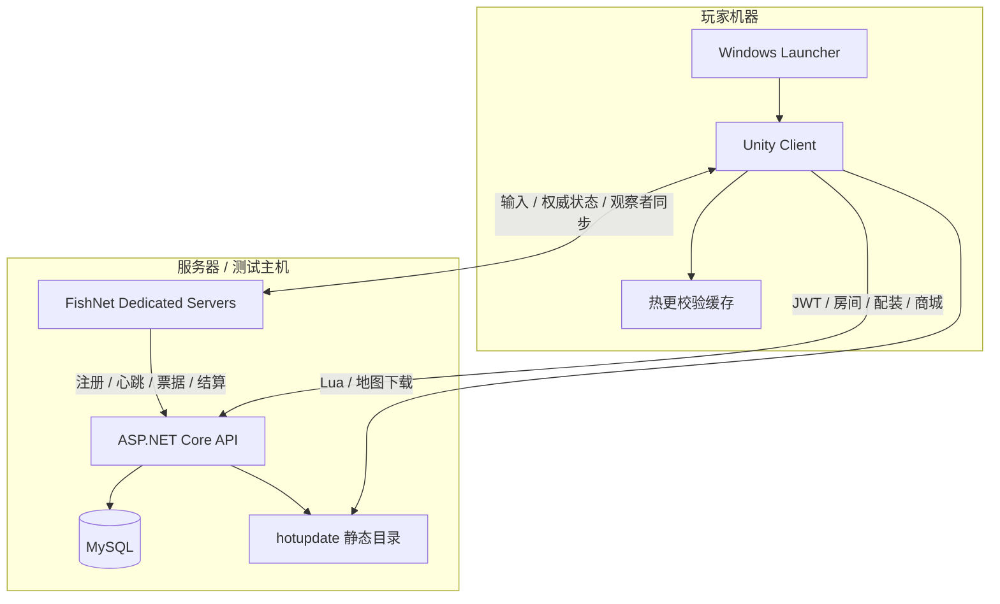
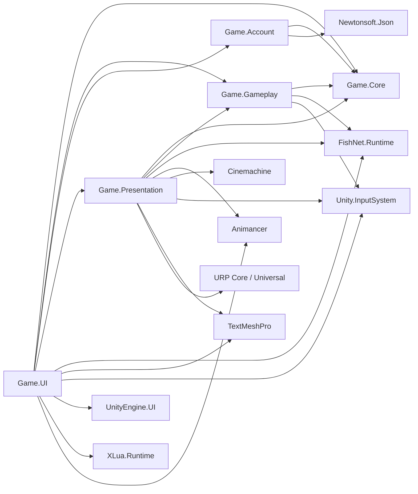
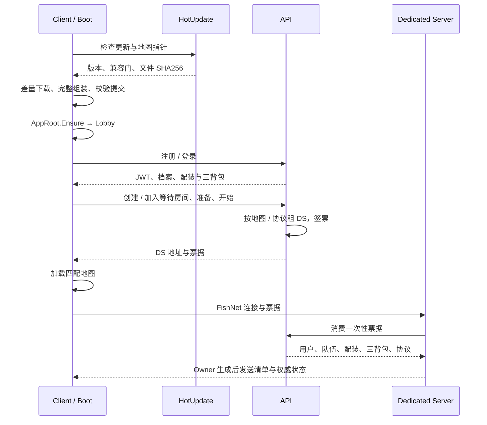
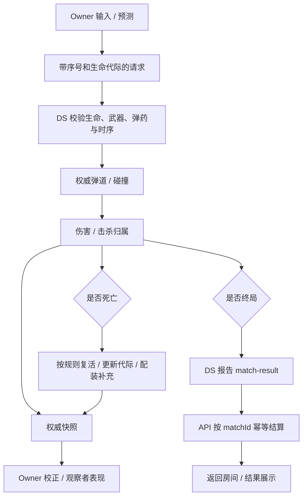
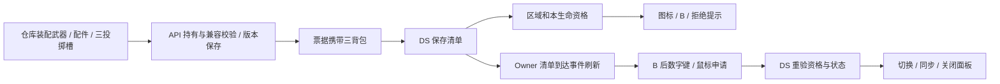

# 系统架构与关键流程

## 部署与责任边界

本地 API 常用 `5080`、六地图 DS 使用 `7770–7775/UDP`；朋友测试拓扑见 [Hosting](../Operations/Hosting.md)。

| 状态 | 权威归属 | 客户端处理 |
|---|---|---|
| 账户、钱包、持有物、背包、配件、设置 | API / MySQL | 会话缓存、UI，保存携带版本或幂等键 |
| 房间、成员、准备、实例租约、票据 | API | 选择、轮询与入场 |
| 移动 | DS 接受和校验；Owner 预测 | 预测、校正、观察者插值 |
| 开火、命中、伤害、弹药、换弹 | DS | 本地响应及权威快照校正 |
| 区域、开火 / 离区锁存、背包资格 | DS | 图标、拒绝提示、申请切换 |
| 动画、音效、FP / TP 模型、HUD | Client Presentation | 消费状态；动画事件不写权威弹药 |
| 对局结果与奖励 | DS 报告，API 幂等保存 | 展示与刷新档案 |
| 热更目录 / 当前版本 | 客户端校验安装器；服务端发布指针 | 完整校验后切换 |

## 实际程序集依赖

箭头表示“左侧引用右侧”，依据 `Assets/_Project/Scripts` 当前 asmdef。

Gameplay 的 Network 子目录与 FishNet 耦合；纯规则类可以独立测试，但整个程序集不是无网络依赖的纯 C# 模块。

| 模块 | 入口与职责 |
|---|---|
| Core | 公共数据、事件及发布环境 |
| Account | ApiClient、AccountSession、HTTP DTO、错误翻译 |
| Gameplay | Player / Input、Weapon、Combat、Action、Match、Network；预测与权威玩法 |
| Presentation | FPWeaponRig / Animator、TPAnimDriver、TPWeaponMeshSwapper、HUD、武器相机 |
| UI | BootEntry、AppRoot、LobbyPresenter / Pages，连接账户、房间、Lua、配装和菜单 |
| Editor | 目录、内容与碰撞派生、地图、双端构建、BuildManifestWriter |
| Backend | Controllers → Services → AppDbContext；认证、业务校验、迁移与种子 |

## 登录、入场与热更

`HotUpdateBootstrap.CheckAndApplyAsync` 先于 `AppRoot.Ensure`，使 Lua loader 使用正确目录。Boot 加载覆盖延续到 Lobby；发布环境要求更新就绪，失败进入重试，不能把所有失败都当作允许回退内置。

## 开火、死亡重生与结算

近掩体射击需检查相机方向与枪口近处碰撞。移动坡面或防越界障碍用 `MapMovementBarrier` 排除战斗射线；可见表面另有精确射击碰撞。

## 背包装配与切换

缺清单显示“配装加载中”；悬停预览，点击或数字键申请，当前背包不重复申请。瞬时忙碌不能恢复已失去的区域 / 生命资格。相关入口为 PlayerNetworkAdapter、NetworkCombatAuthority、BackpackDisplayBridge、BackpackSwitchHudView、NetworkPlayerLoadoutApplier。
