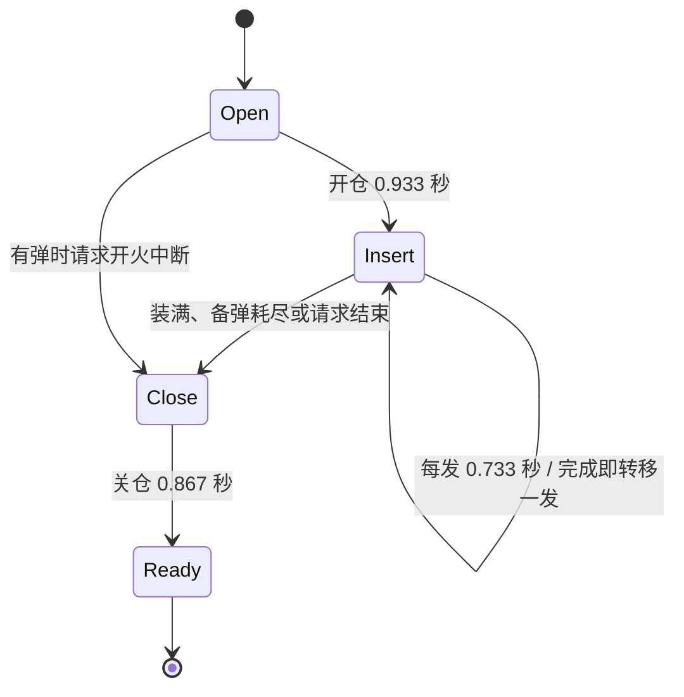

# Gameplay 与表现层开发

## 武器与配件

武器扩展涉及后端商品 ID、Unity 配置、目录解析、FP / TP 视图、动作和图片。商品存在不表示客户端已有模型；检查 IsImplemented、AssetKey、CalibrationKey 与映射。

1. 以已有 ScriptableObject 和视图为模板，在项目派生目录建立配置及 .meta。
2. 在 WeaponCatalogSeed 和 Unity 目录建立一致的商品 / 运行时 ID，保留账号兼容。
3. 准备槽位、镜座、枪口、瞄准基准、FP 动作、TP 手持模型与图片。
4. 后端校验持有和兼容矩阵，客户端通过 AttachmentAssetCatalog / WeaponAttachmentView 呈现。
5. 检查枪匠、装卸、保存重载、Owner 与观察者。

`attach.pistol.magazine` 直购 1500 金币、等级 1，保留通行证渠道。四把原生手枪开放 Scope_02 / Scope_04 两款 1x，兼容与校准以当前种子和资源为准。经典消音器为保留型号，旧步枪消音器持有和配装映射到经典 ID；交易历史保留，通行证奖励同步替换。

## 投掷物与背包

每背包三格、每格一枚，可重复、可留空；永久持有解锁，复活按配装补充。Frag / Flash / Smoke 是效果分类，throwable.* 是型号，库存和模型不能只按分类合并。

| ID | 分类 / 原模型 | 峰值伤害 | 金币 / 等级 |
|---|---|---:|---:|
| throwable.frag | Frag | 90 | 500 / 1 |
| throwable.frag_02 | Frag / Hand_Grenade_2 | 100 | 700 / 1 |
| throwable.frag_03 | Frag / Hand_Grenade_3 | 80 | 400 / 1 |
| throwable.flash | Flash | 沿用效果配置 | 400 / 1 |
| throwable.smoke | Smoke | 沿用效果配置 | 400 / 1 |

Flashbang_2 未接入。初始账号持有原破片 / 闪光 / 烟雾。旧 standard 转为破片＋闪光＋烟雾，旧 frag_assault 转为三破片。明确 NULL 记录表示空槽，种子不能补满它。

扩展型号同步 ThrowableSlotPolicy、ThrowableCatalog、配置、手持 / 飞行模型、UI 图和服务器解析。ThrowableController / ThrowableSlots 跳过空槽及耗尽槽；投掷设置本生命开火锁存。动画恢复不能补库存。

## 原生霰弹逐发换弹

`shotgun.01` 使用 ShellReloadState，其他武器沿用原方式。

完整六发约 6.2 秒，按原生时长呈现。服务器时钟转移弹药，动画事件不增加弹药。按开火停止后续装填，未完成的一发舍弃；空仓先完成第一发，关仓后执行一次待开火。切枪 / 死亡取消，已完成装填按生命周期处理。

权威快照包含阶段、进度、Generation；旧代际或乱序确认不能覆盖新状态。需验证缺 1–6 发、少备弹、中断和网络延迟，见 [Testing](Testing.md)。

## 地图碰撞

六地图使用项目场景和生成器。复杂建筑、车辆、沙袋使用派生精确碰撞，不直接修改第三方源素材。PreciseMapCollision 和 MapRedesignBuilder 保持生成结果；贴合可见方块的 BoxCollider 可以保留。

楼梯坡面、防越界移动障碍挂 MapMovementBarrier，战斗射线忽略；可见表面仍有精确射击碰撞。复杂静态模型使用非凸 MeshCollider，车辆按可见子网格覆盖，避免整形盒封堵空隙。围栏尺寸修复后检查生成器不会再写入负值。

验收包括空隙穿射、表面挡弹、近掩体射击、楼梯移动及边界；抽样射线不代表全图验收。

## FP / TP 表现

FPWeaponRig / FPWeaponAnimator 呈现 Owner 武器；TPAnimDriver / TPWeaponMeshSwapper 呈现观察者。世界相机和武器覆盖相机有不同职责，单一武器手臂露端应在武器视图侧处理。

Final20261001 恢复原生 2016 顶点霰弹手臂，通过 FPViewFramingProfile / FPWeaponCameraFraming 调整构图，旧人工袖口延长网格已撤销。ShotgunSleeveBuilder 名称保留，不表示还采用旧延长方案。

切枪恢复其他武器构图，检查腰射、ADS、后坐、移动、换弹和投掷返回，不能破坏瞄准对位。FP renderer 注册时关闭影子；TP 战术手电通过 TacticalFlashlightShadowFilter 排除自身投影。墙面印记缺有效复现及 A/B 验证，不能以代码存在作为验收。
