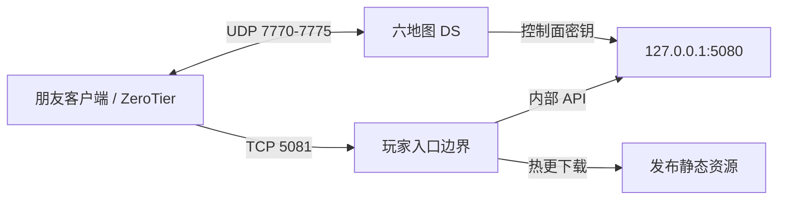

# 本地开服与朋友测试

## 本地开发栈

先完成 [环境](../Development/Setup.md) 与 [双端构建](BuildAndRelease.md)。下面是已有脚本的操作入口，本轮整理文档不会执行开停服：

```powershell
powershell -ExecutionPolicy Bypass -File Tools/Server/Start-LocalServer.ps1 -CheckOnly -AllMaps
powershell -ExecutionPolicy Bypass -File Tools/Server/Start-LocalServer.ps1 -AllMaps
powershell -ExecutionPolicy Bypass -File Tools/Client/Start-LocalClient.ps1
```

CheckOnly 仅检查计划，不启动进程。启动器按实例 ID、PID、exe、日志和注册身份复用健康进程，优先恢复 API，再处理 DS。密钥保存在 Tools/Server/.runtime，不打印密钥；缺配置或外来端口占用应先修复原因。

| mapId | 场景 | 常用 UDP |
|---|---|---:|
| arena | Arena | 7770 |
| map_01 | Map_Stackyard | 7771 |
| map_02 | Map_Depot55 | 7772 |
| map_03 | Map_Ridgeline | 7773 |
| map_04 | Map_TrainingYard | 7774 |
| map_05 | Map_NightRelay | 7775 |

API 本地控制面通常 127.0.0.1:5080。使用两个客户端时分别启动，每次获得独立日志，用不同账号避免单活登录顶替。

停服入口为 Tools/Server/Stop-LocalServer.ps1，只管理记录中确认身份的进程。停服前确认是否仍有测试者在场；不要用同名进程判断归属。

## 朋友测试与 ZeroTier

测试者解压朋友 ZIP，使用“开始游戏.cmd”；启动器启动客户端、应用外部发布环境并给出日志入口。当前 launcher 是 self-contained win-x64，玩家不需另装 .NET；主机 API 是 framework-dependent，组织者需 .NET 8 运行环境。

组织者模板在 Tools/PrivateTest/private-host.example.json 和 client-environment.example.json。按自己的 ZeroTier 网络填写 networkId、overlay 地址、子网、API 入口和分发目录；实际 secrets.json 只在本机 .runtime 保存。示例地址不是保证可访问的公共服务。

典型拓扑：



ZeroTier 加入后由组织者授权成员，检查 overlay 可达和防火墙范围。控制面密钥不能提供给玩家；管理员入口留在环回地址，玩家入口遵循 PrivatePlayerBoundary 的路由限制。

## Final20261001 分发目录

本地分发根目录为 Builds/Distributions/PreviewV1：

- PreviewV1-Client-Win64-Final20261001.zip：朋友包。
- PreviewV1-Host-Win64-Final20261001：对应组织者目录。
- FINAL-VERSION.json：封存指针。
- SHA256SUMS-Final20261001.txt：校验值。
- Final20261001-玩家说明.txt、Final20261001-主机说明.md：当前交付说明。

包 releaseId 为 PreviewV1，packageRevision 为 Final20261001。旧 r1–r5 分发保留。组织者通过主机目录的 Start-PreviewHost.cmd 开服，切换前按说明处理旧本地栈，不能让新旧栈争同一端口。客户端源码默认 telemetry 关闭，分发 launcher 和主机入口通过显式参数启用测试日志；不把默认值写成开启。

本仓库同步不会启动主机、修改防火墙、操作 ZeroTier、重发朋友包或上传 GitHub Releases。实际包身份和已知验证缺口见 [版本记录](../Releases/Final20261001.md)。
