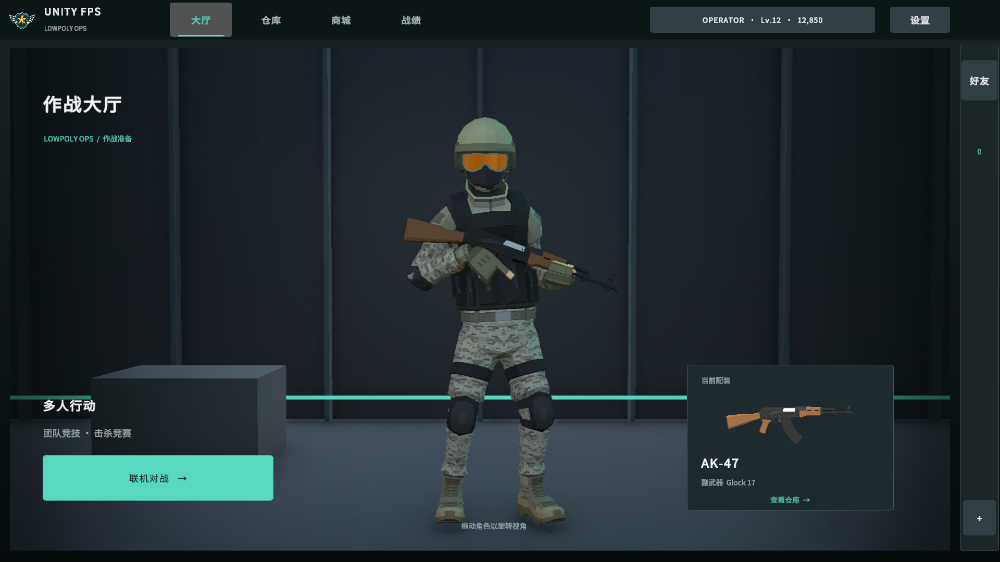
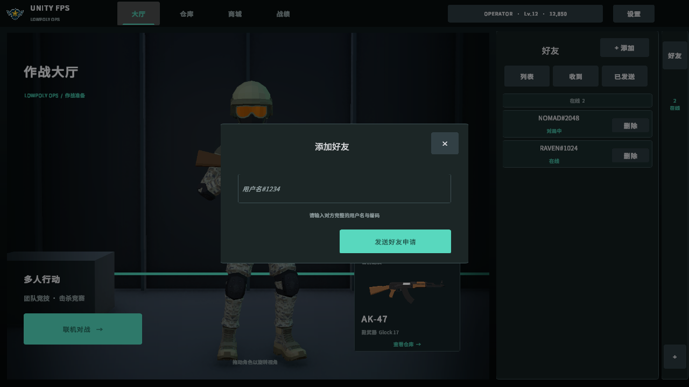
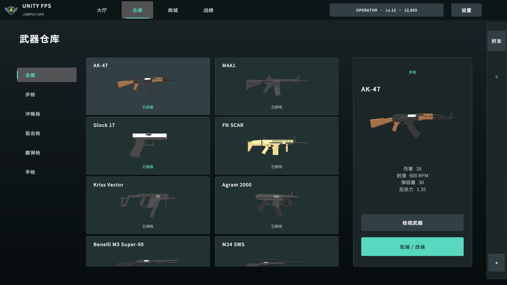

# 全菜单战术 UI 与动态角色大厅实施记录

本次基于现有工作区增量修改，保留已有未提交工作。未提交 Git、未部署服务、未应用数据库迁移。
用户选择：不进入 PlayMode，先完成代码与 EditMode 验证。下方截图使用隔离预览场景、静态示例账号和待机动画采样，不代表在线运行验收。

## 实现范围

- uGUI/TMP 统一深灰黑、冷青绿主题，细边框、小圆角、平面按钮；登录/注册、大厅、仓库/商城、枪匠、设置、暂停、等待房间、加载、结算及 Lua 战绩页接入同一主题。战斗 HUD 不重排。
- 顶部大厅/仓库/商城/战绩；账号面板收纳 XP、退出账号；设置独立入口。演示页仅开发构建设置入口可访问。
- 中央展示独立 LPFP 人物预制体、装备间、相机和 RenderTexture。Animancer 播放 `idle_relaxed@rifle_tpc`，关闭根运动；拖动水平旋转。角色不用战斗玩家 prefab，无网络/战斗输入组件。
- 当前主武器来自 AccountSession.Loadout，使用已校准第三人称 prefab、保存配件与左手握点/IK。离开大厅销毁展示资源。好友刷新仅更新侧栏，装备变化局部刷新。
- 武器目录增加 Sprite icon，以稳定 ID 绑定；现有 16 把 LPFP 武器均从正式模型烘焙透明侧视图，随 Resources 打包。大厅、仓库、商城共用；缺失时显示通用枪械图和名称。
- 好友收折侧栏、在线/离线分组、收发申请分页、滚动列表、申请数量。添加好友居中模态弹窗、提交中禁用、错误/成功反馈；切页与注销取消请求，检查取消状态与代际，Esc 优先关闭弹窗。
- 仓库/商城分类与可滚动图卡、详情区；保持购买、装备、枪匠保存逻辑。房间列表增加筛选与滚动。菜单聊天放入队伍区下方预留区域；性能面板默认关闭，可由设置或 F8 开关。
- 删除任务、升级、产品离线入口；页面枚举保留既有数值，5/9 留空。移除升级 DTO/调用/服务/公式；保留等级、XP、金币、通行证和成就，升级不再发技能点。
- 玩家 `POST /api/matches` 已退役，旧客户端得到 410 `PLAYER_SETTLEMENT_RETIRED`，不会发奖。战绩查询和 Dedicated Server 结算、重试、幂等逻辑保留。编辑器直接开战斗场景不提交账号奖励。

## 验证

- 后端：207 通过、1 跳过、0 失败；包含好友、退役接口、历史查询、权威结算及重试幂等回归。
- 新迁移操作检查确认只删除 PlayerProfile 的四个退役字段，不改等级、XP、钱包、装备及战绩表。
- Unity 编译通过，针对性 EditMode 114/114 通过（job `25107c7d42584ea485e4025883bdbd05`）；包括角色/RenderTexture 清理、16 把武器资源、四类代表武器挂载、好友弹窗/分页、Lua 战绩、枪匠、返房、暂停及聊天回归。结束时仍为 Arena 编辑态，展示舞台、临时预览根、LobbyCharacterRT 均为 0。
- 已检查大厅/好友弹窗的 1920×1080、1280×720、2560×1440、2560×1080 静态布局，以及仓库、商城、设置、登录静态布局；最终证据见同名证据目录。

## 部署与尚未执行的验收

客户端和后端须作为同一版本发布。部署时应用 `20260922160000_RetireAttributeUpgrades`；它删除 SkillPoints、UpDamage、UpAmmoCap、UpMaxHealth，不兑换金币。Down 只重建零值列，不恢复退役分配数据；历史迁移保留。

本次没有进入 PlayMode，没有操作线上数据库或重启已有后端。尚未执行：动态待机/鼠标旋转实机观感、所有武器及握把的动态姿态逐项检查、真实双账号好友流程、购物/保存/建房/加入/准备/开局/返房的端到端联机验收，以及真实数据库迁移前后数据比对。静态截图和单元测试不能替代这些验收。

Lua 战绩源码与内置 Resources 已同步；已生成本地热更包 `Logs/HotUpdate/releases/6/manifest.json`（版本 6，minClientVersion 0.1.0），包含现有地图 bundle；未部署。发布时应同步这版 Lua，避免旧热更文件优先覆盖新内置页。

## 主要入口

- `Assets/_Project/Scripts/UI/Pages/LobbyPresenter.TacticalShell.cs`：大厅与账号。
- `Assets/_Project/Scripts/UI/Pages/LobbyPresenter.Social.cs`：侧栏与弹窗。
- `Assets/_Project/Scripts/UI/Pages/LobbyPresenter.TacticalCatalog.cs`：仓库/商城图卡。
- `Assets/_Project/Scripts/UI/LobbyCharacterPreview.cs`：展示资源与持枪。
- `Assets/_Project/Scripts/Editor/TacticalUiAssetBuilder.cs`：Tools/UI/Build Tactical Lobby Assets。
- `Assets/_Project/Scripts/Editor/TacticalUiPreviewCapture.cs`：静态预览 Capture → CompletePending；不启动 PlayMode。
- `fps-backend/src/UnityFps.Api/Data/Migrations/20260922160000_RetireAttributeUpgrades.cs`：退役迁移。

## 复核关注点

工作区原有光学瞄具、武器模型、网络与好友相关修改均予保留。武器 ID `weapon.m4` 在当前既有目录中对应显示名 AK-47；此次沿用目录映射，没有按 ID 字符串重命名武器。所有图标和持枪模型均来自同一个目录条目。

## 静态预览

其余静态截图：`shop-1280x720.png`、`settings-1280x720.png`、`login-1280x720.png`。
