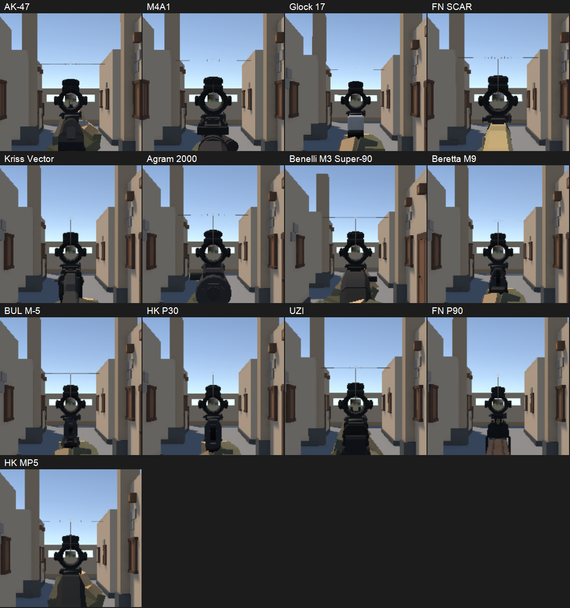

# 低倍镜逐枪核查（2026-09-23）

> 后续状态：用户授权修复后，已完成两款低倍镜的源码修复及 26 组合运行回归，见 [修复报告](2026-09-23-低倍镜修复-报告.md)。下文保留修复前的核查证据。

来源：用户补图明确指出 M4 装低倍瞄具，要求查找其他枪械是否同病。本次是运行核查与根因定位，没有修改生产准线实现；此前 1× 镜裁剪修复不覆盖本问题。

## 结论

截图对应 `attach.lpfp.optic.01`（LPFP 低倍瞄具，Scope_01，3×）。当前正式 LPFP 武器中，13 把允许安装该镜，13/13 均实际复现准线高于镜片、尺寸超出镜片。不是 M4A1 单枪问题。

| 枪械显示名 | 内部 ID | Scope_01 | Scope_03 低倍瞄具 II |
|---|---|---|---|
| M4A1 | weapon.ak | 偏高、过大 | 全屏 overlay 降级 |
| AK-47 | weapon.m4 | 偏高、过大 | 全屏 overlay 降级 |
| FN SCAR | weapon.rifle03 | 偏高、过大 | 全屏 overlay 降级 |
| Kriss Vector | weapon.smg01 | 偏高、过大 | 全屏 overlay 降级 |
| Agram 2000 | weapon.smg02 | 偏高、过大 | 全屏 overlay 降级 |
| UZI | weapon.smg03 | 偏高、过大 | 全屏 overlay 降级 |
| FN P90 | weapon.smg04 | 偏高、过大 | 全屏 overlay 降级 |
| HK MP5 | weapon.smg05 | 偏高、过大 | 全屏 overlay 降级 |
| Benelli M3 Super-90 | weapon.shotgun01 | 偏高、过大 | 全屏 overlay 降级 |
| Glock 17 | weapon.service_pistol | 偏高、过大 | 全屏 overlay 降级 |
| Beretta M9 | weapon.handgun02 | 偏高、过大 | 全屏 overlay 降级 |
| BUL M-5 | weapon.handgun03 | 偏高、过大 | 全屏 overlay 降级 |
| HK P30 | weapon.handgun04 | 偏高、过大 | 全屏 overlay 降级 |

注意内部 ID 历史遗留：`weapon.ak` 实际显示 M4A1，`weapon.m4` 实际显示 AK-47。判断依据为当前 WeaponDefinition.DisplayName 与运行 HUD。

M24 SWS、Barrett M82、Dragunov 使用内置镜，不在这两款外接低倍镜的兼容范围内；本次没有验证其内置镜，也不将其列为已证明正常。

## 根因证据

1. `PhysicalScopeView.TryBuildLens` 将整个瞄具的世界轴对齐包围盒，重新转换为挂点局部包围盒。转换后的盒子并不等于网格原始边界，也不等于镜片孔径；旋转及创建时姿态会放大估算宽度。
2. `OpticLensMath.TryDeriveLensFrame` 直接使用眼点 Y/Z 作为分划圆心，用整个盒子 Z 宽度 × 0.45 作为半径。没有使用真实后镜片光轴与孔径。
3. Scope_01 校准眼点 Y=0.072518 m，而当前校准镜窗中心 Y=0.025745 m。物理分划采用前者，ADS 镜窗构图使用后者，导致两条定位路径不一致，差 46.773 mm。
4. 真实 Scope_01 网格后镜圈截面中心约 Y=0.022518 m，内孔半径约 0.014306 m。运行时 13 组分划圆盘半径均触及 0.045 m 上限，约为该内孔半径的 3.15 倍；圆心则比真实后镜圈高约 50 mm。校准的 windowCenter 本身也只是近似，不应机械地将其视为最终修复真值。
5. M4A1 实测镜窗 viewport Y=0.49970，分划 Y=0.66069（Unity viewport 向上为正），高出屏幕高度约 16.1%；13 组偏高范围约 11.1%–17.2%。M4A1 分划局部 X=0.08960 m，网格真实后端约 X=0.045854 m，深度也偏向眼睛；不同枪创建时包围盒不同，偏差程度会变。
6. Scope_03 本次 13 组均没有生成 PhysicalScopeReticle，HandlingOpticId 为空，截图为隐藏武器的全屏圆形 overlay。这是实体镜构建未成功的另一路表现，不能标为正常，也不能冒称复现了同一种悬空准线。

相关代码：`Assets/_Project/Scripts/Presentation/Camera/PhysicalScopeView.cs:160–222`、`Assets/_Project/Scripts/Gameplay/Weapon/OpticLensMath.cs:29–51`；数据：`Assets/_Project/Resources/AttachmentCalibration.asset` 的 Scope_01 / Scope_03 行。

修复应统一真实镜片的光轴、后端面与有效孔径，处理实体镜分划裁剪，并使用与动画姿态无关的局部几何。仅缩小 HUD 准星或只调 M4 单枪偏移无法解决这一共用问题。

## 运行证据与边界

- 新增诊断采集 `LowZoomOpticAuditTests.CaptureAllCompatibleLowZoomCombinations`，Arena 离线场景逐枪安装两款镜，等待 ADS 稳定，采集 26 张截图与运行坐标；结束恢复原配件存储和输入开关。
- Unity 编译检查成功；PlayMode 采集用例 1/1 完成，35.52 秒，job `6bd5e91e33114965aacee2982014c020`。用例成功表示矩阵采集完整，**不表示瞄具通过视觉验收**。视觉结论为上述缺陷复现。
- 原图、逐枪拼图、measurements.txt、M4 两款镜的网格顶点及 TestResults XML 存于 `2026-09-23-低倍镜逐枪核查-证据/`。
- 本次针对当前编辑器源码运行结果，未构建、未部署、未提交 Git，未修改 LPFP 源素材或 LPW。

