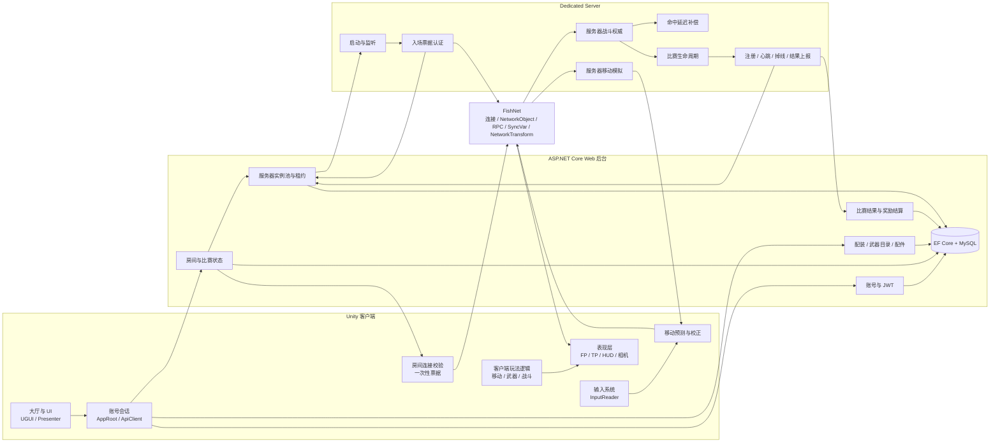

# 多人 FPS 网络游戏 Demo：面试准备材料

> 本文档只分析“基于 Dedicated Server 的多人 FPS 网络游戏 Demo”。
> 不包含《生化危机4 RE》TPS 项目，也不包含项目中与当前多人 FPS 无关的实验内容。

## 0. 先记住项目的一句话

这是一个由 **Unity 客户端 + Dedicated Server + ASP.NET Core Web 后台**组成的多人 FPS Demo：

- 客户端负责输入、预测、表现、UI 和用户操作。
- Dedicated Server 负责实时移动、射击、命中、伤害、比分和比赛生命周期。
- Web 后台负责登录、房间、配装、服务器实例管理和比赛结算。
- FishNet 负责网络底层能力，但服务器权威规则、预测校正、命中补偿和房间流程是自己实现的。

---

## 1. 模块总图



### 这张图怎么理解

最重要的是区分两条通信链：

1. **后台控制链**：登录、房间、配装、服务器分配、比赛结果，主要走 HTTP。
2. **实时对战链**：移动输入、开火请求、状态同步、表现事件，主要走 FishNet 连接的 Dedicated Server。

后台不负责每一发子弹的实时判定，客户端也不直接决定命中和奖励。

---

## 2. 各部分模块说明

## 2.1 Unity 客户端

### 主要职责

- 读取键盘、鼠标和游戏操作。
- 处理本地移动预测。
- 显示第一人称枪械、相机、HUD 和第三人称远端玩家。
- 调用后台完成登录、房间、配装和结算查询。
- 连接 Dedicated Server，提交移动和战斗请求。

### 主要代码模块

| 模块 | 职责 |
|---|---|
| `Game.Account` | 登录会话、DTO、HTTP API、房间数据 |
| `Game.Gameplay` | 输入、移动、武器、战斗、生命值、网络权威 |
| `Game.Presentation` | FP/TP 动画、相机、枪械表现、HUD |
| `Game.UI` | 大厅、登录、等待房间、结算页面 |
| `Game.Core` | 跨模块的基础类型和通用逻辑 |

### 推荐理解顺序

```text
InputReader
    ↓
Locomotor / WeaponController
    ↓
PlayerNetworkAdapter / NetworkCombatAuthority
    ↓
FishNet
    ↓
Dedicated Server
```

客户端不是“什么都自己算”。它可以先预测和显示，但涉及移动最终位置、命中、伤害、击杀和比赛结果时，以服务器为准。

---

## 2.2 UI、大厅和账号模块

### 主要职责

- 登录和注册。
- 大厅导航。
- 仓库、商城和武器配装。
- 创建房间、加入房间、选队、准备和开始比赛。
- 等待房间状态轮询。
- 进入战场前校验连接信息。
- 比赛结束后的结果展示和返房。

### 主要组成

| 组件 | 职责 |
|---|---|
| `AppRoot` | 跨场景保存 `ApiClient` 和 `AccountSession` |
| `AccountSession` | 保存登录状态、个人资料、配装和房间状态 |
| `ApiClient` | 统一发送 HTTP、携带 JWT、解析错误 |
| `LobbyPresenter` | 管理页面状态、按钮操作和页面刷新 |
| `RoomConnectionGate` | 校验服务器地址、端口、比赛身份和票据 |
| `MatchSettlementFlow` | 处理终局、结算、返房和结果显示 |

### UI 通信关系

```text
按钮点击
    ↓
LobbyPresenter
    ↓
ApiClient
    ↓
ASP.NET Core API
    ↓
AccountSession 更新
    ↓
页面根据最新状态刷新
```

### 面试中的准确说法

可以说：

> UI 采用 Presenter 风格。`AppRoot` 保存跨场景会话，`ApiClient` 统一处理后台请求，`LobbyPresenter` 管理页面和用户操作。等待房间通过轮询后台快照，拿到合法连接信息后才进入战场。

不要说：

- 这是完整的商业级 UI 框架。
- 使用了严格标准的完整 MVP 架构。
- 等待房间使用了 WebSocket 实时推送。

更准确的表述是：**代码结构接近 Presenter/MVP 风格，等待房间当前主要使用 HTTP 轮询。**

---

## 2.3 Web 后台模块

### 主要职责

- 用户注册和登录。
- JWT 身份认证。
- 房间创建、加入、选队和准备。
- 维护房间状态。
- 管理 Dedicated Server 实例池。
- 为比赛租用服务器。
- 签发和消费一次性入场票据。
- 保存玩家配装和武器目录。
- 接收 Dedicated Server 的比赛结果。
- 根据结果进行幂等奖励结算。

### 后台分层

```text
Controller
    ↓
Service
    ↓
EF Core / AppDbContext
    ↓
MySQL
```

- Controller：接收请求、权限检查、返回结果。
- Service：实现房间、服务器实例、结算等业务规则。
- EF Core：数据库访问和事务。
- MySQL：持久化账号、房间、配装和比赛结果。

### 面试中的准确说法

> 后台不是只做登录接口，它还维护房间和 Dedicated Server 实例状态。房主开始比赛时，后台会选择可用服务器并签发入场票据；比赛结束后，DS 上报权威结果，后台负责持久化和奖励结算。

但要说明：这是**演示级后台**，不是完整的微服务、云调度或大规模在线服务。

---

## 2.4 Dedicated Server 模块

### 主要职责

- 以 Headless 模式启动 Unity。
- 解析服务器启动参数。
- 配置端口和网络连接。
- 向后台注册服务器实例。
- 周期性发送心跳。
- 验证玩家一次性入场票据。
- 运行服务器权威的移动和战斗。
- 处理比赛开始、结束、掉线和重开。
- 向后台上报比赛结果。

### 主要组成

| 组件 | 职责 |
|---|---|
| `DedicatedServerBootstrap` | DS 启动入口和启动链 |
| `DedicatedServerRuntime` | 配置 FishNet、端口和监听状态 |
| `DedicatedServerOptions` | 解析和校验服务器参数 |
| `JoinTicketAuthenticator` | FishNet 连接认证和票据消费 |
| `UnityWebServerControlPlaneClient` | DS 调用后台控制面 |
| `ServerHeartbeatTracker` | 管理实例状态和心跳 |

### DS 和后台的关系

```text
DS 启动
  ↓
向后台注册
  ↓
后台租用给某个房间
  ↓
DS 持续发送心跳
  ↓
客户端带票据连接
  ↓
DS 请求后台消费票据
  ↓
认证通过后生成玩家
```

### 插件与自研边界

- FishNet：网络连接、网络对象、认证接口、RPC、同步变量。
- 自己实现：DS 启动顺序、服务器状态、票据流程、控制面调用、心跳和终局上报。

---

## 2.5 FishNet 网络层

### FishNet 负责什么

- 网络连接和断开。
- 网络对象生成和销毁。
- ServerRpc、ObserversRpc、TargetRpc。
- SyncVar 状态同步。
- NetworkTransform 基础同步。
- 基本的 Tick 和网络生命周期。

### 自己负责什么

- 哪些数据必须由服务器写入。
- 哪些请求需要服务器验证。
- 移动预测和校正。
- Hitscan 命中判定。
- 命中延迟补偿。
- 生命值、击杀和比分。
- 比赛生命周期。
- 票据和房间的业务流程。

### 状态同步和事件同步

| 类型 | 适合内容 | 项目示例 |
|---|---|---|
| 状态同步 | 当前持续存在的事实 | 生命值、死亡状态、当前武器、弹药、比分、队伍 |
| 事件同步 | 一次性发生的行为 | 开火表现、死亡表现、比赛开始、击杀提示 |
| 请求上行 | 客户端想做的操作 | 移动输入、开火、换弹、切枪、离开比赛 |

面试中可以总结为：

> 客户端上传的是请求，服务器产生的是事实，客户端收到事实后再更新状态和表现。

---

## 2.6 移动预测和校正模块

### 解决的问题

如果客户端完全等待服务器，移动会有明显延迟；如果完全相信客户端，位置可能被篡改，也会和其他玩家看到的结果不一致。

### 处理流程

```text
客户端读取输入
    ├─ 本地先模拟，立即产生手感
    └─ 上传 MovementCommand
            ↓
      Dedicated Server 固定 Tick 模拟
            ↓
      返回权威 MovementSnapshot
            ↓
      客户端比较预测结果
            ├─ 小误差：平滑修正
            └─ 大误差：对齐后重放未确认输入
```

### 主要代码职责

- `InputReader`：读取移动、跳跃、冲刺和视角输入。
- `MovementCommand`：描述一次输入。
- `Locomotor`：实际执行移动模拟。
- `PredictionBuffer`：保存预测输入和快照。
- `Reconciler`：判断如何修正。
- `PlayerNetworkAdapter`：把本地移动和 FishNet 连接起来。

### 当前边界

这是当前 Demo 的移动预测和校正，不要说成完整的确定性物理回滚系统。复杂动态物理、极端丢包和高并发场景还需要进一步增强。

---

## 2.7 服务器权威战斗和命中补偿

### 战斗流程

```text
客户端点击开火
    ↓
提交开火请求
    ↓
服务器检查武器状态、弹药和冷却
    ↓
服务器执行射线和命中判断
    ↓
服务器修改生命值、击杀和比分
    ↓
同步状态并广播开火/死亡表现
```

### 命中延迟补偿

服务器会保存近期玩家受击碰撞体的历史状态。收到开火请求后，在有限时间范围内选择对应的历史姿态进行 Hitscan，然后恢复当前姿态。

需要强调：

- 回溯只影响命中查询使用的碰撞体位置。
- 伤害、死亡、击杀和比分仍由服务器决定。
- 当前方案主要覆盖 Hitscan，不是所有投射物和物理效果的通用回滚。

### 主要代码职责

- `NetworkCombatAuthority`：接收战斗请求。
- `WeaponController`：检查武器运行状态和开火条件。
- `CombatResolver`：射线、目标和命中处理。
- `ServerLagCompensation`：历史碰撞体保存和回溯。
- `DamageableTarget`：生命值和死亡事件。
- `MatchLifecycle`：击杀归因、比分和终局。

---

## 2.8 武器、配件和数据驱动模块

### 数据和运行时状态分离

```text
WeaponDefinition
    └─ 静态数据：武器身份、枪模、动画、音频、瞄具

WeaponRuntime
    └─ 运行时数据：当前弹药、备用弹药、冷却、换弹状态

WeaponStatResolver
    └─ 基础属性 + 配件修改器 = 最终属性
```

### 配件流程

```text
后台保存配装身份
    ↓
DS 认证时读取权威配装快照
    ↓
服务器配置网络玩家的武器和配件
    ↓
客户端根据身份加载本地枪模和挂点
```

### 适合面试的表达

> 我把枪械静态配置、运行时状态和后台配装分开。静态配置使用 ScriptableObject，弹药和换弹属于运行时对象，配件通过统一的属性解析器影响最终武器属性。这样增加武器时，不需要把所有逻辑硬编码到一个脚本里。

当前主要是 ScriptableObject 加后台数据库，不要说成 Excel 或 Lua 驱动。

---

## 2.9 FP/TP 动画、相机和表现模块

### 第一人称表现

- 第一人称枪械动画。
- 开镜、收镜和 ADS 开火。
- 枪械摆动、呼吸、步伐起伏。
- 相机和枪械后坐。
- 枪口火焰、弹道、声音和准星。

### 第三人称表现

- 远端玩家移动动画。
- 第三人称持枪。
- 远端瞄准方向。
- 左手对齐武器挂点。
- 死亡和重生表现。

### 插件与自研边界

- Animancer：负责动画播放、混合和动画层。
- Cinemachine：负责相机管线。
- 自己实现：动画状态转换、事件桥接、相机后坐、枪械摆动、瞄准骨骼调整和基础双骨骼 IK。

### 设计原则

> 游戏逻辑只告诉表现层“发生了开火、换弹、移动或瞄准”，表现层决定“具体播放什么动画、怎么移动相机和枪械”。表现层不参与服务器命中判定。

---

## 2.10 比赛生命周期和结算模块

### 比赛状态

```text
Waiting
   ↓
Starting
   ↓
InMatch
   ↓
Returning
   ↓
Waiting
```

比赛中还要处理：

- 倒计时。
- TDM 和 KillRace 规则。
- 击杀、死亡、助攻和比分。
- 玩家主动离开。
- 玩家断线。
- 比赛结束。
- DS 向后台上报结果。
- 后台幂等发放奖励。
- 客户端查询结果并返回房间。

### 设计原则

> DS 负责实时对局事实，后台负责持久化和奖励，客户端负责展示。客户端不能自己决定胜负，也不能通过重复请求重复获得奖励。

---

## 3. 自研与第三方总表

| 第三方或框架 | 负责内容 | 自己负责内容 |
|---|---|---|
| FishNet | 网络连接、对象、RPC、SyncVar、NetworkTransform | 服务器权威、预测校正、战斗同步、延迟补偿、票据接入 |
| Animancer | 动画播放和混合 | 动画状态机、事件转换、换弹阶段、TP 瞄准和 IK |
| Cinemachine | 相机管线和镜头 | FOV、后坐、枪械运动、ADS 视觉一致性 |
| New Input System | 输入底层 | 输入读取、移动命令和操作门控 |
| UGUI/TMP | UI 基础控件 | 页面状态、请求流程、会话、错误处理 |
| ASP.NET Core | Web 服务框架 | Controller、Service、房间、票据和结算规则 |
| EF Core/MySQL | ORM 和数据库 | 数据模型、事务、幂等和业务数据 |
| JWT 组件 | Token 生成和验证能力 | 登录流程和权限边界 |

---

## 4. 当前完成度和表达边界

### 可以放心介绍

- Unity 客户端、Dedicated Server 和 Web 后台三部分结构。
- 服务器权威移动和战斗。
- 客户端移动预测和服务器校正。
- Hitscan 的有限延迟补偿。
- 房间、服务器租用和一次性入场票据。
- 武器和配件的数据驱动。
- 比赛终局和后台幂等结算。

### 需要主动降低表述

- 这是演示级多人 FPS，不是商业级线上服务。
- 延迟补偿主要覆盖当前 Hitscan。
- AI 和寻路不是当前多人 FPS 的核心模块。
- 没有完成一个可重点介绍的通用对象池。
- 没有做大规模并发压测和生产级运维。
- TP 瞄准和 IK 是基础实现，不是高级动作匹配系统。
- UI 是完整流程 Demo，不是成熟商业 UI 框架。

### 不要主动说

- FishNet 自带了完整的预测和延迟补偿。
- 项目支持完整反作弊。
- 项目已经做过大规模稳定性压测。
- 项目有完整的敌人 AI 和 NavMesh 寻路。
- 项目已经完成商业级对象池。
- 当前多人 FPS 使用 FinalIK、Lua 或 Excel 完成核心逻辑。

---

## 5. 推荐的面试介绍顺序

```text
项目是什么
    ↓
三部分架构：客户端 / DS / Web 后台
    ↓
服务器权威
    ↓
移动预测与战斗验证
    ↓
票据、房间和结算
    ↓
当前完成度与不足
```

第一层不要直接讲具体字段名、缓存大小、Tick 数和阈值。只有面试官继续追问时，再进入实现细节。

---

## 6. 60 秒项目介绍

> 我做的是一个基于 Dedicated Server 的多人 FPS 网络游戏 Demo，包含 Unity 客户端、专用服务器和 ASP.NET Core Web 后台三部分。客户端负责登录、大厅、房间、配装和第一人称战斗；后台负责账号、房间、配装和比赛结果；Dedicated Server 负责实时对战。
>
> 网络部分采用服务器权威。移动上，客户端会先根据输入做本地预测，服务器按照固定 Tick 模拟，再把权威状态返回给客户端做平滑校正或重新同步。战斗上，客户端只提交开火意图，服务器负责检查武器状态、弹药、命中、伤害和击杀。针对高延迟下的 Hitscan，我还做了有限范围的命中回溯。
>
> 另外，客户端进入战场前需要使用后台签发的一次性票据完成 DS 认证。项目目前已经完成演示级的核心代码和构建闭环，但还没有按商业项目去做大规模压测和生产级运维。

---

## 7. 10 个高频项目问题速记

1. **为什么使用 Dedicated Server？**
   - 把房间控制和实时对战分开，避免房主退出影响整局。

2. **移动同步怎么做？**
   - 服务器固定 Tick 模拟，客户端本地预测，收到权威状态后校正。

3. **为什么不能直接同步 Transform？**
   - 会有延迟，也容易被客户端篡改。

4. **为什么由服务器判定命中？**
   - 防止客户端伪造命中、伤害和击杀。

5. **高延迟下怎么改善命中？**
   - 服务器保存近期碰撞体状态，对 Hitscan 做有限范围回溯。

6. **房间怎么进入战斗？**
   - 后台租用 DS，给玩家签发一次性票据，DS 验证后才生成玩家。

7. **武器为什么用 ScriptableObject？**
   - 静态配置和运行时状态分开，方便增加武器和配件。

8. **如何处理模块耦合？**
   - 用职责划分、接口、事件和状态同步分开玩法、网络、表现和 UI。

9. **比赛结果为什么不让客户端提交？**
   - 客户端不可信，DS 才是实时比赛事实来源。

10. **项目还有哪些不足？**
    - 没有大规模压测、完整 AI、商业级对象池、云端服务器编排和高级反作弊。

---

## 8. 3 个 Bug 故事

### 8.1 客户端和 DS 版本不一致

- 现象：客户端连接后出现 RPC 找不到。
- 原因：客户端和 DS 使用了不同批次的程序集。
- 处理：统一源码批次，同时构建客户端和 DS。
- 经验：多人游戏必须保证协议、程序集和构建版本一致。

### 8.2 远端玩家看不见

- 现象：本地玩家能看见自己，但看不见远端玩家。
- 原因：本地主相机剔除了本地玩家身体所在层，远端实例也错误使用了相同层。
- 处理：本地和远端玩家按实例设置不同显示层，受击碰撞体单独保留。
- 经验：Unity Layer 和 Camera Culling Mask 的关系需要从“实例表现”角度考虑。

### 8.3 等待房间聊天解析失败

- 现象：系统消息出现后，整批聊天消息都无法显示。
- 原因：系统消息没有发送者，后台返回空值，客户端使用不可空类型解析失败。
- 处理：改用可空字段，显示层识别为系统消息，并增加失败重试。
- 经验：前后端数据契约要区分“正常空值”和“异常缺失”。

---

## 9. 10 个项目相关 Unity/C# 八股

1. `Update`、`FixedUpdate`、`LateUpdate` 的区别。
2. 客户端预测、服务器校正和网络插值的区别。
3. RPC、SyncVar 和普通事件的区别。
4. 什么数据适合状态同步，什么数据适合事件通知。
5. `ScriptableObject` 和 `MonoBehaviour` 的区别。
6. `Instantiate/Destroy` 为什么可能带来性能和 GC 问题。
7. 委托、事件和事件取消订阅。
8. 接口、抽象类和组合式设计的区别。
9. `async/await`、取消令牌和页面销毁之间的关系。
10. 什么是幂等，数据库事务为什么用于比赛结算。

---

## 10. 如果面试官继续深挖

建议按以下顺序展开：

### 网络移动

1. 输入命令和固定 Tick。
2. 客户端预测。
3. 服务器模拟。
4. 权威快照。
5. 平滑校正或硬校正。
6. 重放未确认输入。

### 网络战斗

1. 客户端只提交开火意图。
2. 服务器检查武器状态。
3. 服务器执行射线。
4. 有限时间回溯碰撞体。
5. 服务器修改生命值和比分。
6. 网络同步状态和表现事件。

### Dedicated Server

1. Headless 启动。
2. 后台注册和心跳。
3. 房间租用实例。
4. 客户端带票据连接。
5. DS 向后台消费票据。
6. 认证成功后生成玩家。

### 武器系统

1. 静态定义和运行时状态分离。
2. 武器属性数据驱动。
3. 配件修改最终属性。
4. 后台保存配装身份。
5. DS 验证并应用权威配装。
6. 客户端加载本地资源和表现。

---

## 11. 源码核对入口

- `Assets/_Project/Scripts/Gameplay/Network/PlayerNetworkAdapter.cs`
- `Assets/_Project/Scripts/Gameplay/Network/NetworkCombatAuthority.cs`
- `Assets/_Project/Scripts/Gameplay/Network/DedicatedServerBootstrap.cs`
- `Assets/_Project/Scripts/Gameplay/Network/JoinTicketAuthenticator.cs`
- `Assets/_Project/Scripts/Gameplay/Network/ServerLagCompensation.cs`
- `Assets/_Project/Scripts/Gameplay/Network/MatchLifecycle.cs`
- `Assets/_Project/Scripts/Gameplay/Movement/Locomotor.cs`
- `Assets/_Project/Scripts/Gameplay/Movement/MovementPredictionCore.cs`
- `Assets/_Project/Scripts/Gameplay/Weapon/WeaponController.cs`
- `Assets/_Project/Scripts/Gameplay/Weapon/WeaponDefinition.cs`
- `Assets/_Project/Scripts/UI/LobbyPresenter.cs`
- `Assets/_Project/Scripts/UI/RoomConnectionGate.cs`
- `fps-backend/src/UnityFps.Api/Services/RoomService.cs`
- `fps-backend/src/UnityFps.Api/Services/ServerInstanceService.cs`
- `fps-backend/src/UnityFps.Api/Services/MatchService.cs`

---

## 12. 最后记忆版

> 后台管账号和房间，Dedicated Server 管实时对战，客户端管输入和表现。
>
> 客户端可以预测，但不能决定最终结果；服务器产生事实，客户端负责展示。
>
> FishNet 提供网络底层，我自己实现服务器权威、移动预测、命中补偿、比赛生命周期和后台控制流程。

