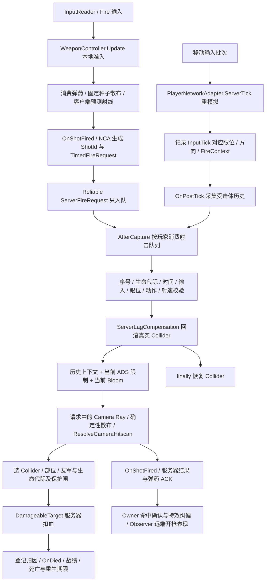

# 多人 FPS 全链路静态审计（2026-09-27）

> 读者：用户及任意接手代理；不依赖原会话。审计对象是当前磁盘上的 UnityFpsLowPoly，而非只看 HEAD 或历史 Review。本文只提供诊断和建议，不实施修复。

本轮发现 **14 项有明确代码证据的问题：P0 11 项、P1 1 项、P2 2 项**；另列 **7 项待运行验证的风险**和 **1 项 P3 诊断改进项**。这里的 P0 严格采用用户定义：可能改变竞技结果，不等同于“已经在实机稳定复现”。“已确认”指逻辑缺陷及触发条件可由代码证明，发生频率、实际空间误差及玩家感受尚未实测。

优先处理：射击与动作的顺序（F02）、命中候选选择（F03）、回溯时间准入与显示时间选择（F04/F05）、死亡受击体（F06）。它们可分别造成吞枪、错用武器、隔墙命中、正常高 Ping 整发拒绝、打中不可见位置及尸体挡枪。F01 的 FPS 射速差同样直接改变 TTK。

## 0. 基线、范围与验证边界

- 审计起点 HEAD：32afebf25bce64d5b854e4079473b9acb094fb95；Unity 6000.0.76f1；当前协议 fps-net-v21。
- 以 Docs/25 的 LPFP 正式路径、当前玩家预制体、正式武器 Tuning 资产和当前代码为准。旧 LPW 武器数据、保留但未被正式入口调用的两段射线，不作为当前玩法结论。
- 已沿玩家输入、移动预测、服务器模拟、观察者显示、射击、动作、回溯、受击、死亡、重生、投掷物、对局结束及客户端反馈追踪；检索项目 Gameplay/Presentation 的协程、动画事件、异步和物理入口，并核查相关 FishNet 实现、配置及既有测试。
- “全项目”在本文指覆盖所列 Gameplay/Network 系统及其跨系统调用链，不表示逐行审阅全部第三方包、后台业务、商店/UI、地图美术和全部资产。未用运行扫描声称已验证所有地图碰撞体。
- **本轮没有修改生产代码、预制体或测试；没有启动 Unity 测试、PlayMode、构建、网络注入、全量资产导入或实机脚本。**仅进行了文件读取、哈希、静态公式和选择器反例的独立算术核对。
- 历史交接中的 91/91、153/153 等测试成绩属于此前工作，不能视为本报告的运行验证。
- 工作区已有其他修复；未覆盖 FULL_PROJECT_REVIEW.md，也未提交或回滚现有改动。审计期间 WeaponController、WeaponView、RemoteShotFxView 及新增 TracerVisibility 正在变化；已重读相关片段。曳光修复仍以独立交付及复测为准，不能仅凭文件出现就认定完成。
- 起点源码哈希：[源码快照](E:/UnityProject/UnityFpsLowPoly/Docs/审计/2026-09-27-静态审计-源码快照.json)；定稿证据：[结束快照及差异](E:/UnityProject/UnityFpsLowPoly/Docs/审计/2026-09-27-静态审计-结束快照.json)、[射速与命中选择算术证据](E:/UnityProject/UnityFpsLowPoly/Docs/审计/2026-09-27-静态审计-算术证据.json)。行号以结束时磁盘文本为准。
- 用户的执行边界：**先完成静态审计，待曳光问题修复后再编写并运行全量实机测试脚本**。本报告的复现步骤都是后续计划，未执行。

## 1. 架构与权威关系

### 1.1 一枪的完整路径

图中的 ADS/Bloom 和动作先后是审计发现，不是建议架构。射击并不直接用服务器重建的方向替换客户端请求；服务器校验请求后使用请求中的相机射线，避免重复施加相机后坐力。

### 1.2 系统职责矩阵

| 系统 | 主要组件 | 当前权威/预测/表现关系 |
|---|---|---|
| 输入、视角、灵敏度 | InputReader、FPMouseLook | 客户端提供输入与相机射线；服务器校验，不是客户端决定伤害 |
| Character Motor、移动、跳跃、冲刺、Lean | Locomotor、MovementPredictionCore、PlayerNetworkAdapter | 客户端固定步预测；服务器重模拟输入；服务器快照确认；客户端纠偏与重放 |
| Crouch | WeaponFireContext 中仅预留字段 | 当前正式输入/移动链未实现蹲伏，不存在已实现的蹲站切换可供验证 |
| 相机、FOV、镜内视图 | FPCameraRig、FPMouseLook、CmFPCameraRecoil、PlayerAimState | 相机位置、FOV、灵敏度主要本地；相机最终射线被 WeaponController 采样；ADS 进度两端各自推进 |
| 第一人称枪、枪口、枪口闪光/音效/曳光 | FPWeaponRig、FPWeaponAnimator、WeaponView | 纯表现/本地预测；服务器结果纠偏；视觉枪口不决定正式 hitscan 遮挡 |
| 第三人称角色 | TPAnimDriver、TPAimDriver、观察者姿态缓冲 | 远端按显示时刻插值；DS 将模型钉到权威根并采集骨骼受击体 |
| 武器、弹药、换弹、切枪 | WeaponController、WeaponRuntime、ActionSystem、Arsenal、NetworkWeaponState | 本地预测，服务器确认；射击排队，换弹/切枪 RPC 即时处理；存在 F02 |
| 后坐力、散布 | WeaponRecoilState、WeaponAccuracyState | 两端维护状态；散布种子按 ShotId/生命代际确定；状态时间推进并未完整共用射击时间轴 |
| Hit Detection / Damage / Health | CombatResolver、HitVolumeTag、DamageableTarget、NCA | 客户端仅预测几何结果；服务器唯一扣血；Health/Dead 等 SyncVar 对外投影 |
| Death / Respawn | NCA、MatchLifecycle、PlayerNetworkAdapter | 服务器确定死亡、3 秒重生期限、生命代际和 2.5 秒保护；客户端执行表现和预测复位 |
| Snapshot / Interpolation | ObserverTimeline、ObserverPoseClock、TimestampedPoseBuffer | 每名观察对象有显示时钟；30Hz 默认约 100–140ms 缓冲，64 个姿态槽 |
| Lag Compensation / History | ServerLagCompensation | 服务器记录各 Collider 的世界位置/旋转、生命代际、保护状态；同步临时回滚并恢复 |
| 手雷/闪光 | ThrowableController、ThrowableProjectile、ThrowableScreenEffects | 投掷、库存、爆炸伤害服务器权威；本地预测动作；闪光强度还依赖客户端收到效果时的相机 |
| Match/Game State、分数、终局 | MatchLifecycle、NCA、DedicatedServerBootstrap | 服务器计算并上报；客户端镜像。Ended 与战斗准入之间存在 F08 |
| Host | 同一套组件的本地服务器分支 | 主机本地直接结算，绕开远程射击请求链；不等同 DS+Client 验证环境（F12） |

### 1.3 多写者及关键风险

| 状态 | 写入者 | 需要维持的约束 |
|---|---|---|
| 玩家根位置 | Locomotor 模拟、快照纠偏/重放、重生传送；回溯还暂时改动 Collider 所在 Transform | 回溯必须同步恢复；重生必须隔离旧代际；视觉残差不能被当成权威位移 |
| 武器当前定义/ActiveIndex | Arsenal 延迟切换、ServerSwitchRequest 立即 Equip、NetworkWeaponState 镜像 | 动作与射击必须用一致的装备版本和执行顺序，当前不满足 |
| 弹匣/备弹/ReloadState | TryFire、换弹完成、切枪缓存、权威 ACK、重生恢复 | 已有 ACK 序号及待确认射击账本；动作顺序仍可破坏其前提 |
| ADS01 / 方向 / 后坐力债务 | 输入视角、PlayerAimState、WeaponRecoilState、移动快照恢复、Cinemachine | 请求射线不能再叠同一后坐力；历史开枪精度不能被当前 ADS 改写 |
| TP 模型和受击体 | 观察者插值、TP 动画/瞄准、骨骼跟随、服务器采集、死亡表现、回溯恢复 | 需要一致的姿态时间及生命周期；死亡目前只关一个 Collider |
| 比赛状态 | 服务器状态机、Ended 事件镜像、ScoreboardSnapshot 镜像、菜单输入锁 | 本地菜单锁不能替代服务器终局伤害闸 |

多写者本身不是定罪；表中 F02/F06/F08 有具体破坏路径，其余关联风险另列。

## 2. 射击、时间与物理的核对结果

### 2.1 Origin / Aim / Tracer

正式路径已改为眼位 Camera Ray。默认眼位相对根为 (0, 1.62, 0.333)，Lean 横移最大约 0.34m；运行时头部受击体中性高度约 1.60m。WeaponController 优先使用 FPWeaponRig 最近一帧发布的 Main Camera 射线，服务器验证后使用同一请求 Origin/Direction。低位逻辑枪口及旧两段函数仍可在代码中找到，但不能据此重报“正式路径用低枪口挡住准星”。

**明确回答：当前正式射击没有第二条视觉枪口到目标的伤害遮挡射线。**仍可能因为服务器眼位一致性闸或历史/当前世界差异而拒绝看起来能打的枪，见 R03；这与旧低枪口缺陷不同。

相机后坐力方向不会在 ExecuteTimedShot 中再叠一次。客户端和服务器确实各算一次散布，但用于各自预测/权威结果，种子相同，不属于把散布连续叠两次；真正的不一致来自散布状态（F09/F10）。Sway、枪模后坐力、视觉枪口不直接决定命中。ADS FOV/倍率改变视觉和灵敏度，未发现其自行旋转 Gameplay Ray。

新增 TracerVisibility 只检查视觉段是否应显示，入口位于 WeaponView/RemoteShotFxView；没有把视觉段遮挡反馈到伤害判定。该修复尚需单独实机验收。未发现完整近墙抬枪规则；是否增加属于 C 清单中的玩法选择。

### 2.2 Tick、时间戳与回溯公式

| 项目 | 当前实现 |
|---|---|
| 网络/移动 tick | FishNet 默认 30Hz，33.33ms；未发现正式场景覆盖为另一 tick rate |
| Unity 物理步 | ProjectSettings/TimeManager 固定 0.02s，即 50Hz；投掷物刚体使用该时间域 |
| Owner 移动 | 1/30s 累积步进，单帧最多 5 步；每批最多 12 条待确认输入 |
| Server 移动 | 每 tick 收支预算，最多 3 步追赶；待消费队列 16，未来输入窗口 32 |
| 火力预测/动作/精度 | Update 驱动；本地最多每渲染帧一枪；动作和 Bloom/后坐力用 deltaTime |
| 服务器射击 | OnPostTick 采集后消费队列；一个玩家的队列先排空，再调用下一个订阅者 |
| Shot 身份 | ShotId、InputTick、LifeEpoch、DisplayTick、AimOrigin/Direction、Ads01；接收时间在服务器队列旁记录 |
| 缺少的请求信息 | 武器/装备版本；独立的亚 tick 开火时间；统一动作序列（F02） |
| 观察者显示 | 每对象独立时钟；30Hz 下延迟约 100–140ms；64 帧缓冲；缺样本时钳在端点，没有无限外推 |
| 回溯历史 | 200ms + 4 tick 安全余量，30Hz 对应约 333ms 覆盖；实际准入仍只有 200ms |
| 历史查询 | 在两快照间插值位置/旋转；跨生命代际不插值；保护状态使用两端 OR |

令 k 为服务器 tick rate，Tnow 为处理时 tick，Td 为请求 DisplayTick：

    回溯年龄 A = (Tnow − Td) / k
    正常准入要求：0 ≤ A ≤ 0.200s，且 Td > 0
    对准可见角色时：A ≈ 上行延迟 + 下行延迟 + 显示缓冲 D + 排队/采样误差 Q
    未探测到中心角色时：Td = LatestTick，通常少了 D（见 F05）

没有“高 Ping 自动多给历史”；相反，有正常高 Ping 被整发拒绝的硬边界。以下仅为对称链路、D=100ms、Q=0 的理想算术，实际抖动/排队只会进一步改变余量：

| RTT | 对准角色的回溯年龄 | 距 200ms 闸的余量 |
|---:|---:|---:|
| 20ms | 120ms | 80ms |
| 50ms | 150ms | 50ms |
| 100ms | 200ms | 0ms |
| 150ms | 250ms | 超限 50ms |
| 200ms | 300ms | 超限 100ms |

若 D 被抖动增加到 140ms，理想可用 RTT 余量只剩 60ms。由此不能把“最大回溯 200ms”解释成“支持 200ms RTT 的正常准星命中”。

历史是插值，不是直接取最近帧，因此不能给它套用最近帧半 tick 误差。作为尺度比较，3.8m/s 在一个 30Hz tick 内移动约 12.7cm；线性匀速理想插值可消除这部分根位置量化误差，不能消除动作相位错位或加速度变化。平滑加速度下线性插值位置误差量级为 |a|Δt²/8，骨骼动作另外受 R02 影响。

### 2.3 Peeker's advantage / trade / 同 tick 批量伤害

假定守角者静止、探头者先在本地预测中看见守角者，后者看见探头动作的传播延迟近似：

    Δpeek ≈ 探头者上行 + 服务器处理相位 + 守角者下行 + 守角者显示缓冲

对称 RTT、D=100ms、忽略额外客户端发包相位时，20/50/100/150/200ms RTT 的理想基线分别约 120/150/200/250/300ms，再加约 0–33.3ms 服务器相位；抖动可再增加显示缓冲约 40ms。它是架构传播估计，不是已测量的实战优势，也不是任何视角下的绝对下界。

高 Ping 会让自己的动作更迟到达对方，但本项目的 F04 同时会拒绝其射击，形成不连续的体验，而不是平滑权衡。躲回墙后才收到死亡通知，单靠画面不足以证明穿墙：需要同时对齐死亡处理时刻、射手 DisplayTick 和受害者显示时刻。

当前 trade 明确是**处理时仍活着才允许开枪**。ExecuteTimedShot 先检查当前 _dead；因此死亡前已在客户端发出的迟到子弹也会被拒绝。玩家间没有统一按开火时间排序；AfterCapture 的订阅顺序会决定同批请求谁先结算。一方先致死就可取消另一方尚未处理的枪。这是“网络/处理顺序影响 Gameplay 结果”，列为 C01 需确认的规则，不能在未选规则前擅自实现死后补枪。

ServerShotCadence 有输入 tick 累积到期时间及服务器实时时间预算，并非完全不验射速。它允许借用最多约 200ms 的到达预算；例如 600RPM、输入 tick 100/103/106 的合法请求，可在同一处理回合连续扣血。单玩家保持队列顺序，伤害时间却被压缩；跨玩家不按统一时间归并。要不要平滑执行或支持同时致死，是 C02；不能把合法批次直接当成无限速漏洞。

### 2.4 受击体、层与物理场景

运行时生成 11 个 Damage Collider：躯干下部、躯干上部、头部、左右上臂、左右大腿、左右小腿、左右脚。没有单独颈部命中区。头/躯干/臂/腿常见伤害倍率为 1.5/1/0.8/0.7；具体仍以装备解析后的 Stats 为准。

中性布局上躯干（中心 y≈1.0、高≈1.0）与头（中心 y≈1.6、高≈0.4）存在颈部重叠；四肢会随骨骼运动进一步改变遮挡。当前优先级 Head > Arm > Leg > Torso，且带 3cm 容差；实现并不保证顺序无关（F03）。单根 hitscan 选一次最终结果再扣血，未发现因命中同角色多个 Collider 而重复伤害；霰弹按 pellet 结算属于预期，多 pellet 总伤害受整发预算分配。

正式射击 mask 为 55，排除第三人称渲染层和第一人称武器层；运行时受击体放到可射击层。查询显式 Collide 以命中 trigger 受击体，并跳过 MovementBlocker。友军目前挡射线但不掉血；死体见 F06。没有验证所有外部地图/资产均无误入射击 mask 的隐形 trigger。

查询使用默认 Physics 场景；回溯移动真实 Collider，先保存再改位置，SyncTransforms 后查询，finally 恢复并再次同步。当前调用链同步、无 await；有 rewind-active 闸，未发现 Shot A 回滚未结束又异步执行 Shot B 的直接证据。玩家以外动态碰撞体不回溯，见 R07。

## 3. 已确认问题（按严重性）

### F01 — P0：本地射击调度量化到渲染帧，低 FPS/不同 FPS 改变有效 RPM

- 【Severity】P0；代码可证明，数值为理想稳态算术，非实机测量。
- 【系统】Fire Rate / WeaponRuntime / Client Prediction。
- 【文件】[WeaponController.cs:261](E:/UnityProject/UnityFpsLowPoly/Assets/_Project/Scripts/Gameplay/Weapon/WeaponController.cs:261)、[WeaponRuntime.cs:39](E:/UnityProject/UnityFpsLowPoly/Assets/_Project/Scripts/Gameplay/Weapon/WeaponRuntime.cs:39)、[ServerShotCadence.cs:25](E:/UnityProject/UnityFpsLowPoly/Assets/_Project/Scripts/Gameplay/Network/ServerShotCadence.cs:25)。
- 【类 / 方法】WeaponController.Update / TryFire；WeaponRuntime.Tick / StartCooldown。
- 【当前逻辑】每 Update 减冷却至不小于零，最多调用一次 TryFire；开枪后冷却重新设为完整 60/RPM，没有保留跨帧超出的时间。
- 【为什么可能出 Bug】下一发只能落在某个渲染帧；冷却余量不断丢失。服务器 cadence 只校验收到的枪，不会补回客户端没生成的枪。
- 【具体触发条件】持续自动射击，或半自动以最快合法输入射击；帧间隔不能整除开火间隔，或 FPS 小于每秒发数。
- 【玩家会看到什么】同一把枪在不同 FPS 下更慢、更快地打完整个弹匣；短 TTK 对枪结果随 FPS 改变。
- 【服务器实际发生什么】接收到不同数量/间距的合法请求并结算；不存在仅靠服务器射速闸恢复理论射速的机制。
- 【如何复现】曳光修复后用各正式武器在 15/30/60/120/144/240FPS 持续射击，统计首末发服务器时间及 ShotId 数；排除换弹，半自动用受控点击频率另测。
- 【建议修复方向】用保留余量的射击时钟/绝对 next-fire-time；为低帧率补发定义有界规则；时间戳与服务器输入 tick 校验一并设计，避免只加 while 又全部贴同一个 InputTick。
- 【是否需要修改 Gameplay Rule】理论 RPM 不应随 FPS 改变无需改规则；低 FPS 是否补发及单帧补发上限需要明确。

理想稳态上限：有效 RPM = 60 × FPS / ceil(60 × FPS / 配置 RPM)。不含输入漏边沿、浮点临界误差和网络拒绝；这些可使实测更低。资产来自正式 Tuning，不是遗留 LPW 表。

| 正式武器 | 配置 RPM | 15FPS | 30FPS | 60FPS | 120FPS | 144FPS | 240FPS |
|---|---:|---:|---:|---:|---:|---:|---:|
| Agram2000 | 780 | 450 | 600 | 720 | 720 | 720 | 757.9 |
| Ak47 | 600 | 450 | 600 | 600 | 600 | 576 | 600 |
| BarrettM82 | 35 | 34.6 | 34.6 | 35 | 35 | 35 | 35 |
| BenelliM3 | 90 | 90 | 90 | 90 | 90 | 90 | 90 |
| BerettaM9 | 300 | 300 | 300 | 300 | 300 | 297.9 | 300 |
| BulM5 | 300 | 300 | 300 | 300 | 300 | 297.9 | 300 |
| Dragunov | 45 | 45 | 45 | 45 | 45 | 45 | 45 |
| FnP90 | 850 | 450 | 600 | 720 | 800 | 785.5 | 847.1 |
| FnScar | 520 | 450 | 450 | 514.3 | 514.3 | 508.2 | 514.3 |
| Glock17 | 360 | 300 | 360 | 360 | 360 | 360 | 360 |
| HkMp5 | 750 | 450 | 600 | 720 | 720 | 720 | 720 |
| HkP30 | 400 | 300 | 360 | 400 | 400 | 392.7 | 400 |
| KrissVector | 850 | 450 | 600 | 720 | 800 | 785.5 | 847.1 |
| M24Sws | 45 | 45 | 45 | 45 | 45 | 45 | 45 |
| M4a1 | 640 | 450 | 600 | 600 | 600 | 617.1 | 626.1 |
| Uzi | 900 | 900 | 900 | 900 | 900 | 864 | 900 |

### F02 — P0：排队射击与即时换弹/切枪不在同一动作时间线上

- 【Severity】P0；可导致吞枪、以新枪结算旧枪请求、切枪后额外等待。
- 【系统】Fire / Reload / Weapon Switching / Ammo。
- 【文件】[NetworkCombatAuthority.cs:111](E:/UnityProject/UnityFpsLowPoly/Assets/_Project/Scripts/Gameplay/Network/NetworkCombatAuthority.cs:111)、[NetworkCombatAuthority.cs:333](E:/UnityProject/UnityFpsLowPoly/Assets/_Project/Scripts/Gameplay/Network/NetworkCombatAuthority.cs:333)、[PlayerNetworkAdapter.cs:1007](E:/UnityProject/UnityFpsLowPoly/Assets/_Project/Scripts/Gameplay/Network/PlayerNetworkAdapter.cs:1007)、[Arsenal.cs:197](E:/UnityProject/UnityFpsLowPoly/Assets/_Project/Scripts/Gameplay/Weapon/Arsenal.cs:197)、[WeaponController.cs:434](E:/UnityProject/UnityFpsLowPoly/Assets/_Project/Scripts/Gameplay/Weapon/WeaponController.cs:434)。
- 【类 / 方法】ServerFireRequest / ProcessTimedShots / ServerReloadRequest / ServerSwitchRequest；Arsenal.TrySelectSlot；EquipDefinition。
- 【当前逻辑】Fire RPC 只入队；Reload RPC 即时 TryReload；Switch RPC 即时 EquipDefinition 并 Align。请求无 WeaponId/装备代际。客户端切枪通过 ActionSystem 延迟换装；服务器未走同样 SwitchWeapon 动作。
- 【为什么可能出 Bug】Reliable 只保证 RPC 到达顺序，不保证“排队的开火”早于“随后立即执行的换枪”。同帧 Fire+Reload 时，PNA(-120) 已发 Reload RPC，而 WC(-50) 才预测 Fire 并发送 Fire RPC。Reload→Swap 时服务器只取消 Runtime.Reload，未像本地 SwitchWeapon 一样中断 ActionSystem.Reload。
- 【具体触发条件】Fire 后迅速 Reload/Swap，相关 RPC 在下一次 AfterCapture 前到齐；或弹匣已有缺口时同帧按 Fire 与 R；或在长换弹过程中切枪，切枪耗时短于剩余换弹。满弹匣时服务器可能直接拒绝先到的 Reload，不能声称每次同帧输入都会吞枪。
- 【玩家会看到什么】枪响/扣预测弹药但服务器拒发；旧枪最后一发变成新枪结果；新枪动画完成仍暂时不能造成伤害。
- 【服务器实际发生什么】先进入 Reload 而拒绝队列中的先前枪；或用当前新枪的弹药、伤害、pellet 数和精度处理旧请求；或残留 Reload 动作持续阻止开火。
- 【如何复现】DS+Client 分别做 Fire→R、最后一发→换槽、长换弹→切到快速枪；记录请求序、处理序、装备 ID、ActionSystem/Runtime 状态和弹药。低延迟也测同帧输入，高延迟测同 tick 聚合。
- 【建议修复方向】建立带生命/装备版本的统一战斗命令序列，按输入时间执行 Fire/Reload/Switch；服务器与预测使用同一动作状态机；拒绝和确认应包含动作序号。不要只靠给 Fire 加武器 ID 掩盖动作越序。
- 【是否需要修改 Gameplay Rule】正常的先开火后换弹无需改规则；同帧优先级、切枪取消换弹的精确时刻需要写明并统一两端。

### F03 — P0：3cm 优先级比较不是顺序无关算法，可能选中墙后的头

- 【Severity】P0；选择器反例可直接演算。
- 【系统】Hit Detection / HitZone / World Occlusion。
- 【文件】[CombatResolver.cs:450](E:/UnityProject/UnityFpsLowPoly/Assets/_Project/Scripts/Gameplay/Combat/CombatResolver.cs:450)。
- 【类 / 方法】CombatResolver.ResolveGeometry。
- 【当前逻辑】候选必须比当前 best 近超过 3cm 才无条件替换；同角色且距离差≤3cm 才按部位优先级替换。
- 【为什么可能出 Bug】不同 root 的更近墙面也受 3cm 阈值限制；同 root 比较围绕不断变化的 best，容差会链式跨越。查询本身不保证结果有序，不能依赖实际返回顺序稳定。[Unity 官方 RaycastNonAlloc 说明](https://docs.unity3d.com/6000.0/Documentation/ScriptReference/Physics.RaycastNonAlloc.html)
- 【具体触发条件】头在墙后约 2cm；或同角色躯干/臂/头的射线交点相邻间隔≤3cm、总跨度>3cm。
- 【玩家会看到什么】看似同位置的墙角枪有时穿墙打头；颈部/手臂重叠处的伤害不稳定。
- 【服务器实际发生什么】按枚举顺序选不同最终 Collider，随后合法执行不同伤害/遮挡结果。
- 【如何复现】先做纯选择器排列测试，再在实机摆薄墙/贴墙目标及交叠部位，导出全部候选 distance/root/region 和 winner。
- 【建议修复方向】先确定实际最近环境/角色遮挡，再在固定“最近点”邻域内应用同目标部位规则；确保所有候选排列得同一结果，不能跨世界遮挡提高部位。
- 【是否需要修改 Gameplay Rule】移除枚举顺序影响无需改规则；3cm 内是否允许头优先于前臂需要确认。

反例一：wall=1.00m，head=1.02m。先枚举 wall → wall；先枚举 head → head，因为 1.00 并不小于 1.02−0.03。反例二：同角色 torso=1.000m/p1、arm=1.025m/p3、head=1.050m/p4。顺序 torso→arm→head 选 head；head→arm→torso 选 torso。两者已用独立算术核对，未调用 Unity 物理。

### F04 — P0：200ms 准入包含插值延迟，正常较高 Ping 会整发拒绝

- 【Severity】P0；时间政策与当前显示缓冲组合可证明。
- 【系统】Lag Compensation / High Ping / Shot Admission。
- 【文件】[ObserverTimeline.cs:79](E:/UnityProject/UnityFpsLowPoly/Assets/_Project/Scripts/Gameplay/Network/ObserverTimeline.cs:79)、[ObserverTimeline.cs:205](E:/UnityProject/UnityFpsLowPoly/Assets/_Project/Scripts/Gameplay/Network/ObserverTimeline.cs:205)、[NetworkCombatAuthority.cs:141](E:/UnityProject/UnityFpsLowPoly/Assets/_Project/Scripts/Gameplay/Network/NetworkCombatAuthority.cs:141)。
- 【类 / 方法】ObserverPoseClock.DelaySeconds；ShotTimingPolicy.ValidDisplayTick / Evaluate。
- 【当前逻辑】可见目标的 DisplayTick 约落后接收的服务器时间 100–140ms；处理时只允许 now−DisplayTick≤200ms，超限返回 InvalidTime。
- 【为什么可能出 Bug】窗口消耗包含上下行和显示缓冲；不是单独允许 200ms RTT。历史虽有安全余量，也不能越过准入闸。
- 【具体触发条件】对准已呈现角色；RTT 接近/超过 100ms，或 RTT≈60ms 再加 140ms 显示缓冲、排队/抖动。
- 【玩家会看到什么】准星明明压中人，枪声预测正常却持续拒发；稍移开人物中心可能重新接受（与 F05 联动）。
- 【服务器实际发生什么】在 Raycast/扣血前整发拒绝并确认；不是缩短回溯或按当前位置结算。
- 【如何复现】固定两人视线与动作，RTT 从 20→50→100→150→200ms，记录每发 DisplayTick、处理 tick、实际缓冲及 InvalidTime 比例；再在同网络下打空墙比较。
- 【建议修复方向】明确定义最大网络延迟与显示延迟各自预算；显示时钟、历史长度、准入政策一起调整，并为超限提供一致行为，不能只扩大历史数组。
- 【是否需要修改 Gameplay Rule】需要确认支持的延迟范围、最大可追溯年龄及超限规则；避免把合法高 Ping 的射击无提示当作无效输入。

### F05 — P0：中心探测决定回溯时间，散布/霰弹会在另一时刻命中

- 【Severity】P0；时刻选择差异确定，实际命中差异频率需实测。
- 【系统】Interpolation / Spread / Shotgun / Lag Compensation。
- 【文件】[WeaponController.cs:91](E:/UnityProject/UnityFpsLowPoly/Assets/_Project/Scripts/Gameplay/Weapon/WeaponController.cs:91)、[NetworkCombatAuthority.cs:68](E:/UnityProject/UnityFpsLowPoly/Assets/_Project/Scripts/Gameplay/Network/NetworkCombatAuthority.cs:68)、[ServerLagCompensation.cs:290](E:/UnityProject/UnityFpsLowPoly/Assets/_Project/Scripts/Gameplay/Network/ServerLagCompensation.cs:290)。
- 【类 / 方法】DisplayTickForShot；HandleOwnerPredictedShot；TryBeginRewind。
- 【当前逻辑】未加散布的中心射线探测到人物则使用该人物 PresentedTick；否则用 ObserverTimeline.LatestTick。整发及所有 pellet 共用这个 tick 回滚所有目标。
- 【为什么可能出 Bug】中心没碰人不代表带散布的弹道没碰人；LatestTick 通常比实际渲染人物新 100–140ms。不同人物还有独立自适应时钟，单一目标的 tick 未必对应另一人物的显示时刻。
- 【具体触发条件】扫人物轮廓、准星略偏但散布命中、霰弹跨多个目标、观察对象间抖动不同。
- 【玩家会看到什么】同样打人物边缘，准星微动就改变 HitReg；霰弹粒子扫过可见角色但服务器按其更晚位置算。
- 【服务器实际发生什么】命中检测使用比当前画面新的目标姿态；若以 3.8m/s 横移，100–140ms 对应约 0.38–0.53m，不是微小精度误差。
- 【如何复现】目标稳定横移，分别让中心命中、中心擦边但 pellet 命中；比较请求 tick、每个目标呈现 tick、服务器 usedTick 与最终受击体。
- 【建议修复方向】把开枪使用的呈现时间作为一致的时间契约，与中心 ray 是否命中人物解耦；若保留每对象显示时钟，要明确多目标/多 pellet 如何重建各自看到的姿态。
- 【是否需要修改 Gameplay Rule】“对看到的位置判定”不需变更；多对象不同显示时钟的归一规则需设计并记录。

### F06 — P0：死亡只关闭一个 Collider，其余受击体继续挡枪

- 【Severity】P0。
- 【系统】Death / Hitbox Lifecycle / Raycast。
- 【文件】[NetworkCombatAuthority.cs:1416](E:/UnityProject/UnityFpsLowPoly/Assets/_Project/Scripts/Gameplay/Network/NetworkCombatAuthority.cs:1416)、[PlayerNetworkAdapter.cs:264](E:/UnityProject/UnityFpsLowPoly/Assets/_Project/Scripts/Gameplay/Network/PlayerNetworkAdapter.cs:264)、[CombatResolver.cs:417](E:/UnityProject/UnityFpsLowPoly/Assets/_Project/Scripts/Gameplay/Combat/CombatResolver.cs:417)、[DamageableTarget.cs:52](E:/UnityProject/UnityFpsLowPoly/Assets/_Project/Scripts/Gameplay/Health/DamageableTarget.cs:52)。
- 【类 / 方法】ApplyDeathVisual；EnsureBodyHitbox；ResolveGeometry / ResolveFinalHit。
- 【当前逻辑】角色已有 11 个 Damage Collider；死亡仅 GetComponent 或 GetComponentInChildren 取得一个并关掉，恢复也只保存这一个。几何选中已死目标后仍终止射线，伤害层才因 !IsAlive 返回零。
- 【为什么可能出 Bug】其余受击体仍可成为最近命中；历史快照也未保存完整存活/启用状态，无法自动消除此问题。
- 【具体触发条件】死人残余头/臂/腿受击体与后方活人处于同射线；尤其死亡动画尚未完全倒地或射手正回溯死亡前位置。
- 【玩家会看到什么】尸体或空中残余部位吸收射击，后方活人不受伤，可能伴随假血效。
- 【服务器实际发生什么】选中死者 Collider，拒绝其伤害，但不继续查询后方目标。
- 【如何复现】三人直线站位，前人死亡后立刻向后人射击；检查死亡前后全部 DamageSurface.enabled 和回溯期间的候选列表。
- 【建议修复方向】按明确标签统一管理所有 Damage Collider 的死亡/重生生命周期；区分尸体阻挡与可受击体；在回溯生命周期策略中记录/处理存活状态。
- 【是否需要修改 Gameplay Rule】需确认尸体是否挡枪；当前“只关一个、其余偶然阻挡”无论选哪种规则都不一致。

### F07 — P0：手雷把受害者自己的 CharacterController 当成世界遮挡

- 【Severity】P0；依赖射线穿过受害者胶囊这一普通几何条件。
- 【系统】Grenade Damage / World Occlusion / Collider Hierarchy。
- 【文件】[ThrowableProjectile.cs:270](E:/UnityProject/UnityFpsLowPoly/Assets/_Project/Scripts/Gameplay/Combat/ThrowableProjectile.cs:270)、[ThrowableProjectile.cs:302](E:/UnityProject/UnityFpsLowPoly/Assets/_Project/Scripts/Gameplay/Combat/ThrowableProjectile.cs:302)、[Player_Day2_Rebuilt.prefab:55](E:/UnityProject/UnityFpsLowPoly/Assets/_Project/Prefabs/Player/Player_Day2_Rebuilt.prefab:55)。
- 【类 / 方法】ApplyExplosionDamage / IsBlastBlockedByWorld。
- 【当前逻辑】OverlapSphere 从子级受击体找到 DamageableTarget；随后朝 target.position+0.9m 做 IgnoreTriggers 遮挡射线。过滤 DamageableTarget 的父链和投掷者自己的 NCA，但不跳过受害者的根 CharacterController/MovementBlocker。
- 【为什么可能出 Bug】DamageableTarget 在 TP_Model 子级，根 CC 的 GetComponentInParent<DamageableTarget>() 返回空；对方 CC 又不属于 thrower，因而被判为墙。
- 【具体触发条件】开阔地爆炸点到敌人躯干的射线先进入该敌人的启用 CC；无需真实掩体。
- 【玩家会看到什么】近距离手雷在空地也可能不伤人，角度/高度变化使伤害突变。
- 【服务器实际发生什么】目标在爆炸半径内但 Occluded=true，跳过 ApplyDamage。
- 【如何复现】使用正式玩家预制体，在平地向敌人四周投掷，记录遮挡 collider 的路径/角色；同时测试投掷者自伤和旁边第三人，不能只用单独 DamageableTarget 靶子。
- 【建议修复方向】建立一致的“世界遮挡”过滤规则，显式区分所有玩家移动胶囊、伤害体和环境；补正式层级的爆炸遮挡测试。
- 【是否需要修改 Gameplay Rule】无需改变伤害规则；人体是否遮挡另一人的爆炸需另行明确，受害者不应被自己的移动代理误当成墙。

### F08 — P0：终局结果生成后，迟到射击仍可扣血和改变战绩

- 【Severity】P0。
- 【系统】Match End / In-flight Commands / Damage / Score。
- 【文件】[MatchLifecycle.cs:585](E:/UnityProject/UnityFpsLowPoly/Assets/_Project/Scripts/Gameplay/Network/MatchLifecycle.cs:585)、[MatchLifecycle.cs:669](E:/UnityProject/UnityFpsLowPoly/Assets/_Project/Scripts/Gameplay/Network/MatchLifecycle.cs:669)、[NetworkCombatAuthority.cs:176](E:/UnityProject/UnityFpsLowPoly/Assets/_Project/Scripts/Gameplay/Network/NetworkCombatAuthority.cs:176)、[NetworkCombatAuthority.cs:688](E:/UnityProject/UnityFpsLowPoly/Assets/_Project/Scripts/Gameplay/Network/NetworkCombatAuthority.cs:688)、[DamageableTarget.cs:45](E:/UnityProject/UnityFpsLowPoly/Assets/_Project/Scripts/Gameplay/Health/DamageableTarget.cs:45)。
- 【类 / 方法】ServerEndMatch；ExecuteTimedShot；ApplyDamageMeasured；HandleServerDied。
- 【当前逻辑】先构建终局成绩，设置 Phase=Ended 并上报；此处未设 InputFrozen=true，射击消费与伤害入口也没有 MatchPhase 闸。死亡处理/ServerAddKill 仍可更新成绩。
- 【为什么可能出 Bug】客户端收到结束界面并锁输入晚于服务器生成终局，且网络中已有请求；本地锁输入不阻止这些合法旧请求继续执行。已有投掷物爆炸也进入同一无阶段闸的伤害入口。
- 【具体触发条件】接近限时/目标击杀数时有在途子弹，或结束时仍有已投掷手雷。
- 【玩家会看到什么】结果页后继续死亡/出现击杀信息；当前战绩与已上报结果不一致。
- 【服务器实际发生什么】终局载荷已固定，之后生命值及 K/D 等继续变化，可能再广播新的战绩快照。
- 【如何复现】倒计时结束前最后 100ms 开枪/投雷，延迟到 Ended 后处理；比对终局载荷、后续伤害记录、SyncVar 战绩和服务器 scoreboard。
- 【建议修复方向】为比赛 epoch/end tick 定义统一伤害边界，战斗消费与伤害终闸共同执行；明确处理或丢弃在途动作，再冻结终局快照。
- 【是否需要修改 Gameplay Rule】需要确认结束瞬间在途攻击是否结算；选定后必须保证结果、HUD 与后端载荷一致。

### F09 — P0：用处理时 ADS 限制历史开枪 ADS，松开瞄准会改写已发出的枪

- 【Severity】P0。
- 【系统】ADS / Historical FireContext / Spread。
- 【文件】[NetworkCombatAuthority.cs:222](E:/UnityProject/UnityFpsLowPoly/Assets/_Project/Scripts/Gameplay/Network/NetworkCombatAuthority.cs:222)、[WeaponAccuracyState.cs:22](E:/UnityProject/UnityFpsLowPoly/Assets/_Project/Scripts/Gameplay/Weapon/WeaponAccuracyState.cs:22)。
- 【类 / 方法】ExecuteTimedShot；WeaponAccuracyState.CurrentSpread。
- 【当前逻辑】先读取 InputTick 对应历史 FireContext，随后把 ADS 改成 min(request.Ads01, 当前 serverAds + 一个 tick 的过渡容差)。
- 【为什么可能出 Bug】当前 ADS 并不代表开枪时 ADS。请求排队等待输入或多个意图同批到达时，后来的松 ADS 状态可先更新，覆盖前一发本来正确的历史状态。
- 【具体触发条件】满 ADS 开火后立即松开瞄准；服务器延后执行该发且当前 ADS 已降低；反向的刚完成 ADS/动作锁解除也要复测。
- 【玩家会看到什么】镜内已稳定的一发却按更接近腰射的散布判定，预测曳光/落点和服务器不同。
- 【服务器实际发生什么】在 30Hz、0.16s 过渡、当前 ADS=0 时，把请求 ADS=1 限为约 0.208；随后将更大的散布锥角用于权威 ray。
- 【如何复现】在 10%/50%/90%/100% ADS 分别开火并立刻松键，施加有限抖动/输入等待；同时记录历史 ADS、请求 ADS、当前 ADS 和最终采用值。
- 【建议修复方向】用同一输入/动作时间轴重建开火时 ADS；允许的偏差应针对同一时刻比较，不能拿处理时 ADS 作为上限。
- 【是否需要修改 Gameplay Rule】无需改变 ADS 精度曲线；需要明确 ADS 取开火时状态并统一预测/权威。

### F10 — P0：确定性种子未覆盖 Bloom，网络到达时间与 FPS 仍改变散布

- 【Severity】P0；同 seed 不等于同弹道。
- 【系统】Spread / Accuracy Recovery / Prediction。
- 【文件】[WeaponController.cs:267](E:/UnityProject/UnityFpsLowPoly/Assets/_Project/Scripts/Gameplay/Weapon/WeaponController.cs:267)、[WeaponController.cs:561](E:/UnityProject/UnityFpsLowPoly/Assets/_Project/Scripts/Gameplay/Weapon/WeaponController.cs:561)、[WeaponAccuracyState.cs:34](E:/UnityProject/UnityFpsLowPoly/Assets/_Project/Scripts/Gameplay/Weapon/WeaponAccuracyState.cs:34)、[Glock17.asset:39](E:/UnityProject/UnityFpsLowPoly/Assets/_Project/ScriptableObjects/Weapons/Tuning/Glock17.asset:39)。
- 【类 / 方法】WeaponAccuracyState.Tick / OnShot / CurrentSpread；TryFireWithServerSnapshot。
- 【当前逻辑】Bloom 由各端 Update.deltaTime 衰减，每次各端实际执行 OnShot 时重置恢复计时；服务器仅回放射击上下文，没有回放或校正该发时刻的 Bloom。
- 【为什么可能出 Bug】输入时间正确、种子相同，服务器的实际处理间隔仍会因抖动/批次变化。预测但被拒绝的枪也只在客户端累加 Bloom。另一个确定偏差是 Tick 跨过 RecoveryDelay 时减去完整 deltaTime，而非只减越过阈值的部分。
- 【具体触发条件】连射暂停接近恢复门槛后再打；两发的网络延迟不同；已有拒发；或客户端与 DS 帧率不同。Glock17 的 RecoveryDelay=0.15s、RecoverySpeed=6°/s，正常两次较快点击就会靠近此边界。
- 【玩家会看到什么】同一后坐力压枪/准星散布下，服务器弹道更散或更集中；低 FPS 恢复跨阈值时还可能更早减少 Bloom。
- 【服务器实际发生什么】把处理时的 CurrentBloom 加到历史移动/ADS 情境散布里；同 ShotId 的随机方向样本被不同锥角缩放。
- 【如何复现】记录相同 InputTick 间隔的两发，分别固定延迟与第二发额外延迟 30–50ms；比较两端开火前 Bloom、TimeSinceLastShot、最终 cone 和 seed。再测恢复门槛前后各一帧及拒发后的下一发。
- 【建议修复方向】精度状态按可重放的射击/输入时钟推进并确认；拒发有状态回收路径；恢复只积分实际超过门槛的时长。仅同步随机种子不够。
- 【是否需要修改 Gameplay Rule】不必改变基础精度参数；应明确网络延迟不额外改变本来合法的开火精度。

### F11 — P0：FFA 每次玩家初次生成前重置轮转索引，反复使用第一个点

- 【Severity】P0（按本次“位置/出生条件改变竞技结果”的定义）；此前已有记录，本轮确认当前代码仍存在。
- 【系统】Initial Spawn / FFA / Late Join。
- 【文件】[TeamFirstSpawnDirector.cs:107](E:/UnityProject/UnityFpsLowPoly/Assets/_Project/Scripts/Gameplay/Network/TeamFirstSpawnDirector.cs:107)、[TeamFirstSpawnDirector.cs:149](E:/UnityProject/UnityFpsLowPoly/Assets/_Project/Scripts/Gameplay/Network/TeamFirstSpawnDirector.cs:149)。
- 【类 / 方法】RebuildSlots；HandleClientLoadedStartScenes。
- 【当前逻辑】每次处理连接场景加载完成都 RebuildSlots，并将 _fallbackNext=0；FFA/无队伍路径随后选择 spawns[_fallbackNext] 再递增。
- 【为什么可能出 Bug】递增结果在下一位玩家进入时又清零，轮转失效；该 fallback 分支也未使用团队分支的占用选择政策。
- 【具体触发条件】FFA 使用多个有效 spawn，玩家顺序进入；第一个点仍有人或可被蹲守时，后来者继续用它。
- 【玩家会看到什么】出生重叠、挤出、同一点反复遭遇出生击杀；晚进场不受预期轮换保护。
- 【服务器实际发生什么】每次合法生成都选第一个 fallback，不是随机网络偏差。此结论不套用到有占用策略的 TDM 分支。
- 【如何复现】FFA 设至少三个明显分离的点，三个真实客户端依次进入，记录选点索引/占用；再在第一个点留一人后晚加入。
- 【建议修复方向】区分“地图变化重建”与“普通连接选点”；保留轮转状态并执行占用/安全选点；初生保护另按玩法确认。
- 【是否需要修改 Gameplay Rule】修复轮转无需改规则；初生是否与重生一样有保护需确认。

### F12 — P1：Host 本地开枪绕开正常远端规则，不能作为 DS 对等验收

- 【Severity】P1；当前 Host 主要是调试路径，范围小于正式 DS 问题。
- 【系统】Host / Shot Admission / Lag Compensation。
- 【文件】[NetworkCombatAuthority.cs:49](E:/UnityProject/UnityFpsLowPoly/Assets/_Project/Scripts/Gameplay/Network/NetworkCombatAuthority.cs:49)、[WeaponController.cs:528](E:/UnityProject/UnityFpsLowPoly/Assets/_Project/Scripts/Gameplay/Weapon/WeaponController.cs:528)。
- 【类 / 方法】HandleOwnerPredictedShot；TryFire。
- 【当前逻辑】IsOwner 且 IsServerInitialized 时不提交 TimedFireRequest；主机本地 TryFire 直接拥有伤害权限，使用当前世界。
- 【为什么可能出 Bug】主机不经过远端的 DisplayTick 准入、输入等待、ServerShotCadence、动作请求排队和回溯。即使远端出现 F02/F04，Host 自测也可能表现正常。
- 【具体触发条件】调试 Host 与远程 Client 对枪，或只用 Host 来验收修复。
- 【玩家会看到什么】主机开火更即时，远程玩家吞枪/迟到拒发；同操作两端规则不同。
- 【服务器实际发生什么】同局两条不同的射击结算路径，而非仅传输延迟不同。
- 【如何复现】同参数用 Host+Client 和 DS+两个 Client 各跑一次高 Ping、最后一发换枪、同时致死；逐项比较是否经过同一政策。
- 【建议修复方向】若支持正式 Host，应共用战斗命令准入与结算规则；若只调试保留，标明 Host 测试不能替代 DS 验收。
- 【是否需要修改 Gameplay Rule】需要确认 Host 是否为受支持玩法；不应把调试捷径默认为竞技对等。

### F13 — P2：命中确认不能完整修复血效类型和归属

- 【Severity】P2，Clarity Bug。
- 【系统】Blood FX / Impact / Server Confirmation。
- 【文件】[WeaponView.cs:360](E:/UnityProject/UnityFpsLowPoly/Assets/_Project/Scripts/Presentation/Weapon/WeaponView.cs:360)、[WeaponView.cs:566](E:/UnityProject/UnityFpsLowPoly/Assets/_Project/Scripts/Presentation/Weapon/WeaponView.cs:566)。
- 【类 / 方法】SpawnImpact；HandleShotConfirmed。
- 【当前逻辑】预测命中任意 DamageableTarget 就可播放角色血效，与 Damaged 无关；单弹确认仅会补环境弹孔，缺少预测 miss→确认角色 hit 的补血效路径；人物 A→人物 B 纠偏时保留原父节点。载荷只有命中角色标志等信息，没有足够的受害者身份供重新绑定。
- 【为什么可能出 Bug】真实无伤害和真实有效伤害可能给出相同血效；权威纠偏只移位置不足以纠正对象归属。该问题独立于曳光段可见性修复。
- 【具体触发条件】友军/保护期/死体，或移动目标导致预测与权威命中对象不同，或预测 miss 后服务器 hit。
- 【玩家会看到什么】打出血却不掉血、真实命中没血、血效移动跟错人。短时粒子可能很快消失，因此不声称永久残留。
- 【服务器实际发生什么】按权威结果正常伤害或拒绝伤害；问题在反馈表达不完整。
- 【如何复现】逐项制造预测 hit→miss、miss→角色、角色 A→B、友军/无敌；同时比对 DamageAmount 与粒子父级。
- 【建议修复方向】区分预测接触反馈与权威伤害血效；确认载荷携带必要的目标/部位身份；补齐类型转换和重新绑定。
- 【是否需要修改 Gameplay Rule】无需改变命中规则；预测血效允许多强的误导属于表现政策。

### F14 — P2：切枪关闭旧视图时丢弃待确认登记，迟到拒绝无法清理旧效果

- 【Severity】P2，Clarity Bug。
- 【系统】Weapon View Lifecycle / Predicted Impact Cleanup。
- 【文件】[WeaponView.cs:141](E:/UnityProject/UnityFpsLowPoly/Assets/_Project/Scripts/Presentation/Weapon/WeaponView.cs:141)、[WeaponView.cs:360](E:/UnityProject/UnityFpsLowPoly/Assets/_Project/Scripts/Presentation/Weapon/WeaponView.cs:360)。
- 【类 / 方法】OnDisable；HandleShotConfirmed；预测表现 registry。
- 【当前逻辑】视图关闭时退订确认并 Clear 登记；没有遍历销毁这些待确认条目持有的弹孔/角色效果。
- 【为什么可能出 Bug】效果对象已经创建在世界或受击者下，不随武器视图自动消失；迟到确认到达时已找不到该发，不能再撤销或纠偏。
- 【具体触发条件】开火后立刻切枪/死亡，确认比视图关闭晚；环境弹孔最容易观察。
- 【玩家会看到什么】服务器拒绝的一枪仍留预测弹孔，或权威命中点已变而旧效果不更新；实际持续多久取决于效果自己的生命周期。
- 【服务器实际发生什么】正常返回确认/拒绝，但客户端没有相应待确认记录。
- 【如何复现】增加 RTT，开一枪立即切枪，再安排该发被否决/改点；检查旧效果与 registry 生命周期。
- 【建议修复方向】把在途射击表现登记交给跨武器的 owner 级管理器，或在视图停用时显式回收所有待确认表现；保留 life epoch 隔离。
- 【是否需要修改 Gameplay Rule】不需要。

### F15 — P3：诊断数据尚不能稳定还原一枪所有权威状态（改进项，不计入 14 项 Bug）

- 【Severity】P3。
- 【系统】Shot Diagnostics / Debug Overlay / Review Reproducibility。
- 【文件】[PublicTestTelemetry.cs:10](E:/UnityProject/UnityFpsLowPoly/Assets/_Project/Scripts/Gameplay/Network/PublicTestTelemetry.cs:10)、[NetworkCombatAuthority.cs:65](E:/UnityProject/UnityFpsLowPoly/Assets/_Project/Scripts/Gameplay/Network/NetworkCombatAuthority.cs:65)、[ServerLagCompensation.cs:290](E:/UnityProject/UnityFpsLowPoly/Assets/_Project/Scripts/Gameplay/Network/ServerLagCompensation.cs:290)。
- 【类 / 方法】FireTrace、CombatRay、CombatDamage、PublicTestTelemetry.Write 及现有移动 trace。
- 【当前逻辑】已有 ShotId、输入 tick、代际、回溯 tick、拒绝原因和部分几何日志，也有移动快照诊断；分散在多条日志、不同编译/开关条件中。
- 【为什么可能出 Bug】这是定位能力缺口而非直接玩法缺陷：无法仅用单条稳定关联记录证明采用了哪把枪、哪个散布状态、哪个 collider 和真实前后血量；会把视觉错误误判为伤害错误。
- 【具体触发条件】高延迟、多 pellet、多目标、切枪和死亡同一窗口，或不同生命 ShotId 数值相同。
- 【玩家会看到什么】没有直接新增表现；开发者难以复现和归因玩家投诉。
- 【服务器实际发生什么】已有日志只覆盖部分生命周期，不能作为完整可重放证据。
- 【如何复现】拿一发 F02/F05 的日志，尝试无录像还原下节列出的所有字段，记录缺项；不用先添加运行脚本。
- 【建议修复方向】建立 match/connection/life/shot 复合键，附装备和动作代际；输出有界结构化记录。Overlay 建议见第 6 节，本轮不实现。
- 【是否需要修改 Gameplay Rule】不需要；应同步修正“最近历史帧/两段射线”等已落后实现的注释，避免后续误审。

## 4. 潜在风险，尚未确认

以下各项**不是已经实机确认的 Bug**。结构风险存在，但是否在正式场景触发、误差多少、最终影响是否可见，要按 D 清单测量。

### R01 — P0：射线候选数组满时，最近墙面/角色可能不在返回集合

- 【Severity】P0，潜在风险，尚未确认。
- 【系统】Physics / Dense Hitboxes / Raycast Capacity。
- 【文件】[CombatResolver.cs:200](E:/UnityProject/UnityFpsLowPoly/Assets/_Project/Scripts/Gameplay/Combat/CombatResolver.cs:200)、[CombatResolver.cs:424](E:/UnityProject/UnityFpsLowPoly/Assets/_Project/Scripts/Gameplay/Combat/CombatResolver.cs:424)。
- 【类 / 方法】ResolveGeometry。
- 【当前逻辑】固定 32 个 RaycastHit；未对 count==capacity 重查或采用完整结果兜底。
- 【为什么可能出 Bug】过滤自身/MovementBlocker 发生在填满数组之后，不能减少最初占槽。Unity 明确说明数组满时不保证得到最近命中。[官方说明](https://docs.unity3d.com/6000.0/Documentation/ScriptReference/Physics.RaycastNonAlloc.html)
- 【具体触发条件】一条长射线穿过多个含 11 个受击体的角色以及环境，使原始交点达到 32；“有三个角色”本身不等于必定达到 32。
- 【玩家会看到什么】可能漏掉近墙或近人，击中更远对象。
- 【服务器实际发生什么】在不完整集合中选“最近”，算法再正确也无法找回缺失项。
- 【如何复现】构造密集列队/重叠测试场景并记录 count==32；与完整 RaycastAll 排序结果对照。正式场景是否达到容量本轮未测。
- 【建议修复方向】满容量时显式重试/扩容或使用保证最近遮挡的分阶段查询；增加饱和计数。
- 【是否需要修改 Gameplay Rule】不需要。

### R02 — P0：历史 tick 与动画实际求值相位可能不同步

- 【Severity】P0，潜在风险，尚未确认。
- 【系统】Animation / Articulated Hitboxes / DS Capture。
- 【文件】[ServerLagCompensation.cs:188](E:/UnityProject/UnityFpsLowPoly/Assets/_Project/Scripts/Gameplay/Network/ServerLagCompensation.cs:188)、[PlayerNetworkAdapter.cs:2142](E:/UnityProject/UnityFpsLowPoly/Assets/_Project/Scripts/Gameplay/Network/PlayerNetworkAdapter.cs:2142)、[TPAimDriver.cs:75](E:/UnityProject/UnityFpsLowPoly/Assets/_Project/Scripts/Presentation/Animation/TPAimDriver.cs:75)、[TPAnimDriver.cs:144](E:/UnityProject/UnityFpsLowPoly/Assets/_Project/Scripts/Presentation/Animation/TPAnimDriver.cs:144)。
- 【类 / 方法】OnPostTick Capture；PinTpModelToRootForServer；ApplyServerPoseNow；TPAnimDriver.Update。
- 【当前逻辑】网络 OnPostTick 在 TimeManager.Update 内采集；采集前更新根、瞄准骨骼和 follower，但没有在该入口明确按该 tick 求值完整 locomotion/action 动画。
- 【为什么可能出 Bug】根可能属于新 tick，骨骼仍属于上一渲染动画求值；同一帧多个网络 tick 可能复用同一动作骨骼相位。此判断是项目调用关系与 Unity 生命周期的推断，不是已测得滞后。[Unity 执行顺序](https://docs.unity3d.com/6000.0/Documentation/Manual/execution-order.html)
- 【具体触发条件】低 DS FPS、单帧多 tick，跳起/落地/冲刺/换弹等快速改变头臂姿态的动作。
- 【玩家会看到什么】可能打到显示头部却按另一姿态结算，或看似擦空却命中。
- 【服务器实际发生什么】可能为新 tick 保存旧骨骼姿态；插值只能插这些数据，不能修正错误标时。
- 【如何复现】同时导出 tick、动画相位、根和 11 受击体姿态，DS 15/30/60/120FPS 对照客户端该 tick 重建的姿态。
- 【建议修复方向】在权威采样点明确动画求值/姿态计算时钟，或用可重建且不依赖渲染帧的权威受击姿态。
- 【是否需要修改 Gameplay Rule】无需改变伤害；动画是否完全决定受击体需明确契约。

### R03 — P0：合法相机纠偏/姿态变化可能超过服务器 10cm 眼位走廊

- 【Severity】P0，潜在风险，尚未确认。
- 【系统】Camera / Reconciliation / Cover / Lean / Eye Validation。
- 【文件】[PlayerNetworkAdapter.cs:1431](E:/UnityProject/UnityFpsLowPoly/Assets/_Project/Scripts/Gameplay/Network/PlayerNetworkAdapter.cs:1431)、[PlayerNetworkAdapter.cs:1969](E:/UnityProject/UnityFpsLowPoly/Assets/_Project/Scripts/Gameplay/Network/PlayerNetworkAdapter.cs:1969)、[NetworkCombatAuthority.cs:152](E:/UnityProject/UnityFpsLowPoly/Assets/_Project/Scripts/Gameplay/Network/NetworkCombatAuthority.cs:152)。
- 【类 / 方法】CarryVisualAfterRebase / IsCameraOriginConsistent / ProcessTimedShots。
- 【当前逻辑】服务器允许请求眼位接近最近三个已消费眼位构成的线段，容差 0.1m；Owner 视觉保持/平滑可保留更大的位置残差（视觉上限约 0.6m），小纠偏区间 0.03–0.75m。骨骼头部还受瞄准、动作、Lean roll 影响。
- 【为什么可能出 Bug】横向/竖向视觉残差不一定落在历史眼位线段上；最近一帧 Camera Ray 与新 InputTick 的几何关系也会在楼梯/跳落时变化。不能仅用中性站姿头眼对齐测试推断所有姿态通过。
- 【具体触发条件】ADS 贴角时纠偏、楼梯升降、落地、大幅 pitch/Lean、较低 FPS；相机残差方向偏离历史运动线。
- 【玩家会看到什么】视野看得到敌人但服务器 InvalidAim；或相机与别人看到的可受击头部不对称。
- 【服务器实际发生什么】可能因眼位距离/连接段遮挡拒发；也可能实际始终在允许走廊内，因此需要测量才能定罪。
- 【如何复现】绘出 Camera、NeutralEye、请求眼位、三点走廊、头部受击体；左/右 Peek、上下楼、45°坡、跳落和强制合法纠偏分别采样。
- 【建议修复方向】统一相机呈现时间与输入/眼位采样；先测误差预算再调整约束，不应直接扩大范围掩盖真实穿墙问题。
- 【是否需要修改 Gameplay Rule】Near-wall 抬枪、头眼暴露比例需设计确认；修复合法纠偏误拒无需改规则。

### R04 — P1：移动重放恢复旧后坐力债务，却没有显式重放期间的射击脉冲

- 【Severity】P1，潜在风险，尚未确认。
- 【系统】Reconciliation / Recoil / View Pitch-Yaw。
- 【文件】[PlayerNetworkAdapter.cs:1431](E:/UnityProject/UnityFpsLowPoly/Assets/_Project/Scripts/Gameplay/Network/PlayerNetworkAdapter.cs:1431)、[Locomotor.cs:243](E:/UnityProject/UnityFpsLowPoly/Assets/_Project/Scripts/Gameplay/Movement/Locomotor.cs:243)、[Locomotor.cs:285](E:/UnityProject/UnityFpsLowPoly/Assets/_Project/Scripts/Gameplay/Movement/Locomotor.cs:285)。
- 【类 / 方法】HardSnapTo；ApplyAuthoritativeSnapshot；RestoreRecoilCompensationDebt。
- 【当前逻辑】快照恢复包含 RecoilDebt，随后只遍历 MovementCommand 执行 Simulate；没有并列的待确认 Fire 事件重放和后坐力时间恢复。
- 【为什么可能出 Bug】快照之后本地已经发生的射击脉冲可能被旧债务覆盖；现有绝对 ViewPitch 修复能覆盖多少影响，需结合真实重放轨迹验证。
- 【具体触发条件】连续射击期间发生非死亡重基；ACK 之后至当前有未确认射击和压枪输入。
- 【玩家会看到什么】可能出现纠偏后准星小跳、压枪回弹异常，或后续合法 Aim 校验偏差。
- 【服务器实际发生什么】继续按其自身射击/后坐力状态推进，客户端重放后的债务可能不同。
- 【如何复现】记录重基前后 debt、offset、绝对 pitch、射击序列，分别在不射击/单发/连射时触发同样位置纠偏。
- 【建议修复方向】把影响模拟的后坐力状态与射击事件纳入一致的重放模型，或明确从移动快照分离其恢复责任。
- 【是否需要修改 Gameplay Rule】不需要。

### R05 — P1：断续输入期间，快照的输入 tick 与实际中性物理步时间可能不一致

- 【Severity】P1，潜在风险，尚未确认。
- 【系统】Movement / Packet Loss / Idle Simulation / ACK。
- 【文件】[PlayerNetworkAdapter.cs:1137](E:/UnityProject/UnityFpsLowPoly/Assets/_Project/Scripts/Gameplay/Network/PlayerNetworkAdapter.cs:1137)、[PlayerNetworkAdapter.cs:1188](E:/UnityProject/UnityFpsLowPoly/Assets/_Project/Scripts/Gameplay/Network/PlayerNetworkAdapter.cs:1188)、[PlayerNetworkAdapter.cs:1335](E:/UnityProject/UnityFpsLowPoly/Assets/_Project/Scripts/Gameplay/Network/PlayerNetworkAdapter.cs:1335)。
- 【类 / 方法】ServerTick；TargetApplyServerState；ACK gate。
- 【当前逻辑】没有新输入时，预算允许后推进中性重力步骤；LastClientTick 不增加。IdleStepsAtSnapshot 使用连续空队列 tick 计数，不等于实际消费的中性步数；普通同 LastClientTick 快照会被去重。
- 【为什么可能出 Bug】服务器状态可能比输入 tick 多推进了物理时间；客户端按该输入 tick 取历史比较，且未见对中性步的一一重放。已有预算修复控制了总速度，但不自动证明时间语义一致。
- 【具体触发条件】可靠输入通道短暂阻塞，空中/落地/坡面仍需重力，随后一批输入恢复。
- 【玩家会看到什么】可能在落地时回拉、轻微抖动、Grounded 分歧，继而影响空中精度或眼位校验。
- 【服务器实际发生什么】可能用已前进的物理状态继续模拟迟到输入；是否造成持续偏差取决于预算和后续纠偏。
- 【如何复现】固定跳跃输入流加入短暂断续，比较每步实际模拟秒数、InputTick/ServerTick、idleConsumed、Grounded 和 reconciliation 原因。
- 【建议修复方向】让快照明确承载真实模拟时间/中性步数，定义客户端如何接受这些步；保留已修复的有界预算，不恢复无限追赶。
- 【是否需要修改 Gameplay Rule】需要明确断输入期间维持/清空哪些意图，但不应无意改变跳跃轨迹。

### R06 — P2：射击密集时的分配、全场回溯和同步日志可能放大 P95/P99 tick

- 【Severity】P2，性能风险，尚未确认超预算。
- 【系统】Server Frame Time / GC / Physics / Telemetry。
- 【文件】[ServerLagCompensation.cs:290](E:/UnityProject/UnityFpsLowPoly/Assets/_Project/Scripts/Gameplay/Network/ServerLagCompensation.cs:290)、[PublicTestTelemetry.cs:46](E:/UnityProject/UnityFpsLowPoly/Assets/_Project/Scripts/Gameplay/Network/PublicTestTelemetry.cs:46)、[CombatResolver.cs:459](E:/UnityProject/UnityFpsLowPoly/Assets/_Project/Scripts/Gameplay/Combat/CombatResolver.cs:459)、[MatchLifecycle.cs:1052](E:/UnityProject/UnityFpsLowPoly/Assets/_Project/Scripts/Gameplay/Network/MatchLifecycle.cs:1052)。
- 【类 / 方法】回溯/恢复、Lean 的物理查询、Match 玩家普查、CombatRay/CombatDamage、PublicTestTelemetry.Write。
- 【当前逻辑】每枪移动多玩家多 Collider 并两次 SyncTransforms；Lean 检测含分配式查询；部分 DS 射击/伤害日志不受 telemetry 开关控制；可选 telemetry 同步序列化写流并周期 Flush。
- 【为什么可能出 Bug】并发连射、霰弹、多人 Lean 和磁盘日志叠加，可能偶发主线程尖峰；尖峰又消耗 F04 的时间余量。仅凭出现 Instantiate/日志不能断言帧率超标。
- 【具体触发条件】预期人数上限、持续开火、投掷物/出生同 tick；开启留证时还需考虑写盘。
- 【玩家会看到什么】若超预算，会出现集中到达伤害、拒枪、卡顿，而平均 FPS 仍可能正常。
- 【服务器实际发生什么】需 Profiler 确认各阶段耗时、GC 和物理同步成本，本轮无数值结果。
- 【如何复现】正式 DS 对比诊断开/关，统计 tick P50/P95/P99/max、GCAlloc、SyncTransforms、日志字节/秒及拒发率，人数逐级增加。
- 【建议修复方向】先量化热点；结构化诊断有界采样/异步缓冲；避免将“关闭日志后正常”当作核心时序问题已修复。
- 【是否需要修改 Gameplay Rule】不需要，除非实测后另行决定人数或物理预算。

### R07 — P0（启用动态掩体时）：玩家历史与当前世界碰撞体混用

- 【Severity】P0，条件性架构风险，尚未确认当前正式地图存在相应移动掩体。
- 【系统】Lag Compensation / Dynamic World。
- 【文件】[ServerLagCompensation.cs:202](E:/UnityProject/UnityFpsLowPoly/Assets/_Project/Scripts/Gameplay/Network/ServerLagCompensation.cs:202)、[CombatResolver.cs:424](E:/UnityProject/UnityFpsLowPoly/Assets/_Project/Scripts/Gameplay/Combat/CombatResolver.cs:424)。
- 【类 / 方法】RegisterPlayer；TryBeginRewind；ResolveGeometry。
- 【当前逻辑】注册并回溯玩家 Collider，环境保留当前状态。未发现正式 Gameplay 的门、电梯、移动掩体、破坏墙状态历史；投掷物等动态碰撞体另有当前物理状态。
- 【为什么可能出 Bug】若动态物体参与射击遮挡，历史玩家 + 当前遮挡不是同一世界状态。
- 【具体触发条件】实际场景引入会移动/消失且处于 shot mask 的非玩家碰撞体；静态墙不受此问题影响。
- 【玩家会看到什么】可能打到画面已关门后的玩家，或被画面尚未关上的门挡住。
- 【服务器实际发生什么】按请求历史玩家位置与处理时环境遮挡组合判定。
- 【如何复现】先盘点正式场景的可动/可破坏射击遮挡；仅对存在的对象做开关/移动跨回溯窗口测试，不假造当前已有门系统。
- 【建议修复方向】引入动态掩体时先定义并实现历史或明确的当前世界政策；把现有投掷物是否能挡 hitscan 一并确认。
- 【是否需要修改 Gameplay Rule】需要明确世界遮挡按开火时还是处理时；当前未实现功能不应擅自补做。

## 5. 其他链路核对与没有重报的问题

### 5.1 Ammo / Reload / Swap / Death 组合

| 输入/状态顺序 | 静态结果与重点 |
|---|---|
| Fire → Reload | F02：后到的即时 Reload 可先于排队 Fire 生效；同帧还有客户端脚本执行顺序倒置 |
| Reload → Fire | 本地 ActionSystem 通常阻止；需验证服务器先拒绝/完成换弹时 ACK 与本地动画是否一致，不能只看枪模 |
| Reload → Weapon Swap | F02：本地 Switch 中断 Reload；服务器 Equip 只取消 Runtime.Reload，可能残留动作锁 |
| Weapon Swap → Fire | 本地收枪/拔枪有时长；服务器立即换装，没有相同动作过程；请求无装备版本 |
| Last Bullet → Reload | 同时涉及 F02 与 ACK；当前待确认弹药账本和“普通 Fire ACK 不清掉有效 Reload”已存在，不重报旧修复 |
| Last Bullet → Swap | 旧请求可消费新枪弹药；按武器缓存已经实现，不再声称正常切枪必定补满弹匣 |
| ADS → Reload | 动作让 ADS 退出，F09 的处理时 ADS 可影响队列里前一发；换弹本身由计时回调补弹 |
| ADS → Swap | 本地动作与服务器立即装备错位；需比对 FOV、镜内表现、ActiveWeapon 和精度，不能只看新枪显示 |
| Death → Fire | 当前死者请求拒绝；此前已发出的迟到枪同样丢弃，C01 |
| Death → Reload | Reload RPC 无显式死亡闸；其实际残留动作/重生影响需结合复位测试，未另列已证实伤害 Bug |
| Death → Swap | ServerSwitchRequest 有死亡闸；旧请求跨生命有 LifeEpoch 防护；视图确认丢失见 F14 |

Reload 关键补弹依赖 ActionSystem 完成回调，不依赖动画事件。开火也不由动画事件驱动。项目的 AnimEventReceiver 主要转发表现事件；没有发现 DS 因没有第一人称动画而无法扣弹/伤害的正式路径。投掷释放协程有 generation/存活检查及死亡中断；FP 重生延迟显示亦有 generation，不把“存在协程”本身当作失效动作复活。

### 5.2 Prediction / 网络可靠性 / 生命周期

客户端发送输入而不是信任位置；服务器重模拟。运行时 PNA 会关闭 NetworkTransform 的客户端权威并关闭给 Owner 的普通 transform 同步，不能根据预制体的遗留序列化值判断现在是客户端位置权威。

普通位置误差约 ≤3cm 忽略，3cm–75cm 在约 0.1s 内平滑纠偏，>75cm 重基并重放；还有 yaw、速度、Lean 等分歧判据。Owner 视觉位置插值与根分开。观察者身体按约 100–140ms 前的姿态显示，而其移动碰撞根跟随较新的状态；贴近其他玩家时的“模型位置与阻挡位置”需要 D 清单验证，不把这种架构差异直接声称已发生碰撞 Bug。

Fire、Reload、Switch、移动输入批次及 Owner 状态确认使用可靠 RPC；观察者时间戳姿态明确用不可靠通道。因而普通网络丢包不等于永久丢 Fire RPC，但可靠通道重传/队头阻塞会增加等待，而应用层 200ms 拒发仍可把迟到请求丢弃。重复/旧 ShotId、连续序号、InputTick 单调和 LifeEpoch 有校验；单发 damage 去重路径和 Health≤0 保护存在。没有找到“正常可靠重传就必然造成两次 Damage”的证据。

伤害先登记击杀归因再触发 OnDied；HP 钳至零并先检查 IsAlive，正常串行多发不会重复进入死亡。旧“首发致死没有归因/重复死亡”不能直接沿用为本次结论。跨生命的历史命中有 generation 闸；保护有历史及当前两层拒伤。当前保护边界行为见 C 清单。

断线清理有 OnStopServer 取消 tick/历史注册、清理归因和对象销毁路径。正式玩家默认 Destroy，不以未来 pooling 生命周期的潜在订阅重复冒充现有正式问题。仍需测正在投掷、换弹、死亡、服务器结算时的真实断线和重连。

未发现正式实现蹲伏、子弹穿透、门/电梯/可破坏掩体；这些相关测试以 N/A/功能引入前置项表示，不能把未实现功能写成已发生的 Bug。未发现正式 hitscan 伤害依赖 Camera.main/Audio/FP 对象；DS 仍依赖第三人称骨骼受击体姿态，其相位风险是 R02。

### 5.3 对用户 55 项审查要求的覆盖索引

“已审”表示静态调用链已审，不表示运行测试通过。

| 原章节 | 主题 | 本轮结果/对应位置 |
|---:|---|---|
| 1 | 架构与权威 | §1 系统矩阵、完整链、多写者 |
| 2 | Shoot Origin / Aim / Tracer / 贴墙 | §2.1；F09/F10、R03；无正式第二枪口遮挡，近墙抬枪待规则 |
| 3 | 全武器 Fire Rate | F01、16 武器表；§2.3 批次与 cadence |
| 4 | Shot ID / Sequence / Timestamp | §2.2、§5.2；F02 缺装备身份 |
| 5 | Lag Comp / 时间 / 历史 / 动态世界 | §2.2、F04/F05、R02/R07 |
| 6 | 同时开枪与死亡 | §2.3、C01；处理时死者丢枪 |
| 7 | Ammo / Reload / Fire race | F02；§5.1 的 11 条组合 |
| 8 | ADS 过渡 | F09；D 中 10%/50%/90%/100% 复测 |
| 9 | Recoil | §2.1、R04；未发现同一相机 recoil 被服务器再叠方向 |
| 10 | Spread | F05/F10；种子一致不等于状态一致 |
| 11 | Hitbox 清单/重复伤害 | §2.4；11 体、单 ray 一次、pellet 预算 |
| 12 | Head / Body 优先级 | F03、C03 |
| 13 | 动画与 Hitbox | R02/R03、F06；动作姿态实测待办 |
| 14 | Crouch Spam | 当前正式链无 crouch，N/A，不假设已有 |
| 15 | Jump / Landing | R02/R05；Grounded/airborne spread 核对，D 待测 |
| 16 | Movement Prediction | §5.2；输入重模拟、R04/R05 |
| 17 | Server Correction | §5.2 阈值；R03/R04/R05 |
| 18 | Interpolation | §2.2；64 槽、100–140ms、端点保持 |
| 19 | 显示与回溯一致性 | F04/F05 |
| 20 | Peeker's Advantage | §2.3 公式、延迟表、异常阈值 |
| 21 | Server Tick | §2.2；30Hz 网络、50Hz 刚体、Update 精度/动作 |
| 22 | Tick Spike | R06，未实测 P95/P99 |
| 23 | Physics / rewind 并发 | §2.4；默认 scene、同步 try/finally、未见异步嵌套 |
| 24 | LayerMask / Trigger / Dead Body | §2.4、F06/F07、R01 |
| 25 | Bullet Penetration | 当前未实现，N/A；F03 不是有意穿透 |
| 26 | Spawn / Respawn | F11、§5.2；D 初始化时序测试 |
| 27 | Spawn Protection | §5.2、C04；历史/当前双闸 |
| 28 | Death 顺序 | F06、§5.1、C01 |
| 29 | Kill Credit / 重复死亡 | §5.2；登记已前移、IsAlive 保护；F08 终局例外 |
| 30 | Damage Idempotency | §5.2；序号/代际/Health 防护已读，未发现正常重传双伤 |
| 31 | Hitmarker | 远端 Owner 使用 accepted 且 DamageAmount>0 的确认，并作代际/去重；与血效 F13 区分 |
| 32 | Visual Clarity | F13/F14；曳光正在独立修复，待验收 |
| 33 | 远端位置与迟到死亡 | §2.3、§5.2；需对齐三个时间点，不能仅凭录像定穿墙 |
| 34 | 左右角落/掩体 | §2.1、R03、D；正式眼位无右侧视觉枪口伤害偏置 |
| 35 | 楼梯 | R03/R05、D；蹲楼梯 N/A |
| 36 | 斜坡 | Locomotor/根 yaw 与眼位链已审；R03/R05、D 运行验证 |
| 37 | 低矮天花板 | 蹲站切换 N/A；站立跳顶/相机仍需 D 测试 |
| 38 | 贴墙 | §2.1、F03、R03 |
| 39 | Camera clipping | near clip≈0.01m；Lean 有空间检测；R03 实测，不凭缺专用相机组件定穿墙 |
| 40 | FOV / ADS 位移 | §2.1；镜头倍率不自行改变射线方向；R03 检查实际最终相机 |
| 41 | Sensitivity | 随 ADS 过渡的本地控制链已审，D 测视角连续性；不虚报确定跳变 |
| 42 | 快速切枪 | F02/F14、D 的 1→2→1→Fire |
| 43 | Animation Event | §5.1；关键伤害/补弹不依赖表现事件 |
| 44 | Coroutine / Invoke / async | §5.1、§5.2；投掷/FP 展示有代际防护；异步后台不在 rewind 内 |
| 45 | Disconnect | §5.2；注册清理存在，D 待测各状态断线 |
| 46 | Packet Loss / RPC 通道 | §5.2；可靠重传的等待与应用层超时区别 |
| 47 | Jitter | F04/F05/F10、R05；每对象自适应显示时钟待测 |
| 48 | High Ping | F04，§2.2/§2.3；100ms 附近并非平滑退化 |
| 49 | FPS | F01/F10、R02；D 覆盖移动/跳/动作/后坐力 |
| 50 | 15FPS | F01；最多一枪/Update，移动最多五步追赶 |
| 51 | Dedicated Server | §5.2、R02/R06；正式验收必须使用 DS |
| 52 | Host | F12 |
| 53 | Shot Debug Logging | F15、§6 字段清单 |
| 54 | FPS Debug Overlay | §6；只建议，未实现 |
| 55 | 报告分类与逐项字段 | §3/§4；P0/P1/P2/P3、事实与风险分离；最后 A/B/C/D |

## 6. 建议的留证与 Overlay（不实施）

目前有 FireTrace、CombatRay、CombatDamage、RespawnTrace、移动预测逐步诊断和可选 PublicTestTelemetry；HUD 能显示部分网络/战绩信息，但没有把下列信息对齐成同一枪和同一输入 tick 的综合调试面板。不要用已有“NetworkHud”的名称推断它具备这些功能。

建议单发关联键为 MatchId + Connection/PlayerId + LifeEpoch + ShotId，并携带 WeaponId/EquipEpoch、ActionSequence、InputTick、亚 tick 开火时刻、ClientFrame、ServerReceiveTime、ProcessTick、各阶段拒绝原因。应有：

| 组 | 应记录的内容 | 目的 |
|---|---|---|
| 显示/时间 | LatestTick、目标 PresentedTick、请求 DisplayTick、UsedTick、实际回溯年龄、显示缓冲、输入等待时长 | 区分 F04 准入与 F05 时间选错 |
| 射线/精度 | Camera/NeutralEye/请求/校验眼位、AimDirection、ADS 请求/历史/当前/最终值、Bloom、seed、每 pellet direction | 区分几何错误与状态散布错误 |
| 动作/武器/弹药 | 当前武器与请求武器、动作/Runtime 状态、弹匣/备弹前后、ACK 序号、待确认账本 | 证明吞枪或错枪而非 HUD 延迟 |
| 碰撞 | 原始命中数/是否饱和、候选距离/root/tag/region、最终 Collider、HitPoint、DamageAllowed 原因 | 直接抓 F03/F06/F07/R01 |
| 生命/结果 | 目标身份与代际、HP 前后、实际 Damage、保护历史/当前、DeathTick、Kill attribution、MatchPhase | 区分命中、有效伤害和终局边界 |

Overlay 建议并列显示 FPS、帧耗时、RTT、抖动、实际丢包/重传指标、ServerTick、服务器 tick P95/P99、观察者缓冲和欠载次数、Client/Server Position（注明时间戳）、Client/Server Aim、当前武器/动作、双方弹药、LastShotId、RewindTime、HitCollider/拒绝原因。不能把不同时间的 client/server 坐标差直接标成预测误差。服务器指标需真实采样后传给开发客户端，不从本地 FPS 猜测。

## 7. A — 已确认 Bug 清单

| ID | 级别 | 确认到的逻辑缺陷 |
|---|---|---|
| F01 | P0 | 每渲染帧最多一枪且丢弃冷却余量，改变有效 RPM |
| F02 | P0 | Fire 排队而 Reload/Switch 即时执行，动作越序且缺装备版本 |
| F03 | P0 | 3cm 命中选择依赖枚举顺序，可选墙后头部 |
| F04 | P0 | 200ms 闸含显示缓冲，正常较高 Ping 整发拒绝 |
| F05 | P0 | 中心 probe 决定回溯 tick，散布/多目标与显示时间不一致 |
| F06 | P0 | 死亡仅关一个受击 Collider，余下体继续挡枪 |
| F07 | P0 | 爆炸遮挡把受害者自己的根 CC 当作环境 |
| F08 | P0 | Ended 后在途攻击仍可伤害并改战绩 |
| F09 | P0 | 当前 ADS 上限覆盖历史射击 ADS |
| F10 | P0 | Bloom 按各端处理帧而非共同射击时间推进 |
| F11 | P0 | FFA 普通新连接重置出生轮转索引 |
| F12 | P1 | Host 本地绕开远端射击政策，调试与正式路径不对等 |
| F13 | P2 | 确认反馈未完整修复血效类型/目标归属 |
| F14 | P2 | 旧武器视图关闭时丢失迟到确认及效果回收能力 |

以上均有逐项文件/方法证据；**没有哪一项声称本轮已完成实机复现**。F15 为 P3 改进项，不计入 Bug 数。

## 8. B — 高风险潜在 Bug 清单

| ID | 风险级别 | 仍需证明的事实 |
|---|---|---|
| R01 | P0 | 正式人数/场景是否能使 ray 原始命中达到 32，以及最近遮挡是否被漏掉 |
| R02 | P0 | DS 采集时骨骼相位与标注 tick/客户端呈现相位的实际误差 |
| R03 | P0 | 合法相机残差是否越过 10cm 眼位走廊；动态姿态的头眼暴露是否一致 |
| R04 | P1 | 非死亡重基是否丢失影响视角的未确认射击后坐力状态 |
| R05 | P1 | 中性物理步与输入 tick 的不一致是否造成可观测落地/纠偏异常 |
| R06 | P2 | 预期人数和诊断配置下 tick P95/P99 是否实际超预算 |
| R07 | P0 条件性 | 正式地图是否有参与 shot mask 的动态遮挡及其历史/当前差异；当前未确认门/平台功能 |

## 9. C — Gameplay Rule 尚需确认的清单

此处的“待确认”指玩法契约需要用户定案或找到明确基线；不是说代码没有当前行为。不要把默认代码行为自动升级为经过设计确认的规则。

| ID | 当前行为 | 需要确定的规则 |
|---|---|---|
| C01 Trade | 处理时已死就拒枪；不按全体玩家开火时间排序 | 是否接受死亡前的在途枪；容忍时间窗多大；是否允许互杀/同时爆头 |
| C02 批次伤害 | 合法多发可在一次服务器处理连续扣血 | 是否保留时间压缩；同 tick 多人伤害/达成击杀目标如何归并与排序 |
| C03 部位优先级 | 3cm 内 Head > Arm > Leg > Torso | 手臂挡头算臂还是头；容差应如何限定，不能跨墙 |
| C04 出生保护 | 重生约 2.5s；历史或当前受保护均拒伤；插值两端保护 OR；未见开枪主动取消保护 | 以发射/呈现/处理哪个时刻判断；边界最多一 tick 延长是否接受；主动开火是否取消；初次出生是否保护 |
| C05 尸体 | 当前混合关闭导致部分挡枪 | 尸体是否挡射线、持续多久、是否影响爆炸；必须整体一致 |
| C06 贴墙武器 | 正式伤害按眼位；未见完整抬枪阻射规则 | 是否保持眼位可信；需要近墙抬枪时先改表现与准入契约，不能偷偷加回低枪口遮挡 |
| C07 高 Ping | 200ms 包含显示缓冲，超限整发拒绝 | 支持的 RTT/抖动范围、最大回溯、超限降级/提示策略 |
| C08 同帧动作 | 本地与服务器执行顺序不统一 | Fire+Reload、Reload+Swap、Swap+Fire、死亡边界的唯一优先级及动作时长 |
| C09 比赛结束 | 结果先固定，之后伤害仍可进来 | EndTick 之前发出但之后到达的枪/手雷是否计入；何时冻结成绩 |
| C10 Flash | 收到效果时使用本地 Camera.main 位置/朝向算暴露 | 能否在服务器爆炸后、客户端收包前转身规避；是否应按爆炸时视角重建 |
| C11 动态世界/穿透 | 玩家历史、世界当前；未实现穿透 | 动态遮挡/破坏启用时的时间政策；没有穿透时任何跨墙命中都不应被解释成穿透机制 |
| C12 Host | 调试本地直通结算 | 是否只作开发便利，还是要求与 DS 同等玩法；测试报告必须注明模式 |

## 10. D — 曳光修复后的人工/实机测试 Checklist

**前置条件：曳光修复交付并可测，固定 Client/DS 为同一协议与源码版本。以下尚未执行。**后续自动化脚本围绕同一清单编写；本轮不提前注入、不借“审计”启动实机。

### 10.1 统一矩阵与采证

- [ ] DS + 至少两名真实 Client 作为正式验收环境；尸体挡枪/FFA/多目标用三名以上；Host 另列对照。
- [ ] 客户端 15/30/60/120/144/240FPS；DS 15/30/60/120FPS，DS 低 FPS 专测多 tick/帧。
- [ ] RTT 20/50/100/150/200ms，明确注入值指 RTT 还是单程，禁止把 100ms 单程误记成 100ms Ping。
- [ ] 丢包 0/1/3/5/10%；抖动序列 20/80/40/120/30ms，注明单程/RTT与方向；分别测试上行、下行和双向。
- [ ] 先覆盖各维度基线及重点交叉组合，再对失败区域加密，不声称一次测完所有笛卡尔积。
- [ ] 每次失败保存 match/life/shot、双端结构化日志、录屏、输入序列、时钟/配置和源码 hash；报告服务器实际判定，不只凭粒子/音效。

### 10.2 枪、准星与命中

- [ ] 16 把正式武器各测完整弹匣；记录有效 RPM、开火间隔分布、TTK、客户端请求数与服务器接受数。
- [ ] 15FPS 连射确认是否漏计划枪；半自动快速点击另测输入边沿丢失，避免与自动调度混淆。
- [ ] 20ms 与 150ms RTT 左右 Peek、站立箱边/墙角，比较 Camera/请求 Origin/服务器眼位/视觉枪口/头部体。
- [ ] 枪口在掩体内但相机眼位可见目标：验证真实伤害按确定的眼位规则，曳光只改变可见性。
- [ ] 准星压中横移人物中心、擦边、中心落空但散布命中；每种对照 DisplayTick/UsedTick。
- [ ] 霰弹跨两个不同抖动目标；逐 pellet 比对命中点、部位、伤害与整发预算。
- [ ] 墙与头交点差 1/2/3/4cm；交换物体创建/启用顺序，确认结果不依赖物理候选枚举。
- [ ] 颈/上臂/胸重叠，特别复测 F03 两个数学反例；检查穿墙与部位选择分开判定。
- [ ] 密集列队触发原始 ray hits=32，对照完整查询；查询前就占槽的自身/CC 也计入。
- [ ] ADS 10%/50%/90%/100% 开火；开火后马上松 ADS，比较请求、历史、当前与最终 ADS。
- [ ] 连射暂停跨 Bloom 恢复边界；在第二发加 30–50ms 延迟；同 seed 下比较最终 cone。
- [ ] 长时间连射与压枪：比较 FPS 下 recoil offset/debt、落点、瞄准角，而不仅比较枪模抖动。

### 10.3 动作与死亡

- [ ] Fire→Reload、Reload→Fire、最后一发→Reload；同一帧和相邻帧都测。
- [ ] Reload→Swap、Swap→Fire、最后一发→Swap；特别选择剩余换弹时间长于切枪时间的组合。
- [ ] ADS→Reload、ADS→Swap、1→2→1→Fire；记录 ActiveWeapon/Action/Runtime 与服务器采用的 WeaponId。
- [ ] 开枪后立刻切枪/死亡，等迟到确认到达；预测弹孔/血效应被正确撤销或纠偏。
- [ ] 两人同时一枪致死/爆头，交换高低 Ping、加入顺序、连接/生成顺序，记录谁的请求何时被拒。
- [ ] 三人直线：前人刚死后射后人；检查全部 11 个受击体的 enabled、实际姿态和 ray winner。
- [ ] 一发致死、多 pellet 致死、两人同 tick 打同一人：Death/Kill/KillFeed 每生命只发生一次且归因正确。
- [ ] Death→Fire/Reload/Swap；重生后一帧开火；旧 life 请求/确认不能污染新生命。
- [ ] 保护结束前后各一 tick、以及目标显示时仍在保护但当前已结束；按 C04 的最终规则验收。
- [ ] 限时/目标分结束边界仍有在途枪和手雷；结果页、scoreboard 和已上报成绩保持同一冻结结果。

### 10.4 移动、相机和受击体

- [ ] 各 FPS 的移动速度、冲刺距离、跳高、滞空时间、ADS 时间、换弹/切枪完成时刻。
- [ ] 跳起/空中/落地瞬间开枪，对照 Grounded、速度、空中散布与头/臂姿态。
- [ ] 上楼/下楼/站阶边/跳楼梯/ADS 楼梯；斜坡重复；绘制眼位走廊及视觉残差。
- [ ] 正面/左右贴墙、箱角、低天花板跳顶，检查 camera near clip、真实眼位、Lean 空间检测。
- [ ] 连续左右 Lean、向上/下极限 pitch、跳跃打断 Lean；分别记录自身相机与别人看到的头。
- [ ] 触发小平滑纠偏及大重基，检查 ADS 准星抖动、eye InvalidAim、RecoilDebt 与重放步。
- [ ] 跳跃中暂停输入到达再恢复，记录实际中性步数；检查 R05，不能只观察最终落地点。
- [ ] 贴近/绕过移动中的其他玩家，比较较新 CC 阻挡与较旧 TP 渲染位置。
- [ ] DS 低 FPS 多 tick/帧时比较完整动画求值与历史姿态；站立/跳落/冲刺/ADS/Reload/Swap/Death 全覆盖。
- [ ] Crouch spam、蹲站过渡、蹲入低洞后站起：当前标 N/A；未来实现后作为强制准入测试，不伪造本轮通过。

### 10.5 手雷、联机与压力

- [ ] 平地在受害者四周不同距离/高度引爆，确认自己的 CC 不被判墙；与有真实墙对照。
- [ ] 手雷自伤、友军、敌军、死者、保护期、投掷者中途断线；归因与伤害按明确规则。
- [ ] 闪光爆炸前后转身，比较不同 RTT；记录本地效果计算时刻，确认 C10。
- [ ] FFA 三人顺序首次进入/晚加入，核对每个 spawn 索引与占用；TDM 另测，不能混为同一算法。
- [ ] 初次生成逐帧检查 ownership、健康、受击体、装备、输入、相机及保护；重生重复验证。
- [ ] 开火/换弹/投掷/死亡过程中断线，检查网络对象、受击体、历史、计分和后端离场清理；重连不能继承旧请求。
- [ ] 5% 丢包下持续自动射击并切枪/换弹；10% 压力下区分可靠等待、应用层拒发与真实断线。
- [ ] 所有人连射/Lean/投掷，收集 DS tick P95/P99/max、GC、Physics 同步、日志量与拒发率；诊断开/关分别跑。
- [ ] 动态门/掩体/平台/破坏墙：先确认正式场景确有该功能；有则测试历史遮挡，无则记录 N/A。
- [ ] Host 与 DS 双客户端同一输入脚本对照；Host 通过不能替代 DS 通过。

## 11. 建议处理顺序与交付边界

建议先修不需要玩法重新定案的确定错误：F03 选择器、F07 爆炸过滤、F11 出生索引；同时为 F02 设计统一动作顺序。F04/F05 应一起解决显示时钟与回溯准入契约，不能单独把 200ms 调大后就宣告 HitReg 正常。随后处理 F01 调度、F09/F10 精度时钟及 F06/F08 生命周期边界；F12–F14 随正式联机/表现验收跟进。C 中的规则选择必须先落定对应政策，再写回归判据。

本报告没有替用户选择 trade、尸体阻挡、贴墙抬枪等玩法，也没有开始修复。下一阶段是在曳光修复完成后，依据 D 编写有界、可复现的实机测试与诊断脚本，把“代码可证明”推进到“实际条件和频率已测量”，并据实更新每项状态。

## 12. 定稿证据与复核入口

起点采样为北京时间 2026-09-27 01:02，结束采样为 01:32，HEAD 未变化。结束快照含 497 个去重路径；相对起点发现三处源文件更新及一个新增源文件：WeaponController、WeaponView、RemoteShotFxView、TracerVisibility，均已重读与审计相关的射击/确认入口。此快照用于指明本次结论对应的文件版本，不代表对并行曳光工作作完成验收；也不代表保存了全部文件内容。

报告内 22 个问题/风险条目（F01–F15、R01–R07）均具备要求的 12 个字段；已核对本地源码链接存在且行号有效，16 个正式武器资产 RPM 已与算术表对照。算术证据 JSON 保存理想射速计算及两组命中选择器的全部排列结果。复核时优先检查 F02 的请求/执行顺序、F03 两个反例、F04/F05 时间公式、F07 正式预制体父子层级和 F08 终局后的伤害入口。

生产代码、资产、测试及 git 暂存/提交均未由本轮改变；本轮新增文件仅位于 Docs/审计。没有 Unity 编译、EditMode、PlayMode、独立客户端/服务器或网络注入的本轮通过证据。
