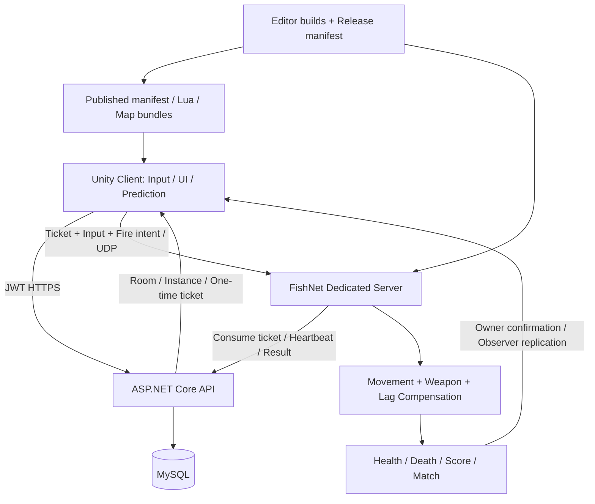

# FULL PROJECT REVIEW — UnityFpsLowPoly

> 日期：2026-09-26。审查角色：Senior Unity Engineer / Multiplayer FPS Lead / Code Reviewer。
> 源码基线：`c618134001e9087283b8dce8f54083d5d0c487ba`。审查期间 HEAD 到达 `32afebf2`，该次提交只纳入了本报告的早期占位快照；不属于本次审查执行的提交，业务源码未因此变化。
> 本轮只 Review：未修改源码、配置、资产；本轮交付修改仅此报告。测试运行产生的输出位于忽略目录 Logs / bin / obj。
> **结论属于静态工程审查与有限自动化验证，不是公网渗透测试或 Unity 实机验收通过证明。** 第 16 节逐文件列出覆盖状态；未将目录扫描、测试通过等同于完整代码审阅。

# 1. Executive Summary

项目已经形成较完整的多人 FPS 垂直链路：Unity 6 客户端与 FishNet Dedicated Server 负责实时对战，ASP.NET Core / MySQL 负责账户、房间、入场票据、商城、社交和结算。正式美术与武器表现基线已转向 LPFP；不能根据历史 LPW 命名判断当前运行入口。

总体判断：**应先关闭权威模拟与射速绕过，再扩大不可信玩家的公网测试。** 实时伤害和结算已经放在服务器，但“服务器执行代码”不自动保证服务器掌握时间、状态切换和生命周期的决定权。R01、R02 都发生在已有权威架构内部。

本次记录 **32 项独立问题：P0 2 项、P1 12 项、P2 15 项、P3 3 项**。不是按不优雅程度评分；Medium confidence 的 R13、R17 保留了运行条件和验证要求。High confidence 表示代码证据强，不自动表示已实机复现。审查后用户确认 R03：点击战绩确实会完全阻塞主线程；其余问题的验证状态见各条记录。

| 风险主线 | 主要问题 | 实际后果 |
| --- | --- | --- |
| 不可信实时输入 | R01、R02、R06、R07 | 超额权威模拟、重置射速限制、非法数值与资源消耗 |
| 正常玩家联机 | R04、R05、R12、R13、R16、R28 | late join、模式/队伍、延迟射击、复活预测及首生错误 |
| 进程/网络故障恢复 | R08–R11、R18 | 结果滞留或丢失、房间卡 Returning、不可连接实例仍 Ready |
| 客户端可用性 | R03、R19、R20、R29 | 战绩页主线程循环、损坏安装无法修复、Lua 释放和设置竞态 |
| 公网成本与发布 | R14、R21、R24–R27 | 数据增长、查询放大、构建配对漏检、干净检出依赖与守护误判 |

值得保留的实现：一次性入场票据绑定身份/实例/比赛，JWT 带 token version，服务器核验配装与伤害，shotId / life epoch 防止重复和跨生命误用，弹药有预测账本与服务器确认，回溯有恢复路径，后端有奖励幂等与业务测试，生产环境拒绝开发密钥和不适当的数据配置。详见第 7、8、10 节的 “No action required.” 项，不建议为设计模式做整体重写。

**实际验证结果：**

| 检查 | 结果 | 证据与边界 |
| --- | --- | --- |
| 后端测试 | 238 passed / 0 failed / 1 skipped，总计 239 | [backend-review.trx](E:/UnityProject/UnityFpsLowPoly/Logs/FullReview/backend-review.trx)；真实 MySQL 集成用例显式跳过 |
| 网络证据 Python 单元测试 | 3 passed | `python -m unittest discover -s Tools/Network -p 'test_*.py' -v`；只是证据处理测试，不是联网实测 |
| PowerShell 解析 | 33 个脚本、0 语法错误 | Parser.ParseFile 检查；没有启动/停止/发布服务 |
| 既有独立网络审计 harness | 未运行断言 | 旧 UnityStubs 缺少当前源码使用的 Lerp / LerpAngle / Repeat / Vector2.Lerp，编译失败；这是 harness 不兼容，不能据此判定产品 Unity 编译失败 |
| Unity / 实网 / 数据库 | 未验证 | 未触碰运行中编辑器，未进行 Unity 编译、EditMode、PlayMode、Player build、Profiler、真实 MySQL 或网络故障注入 |

最初普通 `dotnet test ... --no-restore` 因运行中 API 锁住 apphost 而失败（MSB3027 / MSB3021）；没有停止该服务。后续以独立输出目录及 `UseAppHost=false` 完成上述后端测试：

```powershell
dotnet test fps-backend/tests/UnityFps.Api.Tests/UnityFps.Api.Tests.csproj --no-restore -p:OutputPath=E:/UnityProject/UnityFpsLowPoly/Logs/FullReview/test-bin/ -p:UseAppHost=false --logger 'trx;LogFileName=backend-review.trx' --results-directory E:/UnityProject/UnityFpsLowPoly/Logs/FullReview --logger 'console;verbosity=minimal'
```

# 2. Project Architecture Map

以下地图以实际入口、调用和状态拥有者为依据。版本指本仓库锁定/声明版本，不代表最新版本。

| # | 领域 | 当前实现与边界 | 主要入口 |
| --- | --- | --- | --- |
| 1 | Unity 版本 | Unity 6000.0.76f1，URP，Windows 开发/部署链 | [ProjectSettings/ProjectVersion.txt](E:/UnityProject/UnityFpsLowPoly/ProjectSettings/ProjectVersion.txt) |
| 2 | Packages / dependencies | URP 17.0.4；Input System 1.19.0；Cinemachine 3.1.7；Addressables 2.9.1；Navigation 2.0.12；Newtonsoft 3.2.1；Test Framework 1.6.0；UGUI 2.0.0；嵌入 Animancer、xLua、DOTween、Editor 桥 | [Packages/manifest.json](E:/UnityProject/UnityFpsLowPoly/Packages/manifest.json)、[Packages/packages-lock.json](E:/UnityProject/UnityFpsLowPoly/Packages/packages-lock.json) |
| 3 | 网络框架 | FishNet 4.7.2 / Tugboat UDP；项目自有 tick 输入、预测、校正及回溯层 | [FishNet](E:/UnityProject/UnityFpsLowPoly/Assets/FishNet)、[PlayerNetworkAdapter.cs](E:/UnityProject/UnityFpsLowPoly/Assets/_Project/Scripts/Gameplay/Network/PlayerNetworkAdapter.cs) |
| 4 | 服务端运行 | Unity headless DS，启动参数指定地图/实例/API；注册、心跳与比赛结果经 HTTP | [DedicatedServerBootstrap.cs](E:/UnityProject/UnityFpsLowPoly/Assets/_Project/Scripts/Gameplay/Network/DedicatedServerBootstrap.cs)、[DedicatedServerRuntime.cs](E:/UnityProject/UnityFpsLowPoly/Assets/_Project/Scripts/Gameplay/Network/DedicatedServerRuntime.cs) |
| 5 | DS / Host / Client | 正式部署为 DS + 纯客户端；保留 Host/离线路径；Host 共用进程静态状态会掩盖复制缺口 | [FishNetLifecycleGuard.cs](E:/UnityProject/UnityFpsLowPoly/Assets/_Project/Scripts/Gameplay/Network/FishNetLifecycleGuard.cs)、[ClientMatchSessionCoordinator.cs](E:/UnityProject/UnityFpsLowPoly/Assets/_Project/Scripts/Gameplay/Network/ClientMatchSessionCoordinator.cs) |
| 6 | 后端 API | ASP.NET Core .NET 8，13 个控制器；EF Core 8.0.13 / Pomelo 8.0.3 | [fps-backend/src/UnityFps.Api/Program.cs](E:/UnityProject/UnityFpsLowPoly/fps-backend/src/UnityFps.Api/Program.cs) |
| 7 | 登录 / 鉴权 | BCrypt，JWT 约 12 小时，token version / Disabled 核验；DS 服务密钥；单次 join ticket | [AuthService.cs](E:/UnityProject/UnityFpsLowPoly/fps-backend/src/UnityFps.Api/Services/AuthService.cs)、[JwtTokenService.cs](E:/UnityProject/UnityFpsLowPoly/fps-backend/src/UnityFps.Api/Services/JwtTokenService.cs)、[JoinTicketAuthenticator.cs](E:/UnityProject/UnityFpsLowPoly/Assets/_Project/Scripts/Gameplay/Network/JoinTicketAuthenticator.cs) |
| 8 | 玩家数据 | Profile / Wallet / Inventory / Loadout / Settings / Pass / 社交；以 JWT 身份访问 | [AppDbContext.cs](E:/UnityProject/UnityFpsLowPoly/fps-backend/src/UnityFps.Api/Data/AppDbContext.cs)、[AccountSession.cs](E:/UnityProject/UnityFpsLowPoly/Assets/_Project/Scripts/Account/AccountSession.cs) |
| 9 | 武器 | WeaponDefinition / Stat / Attachment SO → StatResolver → WeaponRuntime / ActionSystem；Arsenal 管理槽位 | [WeaponController.cs](E:/UnityProject/UnityFpsLowPoly/Assets/_Project/Scripts/Gameplay/Weapon/WeaponController.cs)、[Arsenal.cs](E:/UnityProject/UnityFpsLowPoly/Assets/_Project/Scripts/Gameplay/Weapon/Arsenal.cs) |
| 10 | 射击 | 本地预测后提交 TimedFireRequest；服务器匹配输入、校验时序/瞄准/弹药，执行命中 | [NetworkCombatAuthority.cs](E:/UnityProject/UnityFpsLowPoly/Assets/_Project/Scripts/Gameplay/Network/NetworkCombatAuthority.cs) |
| 11 | 伤害 | CombatResolver / DamageableTarget；服务器生命、死亡、击杀归属及队分；投掷物也有服务器分支 | [CombatResolver.cs](E:/UnityProject/UnityFpsLowPoly/Assets/_Project/Scripts/Gameplay/Combat/CombatResolver.cs)、[DamageableTarget.cs](E:/UnityProject/UnityFpsLowPoly/Assets/_Project/Scripts/Gameplay/Health/DamageableTarget.cs) |
| 12 | 玩家移动 | 输入命令 → Locomotor.Simulate；服务器消费、owner replay、远端插值 | [MovementPredictionCore.cs](E:/UnityProject/UnityFpsLowPoly/Assets/_Project/Scripts/Gameplay/Movement/MovementPredictionCore.cs)、[Locomotor.cs](E:/UnityProject/UnityFpsLowPoly/Assets/_Project/Scripts/Gameplay/Movement/Locomotor.cs) |
| 13 | CC / Rigidbody | 玩家为 CharacterController；移动数据包含烘焙的根运动资料；投掷物使用物理刚体。不是 Rigidbody 玩家预测 | [Locomotor.cs](E:/UnityProject/UnityFpsLowPoly/Assets/_Project/Scripts/Gameplay/Movement/Locomotor.cs)、[PlayerNetworkAdapter.cs](E:/UnityProject/UnityFpsLowPoly/Assets/_Project/Scripts/Gameplay/Network/PlayerNetworkAdapter.cs) |
| 14 | 网络同步 | RPC、SyncVar、权威状态确认及时间戳 observer pose；生命 epoch 分隔旧状态 | [NetworkWeaponState.cs](E:/UnityProject/UnityFpsLowPoly/Assets/_Project/Scripts/Gameplay/Network/NetworkWeaponState.cs)、[ObserverTimeline.cs](E:/UnityProject/UnityFpsLowPoly/Assets/_Project/Scripts/Gameplay/Network/ObserverTimeline.cs) |
| 15 | Spawn / Despawn | 鉴权后 scene-ready → TeamFirstSpawnDirector → FishNet pooled instantiate / Spawn；复活复用玩家实体并重置生命 | [TeamFirstSpawnDirector.cs](E:/UnityProject/UnityFpsLowPoly/Assets/_Project/Scripts/Gameplay/Network/TeamFirstSpawnDirector.cs)、[SceneSpawnPoints.cs](E:/UnityProject/UnityFpsLowPoly/Assets/_Project/Scripts/Gameplay/Network/SceneSpawnPoints.cs) |
| 16 | Match / Room / Lobby | 后端 Waiting / Starting / InMatch / Returning / Closed；DS Ready / Reserved / InMatch / Draining；客户端本地 phase | [RoomService.cs](E:/UnityProject/UnityFpsLowPoly/fps-backend/src/UnityFps.Api/Services/RoomService.cs)、[ServerInstanceService.cs](E:/UnityProject/UnityFpsLowPoly/fps-backend/src/UnityFps.Api/Services/ServerInstanceService.cs)、[MatchLifecycle.cs](E:/UnityProject/UnityFpsLowPoly/Assets/_Project/Scripts/Gameplay/Network/MatchLifecycle.cs) |
| 17 | Scene 管理 | Boot → Lobby → 普通场景/热更地图；SessionCoordinator 管连接代际、入场与 owner 就绪；MatchReturnSequence 负责返回 | [BootEntry.cs](E:/UnityProject/UnityFpsLowPoly/Assets/_Project/Scripts/UI/BootEntry.cs)、[ClientMatchSessionCoordinator.cs](E:/UnityProject/UnityFpsLowPoly/Assets/_Project/Scripts/Gameplay/Network/ClientMatchSessionCoordinator.cs)、[MatchReturnSequence.cs](E:/UnityProject/UnityFpsLowPoly/Assets/_Project/Scripts/UI/MatchReturnSequence.cs) |
| 18 | UI | UGUI / TMP，大量代码构建界面；大厅页面、HUD、菜单、聊天和 Lua 热页 | [AppRoot.cs](E:/UnityProject/UnityFpsLowPoly/Assets/_Project/Scripts/UI/AppRoot.cs)、[LobbyPresenter.cs](E:/UnityProject/UnityFpsLowPoly/Assets/_Project/Scripts/UI/LobbyPresenter.cs) |
| 19 | 输入 | Input System 键鼠与设置绑定，GameplayInputGate 管菜单/场景切换；项目同时保留旧输入支持配置 | [InputReader.cs](E:/UnityProject/UnityFpsLowPoly/Assets/_Project/Scripts/Gameplay/Player/InputReader.cs)、[GameplayInputGate.cs](E:/UnityProject/UnityFpsLowPoly/Assets/_Project/Scripts/Gameplay/Menu/GameplayInputGate.cs) |
| 20 | 音频 | AudioBus 总音量 / 类别音量；本地开火 voice 池，远端枪声和脚步/音乐分路 | [AudioBus.cs](E:/UnityProject/UnityFpsLowPoly/Assets/_Project/Scripts/Core/AudioBus.cs)、[RemoteGunAudioView.cs](E:/UnityProject/UnityFpsLowPoly/Assets/_Project/Scripts/Presentation/Audio/RemoteGunAudioView.cs) |
| 21 | 配置 | SO 玩法参数、用户设置、服务地址/发布身份、地图目录、服务器参数及 appsettings / env | [UserSettingsSync.cs](E:/UnityProject/UnityFpsLowPoly/Assets/_Project/Scripts/Gameplay/Settings/UserSettingsSync.cs)、[DedicatedServerOptions.cs](E:/UnityProject/UnityFpsLowPoly/Assets/_Project/Scripts/Gameplay/Network/DedicatedServerOptions.cs) |
| 22 | Save / 持久化 | MySQL 业务状态；PlayerPrefs 设置；Windows DPAPI 记住会话/主机秘密；JSON pending 结算队列 | [RememberedSession.cs](E:/UnityProject/UnityFpsLowPoly/Assets/_Project/Scripts/Account/RememberedSession.cs)、[MatchResultPendingStore.cs](E:/UnityProject/UnityFpsLowPoly/Assets/_Project/Scripts/Gameplay/Network/MatchResultPendingStore.cs) |
| 23 | Resources / Bundle / Addressables | Resources 用于配置/UI/预置资源；手动 AssetBundle 场景加载；已安装 Addressables，但未发现一方运行链调用其加载 API | [HotSceneLoader.cs](E:/UnityProject/UnityFpsLowPoly/Assets/_Project/Scripts/UI/HotUpdate/HotSceneLoader.cs)、[HotUpdateRuntime.cs](E:/UnityProject/UnityFpsLowPoly/Assets/_Project/Scripts/UI/HotUpdate/HotUpdateRuntime.cs) |
| 24 | 热更新 | 清单版本/路径/文件 SHA 校验，staging 安装；xLua 页面 + 地图 bundles；属于脚本/内容更新 | [HotUpdateBootstrap.cs](E:/UnityProject/UnityFpsLowPoly/Assets/_Project/Scripts/UI/HotUpdate/HotUpdateBootstrap.cs)、[HotUpdateInstaller.cs](E:/UnityProject/UnityFpsLowPoly/Assets/_Project/Scripts/UI/HotUpdate/HotUpdateInstaller.cs) |
| 25 | 日志 | Unity 日志、Fire/Move/Auth/Match trace、可选遥测 JSONL、ASP.NET 日志、部署证据导出 | [PublicTestTelemetry.cs](E:/UnityProject/UnityFpsLowPoly/Assets/_Project/Scripts/Gameplay/Network/PublicTestTelemetry.cs)、[ApiExceptionMiddleware.cs](E:/UnityProject/UnityFpsLowPoly/fps-backend/src/UnityFps.Api/Common/ApiExceptionMiddleware.cs) |
| 26 | 对象池 | tracer 池、本地音频 voice 池、FishNet 玩家池；部分枪口/弹壳/命中特效和远端音频仍创建销毁 | [WeaponView.cs](E:/UnityProject/UnityFpsLowPoly/Assets/_Project/Scripts/Presentation/Weapon/WeaponView.cs)、[TeamFirstSpawnDirector.cs](E:/UnityProject/UnityFpsLowPoly/Assets/_Project/Scripts/Gameplay/Network/TeamFirstSpawnDirector.cs) |
| 27 | AI / Bot | 未发现一方生产战斗 Bot / NavMeshAgent AI 链；ClientAutoPilot 是测试驱动，不等同生产 Bot | [Debug](E:/UnityProject/UnityFpsLowPoly/Assets/_Project/Scripts/Debug) |
| 28 | 外部服务 | MySQL + Web API；未发现 Redis 链；私测可走 ZeroTier，公网依赖 HTTPS 入口和 UDP 可达性 | [Cloud tools](E:/UnityProject/UnityFpsLowPoly/Tools/Cloud)、[PrivateTest tools](E:/UnityProject/UnityFpsLowPoly/Tools/PrivateTest) |
| 29 | Build / CI / Deploy | Editor 客户端/DS/邀请包/热更构建；Windows PowerShell 管 6 个地图 DS + 1 个 API；发布 hash / readiness 门 | [BuildManifestWriter.cs](E:/UnityProject/UnityFpsLowPoly/Assets/_Project/Editor/BuildManifestWriter.cs)、[Tools/Cloud/Start-CloudServer.ps1](E:/UnityProject/UnityFpsLowPoly/Tools/Cloud/Start-CloudServer.ps1) |
| 30 | 测试 | Unity EditMode 168 个 C# 文件，PlayMode 7 个；后端 36 个测试源文件；工具解析/网络证据测试 | [Assets/_Project/Tests](E:/UnityProject/UnityFpsLowPoly/Assets/_Project/Tests)、[fps-backend/tests](E:/UnityProject/UnityFpsLowPoly/fps-backend/tests)、[Tools/Network](E:/UnityProject/UnityFpsLowPoly/Tools/Network) |

程序集主要方向为 Core → Account / Gameplay → Presentation → UI；Gameplay 内又包含 Network。这里箭头表示上层逐渐依赖前面层，不表示 Core 依赖 UI。UI 汇集 Gameplay、Account、Presentation 与 xLua。部分 Gameplay 通过 reflection 调用上层，编译依赖图不能完整展示运行时耦合。



主要链路：
1. **入场**：账户会话 → 房间/模式 → 分配 DS → 签发票据 → 加载指定地图 → FishNet 鉴权消费票据 → 首次 Spawn → owner / phase 就绪。
2. **移动**：InputReader → MovementCommand → owner 预测 → ServerSubmitInputBatch → 输入队列/Locomotor → owner 权威确认与重放 → observer pose 插值。
3. **射击**：输入 → WeaponController 本地预测 → TimedFireRequest → 所属者/生命/输入/瞄准/射速校验 → 回溯 → 眼点/枪口双阶段命中 → DamageableTarget → 死亡/击杀/队分 → 弹药确认、远端表现。
4. **结算返回**：DS 终局 → 后端权威结果/奖励 → 客户端结算页 → 返回/退出 ack → 断线事实 → 后端释放房间和实例；R08–R10 位于这条链的故障分支。
5. **内容激活**：下载 manifest → 版本/路径/hash → staging → 激活文件/场景 bundle → Lua 页面注册；R19、R20 位于安装恢复与宿主退出边界。

# 3. Critical Issues

## [R01] 客户端输入 tick 没有服务器时间预算，可持续加速权威模拟

**Severity:** P0  
**Category:** Network / Security

**Location / Line:**

- [Assets/_Project/Scripts/Gameplay/Movement/MovementPredictionCore.cs](E:/UnityProject/UnityFpsLowPoly/Assets/_Project/Scripts/Gameplay/Movement/MovementPredictionCore.cs:23) — L23–27、417–486
- [Assets/_Project/Scripts/Gameplay/Network/PlayerNetworkAdapter.cs](E:/UnityProject/UnityFpsLowPoly/Assets/_Project/Scripts/Gameplay/Network/PlayerNetworkAdapter.cs:1107) — L1107–1159

**Problem:** 服务器限制单次追赶步数，却没有限制累计模拟时间相对真实服务器时间的领先量。

**Evidence:** Enqueue 只比较 cmd.Tick 与 LastProcessedTick；Drain 每个服务器 tick 可消费 3 条，每条都 Simulate(..., _fixedDelta)。持续每 tick 提供 3 条连续编号，窗口随消费一起前进，不会触发 32 tick 的 future 检查。按 30Hz 推导：300 个服务器 tick 可以执行 900 个模拟步。

**Runtime Scenario:** 持有效票据的修改客户端持续超频发送合法编号的移动命令；另一个边界是空队列分支直接 return，空中停发输入期间重力也不推进。

**Impact:** 可改变服务器权威移动速度；射速校验也依赖 InputTick，受同一时间伪造影响。不是直接上传位置的漏洞；碰撞仍执行，但执行了过多时间。

**Suggested Fix:** 建立服务器墙钟驱动的累计模拟预算，只允许有上限、可偿还的短时追赶；客户端 tick 映射到服务器 epoch；无输入时继续中性输入/重力步进。新增持续超频、停包悬空和正常突发补包的集成验证。

**Confidence:** High。

**Validation:** 需要运行时验证。上述代码路径已静态核对；本轮未在 Unity Player / 公网 / 真实数据库中复现该问题，也没有为其修改代码或新增测试。

## [R02] 同槽换枪 RPC 重建运行态，清空服务端射速限制

**Severity:** P0  
**Category:** Network / Security / Gameplay

**Location / Line:**

- [Assets/_Project/Scripts/Gameplay/Network/NetworkCombatAuthority.cs](E:/UnityProject/UnityFpsLowPoly/Assets/_Project/Scripts/Gameplay/Network/NetworkCombatAuthority.cs:189) — L189–196、353–372
- [Assets/_Project/Scripts/Gameplay/Weapon/WeaponController.cs](E:/UnityProject/UnityFpsLowPoly/Assets/_Project/Scripts/Gameplay/Weapon/WeaponController.cs:323) — L323–338、422–442、498–523
- [Assets/_Project/Scripts/Gameplay/Weapon/WeaponRuntime.cs](E:/UnityProject/UnityFpsLowPoly/Assets/_Project/Scripts/Gameplay/Weapon/WeaponRuntime.cs:32) — L32–36

**Problem:** 请求当前已装备槽位仍被当作有效换枪；服务端射速账本与临时 WeaponRuntime 对象身份绑定。

**Evidence:** ServerSwitchRequest 校验槽位存在后直接 EquipDefinition；它重建 Runtime 并 HardReset recoil/accuracy。ExecuteTimedShot 发现 Runtime 引用变化即 Reset cadence；cadenceValidated:true 又跳过 Runtime 自身冷却。RPC 未执行客户端 Arsenal 的收枪/拔枪时间约束。

**Runtime Scenario:** 合法持枪玩家在连续射击之间反复请求同一槽位，并提交新的 ShotId 和有效瞄准/时间数据。至少可以跨服务器 tick 重复清空正常 RPM 限制；未声称可在同一批次无限开火。

**Impact:** 低射速武器可以异常高频射击，并清空后坐力/散布累积。已有弹药保存逻辑仍有效，不能据此称为无限弹药。

**Suggested Fix:** 当前槽位请求应为无副作用操作；服务端执行统一换枪动作规则；射速账本按玩家、武器、生命代际持有，不能因重建 Runtime 清空；与 R01 的服务器时间预算共同修复。

**Confidence:** High。

**Validation:** 需要运行时验证。上述代码路径已静态核对；本轮未在 Unity Player / 公网 / 真实数据库中复现该问题，也没有为其修改代码或新增测试。

# 4. High Priority Issues

## [R03] Lua 战绩页清理循环在 Player 中阻塞主线程

**Severity:** P1  
**Category:** Unity / Lua / Lifecycle

**Location / Line:**

- [Assets/Resources/Lua/career_page.lua.txt](E:/UnityProject/UnityFpsLowPoly/Assets/Resources/Lua/career_page.lua.txt:17) — L17–27、44–45、131–145
- [Assets/_Project/Tests/EditMode/HotUpdate/HotPageSmokeTests.cs](E:/UnityProject/UnityFpsLowPoly/Assets/_Project/Tests/EditMode/HotUpdate/HotPageSmokeTests.cs:162) — L162–201

**Problem:** 运行时 while 循环等待 childCount 下降，但循环体只调用延迟销毁。

**Evidence:** show 创建加载标题和提示；HTTP 成功或失败回调进入 CareerPageRender，再调用 clearRoot。Application.isPlaying 为 true 时 Destroy 不立即从层级移除子节点，循环始终取得第 0 个节点。EditMode 分支使用 DestroyImmediate，现有 EditMode 渲染测试无法覆盖该差异。 Unity 官方说明 Destroy 的实际销毁延迟到当前 Update 循环之后，因此同一同步 while 中不能以 childCount 递减作为退出条件。[Object.Destroy](https://docs.unity3d.com/6000.0/Documentation/ScriptReference/Object.Destroy.html)。

**Runtime Scenario:** Player 打开战绩页，服务器返回数据或错误，且页面尚未离开。内置脚本路径可触发；实际热更包是否包含相同版本未重新验包。

**Impact:** 客户端主线程无法返回帧循环，界面及输入卡死。

**User Confirmation:** 用户确认当前点击战绩会直接卡死主线程；战绩页用于展示 Lua 热更新的录制演示。因此 R03 是当前演示的首要阻断项。此反馈确认卡死现象，与静态清理循环证据一致；尚未由审查者核验用户实际加载的热更脚本版本。

**Suggested Fix:** 使用有界倒序遍历，或先将子节点脱离父节点再 Destroy；补充 Player/PlayMode 的加载态→成功态、错误态和翻页验证。

**Confidence:** High。

**Validation:** 卡死现象已由用户实机确认，清理循环已静态核对；修复后的 Player 行为、实际激活脚本版本及完整热更新演示仍需运行时验证。审查者未自行执行 Unity 复现，也未修改代码或新增测试。

## [R04] 中途加入者没有比赛阶段快照，加载界面可能永久停留

**Severity:** P1  
**Category:** Network / Late Join

**Location / Line:**

- [Assets/_Project/Scripts/Gameplay/Network/MatchLifecycle.cs](E:/UnityProject/UnityFpsLowPoly/Assets/_Project/Scripts/Gameplay/Network/MatchLifecycle.cs:280) — L280–331、406–417、900–934
- [Assets/_Project/Scripts/Gameplay/Network/NetworkCombatAuthority.cs](E:/UnityProject/UnityFpsLowPoly/Assets/_Project/Scripts/Gameplay/Network/NetworkCombatAuthority.cs:1190) — L1190–1200
- [Assets/_Project/Scripts/Gameplay/Network/ClientMatchSessionCoordinator.cs](E:/UnityProject/UnityFpsLowPoly/Assets/_Project/Scripts/Gameplay/Network/ClientMatchSessionCoordinator.cs:206) — L206–214
- [Assets/_Project/Scripts/Gameplay/Network/MatchLoadingScreen.cs](E:/UnityProject/UnityFpsLowPoly/Assets/_Project/Scripts/Gameplay/Network/MatchLoadingScreen.cs:113) — L113–117

**Problem:** 比赛阶段只靠瞬时事件推进；连接时重置到 Idle 后，没有获取当前阶段的可靠初始化路径。

**Evidence:** CountdownStarted/CountdownEnded/MatchIdAssigned 通过未 BufferLast 的 ObserversRpc 发出；ServerNotifyPlayerJoined 只通知聊天。周期 scoreboard 不包含 phase/matchId，MirrorFromEvent 也不消费它。加载完成要求 MatchLifecycle.Phase == InProgress。

**Runtime Scenario:** 对局开始后补入，或正常参赛者加载超过倒计时并错过阶段广播。

**Impact:** 网络角色已生成，客户端仍处于 Idle，加载遮罩不退出；依赖阶段的聊天和投掷等行为也可能错误。

**Suggested Fix:** 在观察者就绪时下发包含 matchId、generation、phase、规则、时间基准的持久状态快照；阶段状态与一次性通知分开，覆盖晚加入、慢加载和重连。

**Confidence:** High。

**Validation:** 需要运行时验证。上述代码路径已静态核对；本轮未在 Unity Player / 公网 / 真实数据库中复现该问题，也没有为其修改代码或新增测试。

## [R05] 纯客户端的比赛模式一直保留 KillRace 默认值

**Severity:** P1  
**Category:** Network / State Consistency

**Location / Line:**

- [Assets/_Project/Scripts/Gameplay/Network/MatchLifecycle.cs](E:/UnityProject/UnityFpsLowPoly/Assets/_Project/Scripts/Gameplay/Network/MatchLifecycle.cs:87) — L87–101、280–331
- [Assets/_Project/Scripts/Presentation/HUD/EnemyOutlinePresenter.cs](E:/UnityProject/UnityFpsLowPoly/Assets/_Project/Scripts/Presentation/HUD/EnemyOutlinePresenter.cs:29) — L29–33
- [Assets/_Project/Scripts/Presentation/HUD/TacticalMinimapView.cs](E:/UnityProject/UnityFpsLowPoly/Assets/_Project/Scripts/Presentation/HUD/TacticalMinimapView.cs:175) — L175–185
- [Assets/_Project/Scripts/Presentation/HUD/MatchHudView.cs](E:/UnityProject/UnityFpsLowPoly/Assets/_Project/Scripts/Presentation/HUD/MatchHudView.cs:136) — L136–154

**Problem:** 客户端规则镜像没有应用服务端模式，TDM 中多个表现模块因此按个人模式处理。

**Evidence:** CurrentMode 的有效赋值来自服务端 AcceptedUsers；客户端重置为 KillRace 后，MirrorFromEvent 只改阶段和比赛 ID。scoreboard 虽携带 mode，HUD 自行读取该 payload 不会更新 MatchLifecycle.CurrentMode。

**Runtime Scenario:** 使用 Dedicated Server 正常从头开始一局 TDM；Host 共享服务器静态值，会掩盖问题。

**Impact:** 队友可能被画为敌人轮廓/标识，小地图队友分支不执行。不能据此认定服务端友伤开关失效；服务端模式和队伍另有正确来源。

**Suggested Fix:** 让所有客户端规则消费者使用同一份服务器快照，统一模式、目标分数与计时；不要只修某个 HUD 的判断。与 R04 共用状态复制方案。

**Confidence:** High。

**Validation:** 需要运行时验证。上述代码路径已静态核对；本轮未在 Unity Player / 公网 / 真实数据库中复现该问题，也没有为其修改代码或新增测试。

## [R06] 移动 RPC 接受非有限数值，且未校验批次数量

**Severity:** P1  
**Category:** Security / Network Input Validation

**Location / Line:**

- [Assets/_Project/Scripts/Gameplay/Network/PlayerNetworkAdapter.cs](E:/UnityProject/UnityFpsLowPoly/Assets/_Project/Scripts/Gameplay/Network/PlayerNetworkAdapter.cs:1186) — L1186–1221、2248–2258
- [Assets/_Project/Scripts/Gameplay/Movement/MovementPredictionCore.cs](E:/UnityProject/UnityFpsLowPoly/Assets/_Project/Scripts/Gameplay/Movement/MovementPredictionCore.cs:417) — L417–449
- [Assets/_Project/Scripts/Gameplay/Movement/Locomotor.cs](E:/UnityProject/UnityFpsLowPoly/Assets/_Project/Scripts/Gameplay/Movement/Locomotor.cs:142) — L142–146、305–345

**Problem:** 服务端对 tick/生命代际的检查没有覆盖 Move、YawDelta、PitchDelta、Ads01 的数值合法性。

**Evidence:** RPC 遍历收到的整个数组；ClientMaxBatch 的限制只在发送端。队列没有 IsFinite 验证；ClampMagnitude/Clamp01 不是 NaN 校验，输入继续进入位移、旋转及 ADS 速度计算。

**Runtime Scenario:** 已认证恶意客户端发送带 NaN/Infinity 的移动命令，或超过正常发送端长度的数组。

**Impact:** 可能污染权威 Transform/模拟状态，触发物理与同步异常；大批次增加解析后的处理成本。未验证可导致整个服务器崩溃，也未绕过 FishNet 自身报文大小限制。

**Suggested Fix:** 在 RPC 入队前校验数组长度、所有浮点 IsFinite、方向与角度边界、枚举范围；非法请求计数并限流/断开。ADS 减速从服务端瞄准态计算，避免客户端填 0 绕过。

**Confidence:** High。

**Validation:** 需要运行时验证。上述代码路径已静态核对；本轮未在 Unity Player / 公网 / 真实数据库中复现该问题，也没有为其修改代码或新增测试。

## [R07] 雷达上报可用任意目标 ID 扩大字典并反复全场扫描

**Severity:** P1  
**Category:** Security / Denial of Service

**Location / Line:**

- [Assets/_Project/Scripts/Gameplay/Network/NetworkCombatAuthority.cs](E:/UnityProject/UnityFpsLowPoly/Assets/_Project/Scripts/Gameplay/Network/NetworkCombatAuthority.cs:1065) — L1065–1089

**Problem:** 雷达节流按客户端传入的任意 ID 分桶，缺少单连接总预算。

**Evidence:** 在确认目标存在之前执行 _radarAcceptTimes[enemyObjectId] = now；新 ID 每次触发 FindObjectsByType。未找到该字典的淘汰路径；单 ID 的 0.15 秒限制无法约束连续不同 ID。

**Runtime Scenario:** 持有效 TDM 身份的活跃玩家高速提交不同 enemyObjectId。

**Impact:** 服务器字典持续增长，并产生查找数组及遍历开销；实际吞吐/内存耗尽阈值需要压测。

**Suggested Fix:** 先验证 ID 对应有效敌人，再记录有限集合；增加每连接令牌桶、场景对象注册表及生命周期清理。

**Confidence:** High。

**Validation:** 需要运行时验证。上述代码路径已静态核对；本轮未在 Unity Player / 公网 / 真实数据库中复现该问题，也没有为其修改代码或新增测试。

## [R08] 结算补偿队列没有正常心跳期间的重试泵

**Severity:** P1  
**Category:** Backend / Reliability

**Location / Line:**

- [Assets/_Project/Scripts/Gameplay/Network/DedicatedServerBootstrap.cs](E:/UnityProject/UnityFpsLowPoly/Assets/_Project/Scripts/Gameplay/Network/DedicatedServerBootstrap.cs:370) — L370–384、433–460、479–519

**Problem:** 日志承诺后端恢复后自动重放，但失败结果只在重新注册时尝试补交。

**Evidence:** 三次发送失败后 Append；FlushPendingMatchResultsAsync 的调用点位于 TryRegisterOnceAsync。HeartbeatUntilConflictAsync 对 Accepted/TransportError 继续循环，不 flush；只有 409 才退出并注册。

**Runtime Scenario:** 结算接口或奖励处理短时失败，结果进入 pending；随后正常心跳持续成功，没有触发重新注册。

**Impact:** 结果/奖励可长期处于待补交，进程一直存活也不能自动完成。

**Suggested Fix:** 使用独立、单实例执行的有界补偿任务，或成功心跳触发去重调度；正常恢复不应依赖 409/重启；验证奖励部分失败与网络故障恢复。

**Confidence:** High。

**Validation:** 需要运行时验证。上述代码路径已静态核对；本轮未在 Unity Player / 公网 / 真实数据库中复现该问题，也没有为其修改代码或新增测试。

## [R09] 结算首次持久化发生在网络重试结束之后

**Severity:** P1  
**Category:** Persistence / Crash Recovery

**Location / Line:**

- [Assets/_Project/Scripts/Gameplay/Network/DedicatedServerBootstrap.cs](E:/UnityProject/UnityFpsLowPoly/Assets/_Project/Scripts/Gameplay/Network/DedicatedServerBootstrap.cs:370) — L370–380、394–425
- [Assets/_Project/Scripts/Gameplay/Network/MatchResultPendingStore.cs](E:/UnityProject/UnityFpsLowPoly/Assets/_Project/Scripts/Gameplay/Network/MatchResultPendingStore.cs:167) — L167–194

**Problem:** 持久队列不是先写后发，终局结果在首次发送及重试期间仅驻留内存。

**Evidence:** DeliverMatchResultAsync 先 await ReportMatchResultAsync；仅失败返回后 Append。PendingStore 的原子替换不能保护尚未 Append 的请求。

**Runtime Scenario:** 比赛结束后，后端尚未接受结果时 DS 进程退出、主机掉电或崩溃。

**Impact:** 该窗口中的权威终局载荷无法从 pending 文件恢复，玩家战绩/奖励可能缺失。

**Suggested Fix:** 终局生成后先持久化唯一 matchId 载荷，再尝试交付；确认 accepted 或明确终态后删除；恢复与幂等处理沿用现有后端契约。

**Confidence:** High。

**Validation:** 需要运行时验证。上述代码路径已静态核对；本轮未在 Unity Player / 公网 / 真实数据库中复现该问题，也没有为其修改代码或新增测试。

## [R10] Returning 状态依赖永远不会再来的 DS 断线报告

**Severity:** P1  
**Category:** Backend / Lifecycle / Recovery

**Location / Line:**

- [fps-backend/src/UnityFps.Api/Services/RoomService.cs](E:/UnityProject/UnityFpsLowPoly/fps-backend/src/UnityFps.Api/Services/RoomService.cs:1275) — L1275–1304、1389–1406、1472–1489
- [fps-backend/src/UnityFps.Api/Services/ServerInstanceService.cs](E:/UnityProject/UnityFpsLowPoly/fps-backend/src/UnityFps.Api/Services/ServerInstanceService.cs:87) — L87–108

**Problem:** 已消费过票据的玩家在 DS 崩溃后，Returning 无法依靠实例死亡事实收尾。

**Evidence:** Returning 超时仅调用 MarkNeverConnectedRosterRowsLeftAsync；任何历史已消费票据都会阻止标记 Left。该分支没有像 InMatch 一样处理实例心跳超时；重新注册也不会补回旧进程已经丢失的逐玩家断线报告。

**Runtime Scenario:** 结算已使房间进入 Returning，但 DS 在玩家断线上报前崩溃，或断线报告永久失败。

**Impact:** 房间持续 Returning、实例持续绑定/Draining，玩家无法正常开始下一局；该风险不等同于允许仅凭客户端 ack 提前释放活跃服务器。

**Suggested Fix:** 引入服务器进程 incarnation/租约 fencing；确认旧实例失效后为旧代际批量生成退出事实并封存；保留对仍存活连接的保护。

**Confidence:** High。

**Validation:** 需要运行时验证。上述代码路径已静态核对；本轮未在 Unity Player / 公网 / 真实数据库中复现该问题，也没有为其修改代码或新增测试。

## [R11] UDP 监听停止后仍可持续报告 Ready 心跳

**Severity:** P1  
**Category:** Deployment / Availability

**Location / Line:**

- [Assets/_Project/Scripts/Gameplay/Network/DedicatedServerBootstrap.cs](E:/UnityProject/UnityFpsLowPoly/Assets/_Project/Scripts/Gameplay/Network/DedicatedServerBootstrap.cs:259) — L259–273、500–521、760–772
- [Assets/_Project/Scripts/Gameplay/Network/DedicatedServerRuntime.cs](E:/UnityProject/UnityFpsLowPoly/Assets/_Project/Scripts/Gameplay/Network/DedicatedServerRuntime.cs:535) — L535–544
- [Tools/Cloud/Watch-CloudServer.ps1](E:/UnityProject/UnityFpsLowPoly/Tools/Cloud/Watch-CloudServer.ps1:6) — L6–15

**Problem:** 初次监听成功后，监听状态不再参与服务发现健康判断。

**Evidence:** Stopped 回调仅写警告；TryBuildHeartbeat 读取玩家数及状态追踪器，不检查传输监听是否仍 Started。守护脚本只检查进程身份/退出。

**Runtime Scenario:** 已注册的空闲 DS 停止 FishNet 监听但进程仍存活，或网络层异常停止。

**Impact:** API 仍可能看到新鲜 Ready 实例，将玩家分配到不可连接的 UDP 服务。

**Suggested Fix:** 监听停止即停止 Ready 通告并上报 Offline/失败原因；将传输状态接入健康与恢复逻辑，避免只用 PID 存活判断可服务。

**Confidence:** High。

**Validation:** 需要运行时验证。上述代码路径已静态核对；本轮未在 Unity Player / 公网 / 真实数据库中复现该问题，也没有为其修改代码或新增测试。

## [R12] 修改房间模式没有迁移现有成员队伍

**Severity:** P1  
**Category:** Backend / Gameplay Consistency

**Location / Line:**

- [fps-backend/src/UnityFps.Api/Services/RoomService.cs](E:/UnityProject/UnityFpsLowPoly/fps-backend/src/UnityFps.Api/Services/RoomService.cs:339) — L339–363、433–467
- [Assets/_Project/Scripts/Gameplay/Network/MatchRules.cs](E:/UnityProject/UnityFpsLowPoly/Assets/_Project/Scripts/Gameplay/Network/MatchRules.cs:91) — L91–95
- [Assets/_Project/Scripts/Gameplay/Network/MatchLifecycle.cs](E:/UnityProject/UnityFpsLowPoly/Assets/_Project/Scripts/Gameplay/Network/MatchLifecycle.cs:74) — L74–79、114–125

**Problem:** 房主提交合法的新模式及对应规则后，旧 TeamId 原样进入下一局 roster。

**Evidence:** UpdateSettings 修改 Mode 并清 ready，没有清理/重分配成员队伍。开局复制成员 TeamId；同队伤害判定比较 Red/Blue，AddTeamKill 只处理 Red/Blue。

**Runtime Scenario:** TDM 改为 KillRace，旧红蓝成员仍同队免伤；KillRace 改为 TDM，现有成员可保持 None，不能正常贡献队分。前提是同地图支持该模式且请求同时满足新规则白名单。

**Impact:** 模式规则、友伤和计分不一致，可能影响整局胜负。

**Suggested Fix:** 模式切换应事务化重建成员队伍并校验队伍容量；或禁止有成员时改变模式并提供明确迁移流程。开局再次验证 roster 与模式相容。

**Confidence:** High。

**Validation:** 需要运行时验证。上述代码路径已静态核对；本轮未在 Unity Player / 公网 / 真实数据库中复现该问题，也没有为其修改代码或新增测试。

## [R13] 200ms 显示时间窗口把正常较高延迟射击整发拒绝

**Severity:** P1  
**Category:** Network / Lag Compensation

**Location / Line:**

- [Assets/_Project/Scripts/Gameplay/Network/ObserverTimeline.cs](E:/UnityProject/UnityFpsLowPoly/Assets/_Project/Scripts/Gameplay/Network/ObserverTimeline.cs:29) — L29、76–77、198–213
- [Assets/_Project/Scripts/Gameplay/Network/NetworkCombatAuthority.cs](E:/UnityProject/UnityFpsLowPoly/Assets/_Project/Scripts/Gameplay/Network/NetworkCombatAuthority.cs:68) — L68–74、142–157、203–212

**Problem:** 回溯窗口同时被用作射击准入条件，没有超窗时的可解释退化策略。

**Evidence:** 远端显示通常缓冲约 100ms（30Hz 的 3 tick）；服务器接收时 displayTick 的年龄约为 RTT + 显示缓冲。ValidDisplayTick 超过 200ms 直接 InvalidTime，随后 RejectShot，且回溯失败同样整发拒绝。

**Runtime Scenario:** 稳定 150ms RTT、约 100ms 显示缓冲时，理想模型下请求年龄约 250ms；丢包/抖动还会扩大年龄。目标实际呈现 tick 的修正并不能消除这项预算冲突。

**Impact:** 玩家本地有开火与预测命中，但服务器持续拒发。200ms 上限本身可以是公平性策略，问题是它与当前显示延迟及准入行为组合后形成很低的实际延迟门槛。

**Suggested Fix:** 明确支持的 RTT/抖动范围并联合设计显示缓冲与回溯预算；超窗采用有界不补偿/钳制策略或清楚的连接质量拒绝策略，不能只任意扩大信任窗口。用 80/150/250ms RTT 实测。

**Confidence:** Medium。

**Validation:** 需要运行时验证。上述代码路径已静态核对；本轮未在 Unity Player / 公网 / 真实数据库中复现该问题，也没有为其修改代码或新增测试。

## [R14] 用户设置可无限累积任意键，写入后又全量读回

**Severity:** P1  
**Category:** Security / Database / Resource Limits

**Location / Line:**

- [fps-backend/src/UnityFps.Api/Services/UserSettingsService.cs](E:/UnityProject/UnityFpsLowPoly/fps-backend/src/UnityFps.Api/Services/UserSettingsService.cs:16) — L16–24、27–67
- [fps-backend/src/UnityFps.Api/Program.cs](E:/UnityProject/UnityFpsLowPoly/fps-backend/src/UnityFps.Api/Program.cs:150) — L150–154

**Problem:** 128 个键是单次请求限制，不是每用户总量限制。

**Evidence:** SaveAsync 仅查本批 keys，允许不断新增无白名单键；最后 GetAsync 返回该用户全部键。每账户每分钟 1200 请求的全局限流不能形成存储配额。

**Runtime Scenario:** 任意已认证账户持续写入不同的合法短键。

**Impact:** 数据库行数与后续 GET/PUT 响应持续膨胀，消耗共享 API/DB 资源；不是越权读取其他账户。

**Suggested Fix:** 按已知设置键/版本白名单接收，或限制每用户总键数和总字节；对新增键事务性计数；响应只返回当前设置快照的有限结构。

**Confidence:** High。

**Validation:** 需要运行时验证。上述代码路径已静态核对；本轮未在 Unity Player / 公网 / 真实数据库中复现该问题，也没有为其修改代码或新增测试。

# 5. Medium Priority Issues

## [R15] 个人模式中途加入与缩小房间容量没有总人数约束

**Severity:** P2  
**Category:** Backend / Admission

**Location / Line:**

- [fps-backend/src/UnityFps.Api/Services/RoomService.cs](E:/UnityProject/UnityFpsLowPoly/fps-backend/src/UnityFps.Api/Services/RoomService.cs:193) — L193–205、239–244、350–360、1154–1190
- [Assets/_Project/Scripts/Gameplay/Network/JoinTicketCapacityPolicy.cs](E:/UnityProject/UnityFpsLowPoly/Assets/_Project/Scripts/Gameplay/Network/JoinTicketCapacityPolicy.cs:33) — L33–40

**Problem:** Waiting 入场检查总人数，但 InMatch 新成员路径没有同等检查；修改 MaxPlayers 也不检查当前占用。

**Evidence:** AddMemberUnsafe 只对 TDM 队伍执行容量判断；DS 的 CanAccept 对非 TDM 直接 true。设置更新直接赋值 MaxPlayers。

**Runtime Scenario:** 满员 KillRace 对局继续加入，或房主将已有人数较多的等待房间容量调小。

**Impact:** 超过产品声明容量，服务端分配/房间 UI/队伍约束失配；传输层自身最大连接数不能替代每房容量。

**Suggested Fix:** 所有入场路径统一校验总容量；缩容必须 ≥ 现有成员总数及各队所需容量，并在开局与票据消费边界复核。

**Confidence:** High。

**Validation:** 需要运行时验证。上述代码路径已静态核对；本轮未在 Unity Player / 公网 / 真实数据库中复现该问题，也没有为其修改代码或新增测试。

## [R16] 复活后客户端与服务器的确定性后坐力种子不同

**Severity:** P2  
**Category:** Network / Weapon Prediction

**Location / Line:**

- [Assets/_Project/Scripts/Gameplay/Network/PlayerNetworkAdapter.cs](E:/UnityProject/UnityFpsLowPoly/Assets/_Project/Scripts/Gameplay/Network/PlayerNetworkAdapter.cs:1021) — L1021–1033
- [Assets/_Project/Scripts/Gameplay/Network/NetworkCombatAuthority.cs](E:/UnityProject/UnityFpsLowPoly/Assets/_Project/Scripts/Gameplay/Network/NetworkCombatAuthority.cs:600) — L600、615–632、783、896–904
- [Assets/_Project/Scripts/Gameplay/Weapon/WeaponController.cs](E:/UnityProject/UnityFpsLowPoly/Assets/_Project/Scripts/Gameplay/Weapon/WeaponController.cs:462) — L462–467

**Problem:** 种子使用服务端专有 lifeGeneration，而纯客户端复活后仍读取默认 0。

**Evidence:** 服务端递增 _lifeGeneration；纯客户端已有 KnownLifeEpoch/OwnerAmmoLifeEpoch 复制路径，但 ApplyDeterministicRecoilSeeds 没有使用。相同 seed 又被 _recoilSeedApplied 短路，不会重建随机序列。

**Runtime Scenario:** Dedicated Server 上玩家死亡后复活，再连续射击；Host 可能正常。

**Impact:** 客户端后坐力随机序列与服务器偏离，导致瞄准预测、压枪与校验不一致。散布使用另一路 lifeEpoch，不能将该问题泛化为所有随机系统失步。

**Suggested Fix:** 统一使用已经确认的生命 epoch 生成种子，定义复活时一次性重置顺序；覆盖纯客户端复活后的序列一致性。

**Confidence:** High。

**Validation:** 需要运行时验证。上述代码路径已静态核对；本轮未在 Unity Player / 公网 / 真实数据库中复现该问题，也没有为其修改代码或新增测试。

## [R17] 命中缓冲满 32 项时无法保证最近遮挡物被包含

**Severity:** P2  
**Category:** Physics / Hit Detection

**Location / Line:**

- [Assets/_Project/Scripts/Gameplay/Combat/CombatResolver.cs](E:/UnityProject/UnityFpsLowPoly/Assets/_Project/Scripts/Gameplay/Combat/CombatResolver.cs:197) — L197、370–406

**Problem:** 从固定长度 NonAlloc 结果中选择最近项，但未处理缓冲饱和。

**Evidence:** ResolveGeometry 不检查 count == _hits.Length。Unity 不保证满缓冲包含最近命中；返回子集内选最近不能恢复漏掉的墙体/受击体。 Unity 官方明确指出 NonAlloc 返回项顺序未定义，缓冲满时结果不保证包含距离最近的全部命中。[Physics.RaycastNonAlloc](https://docs.unity3d.com/6000.0/Documentation/ScriptReference/Physics.RaycastNonAlloc.html)。

**Runtime Scenario:** 射线穿过密集地图碰撞体、多个玩家分部受击体和自身碰撞体，结果达到 32 项；具体正式地图是否出现需要运行时验证。

**Impact:** 可能选错遮挡或目标，出现漏命中/错误命中；未声称已在当前地图复现穿墙。

**Suggested Fix:** 满缓冲时扩容重试或使用能保证首个有效遮挡的分段查询；减少不相关 layer；增加饱和计数与密集碰撞场景测试。

**Confidence:** Medium。

**Validation:** 需要运行时验证。上述代码路径已静态核对；本轮未在 Unity Player / 公网 / 真实数据库中复现该问题，也没有为其修改代码或新增测试。

## [R18] API 重启后聊天序号重置，与持久入房水位冲突

**Severity:** P2  
**Category:** Backend / State Recovery

**Location / Line:**

- [fps-backend/src/UnityFps.Api/Services/RoomChatService.cs](E:/UnityProject/UnityFpsLowPoly/fps-backend/src/UnityFps.Api/Services/RoomChatService.cs:109) — L109–129
- [fps-backend/src/UnityFps.Api/Services/RoomService.cs](E:/UnityProject/UnityFpsLowPoly/fps-backend/src/UnityFps.Api/Services/RoomService.cs:1180) — L1180–1186
- [Assets/_Project/Scripts/UI/Chat/ChatController.cs](E:/UnityProject/UnityFpsLowPoly/Assets/_Project/Scripts/UI/Chat/ChatController.cs:299) — L299–347
- [Assets/_Project/Scripts/UI/Chat/ChatRoomSession.cs](E:/UnityProject/UnityFpsLowPoly/Assets/_Project/Scripts/UI/Chat/ChatRoomSession.cs:61) — L61–85

**Problem:** 聊天序号在进程内存，ChatJoinSeq 却跟成员落库，协议没有聊天流 epoch。

**Evidence:** Fetch 使用 max(after, member.ChatJoinSeq)。重启后新 buffer 从小序号开始；客户端虽会在游标越界时归零，仍无法越过旧 ChatJoinSeq。客户端去重键 H:seq 也可能与重启前消息重复。

**Runtime Scenario:** 房间保持在数据库中，聊天已经积累较高水位，API 重启后继续使用该房间。

**Impact:** 新消息在序号追平之前被过滤，或因旧去重键被丢弃；不是简单清空本地游标即可解决。

**Suggested Fix:** 为聊天流引入 epoch，与 cursor/入房水位/去重键一起传递；或持久化统一序号。重启时明确重建水位语义，保留禁止补看入房前历史的规则。

**Confidence:** High。

**Validation:** 需要运行时验证。上述代码路径已静态核对；本轮未在 Unity Player / 公网 / 真实数据库中复现该问题，也没有为其修改代码或新增测试。

## [R19] 热更新“最新”判定不检查磁盘文件，无法修复损坏安装

**Severity:** P2  
**Category:** Hot Update / Reliability

**Location / Line:**

- [Assets/_Project/Scripts/UI/HotUpdate/HotUpdateManifest.cs](E:/UnityProject/UnityFpsLowPoly/Assets/_Project/Scripts/UI/HotUpdate/HotUpdateManifest.cs:83) — L83–98
- [Assets/_Project/Scripts/UI/HotUpdate/HotUpdateBootstrap.cs](E:/UnityProject/UnityFpsLowPoly/Assets/_Project/Scripts/UI/HotUpdate/HotUpdateBootstrap.cs:101) — L101–128、191–217
- [Assets/_Project/Scripts/UI/HotUpdate/MapContentUpdater.cs](E:/UnityProject/UnityFpsLowPoly/Assets/_Project/Scripts/UI/HotUpdate/MapContentUpdater.cs:50) — L50–57
- [Assets/_Project/Scripts/UI/HotUpdate/HotUpdateInstaller.cs](E:/UnityProject/UnityFpsLowPoly/Assets/_Project/Scripts/UI/HotUpdate/HotUpdateInstaller.cs:88) — L88–99

**Problem:** 只有清单 hash 对比，没有把当前安装文件的缺失/损坏纳入更新决策。

**Evidence:** 两端清单一致即 UpToDate，不进入 Installer 的磁盘校验。即使尝试同版本修复，Installer 目前也拒绝覆盖 installedVersionDir。地图入场 SHA 校验能拒绝坏文件，但不能修复它。

**Runtime Scenario:** 下载后文件被损坏/删除，或用户缓存目录只剩 installed.json。

**Impact:** 持续显示最新，却无法加载 Lua/地图或无法入场，普通重启与检查更新不能自愈。

**Suggested Fix:** 在激活/最新判定前验证必需文件；支持同一不可变版本的 staging 修复与原子替换，不能将完整性损坏当作同版本重发冲突。

**Confidence:** High。

**Validation:** 需要运行时验证。上述代码路径已静态核对；本轮未在 Unity Player / 公网 / 真实数据库中复现该问题，也没有为其修改代码或新增测试。

## [R20] LuaEnv 销毁前未释放静态页面代理和未完成回调

**Severity:** P2  
**Category:** Resource / Lifecycle / Lua

**Location / Line:**

- [Assets/_Project/Scripts/UI/HotUpdate/HotUpdateRuntime.cs](E:/UnityProject/UnityFpsLowPoly/Assets/_Project/Scripts/UI/HotUpdate/HotUpdateRuntime.cs:87) — L87–94
- [Assets/_Project/Scripts/UI/HotUpdate/HotPageRegistry.cs](E:/UnityProject/UnityFpsLowPoly/Assets/_Project/Scripts/UI/HotUpdate/HotPageRegistry.cs:22) — L22–37、49–53
- [Assets/_Project/Scripts/UI/HotUpdate/HotLuaFacade.cs](E:/UnityProject/UnityFpsLowPoly/Assets/_Project/Scripts/UI/HotUpdate/HotLuaFacade.cs:35) — L35–43、49–92
- [Assets/XLua/Src/LuaEnv.cs](E:/UnityProject/UnityFpsLowPoly/Assets/XLua/Src/LuaEnv.cs:387) — L387–420

**Problem:** 静态 HotPageRegistry 持有 Lua→C# render 委托，运行时 OnDestroy 直接 Dispose Env。

**Evidence:** 运行时没有 ClearAll 调用；仓库所用 xLua 在 AllDelegateBridgeReleased 为 false 时明确抛 InvalidOperationException。历史请求还使用 CancellationToken.None，可能持有回调与已销毁页面。

**Runtime Scenario:** AppRoot/热更新宿主销毁、编辑器停止播放或重新建立宿主，而注册页委托仍可达。

**Impact:** LuaEnv 释放失败、静态委托残留或过期 UI 回调；具体退出顺序和原生内存保留量需要运行时验证。

**Suggested Fix:** 建立页面注销与宿主停止顺序：取消并等待请求、清页面/UI 委托和静态 registry，再安全释放 LuaEnv；明确 LuaTable 的临时包装所有权。

**Confidence:** High。

**Validation:** 需要运行时验证。上述代码路径已静态核对；本轮未在 Unity Player / 公网 / 真实数据库中复现该问题，也没有为其修改代码或新增测试。

## [R21] 社交 inbox 每三秒执行随历史会话数增长的 N+1 查询

**Severity:** P2  
**Category:** Performance / Database

**Location / Line:**

- [fps-backend/src/UnityFps.Api/Services/SocialService.cs](E:/UnityProject/UnityFpsLowPoly/fps-backend/src/UnityFps.Api/Services/SocialService.cs:66) — L66–94
- [Assets/_Project/Scripts/UI/SocialSession.cs](E:/UnityProject/UnityFpsLowPoly/Assets/_Project/Scripts/UI/SocialSession.cs:24) — L24–54

**Problem:** 轮询接口无会话分页，为每个历史 peer 单独查询最后消息及未读数。

**Evidence:** 主体查询约 4 + 2N 条，再叠加每邀请的房间/用户查询；peerIds 从所有历史消息取 distinct。客户端包括对战期间的 AppRoot 都每 3 秒轮询。

**Runtime Scenario:** 账户积累几十/几百个历史会话，多名玩家同时在线。

**Impact:** 查询往返和历史扫描持续增加；不能用现有小数据 InMemory 测试推断 MySQL 延迟。

**Suggested Fix:** 按最新会话分页，服务端批量聚合最后消息和未读数，提供增量游标；按界面可见性或变化调整轮询。先在真实 MySQL 上记录查询数及 P95。

**Confidence:** High。

**Validation:** 需要运行时验证。上述代码路径已静态核对；本轮未在 Unity Player / 公网 / 真实数据库中复现该问题，也没有为其修改代码或新增测试。

## [R22] Dedicated Server 挂载本地菜单，每帧做无结果玩家查找

**Severity:** P2  
**Category:** Performance / Server Boundary

**Location / Line:**

- [Assets/_Project/Scripts/Gameplay/Menu/GameplayMenuController.cs](E:/UnityProject/UnityFpsLowPoly/Assets/_Project/Scripts/Gameplay/Menu/GameplayMenuController.cs:78) — L78–105、163–200、220–234

**Problem:** 菜单自动挂载没有 Dedicated Server 条件，Update 反复解析永远不存在的本地 Owner。

**Evidence:** 每帧无条件 FindObjectsByType<NetworkCombatAuthority> 统计人数；_localInput/_localCombat 为空时又分别扫描 InputReader 与战斗对象。DS 本来就没有本地玩家，缓存无法稳定命中；还尝试通过反射挂 UI。

**Runtime Scenario:** 六地图常驻 DS 持续运行，场景生命周期安装 GameplayMenuController。

**Impact:** 产生不服务于服务器逻辑的场景扫描、数组分配及 UI 工作；具体 CPU/GC 数量未采样，未列为严重性能事故。

**Suggested Fix:** DS 不挂本地菜单/光标/UI；客户端人数由连接/成员事件更新或低频采样，保留简单缓存即可，无需全面 ECS 重构。

**Confidence:** High。

**Validation:** 需要运行时验证。上述代码路径已静态核对；本轮未在 Unity Player / 公网 / 真实数据库中复现该问题，也没有为其修改代码或新增测试。

## [R23] 激光附件创建的原生 Material 没有销毁所有者

**Severity:** P2  
**Category:** Resource / Memory

**Location / Line:**

- [Assets/_Project/Scripts/Gameplay/Weapon/LaserSightBeam.cs](E:/UnityProject/UnityFpsLowPoly/Assets/_Project/Scripts/Gameplay/Weapon/LaserSightBeam.cs:66) — L66–108
- [Assets/_Project/Scripts/Gameplay/Weapon/WeaponAttachmentView.cs](E:/UnityProject/UnityFpsLowPoly/Assets/_Project/Scripts/Gameplay/Weapon/WeaponAttachmentView.cs:188) — L188–194、230–243

**Problem:** 每个激光实例 new Material(shader)，脚本只在 OnDisable 隐藏 LineRenderer。

**Evidence:** 没有保存材质引用或 OnDestroy 释放路径；附件更换会销毁实例，但不显式销毁运行时材质。 运行时材质需要明确释放所有者，销毁 Renderer 不等于已经履行材质释放责任。[Renderer.material](https://docs.unity3d.com/6000.0/Documentation/ScriptReference/Renderer-material.html)。

**Runtime Scenario:** 大厅预览/对战中反复装备或重建激光附件，尤其在同一场景长时间操作。

**Impact:** 原生材质可积累到后续 UnloadUnusedAssets，增加长会话内存；不是每帧都创建材质。

**Suggested Fix:** 保存自建材质并在 OnDestroy 销毁，或使用明确共享所有权的材质资产；用重复换装后的 Material 数验证。

**Confidence:** High。

**Validation:** 需要运行时验证。上述代码路径已静态核对；本轮未在 Unity Player / 公网 / 真实数据库中复现该问题，也没有为其修改代码或新增测试。

## [R24] 构建输入摘要漏掉决定联网行为的资产

**Severity:** P2  
**Category:** Build / Reproducibility

**Location / Line:**

- [Assets/_Project/Editor/BuildManifestWriter.cs](E:/UnityProject/UnityFpsLowPoly/Assets/_Project/Editor/BuildManifestWriter.cs:44) — L44–51、96–128
- [Tools/Cloud/Publish-InvitationRelease.ps1](E:/UnityProject/UnityFpsLowPoly/Tools/Cloud/Publish-InvitationRelease.ps1:17) — L17–26

**Problem:** inputDigest 被用作客户端/DS 一致性门，但只包含 Scripts、Editor、Lua、manifest 与 Unity 版本。

**Evidence:** Scenes、Prefabs、ScriptableObjects/Resources 武器参数、碰撞配置及 packages-lock 均未参与摘要。打包后逐文件 SHA 能验证包未被改动，不能补足两个构建之间的玩法资产一致性。

**Runtime Scenario:** 只改武器射速/后坐力或地图碰撞资产，然后仅重建客户端或 DS；旧另一端拥有相同 inputDigest。

**Impact:** 发布门允许配置不一致的配对通过，产生预测、命中或协议以外的数据差异。

**Suggested Fix:** 摘要覆盖确定性玩法数据和构建依赖，记录源码提交及资产版本；不同 client/server 平台产物不必二进制相等，但必须声明同一 gameplay content identity。

**Confidence:** High。

**Validation:** 需要运行时验证。上述代码路径已静态核对；本轮未在 Unity Player / 公网 / 真实数据库中复现该问题，也没有为其修改代码或新增测试。

## [R25] UPM manifest 强依赖仓库忽略的本机工具目录

**Severity:** P2  
**Category:** Build / Portability

**Location / Line:**

- [Packages/manifest.json](E:/UnityProject/UnityFpsLowPoly/Packages/manifest.json:3) — L3、50
- [Packages/packages-lock.json](E:/UnityProject/UnityFpsLowPoly/Packages/packages-lock.json:3) — L3–25
- [.gitignore](E:/UnityProject/UnityFpsLowPoly/.gitignore:46) — L46–47

**Problem:** 两个 file: 包依赖指向未纳入版本控制的 .codely-cli/.codely.packages。

**Evidence:** manifest 和 lock 都声明本地路径；.gitignore 排除了路径；没有从该依赖声明本身获得可恢复版本内容的方式。

**Runtime Scenario:** 新开发机或干净 CI checkout，没有原机器上的 Codely 包目录。

**Impact:** Package Manager 解析阻塞，无法按仓库单独还原可构建环境。当前工作机已有目录不代表可复现。

**Suggested Fix:** 将开发工具接入与产品所需包分离，或提供经过验证的、固定版本的 bootstrap 获取方式；在干净目录验证恢复，不必删除现有开发者工具。

**Confidence:** High。

**Validation:** 需要运行时验证。上述代码路径已静态核对；本轮未在 Unity Player / 公网 / 真实数据库中复现该问题，也没有为其修改代码或新增测试。

## [R26] 开放注册配置下匿名注册没有应用层限流

**Severity:** P2  
**Category:** Security / API

**Location / Line:**

- [fps-backend/src/UnityFps.Api/Controllers/AuthController.cs](E:/UnityProject/UnityFpsLowPoly/fps-backend/src/UnityFps.Api/Controllers/AuthController.cs:10) — L10–15
- [fps-backend/src/UnityFps.Api/Program.cs](E:/UnityProject/UnityFpsLowPoly/fps-backend/src/UnityFps.Api/Program.cs:144) — L144–154
- [fps-backend/src/UnityFps.Api/Services/AuthService.cs](E:/UnityProject/UnityFpsLowPoly/fps-backend/src/UnityFps.Api/Services/AuthService.cs:13) — L13–38

**Problem:** 登录有每 IP 限流，注册没有；匿名请求的 GlobalLimiter 明确放行。

**Evidence:** Access.InviteOnly=false 时匿名请求进入 BCrypt workFactor 12 和多实体写入。生产安全验证要求强密钥，但不要求 InviteOnly=true。

**Runtime Scenario:** 开放注册环境暴露给不可信网络；当前 Cloud 启动默认 InviteOnly=true 会阻断该路径，不能称其默认公网实例已经暴露此漏洞。私有组网若开放注册，也要考虑被批准设备。

**Impact:** 可消耗 CPU 和账户存储资源；实际公网反向代理额外限流未验证。

**Suggested Fix:** 为注册单独建立 IP/全局并发预算和账户创建配额；继续保留邀请开关，不把受邀网络成员视作天然可信。

**Confidence:** High。

**Validation:** 需要运行时验证。上述代码路径已静态核对；本轮未在 Unity Player / 公网 / 真实数据库中复现该问题，也没有为其修改代码或新增测试。

## [R27] 守护脚本用旧进程数量判断，正常部署持续触发重启检查

**Severity:** P2  
**Category:** Deployment / Performance

**Location / Line:**

- [Tools/Cloud/Watch-CloudServer.ps1](E:/UnityProject/UnityFpsLowPoly/Tools/Cloud/Watch-CloudServer.ps1:6) — L6–17
- [Tools/Cloud/Cloud.Common.ps1](E:/UnityProject/UnityFpsLowPoly/Tools/Cloud/Cloud.Common.ps1:28) — L28–30
- [Tools/Cloud/Start-CloudServer.ps1](E:/UnityProject/UnityFpsLowPoly/Tools/Cloud/Start-CloudServer.ps1:17) — L17–20、84–105

**Problem:** 守护期待 6 条记录，当前部署是 6 个地图 DS 加 1 个 API，共 7 条。

**Evidence:** records.Count -ne 6 恒为 true；每 30 秒进入 Start-CloudServer，重新逐文件 hash 及 readiness 检查。Start-Managed 会跳过存活进程，因此不是每轮真的杀服/重复启动。

**Runtime Scenario:** 六地图发布包使用 Watch-CloudServer 正常守护。

**Impact:** 不必要的全发布包磁盘读取与检查；故障信息含义混乱。

**Suggested Fix:** 由 Get-CloudMaps 动态计算进程集合（含 API），按名称/实例身份比较；健康检查与不可变发布包预检分开。

**Confidence:** High。

**Validation:** 需要运行时验证。上述代码路径已静态核对；本轮未在 Unity Player / 公网 / 真实数据库中复现该问题，也没有为其修改代码或新增测试。

## [R28] 个人模式首生轮转索引在每次生成前被归零

**Severity:** P2  
**Category:** Gameplay / Spawn

**Location / Line:**

- [Assets/_Project/Scripts/Gameplay/Network/TeamFirstSpawnDirector.cs](E:/UnityProject/UnityFpsLowPoly/Assets/_Project/Scripts/Gameplay/Network/TeamFirstSpawnDirector.cs:107) — L107–131、144–186
- [Assets/_Project/Scripts/Gameplay/Network/NetworkHud.cs](E:/UnityProject/UnityFpsLowPoly/Assets/_Project/Scripts/Gameplay/Network/NetworkHud.cs:34) — L34

**Problem:** 每个 OnClientLoadedStartScenes 都 RebuildSlots，清零 _fallbackNext。

**Evidence:** 无 Red/Blue 队伍时从 _spawner.Spawns[_fallbackNext] 取点；刚重建后恒从 0 开始。TDM 分支另外检查占位，但该 fallback 不检查。

**Runtime Scenario:** KillRace 玩家陆续初次生成或补入同一对局。

**Impact:** 多人反复使用同一个首生点，可能重叠或容易被出生点守杀；CharacterController 实际挤压效果需要运行时验证。

**Suggested Fix:** 仅地图/出生点集合改变时重建；保留轮转状态，并将当前场景出生点与占位检查用于 FFA 首生。

**Confidence:** High。

**Validation:** 需要运行时验证。上述代码路径已静态核对；本轮未在 Unity Player / 公网 / 真实数据库中复现该问题，也没有为其修改代码或新增测试。

## [R29] 异步设置拉取没有账户与本地编辑版本保护

**Severity:** P2  
**Category:** Async / State Consistency

**Location / Line:**

- [Assets/_Project/Scripts/UI/AppRoot.cs](E:/UnityProject/UnityFpsLowPoly/Assets/_Project/Scripts/UI/AppRoot.cs:146) — L146–158、166–179
- [Assets/_Project/Scripts/UI/LobbyPresenter.cs](E:/UnityProject/UnityFpsLowPoly/Assets/_Project/Scripts/UI/LobbyPresenter.cs:391) — L391–396
- [Assets/_Project/Scripts/Gameplay/Settings/UserSettingsSync.cs](E:/UnityProject/UnityFpsLowPoly/Assets/_Project/Scripts/Gameplay/Settings/UserSettingsSync.cs:47) — L47–65

**Problem:** 设置请求完成后直接覆盖并持久化全局设置，没有确认仍是同一账户或同一次本地编辑。

**Evidence:** PullUserSettingsAsync 未捕获 token/generation，也没有 cancellation。ApplyRemote 会 Save 和重新应用；Push 失败只记日志，不保留最新待同步快照。

**Runtime Scenario:** 登录后响应较慢，期间玩家已修改设置或切换账户；旧响应晚到。

**Impact:** 新设置被旧值覆盖，或前一账户设置污染后一账户；不涉及跨账户服务端读取权限失效。

**Suggested Fix:** 拉取时捕获账户和本地设置 revision，完成时比对；对并发保存合并最新值并重试。沿用已有返房流程的代际保护思路。

**Confidence:** High。

**Validation:** 需要运行时验证。上述代码路径已静态核对；本轮未在 Unity Player / 公网 / 真实数据库中复现该问题，也没有为其修改代码或新增测试。

# 6. Low Priority Issues

## [R30] 激光终点直接取 NonAlloc 首项，没有选最近命中

**Severity:** P3  
**Category:** Physics / Presentation

**Location / Line:**

- [Assets/_Project/Scripts/Gameplay/Weapon/LaserSightBeam.cs](E:/UnityProject/UnityFpsLowPoly/Assets/_Project/Scripts/Gameplay/Weapon/LaserSightBeam.cs:172) — L172–186

**Problem:** 跳过自身后返回遇到的第一项，假定物理查询按距离排序。

**Evidence:** RaycastNonAlloc 的返回顺序未定义；这里与 CombatResolver 不同，没有距离选择。 NonAlloc 命中数组没有距离排序保证。[Physics.RaycastNonAlloc](https://docs.unity3d.com/6000.0/Documentation/ScriptReference/Physics.RaycastNonAlloc.html)。

**Runtime Scenario:** 激光射线上同时有近墙和远处碰撞体。

**Impact:** 纯表现激光可能越过近墙指向更远位置；它不是服务器伤害射线，不能作为穿墙伤害证据。

**Suggested Fix:** 选择最近有效命中并处理缓冲满载；可与 R17 共用安全查询约定。

**Confidence:** High。

**Validation:** 需要运行时验证。上述代码路径已静态核对；本轮未在 Unity Player / 公网 / 真实数据库中复现该问题，也没有为其修改代码或新增测试。

## [R31] 自建日志订阅没有释放，且丢弃异常堆栈

**Severity:** P3  
**Category:** Observability / Resource

**Location / Line:**

- [Assets/_Project/Scripts/UI/AppRoot.cs](E:/UnityProject/UnityFpsLowPoly/Assets/_Project/Scripts/UI/AppRoot.cs:86) — L86–93、126–135

**Problem:** 无 -logFile 时注册匿名日志处理器，StreamWriter 不可在 OnDestroy 取消和 Dispose。

**Evidence:** lambda 只写 condition，忽略 stackTrace；退出清理只处理 API 与设置订阅。

**Runtime Scenario:** 用户直接双击客户端，需要靠 self-log 定位异常；宿主在同进程内销毁重建时会保留旧订阅/文件。

**Impact:** 所收集自建日志缺乏异常位置；特定重建场景可能重复写日志。原 Unity Player.log 仍可能有堆栈。

**Suggested Fix:** 保存 writer 和委托引用并成对清理；对 Exception/Error 记录脱敏堆栈，保留现有 URL/token 脱敏边界。

**Confidence:** High。

**Validation:** 需要运行时验证。上述代码路径已静态核对；本轮未在 Unity Player / 公网 / 真实数据库中复现该问题，也没有为其修改代码或新增测试。

## [R32] 后端入口 README 仍描述已退役 API 与旧存储边界

**Severity:** P3  
**Category:** Documentation

**Location / Line:**

- [fps-backend/README.md](E:/UnityProject/UnityFpsLowPoly/fps-backend/README.md:1) — L1–12、28–37

**Problem:** 新人入口文档与当前已实现功能及安全边界相矛盾。

**Evidence:** README 写不包含房间、JWT 仅内存、客户端 POST 比赛结算和属性升级；当前已有房间控制面、Windows DPAPI RememberedSession，客户端结算/升级路径已退役。

**Runtime Scenario:** 新成员依据 README 集成或排查线上行为。

**Impact:** 误用废弃端点、误判鉴权与持久化边界，增加维护成本；不是运行时 bug。

**Suggested Fix:** 保留历史文档身份但将入口改为当前 API/部署/安全基线导航，明确废弃端点返回契约。

**Confidence:** High。

**Validation:** 文档与当前实现的差异已静态核对；该文档问题无需 Unity 运行时复现。本轮未修改 README。

# 7. Multiplayer / Networking Review

## 7.1 权威边界与完整调用链

当前是**服务器权威状态 + 客户端预测表现**的混合架构。服务端处理移动输入、武器可用性、命中、伤害、生命、比分和终局；客户端负责即时输入响应、预测弹药/开火、相机动画与插值。RPC 的 ownership 保护只能防止冒用其他 NetworkObject，不能证明自己提交的行为合法。

| 链路环节 | 已有约束 | 缺口 / 判断 |
| --- | --- | --- |
| 身份与配装 | 票据消费绑定账户/会话/比赛/实例；NetworkLoadoutPolicy 对服务器得到的配装做约束 | 本轮未发现直接用客户端任意 catalog ID 绕过购买/所有权的明确链路；保留此边界 |
| 移动输入 | 生命 epoch、旧 tick / 重复 tick、队列大小、单 tick 追赶上限 | 缺少累计真实时间预算 R01；非有限数值与批次长度 R06 |
| 开火请求 | RequireOwnership、shotId、生命、输入对应、输入顺序、瞄准有限数值/单位方向/误差界限 | InputTick 必须先受真实时间约束；换枪重建 runtime 使 cadence 失效 R02 |
| 弹药 / 换弹 | WeaponRuntime 服务端消费；预测账本、权威快照序号、生命区隔；换枪保存已用弹药 | 未发现“换枪补满弹药”；R02 是冷却和运行态重置，不应夸大为无限弹药 |
| 命中 | 服务端双阶段眼点/枪口射线、回溯、命中目标查找、生命/无敌检查 | 满缓冲最近遮挡缺口 R17；延迟预算组合 R13 |
| 伤害 / 死亡 | 服务端 DamageableTarget、死亡/重生 epoch、归属与队伍判定 | 错误队伍由后端模式迁移产生 R12；不是客户端直接传 damage |
| 计分 / Match result | 服务器生成并提交结果；后端比赛/roster/实例绑定与幂等处理 | DS 交付与后端房间恢复不是完整闭环 R08–R10 |
| 雷达 | 按 target ID 间隔限制 | 验证存在性前建字典、任意 ID 可绕过间隔 R07 |
| 投掷物 | 服务器投掷/爆炸路径，状态检查与伤害入口分离 | 已沿主链检查；复杂遮挡、抛物线穿透与断线边界未实机证明，不推断“零漏洞” |

玩家 prefab 中 NetworkTransform 的序列化字段不能单独用于判断权威：[PlayerNetworkAdapter.cs](E:/UnityProject/UnityFpsLowPoly/Assets/_Project/Scripts/Gameplay/Network/PlayerNetworkAdapter.cs) 在运行初始化时调整同步使用方式。已经跟踪自定义输入/权威状态路径，未把 prefab 中一个 client-authoritative 标记直接报告成“客户端可任意上传位置”。

## 7.2 Host、纯客户端与 Dedicated Server 的区别

R04 / R05 是两类独立缺口：前者是**新观察者缺少当前阶段状态**，后者是**模式没有完整复制给纯客户端**。只加 BufferLast 无法自动让 mode、matchId、phase、计时、比分和版本形成一致快照。建议后续使用单一带比赛代际的状态快照，首次加入与后续更新走同一解释路径。

Host 中静态 MatchLifecycle 与服务端共享内存，可以掩盖 CurrentMode 未复制；纯客户端复活时 server-only lifeGeneration 也不会共享，出现 R16。回归必须至少包含一个 DS 进程和两个独立客户端。

首生检查发现 R28；入场容量检查发现 R15。已有连接代际、ticket/session ID 与重连状态不能只用玩家 userId 替代，否则旧连接的异步回调会污染新连接。本次看到 SessionCoordinator 和鉴权链对这一点已有专门防护，建议保留。

## 7.3 时间域与预测

项目确实实现了预测、reconciliation、插值与生命代际；不应报告“缺少这些机制”。真正问题是三种时间含义必须分开：

- **服务器真实时间**决定可模拟的运动与动作预算。
- **输入序号**负责去重、排序与确认，不能独立决定玩家可以获得多少时间。
- **显示时间**描述目标实际呈现姿态，只能在服务器限定的回溯窗口内使用。

R01 把前两者混用；R13 是显示延迟与回溯/准入窗口的组合。以 30Hz、3 tick 显示缓冲和稳定 150ms RTT 推算，服务器收到射击时显示姿态年龄约 250ms，超过 200ms。该推算仍需真实时钟/网络采样确认，不能充当实测拒绝率。当前目标级 ActualTick 修正是有效改进，不能据历史文档继续报告已经修复的旧 tick 选择问题。

服务端回溯恢复采用受控退出路径；不能为了降低物理成本直接关闭 Transform 同步，必须同时证明回溯后物理查询仍读取正确姿态。

## 7.4 建议的后续实网验证矩阵（本轮未执行）

| 维度 | 场景 | 主要观察量 |
| --- | --- | --- |
| 对等角色 | Host；DS + 2 个纯客户端；owner / observer | mode/phase/生命/武器状态一致性 |
| 网络 | 低延迟；80/150/250ms RTT；有限抖动、丢包、乱序 | 输入消费/真实 tick 比、校正幅度、shot rejection reason |
| 行为 | 超频合法输入、停发输入、同槽换枪、合法突发补包 | 真实速度、重力、RPM、误拒率 |
| 生命周期 | late join、死亡复活、断线重连、地图切换、结束返回 | epoch、生成次数、Ghost Object、房间/实例回收 |
| 故障 | 结算 API 短暂失败、DS 在写盘前退出、Returning 中崩溃、UDP 停止但进程存活 | pending 可恢复性、幂等奖励、租约 fencing、可分配健康状态 |

# 8. Security Review

## 8.1 已确认的保护与未发现的直接漏洞

- 账户 API 以认证身份定位用户，不能仅通过客户端随意改 userId 获得其他玩家钱包/设置。商城、配装及奖励路径已有服务器规则与数据库约束。**No action required.** 指保留权威边界，不代表真实 MySQL 并发事务已经验收。
- JWT 有 token version 和 Disabled 状态核验；服务密钥与 JWT 密钥分离，生产配置检查拒绝已知开发值；服务密钥比较使用固定时间比较。**No action required.**
- join ticket 使用高熵随机值并存摘要，限时、单次消费，绑定服务器/比赛/会话。客户端提交意图不能替代后台票据中的身份。**No action required.**
- 已退役客户端结算/属性升级入口存在拒绝路径，不应仅因为旧 controller 或 DTO 还在就认定玩家可以直接提交奖励。
- 看到 EF 查询参数化、热更文件路径限制与文件 hash 校验；本轮没有构造出明确的 SQL injection、命令注入或任意目录写入链。没有实网 fuzz，不能据此出具无漏洞结论。

## 8.2 攻击面与优先级

| 输入面 | 风险 | 对应问题 |
| --- | --- | --- |
| 已认证游戏客户端 UDP/RPC | 权威时间被客户端 tick 扩张、冷却被状态重建绕过 | R01、R02 |
| 移动批次 / 雷达目标 | 非有限数值、处理量上界不完整、任意 ID 放大 | R06、R07 |
| 已认证设置 API | 每请求上限替代了每账户总量上限 | R14 |
| 匿名账户创建 | 仅开放注册配置下可进入高成本 BCrypt / 存储写入 | R26 |
| 内容与发布配对 | 玩法资产未纳入共同身份，二进制包 hash 不能证明 client/DS 参数相同 | R24 |
| 服务发现 | 活进程但失效 UDP 仍能通告健康 | R11 |

Rate limit 已存在，不能报告“全项目无 Rate Limit”。但登录、认证 API、每对象 RPC 的预算含义不同；每请求数量上限也不能阻止跨请求累积。Transport 的消息大小上限不能代替业务批次数量、数值范围和每玩家/每服务器工作量预算。

开放注册风险 R26 的前提必须保留：Cloud 启动默认 InviteOnly=true。没有验证实际公网反向代理限制，因此既不声称公网必然可用此攻击，也不把未知代理策略当成已经修复。

## 8.3 Secret、传输与部署信任

对一方文本、配置与工具进行了敏感字段/硬编码候选扫描，仅输出类型与位置。本轮识别到的是 [PublicTestSecurity.cs](E:/UnityProject/UnityFpsLowPoly/fps-backend/src/UnityFps.Api/Services/PublicTestSecurity.cs) L7 的**显式开发占位 JWT 密钥**以及 Editor 预览用途的假 JWT；没有在报告复制其完整值。生产校验拒绝开发值，预览令牌不是有效生产令牌，未单独作为真实 Secret 泄漏计入问题。

忽略的主机运行时秘密文件未审阅（读取受限后未继续尝试）；Git 历史也未做完整 secret archaeology。因此“未确认有效生产密钥泄漏”绝不等于“仓库/历史/主机不存在泄漏”。

DPAPI 记住会话/主机配置是当前 Windows 方案的合理边界。局部私测允许 HTTP 的路径必须保持受环境约束；公网部署要求 HTTPS 入口与正确 UDP 规则。未连接实际 IIS / DNS / 证书 / 防火墙 / ZeroTier 控制面，也未确认任何秘密实际有效。

Lua 热更内容能够驱动 C# 界面能力，应按受信发布代码对待。SHA 校验解决文件与清单是否相符，不能独立抵抗发布源本身被篡改。这是现有信任模型的说明，本轮未证明发布源可被攻击，未据此编造独立漏洞。

# 9. Performance Review

## 9.1 已有具体证据的问题

| 问题 | 频率 / 放大条件 | 结论 |
| --- | --- | --- |
| R03 | 战绩页数据返回后同步清理节点 | 首要是主线程无退出循环，不是一般 UI 优化 |
| R07 | 恶意不同 target ID 请求 | 字典增长 + 全场查找；先限制入口与存在性 |
| R14 | 每次 PUT 新键，之后读回全部设置 | 持久存储与返回体持续增长 |
| R21 | 在线账户每约 3 秒轮询，随历史私聊对象数增长 | N+1 数据库查询；不是单次 LINQ 的风格问题 |
| R22 | DS 每帧且找不到 owner | 无结果查找反复执行；应在装配层跳过本地 UI |
| R27 | 正常七进程部署每约 30 秒 | 重复 hash 发布包 / readiness 检查造成额外磁盘 I/O |

## 9.2 未达到缺陷证据门槛的热点候选

远端开火音频、部分 muzzle flash / shell / impact 使用 Instantiate / Destroy；近距离高射速多人交火可能形成 GC 和原生对象峰值。但本轮没有 Profiler 数据，也没有因为出现 Instantiate 就新增 P1。建议先按每秒发射数与可见玩家数采样，再决定池化范围。已有 tracer 和本地 voice 池不需要为了统一写法重做。

Locomotor 与回溯会高频做物理查询；当前是 correctness-sensitive 路径。RaycastNonAlloc 能减少托管分配，但仍需处理容量饱和（R17）和非排序结果（R30）。Physics.autoSyncTransforms 当前开启，不应机械建议关闭。

少量初始化时的 GetComponent / Resources.Load、场景切换时的 Find、一次性列表构建，不等同于每帧瓶颈。表现层缓存失败后的反复查找才需要结合是否长期失败判断，R22 已满足这个条件。

## 9.3 性能边界

未采集 CPU/GPU frame time、每帧 GC 字节、GC pause、带宽、UDP 重传、Tick backlog、DB QPS、慢查询或长时内存。因此没有虚构 FPS 提升量、支持在线人数或压测容量。本项目能否承载目标公网人数仍需独立容量验收。

ProjectSettings 中全开放 layer collision matrix 与查询 trigger 设置已抽查，但射击调用点还有显式 mask / QueryTriggerInteraction；仅看全局配置不能证明子弹一定打中自己或穿墙。当前有效碰撞组合仍需场景级检查。

# 10. Architecture Review

## 10.1 已造成实际后果的职责集中

[NetworkCombatAuthority.cs](E:/UnityProject/UnityFpsLowPoly/Assets/_Project/Scripts/Gameplay/Network/NetworkCombatAuthority.cs) 集中射击准入、武器动作、雷达、生命、比赛事件与状态复制；[PlayerNetworkAdapter.cs](E:/UnityProject/UnityFpsLowPoly/Assets/_Project/Scripts/Gameplay/Network/PlayerNetworkAdapter.cs) 集中移动、输入、预测、视觉姿态、hitbox 与诊断。问题不是类超过某行数，而是 R02 的装备重建与 cadence、R04 / R05 的比赛状态复制、R16 的种子代际跨职责发生脱节。

后续可先抽取有明确不变量的小边界：服务器动作预算、比赛状态快照、生命代际初始化。先让现有行为可证明，再讨论更广泛的网络适配程序集。不建议一次性重写 FishNet 接入或更换框架。

[RoomService.cs](E:/UnityProject/UnityFpsLowPoly/fps-backend/src/UnityFps.Api/Services/RoomService.cs) 同时管理成员/队伍、设置、开局、票据、超时与回收。R10 / R12 / R15 表明需要**模式与 roster 一致性、容量不变量、终态可收敛**三项集中校验。拆成更多 service 只有在不变量更清楚时才有价值。

## 10.2 隐式依赖与可维护性

Gameplay 通过 reflection 访问 Arsenal 私有 slots、上层 UI/表现类型，削弱编译器约束；还存在 static MatchLifecycle / AppRoot / ObserverTimeline。这里部分依赖是 Unity 装配和历史迁移的结果，不按数量直接判 Bug。建议在修 R02、R04、R05 时引入窄接口或只读 snapshot，避免修复后仍依赖私有字段名或共享 static。

跨 API / DS / UI 的房间状态是一个分布式协议，进程内 finally 不能保证进程退出后的终态。R08–R10 应用 durable outbox / incarnation fencing 的目的，是让现有协议在故障后继续完成；不要求引入消息中间件才可修复。

## 10.3 可以保留的设计

- WeaponDefinition / 解析后属性 / WeaponRuntime / 表现分离，使服务器可独立消费规则。**No action required.**
- DTO / Policy / 纯状态机与 Unity 接口之间已有部分分层，便于后端/纯逻辑测试。**No action required.**
- 事务与幂等奖励优先于客户端成功提示；客户端结果入口退役方向正确。**No action required.**
- 使用 Resources 或手动 AssetBundle 本身不是架构缺陷，不因安装了 Addressables 就要求迁移。**No action required.**
- 无 Bot/AI 是当前功能范围，不是缺陷。

# 11. Unity Lifecycle Review

| 生命周期边界 | 审查结论 |
| --- | --- |
| Awake / Initialize | AppRoot、HotUpdateRuntime 有实例/初始化保护；不能仅看到 DontDestroyOnLoad 就判重复实例 |
| OnEnable / OnDisable | 已抽查网络 tick、场景事件、HUD/音频绑定及 TeamFirstSpawnDirector 的解除/恢复；未发现足以报告为普遍性事件泄漏的证据 |
| Update / FixedUpdate / 网络 tick | 权威移动由网络输入驱动；R01 的空队列 return 使重力未推进，需要在服务器时间层修复，不能只给客户端动画补偿 |
| LateUpdate | 相机/手部/枪模/激光表现存在明确 owner/可见性门；R30 属查询结果选择，不能推成服务器伤害漏洞 |
| Destroy / OnDestroy | R03 的延迟销毁与 while 冲突；R20 的 Lua delegate 生命周期；R23 的动态材质所有权；R31 的日志 writer/订阅 |
| Scene load/unload | SessionCoordinator 的连接代际保护值得保留；late join 缺失 phase 属 R04，不能以延长 loading timeout 替代复制 |
| async / Task | AppRoot 云设置请求缺账户/本地版本 fencing（R29）；Lua 请求使用不随页面退出取消的回调（R20） |
| Pool / respawn | 多个初始状态不能依赖只执行一次的 Awake；已确认种子路径 R16。其他池复用事件重复订阅尚未证实，不额外计问题 |

MonoBehaviour 中不是所有 async void 都可简单换签名：UI 事件回调必须明确异常观察与退出取消的所有者。建议在实际修 R20、R29 时按页面/账户/场景 lifetime 处理，避免在销毁后继续操作旧界面。

全量动画事件、Inspector UnityEvent、Prefab override 与实际场景装配未逐一动态检查；不能声称 Start 顺序或每个禁用/启用组合都已证明安全。

# 12. Resource / Memory Review

确认的生命周期缺口集中在 R20、R23、R31。R20 不仅是托管引用存在：项目内 xLua 的 LuaEnv.Dispose 明确检查仍存活的 C# callback，静态 HotPageRegistry 持有 Lua render delegate 时，直接销毁宿主可能失败。应先解除页面/button/请求回调，再销毁 Env。

R23 是每次创建/替换激光附件克隆时的运行时 Material 释放缺口，不是每帧 new Material。父节点销毁会删除子 GameObject，但不能代替显式释放所创建的 Material。后续应验证多次切换附件后的 native Material 数量，而非仅看 C# GC。

热更下载已使用清单/临时安装结构；R19 是激活与损坏修复决策没有读取真实文件状态。不能因为下载时有 SHA，就认为安装之后永久完整。

HotSceneLoader 手动持有 bundle，切换时使用 Unload(false) 等路径。保留被场景使用的对象并不自动构成泄漏；本轮未做多地图往返内存快照，不能证明是否仍有旧资源被引用。Addressables 没有活跃一方加载链，未发现可具体指认的 Addressables handle 未 Release 问题。

Local audio voice、tracer 有池；Remote FX、UI 预览材质、RenderTexture / scope 相机做了生命周期重点抽查，但未覆盖全部图形资产和 GPU 资源。未测 long-session native memory、domain reload disabled 情况或客户端重复登录 100 次的资源曲线。

# 13. Error Handling / Logging Review

## 13.1 已有诊断能力

后端 ApiExceptionMiddleware 区分业务异常和未预期异常；Unity 有 FireTrace / MoveDiag / Auth / Match 等上下文。射击诊断包含 shotId、inputTick、displayTick、lifeEpoch、connection；实例/房间/比赛链也有身份信息。部署工具支持导出玩家证据与归档日志。当前不是“没有可观测性”。

但日志能说明“尝试了什么”，不能替代交付成功：R08 中 pending 日志与正常心跳恢复后的实际处理不一致；R11 中新鲜心跳不足以说明 UDP 可服务。R31 的自建日志丢弃 stackTrace，不能用一句 exception.Message 完整定位异常。

## 13.2 按现场故障评估

| 故障 | 当前可用线索 | 缺口 / 下一步 |
| --- | --- | --- |
| DS Crash | 进程记录、Unity server log、最后心跳、matchId | 需要可靠区分旧实例代际并驱动回收，R10 |
| UDP 已停但进程活 | Stop 警告、进程仍在 | Ready 健康判断失真，R11 |
| 射击未生效 | 拒绝原因、输入/显示 tick、shotId | 需要聚合拒绝率与 RTT，区分 R01/R02/R13，不能仅看客户端弹孔 |
| 结算 API 超时 | 错误与 pending 文件 | 发送前持久化及恢复泵缺口，R08/R09 |
| Auth failure | 身份/会话/代际与错误类型 | 未真实验证 HTTPS 代理、JWT 时钟偏差及 DS 网路重试上限体验 |
| NullReference / Lua dispose | Unity 控制台/Player log、异常信息 | 自建日志 stack 丢失 R31；本轮没有所有 Player 崩溃转储 |

遥测有分段文件轮转，但未看到足以证明长期磁盘总量受控的证据；部署归档策略和保留时长需运营验收。本轮未用长时磁盘增长数据将其另列已确认泄漏。

敏感信息检查未发现需要在报告展示的真实有效密码/Token。仍应把日志采集和问题复现包按内部资料处理；未验证公网机器上日志 ACL、保留和下载权限。本报告未转录秘密值。

# 14. Technical Debt

| 债务 | 当前证据 / 实际收益 | 处置建议 |
| --- | --- | --- |
| 协议不变量分散 | phase/mode/roster/life 分散，已造成 R04/R05/R12/R16 | 随缺陷修复集中状态快照与代际，不做全局重构 |
| 发布身份不完整 | inputDigest 漏资产 R24；本机 UPM 依赖 R25 | 建立可干净检出、可配对的构建入口 |
| 故障协议靠活进程补偿 | R08–R10、R18 | 先定义持久事实和 epoch，再补重试 |
| 文档与真实入口分离 | 后端 README 已过时 R32；Docs 存在多阶段基线 | 修入口文档与基线索引，历史复盘保留为历史 |
| 旧 LPW / 新 LPFP 痕迹并存 | 命名、校准工具、旧票据和兼容路径仍在 | 本轮没有判定可安全批删；先检查序列化、Resources、反射、动画事件引用 |
| 大量行为测试偏静态/EditMode | 战绩清理分支使用 DestroyImmediate，掩盖 R03；旧独立 harness 不再编译 | 为高价值运行语义补 Player/DS 测试，避免只测方法输出或源码字符串 |
| 构建自动化证据不足 | 有完整脚本和校验工具，但未在仓库常见入口找到持续 CI 流水线定义 | 如外部 CI 已配置，应纳入可追踪入口；未发现仓库文件不等于云端必然无 CI |
| 第三方局部修改 | LPFP 八个文件有 Unity 6 velocity→linearVelocity 迁移；xLua 生成绑定有项目变化 | 记录上游版本与差异；不因 vendor 目录就完全忽略项目补丁 |

未把所有 TODO/FIXME/HACK、旧注释、0 reference 类型都列成缺陷。Unity 的序列化、Inspector、Animation Event、反射、Resources 可以绕过普通 C# 引用搜索；本轮没有删除候选清单，也没有删除任何代码。

# 15. Recommended Fix Order

这只是建议实施顺序，本轮未开始修复。四个阶段覆盖全部 32 项，排序依据是不变量和依赖关系。

**结合用户补充后的近期顺序：**

1. **R03 战绩页卡死**：用户已确认复现，直接阻断热更新录制演示，先做最小范围修复。保留演示功能，以新热更版本发布修复脚本并更新清单/hash；验证安装后实际加载新脚本，以及重复进入、成功/失败返回和退出页面，不用 EditMode 的 DestroyImmediate 分支代替 Player 验收。
2. **R01 / R02 权威模拟时间与射速绕过**：扩大不可信玩家测试前必须关闭。两项涉及不同预算，应共同验证正常补包、切枪、换弹与持续射击不被误伤。
3. **R04 / R05 / R12 联机阶段、模式与队伍一致性**：正常玩家即可遇到，优先恢复 late join、纯客户端 TDM 与模式切换的正确性。
4. **R06 / R07 RPC 输入边界**：在开放测试前补齐非法数值、批次与目标 ID 的资源预算。
5. **R08 / R09 / R10 / R11 故障恢复闭环**：保证结果可补交、房间可回收、失效 UDP 实例不再分配；不能仅以正常打完一局验证。
6. **R16 / R19 / R20 / R24 复活预测、热更与发布收口**：若录制包含热更新下载/重复进出，应将 R19 / R20 的相关验证前移到 R03 验收；R24 必须在扩大外部分发前完成。

R13 的延迟拒发应尽早安排测量，但保持 Medium confidence，先记录实际 RTT、displayTick 年龄与拒绝原因，再决定是否调整窗口。以上顺序不改变问题严重性等级：R03 仍为 P1，但因已复现且阻断当前演示，实施顺序先于尚未开放测试的风险项。

| 阶段 | 问题 | 为什么先/后做 | 建议验收出口 |
| --- | --- | --- | --- |
| **Phase 1 — 权威与可执行边界** | R01、R02、R06、R07、R14、R26；R03；R25 | 先封住时间/动作预算与不可信输入资源增长；R03 阻断普通用户页面；R25 为其他修复提供干净环境可验证性 | 合法突发补包不被误杀，超频输入/同槽重置不能提高速度或 RPM，异常输入受限；Player 战绩页可返回；新环境能解析依赖 |
| **Phase 2 — 比赛状态与纯客户端一致性** | R04、R05、R12、R15、R16、R28、R13、R17、R30 | 以 Phase 1 的真实时间与动作边界为基础修快照、队伍、容量与生命种子，再调整延迟补偿和物理命中 | DS + 两客户端覆盖 late join / 重连 / 模式切换 / 复活；80/150/250ms 延迟行为有明确支持策略；密集遮挡和激光最近命中正确 |
| **Phase 3 — 故障恢复与退出生命周期** | R08、R09、R10、R11、R18、R19、R20、R23、R29、R31 | 先有稳定业务状态，再使崩溃、重启、请求超时和资源销毁可收敛 | 写盘前后故障注入不丢结果/不重复发奖；失效实例不分配；Returning 可回收；聊天重启可读；损坏内容可修复；账号切换不会应用旧设置 |
| **Phase 4 — 公网运行成本与发布收口** | R21、R22、R24、R27、R32 | 正确性与恢复闭环后，再缩减持续成本并收紧发布与文档 | DB 查询随会话量受控、DS 无本地 UI 热路径；修改玩法资产能使发布配对失败；七进程正常守护不重复全量预检；入口文档与现状一致 |

Phase 4 中 R24 的构建内容身份应在任何扩大外部分发前落实；分阶段不意味着可带着内容不一致发布。性能优化是否进一步池化、缓存或改物理设置，以 Phase 2/3 的正确性回归与实测数据为依据。

对后续修复测试的要求：验证不变量和失败恢复，而非仅复制实现。优先补“持续超频仍不加速”“同槽换枪不能清空预算”“late join 得到当前快照”“进程重启恢复未交付结果”“Play 模式 Destroy 后清理能退出”这类场景。
# 16. Reviewed Scope

## 16.1 覆盖口径与限制

本次完成的是**仓库级系统地图、主要业务/故障调用链审查、全仓一方代码风险模式检索，以及有限自动化验证**。未完成每个一方文件的逐行审计，尤其是表现/校准/界面细节、完整迁移历史和全部测试实现。以下不以“全量”标题掩盖这一差别。

文件清点排除 Library、Temp、Build/Builds、Logs、bin、obj、运行时秘密与生成的发布内容；对一方 C# / PowerShell / Python 得到 **621 个文件**。其中也包含测试及后端迁移生成文件，不等于 621 个生产业务实现。

逐文件状态严格解释为：

- **Reviewed（R）**：人工阅读主要实现，并沿本次相关调用/退出链核对；不是每个运行环境与分支都通过测试。
- **Partially Reviewed（P）**：人工只读关键片段，或仅进行专项风险检索、解析、测试执行。表后的口径说明区分这些深度，不能将 P 当作完整人工审阅。
- **Not Reviewed（N）**：没有完成该文件的独立人工语义审阅；可能已被清点或全仓模式检索命中，但不据此声称审阅完成。

621 个源文件中：R **116**，P **263**，N **242**。不提供“已审阅行数百分比”，因为读过一个函数不能把整个文件行数算作已审阅。Lua、shader、配置、资产与第三方修改另列，不混进该分母。

## 16.2 Reviewed

已深入追踪的系统包括：账户/JWT/入场身份，后端控制器与主要业务服务，房间/实例/票据/结算主路径，移动输入/预测/校正，武器运行态/射击校验/回溯/伤害/重生，首生与返回链，热更安装和 Lua 宿主，部分表现/音频，客户端/DS 构建与 Cloud 部署主入口。第 16.5 节标 R 的文件逐一给出。

额外完成或重点核对：

| 文件 / 内容 | 深度与结果 |
| --- | --- |
| [Assets/Resources/Lua/career_page.lua.txt](E:/UnityProject/UnityFpsLowPoly/Assets/Resources/Lua/career_page.lua.txt)、[Assets/Resources/Lua/hot_bootstrap.lua.txt](E:/UnityProject/UnityFpsLowPoly/Assets/Resources/Lua/hot_bootstrap.lua.txt)、[Assets/Resources/Lua/hello_page.lua.txt](E:/UnityProject/UnityFpsLowPoly/Assets/Resources/Lua/hello_page.lua.txt) | 三个 Lua 入口已人工阅读；发现 R03，宿主引用释放见 R20 |
| [Packages/manifest.json](E:/UnityProject/UnityFpsLowPoly/Packages/manifest.json)、[Packages/packages-lock.json](E:/UnityProject/UnityFpsLowPoly/Packages/packages-lock.json) | 依赖版本、本地路径、嵌入包与锁定关系；R25 |
| [ProjectSettings/ProjectVersion.txt](E:/UnityProject/UnityFpsLowPoly/ProjectSettings/ProjectVersion.txt)、[ProjectSettings/EditorBuildSettings.asset](E:/UnityProject/UnityFpsLowPoly/ProjectSettings/EditorBuildSettings.asset) | Unity 版本与 Build Settings 场景清单；另外沿 Editor 构建代码核对 DS/热更地图路径 |
| 一方 asmdef | 核对 Core / Account / Gameplay / Presentation / UI 引用方向；并搜索跨层反射 |
| [fps-backend/src/UnityFps.Api/UnityFps.Api.csproj](E:/UnityProject/UnityFpsLowPoly/fps-backend/src/UnityFps.Api/UnityFps.Api.csproj)、后端 appsettings 和启动入口 | .NET/EF/鉴权/配置装配；未在报告转录任何秘密值 |
| [Docs/25-LPFP全面转向说明.md](E:/UnityProject/UnityFpsLowPoly/Docs/25-LPFP全面转向说明.md) 及关联网络/公网/私测基线 | 用于区分正式 LPFP 链与历史方案；不是把 Docs 全部当成代码行为事实 |

## 16.3 Partially Reviewed / Not Reviewed

**Partially Reviewed：**

- 两个最大网络类已审查权威关键链，但未逐行审完诊断、旧表现桥和所有 hitbox 构建细节；因此 [Assets/_Project/Scripts/Gameplay/Network/PlayerNetworkAdapter.cs](E:/UnityProject/UnityFpsLowPoly/Assets/_Project/Scripts/Gameplay/Network/PlayerNetworkAdapter.cs) 与 [Assets/_Project/Scripts/Gameplay/Network/NetworkCombatAuthority.cs](E:/UnityProject/UnityFpsLowPoly/Assets/_Project/Scripts/Gameplay/Network/NetworkCombatAuthority.cs) 标 P，不把其全部 4,000 多行算已读。
- UI 多页面、枪模/IK/姿态数学、scope/HUD、动画校准与 Editor 生产工具以生命周期/入口/高频操作抽查为主。未在编辑器里逐一检查场景和 Inspector 装配。
- [ProjectSettings/ProjectSettings.asset](E:/UnityProject/UnityFpsLowPoly/ProjectSettings/ProjectSettings.asset)、[ProjectSettings/DynamicsManager.asset](E:/UnityProject/UnityFpsLowPoly/ProjectSettings/DynamicsManager.asset)、输入/时间/图层/图形设置：核对与启动、物理和联网有关的字段；不是全部 Unity 平台配置认证。
- Scene / Prefab / SO：选择性读 YAML、GUID/挂载和运行时覆盖；没有完整检查全部碰撞体、LayerMask、序列化引用、Animator transition、音频导入、纹理和材质。
- 五个一方 shader 已清点；EnemySilhouetteOutline / NativeSniperScope 有关键逻辑抽查，其余未完整人工审阅，均未做 GPU/渲染平台测试。
- Unity 175 个测试文件：按议题检索/选择性读断言，**未执行 Unity 测试**。文件表统一 P 仅代表该层有限检查，不表示每个测试文件被逐行阅读。
- 后端 36 个测试文件：实际套件执行通过情况见第 1 节；只抽读断言/fixture，未逐一人工审查所有测试。
- Tools 所有 33 个 PowerShell 文件通过解析；未标 R 的脚本不能仅凭解析通过而称逻辑正确。没有运行部署、备份、进程控制、计划任务或防火墙修改。
- 第三方项目差异：通过 Git 修改历史核对 LPFP 的八个 C# Unity 6 API 迁移差异；并核对 xLua LuaEnv.Dispose 相关实现。xLua 项目生成绑定仅清点/检索，未完整审计生成器/跨语言 AOT 行为。

**Not Reviewed：**

- 第 16.5 节标 N 的一方源文件，没有完成独立人工审阅；这是明确的剩余覆盖范围。
- 后端历史迁移逐步升降级、真实 MySQL 索引/锁/隔离/死锁/失败回滚和生产数据修复。生成的 Designer / ModelSnapshot 不是本次完整逐行审计对象。
- FishNet、Animancer、DOTween、xLua、URP、Input System、MCP/编辑器桥等第三方原始全量实现；只读与具体证据相关片段和项目修改线索。
- 二进制资产、完整动画/模型/音频/纹理、每个地图的实景命中/遮挡，以及 GPU 平台差异。
- 实际公网服务器、IIS/HTTPS 证书、DNS、UDP 防火墙、ZeroTier 配置、生产数据库、主机 secrets、云权限、线上有效 token；没有进行网络攻击或秘密有效性探测。
- 完整 Git 历史 Secret 扫描、外部依赖 CVE 供应链审计、外部 CI/制品平台配置。
- Unity 编译与 Player 构建、EditMode / PlayMode、跨进程实战、Profiler、长时 soak、网络抖动/丢包注入和真实公网容量压测。

## 16.4 Review Checklist 最终状态

| 模块 | 文件数 / 总行数（清点） | R | P | N | 主要结论 |
| --- | --- | --- | --- | --- | --- |
| Unity Account | 11 / 969 | 4 | 3 | 4 | 会话/API 主链已读；部分 DTO/辅助错误映射未逐文件审阅 |
| Unity Core | 6 / 532 | 2 | 0 | 4 | 音频和发布环境主逻辑；其余主要为配置/契约清点 |
| Unity Debug | 4 / 1,169 | 0 | 0 | 4 | 只清点/风险检索，未运行调试驱动 |
| Unity Scripts/Editor | 15 / 3,612 | 0 | 0 | 15 | 工具入口扫描，不声称校准算法已审阅 |
| Unity Gameplay | 115 / 23,152 | 35 | 9 | 71 | 权威主链重点深入；外围配置/辅助策略仍有未逐文件部分 |
| Unity Presentation | 52 / 12,069 | 5 | 9 | 38 | 音频/激光/远端效果已读，动画/相机/HUD 主要抽查 |
| Unity UI | 57 / 10,256 | 15 | 4 | 38 | 启动/热更/结算深入，大厅和页面抽查 |
| Unity 独立 Editor | 32 / 6,852 | 5 | 1 | 26 | 构建发布主入口深入，生产/校准工具未全读 |
| Unity EditMode Tests | 168 / 27,245 | 0 | 168 | 0 | 专项检索/抽读，未运行 |
| Unity PlayMode Tests | 7 / 1,265 | 0 | 7 | 0 | 专项检索/抽读，未运行 |
| Backend Source | 77 / 19,021 | 35 | 4 | 38 | 主要服务/控制器深入；含 11 个迁移生成/快照文件约 10,681 行 |
| Backend Tests | 36 / 6,827 | 0 | 36 | 0 | 238 通过、1 跳过；不是逐测试审计 |
| Tools Source | 41 / 2,707 | 15 | 22 | 4 | 部署主入口深入；33 个 ps1 全部解析，网络证据测试 3 通过 |

## 16.5 逐文件清单

以下总行数只用于定位文件规模；**状态不代表其每一行都已验证**。Tests 标 P 的含义是套件层执行/检索或抽读；PowerShell 标 P 的最低含义是解析与模式检索；其他 P 表示问题路径/生命周期片段阅读。需要精确定位未审部分时，先看 N，再看 P。

### Unity Account

| 文件 | 行数 | 状态 |
| --- | --- | --- |
| [Assets/_Project/Scripts/Account/AccountContracts.cs](E:/UnityProject/UnityFpsLowPoly/Assets/_Project/Scripts/Account/AccountContracts.cs) | 163 | P |
| [Assets/_Project/Scripts/Account/AccountSession.cs](E:/UnityProject/UnityFpsLowPoly/Assets/_Project/Scripts/Account/AccountSession.cs) | 226 | R |
| [Assets/_Project/Scripts/Account/ApiClient.cs](E:/UnityProject/UnityFpsLowPoly/Assets/_Project/Scripts/Account/ApiClient.cs) | 296 | R |
| [Assets/_Project/Scripts/Account/ApiClient.Social.cs](E:/UnityProject/UnityFpsLowPoly/Assets/_Project/Scripts/Account/ApiClient.Social.cs) | 31 | P |
| [Assets/_Project/Scripts/Account/ApiClientConfig.cs](E:/UnityProject/UnityFpsLowPoly/Assets/_Project/Scripts/Account/ApiClientConfig.cs) | 41 | R |
| [Assets/_Project/Scripts/Account/ApiClientErrorCodes.cs](E:/UnityProject/UnityFpsLowPoly/Assets/_Project/Scripts/Account/ApiClientErrorCodes.cs) | 24 | N |
| [Assets/_Project/Scripts/Account/ApiResult.cs](E:/UnityProject/UnityFpsLowPoly/Assets/_Project/Scripts/Account/ApiResult.cs) | 34 | N |
| [Assets/_Project/Scripts/Account/ApiTransportFailureClassifier.cs](E:/UnityProject/UnityFpsLowPoly/Assets/_Project/Scripts/Account/ApiTransportFailureClassifier.cs) | 31 | N |
| [Assets/_Project/Scripts/Account/IApiClient.cs](E:/UnityProject/UnityFpsLowPoly/Assets/_Project/Scripts/Account/IApiClient.cs) | 51 | N |
| [Assets/_Project/Scripts/Account/RememberedSession.cs](E:/UnityProject/UnityFpsLowPoly/Assets/_Project/Scripts/Account/RememberedSession.cs) | 59 | R |
| [Assets/_Project/Scripts/Account/SocialContracts.cs](E:/UnityProject/UnityFpsLowPoly/Assets/_Project/Scripts/Account/SocialContracts.cs) | 13 | P |

### Unity Core

| 文件 | 行数 | 状态 |
| --- | --- | --- |
| [Assets/_Project/Scripts/Core/AudioBus.cs](E:/UnityProject/UnityFpsLowPoly/Assets/_Project/Scripts/Core/AudioBus.cs) | 50 | R |
| [Assets/_Project/Scripts/Core/ClientReleaseEnvironment.cs](E:/UnityProject/UnityFpsLowPoly/Assets/_Project/Scripts/Core/ClientReleaseEnvironment.cs) | 96 | R |
| [Assets/_Project/Scripts/Core/DemoBalanceConfig.cs](E:/UnityProject/UnityFpsLowPoly/Assets/_Project/Scripts/Core/DemoBalanceConfig.cs) | 162 | N |
| [Assets/_Project/Scripts/Core/IBalanceConfig.cs](E:/UnityProject/UnityFpsLowPoly/Assets/_Project/Scripts/Core/IBalanceConfig.cs) | 75 | N |
| [Assets/_Project/Scripts/Core/WeaponStatModifier.cs](E:/UnityProject/UnityFpsLowPoly/Assets/_Project/Scripts/Core/WeaponStatModifier.cs) | 61 | N |
| [Assets/_Project/Scripts/Core/WeaponTuningProfile.cs](E:/UnityProject/UnityFpsLowPoly/Assets/_Project/Scripts/Core/WeaponTuningProfile.cs) | 88 | N |

### Unity Debug

| 文件 | 行数 | 状态 |
| --- | --- | --- |
| [Assets/_Project/Scripts/Debug/FormalOpticEvidenceCaptureRuntime.cs](E:/UnityProject/UnityFpsLowPoly/Assets/_Project/Scripts/Debug/FormalOpticEvidenceCaptureRuntime.cs) | 877 | N |
| [Assets/_Project/Scripts/Debug/LPWAdsRuntimeVerifier.cs](E:/UnityProject/UnityFpsLowPoly/Assets/_Project/Scripts/Debug/LPWAdsRuntimeVerifier.cs) | 168 | N |
| [Assets/_Project/Scripts/Debug/LPWAimInTestOverlay.cs](E:/UnityProject/UnityFpsLowPoly/Assets/_Project/Scripts/Debug/LPWAimInTestOverlay.cs) | 60 | N |
| [Assets/_Project/Scripts/Debug/OpticAimCalibrationOverlay.cs](E:/UnityProject/UnityFpsLowPoly/Assets/_Project/Scripts/Debug/OpticAimCalibrationOverlay.cs) | 64 | N |

### Unity Scripts/Editor

| 文件 | 行数 | 状态 |
| --- | --- | --- |
| [Assets/_Project/Scripts/Editor/AttachmentCalibrationWindow.cs](E:/UnityProject/UnityFpsLowPoly/Assets/_Project/Scripts/Editor/AttachmentCalibrationWindow.cs) | 228 | N |
| [Assets/_Project/Scripts/Editor/AttachmentCatalogBuilder.cs](E:/UnityProject/UnityFpsLowPoly/Assets/_Project/Scripts/Editor/AttachmentCatalogBuilder.cs) | 351 | N |
| [Assets/_Project/Scripts/Editor/AttachmentSocketBuilder.cs](E:/UnityProject/UnityFpsLowPoly/Assets/_Project/Scripts/Editor/AttachmentSocketBuilder.cs) | 671 | N |
| [Assets/_Project/Scripts/Editor/FormalOpticAimCalibrationBuilder.cs](E:/UnityProject/UnityFpsLowPoly/Assets/_Project/Scripts/Editor/FormalOpticAimCalibrationBuilder.cs) | 256 | N |
| [Assets/_Project/Scripts/Editor/HotUpdateGenConfig.cs](E:/UnityProject/UnityFpsLowPoly/Assets/_Project/Scripts/Editor/HotUpdateGenConfig.cs) | 49 | N |
| [Assets/_Project/Scripts/Editor/NativeAttachmentMountRepair.cs](E:/UnityProject/UnityFpsLowPoly/Assets/_Project/Scripts/Editor/NativeAttachmentMountRepair.cs) | 303 | N |
| [Assets/_Project/Scripts/Editor/NativeScopeReticleBuilder.cs](E:/UnityProject/UnityFpsLowPoly/Assets/_Project/Scripts/Editor/NativeScopeReticleBuilder.cs) | 62 | N |
| [Assets/_Project/Scripts/Editor/OpticAimCalibrationWindow.cs](E:/UnityProject/UnityFpsLowPoly/Assets/_Project/Scripts/Editor/OpticAimCalibrationWindow.cs) | 544 | N |
| [Assets/_Project/Scripts/Editor/OpticMatrixDocGenerator.cs](E:/UnityProject/UnityFpsLowPoly/Assets/_Project/Scripts/Editor/OpticMatrixDocGenerator.cs) | 125 | N |
| [Assets/_Project/Scripts/Editor/OpticSocketRailContactCalibrator.cs](E:/UnityProject/UnityFpsLowPoly/Assets/_Project/Scripts/Editor/OpticSocketRailContactCalibrator.cs) | 129 | N |
| [Assets/_Project/Scripts/Editor/RoomMapPreviewBuilder.cs](E:/UnityProject/UnityFpsLowPoly/Assets/_Project/Scripts/Editor/RoomMapPreviewBuilder.cs) | 46 | N |
| [Assets/_Project/Scripts/Editor/RootMotionProfileBaker.cs](E:/UnityProject/UnityFpsLowPoly/Assets/_Project/Scripts/Editor/RootMotionProfileBaker.cs) | 179 | N |
| [Assets/_Project/Scripts/Editor/Scar553AdsProbe.cs](E:/UnityProject/UnityFpsLowPoly/Assets/_Project/Scripts/Editor/Scar553AdsProbe.cs) | 398 | N |
| [Assets/_Project/Scripts/Editor/TacticalUiAssetBuilder.cs](E:/UnityProject/UnityFpsLowPoly/Assets/_Project/Scripts/Editor/TacticalUiAssetBuilder.cs) | 114 | N |
| [Assets/_Project/Scripts/Editor/TacticalUiPreviewCapture.cs](E:/UnityProject/UnityFpsLowPoly/Assets/_Project/Scripts/Editor/TacticalUiPreviewCapture.cs) | 157 | N |

### Unity Gameplay

| 文件 | 行数 | 状态 |
| --- | --- | --- |
| [Assets/_Project/Scripts/Gameplay/Action/ActionSystem.cs](E:/UnityProject/UnityFpsLowPoly/Assets/_Project/Scripts/Gameplay/Action/ActionSystem.cs) | 95 | R |
| [Assets/_Project/Scripts/Gameplay/Animation/IThirdPersonPoseLifecycle.cs](E:/UnityProject/UnityFpsLowPoly/Assets/_Project/Scripts/Gameplay/Animation/IThirdPersonPoseLifecycle.cs) | 25 | N |
| [Assets/_Project/Scripts/Gameplay/AssemblyInfo.cs](E:/UnityProject/UnityFpsLowPoly/Assets/_Project/Scripts/Gameplay/AssemblyInfo.cs) | 3 | N |
| [Assets/_Project/Scripts/Gameplay/Combat/CombatAudioConfig.cs](E:/UnityProject/UnityFpsLowPoly/Assets/_Project/Scripts/Gameplay/Combat/CombatAudioConfig.cs) | 28 | N |
| [Assets/_Project/Scripts/Gameplay/Combat/CombatResolver.cs](E:/UnityProject/UnityFpsLowPoly/Assets/_Project/Scripts/Gameplay/Combat/CombatResolver.cs) | 579 | R |
| [Assets/_Project/Scripts/Gameplay/Combat/HitVolumeRoles.cs](E:/UnityProject/UnityFpsLowPoly/Assets/_Project/Scripts/Gameplay/Combat/HitVolumeRoles.cs) | 48 | N |
| [Assets/_Project/Scripts/Gameplay/Combat/ThrowableCatalog.cs](E:/UnityProject/UnityFpsLowPoly/Assets/_Project/Scripts/Gameplay/Combat/ThrowableCatalog.cs) | 40 | N |
| [Assets/_Project/Scripts/Gameplay/Combat/ThrowableController.cs](E:/UnityProject/UnityFpsLowPoly/Assets/_Project/Scripts/Gameplay/Combat/ThrowableController.cs) | 379 | R |
| [Assets/_Project/Scripts/Gameplay/Combat/ThrowableDefinition.cs](E:/UnityProject/UnityFpsLowPoly/Assets/_Project/Scripts/Gameplay/Combat/ThrowableDefinition.cs) | 50 | N |
| [Assets/_Project/Scripts/Gameplay/Combat/ThrowableProjectile.cs](E:/UnityProject/UnityFpsLowPoly/Assets/_Project/Scripts/Gameplay/Combat/ThrowableProjectile.cs) | 322 | R |
| [Assets/_Project/Scripts/Gameplay/Combat/TwoStageHitResolver.cs](E:/UnityProject/UnityFpsLowPoly/Assets/_Project/Scripts/Gameplay/Combat/TwoStageHitResolver.cs) | 61 | R |
| [Assets/_Project/Scripts/Gameplay/Health/DamageableTarget.cs](E:/UnityProject/UnityFpsLowPoly/Assets/_Project/Scripts/Gameplay/Health/DamageableTarget.cs) | 85 | R |
| [Assets/_Project/Scripts/Gameplay/Menu/GameplayInputGate.cs](E:/UnityProject/UnityFpsLowPoly/Assets/_Project/Scripts/Gameplay/Menu/GameplayInputGate.cs) | 86 | N |
| [Assets/_Project/Scripts/Gameplay/Menu/GameplayMenuController.cs](E:/UnityProject/UnityFpsLowPoly/Assets/_Project/Scripts/Gameplay/Menu/GameplayMenuController.cs) | 545 | P |
| [Assets/_Project/Scripts/Gameplay/Menu/GameplayMenuStateMachine.cs](E:/UnityProject/UnityFpsLowPoly/Assets/_Project/Scripts/Gameplay/Menu/GameplayMenuStateMachine.cs) | 158 | N |
| [Assets/_Project/Scripts/Gameplay/Menu/MenuMountPolicy.cs](E:/UnityProject/UnityFpsLowPoly/Assets/_Project/Scripts/Gameplay/Menu/MenuMountPolicy.cs) | 12 | N |
| [Assets/_Project/Scripts/Gameplay/Movement/AuthoritativeMovementState.cs](E:/UnityProject/UnityFpsLowPoly/Assets/_Project/Scripts/Gameplay/Movement/AuthoritativeMovementState.cs) | 32 | N |
| [Assets/_Project/Scripts/Gameplay/Movement/Locomotor.cs](E:/UnityProject/UnityFpsLowPoly/Assets/_Project/Scripts/Gameplay/Movement/Locomotor.cs) | 464 | R |
| [Assets/_Project/Scripts/Gameplay/Movement/MovementDiagnostics.cs](E:/UnityProject/UnityFpsLowPoly/Assets/_Project/Scripts/Gameplay/Movement/MovementDiagnostics.cs) | 372 | N |
| [Assets/_Project/Scripts/Gameplay/Movement/MovementPredictionCore.cs](E:/UnityProject/UnityFpsLowPoly/Assets/_Project/Scripts/Gameplay/Movement/MovementPredictionCore.cs) | 771 | R |
| [Assets/_Project/Scripts/Gameplay/Movement/MovementPullbackTrace.cs](E:/UnityProject/UnityFpsLowPoly/Assets/_Project/Scripts/Gameplay/Movement/MovementPullbackTrace.cs) | 227 | N |
| [Assets/_Project/Scripts/Gameplay/Movement/MovementSimulationTypes.cs](E:/UnityProject/UnityFpsLowPoly/Assets/_Project/Scripts/Gameplay/Movement/MovementSimulationTypes.cs) | 101 | R |
| [Assets/_Project/Scripts/Gameplay/Movement/MovementStepTrace.cs](E:/UnityProject/UnityFpsLowPoly/Assets/_Project/Scripts/Gameplay/Movement/MovementStepTrace.cs) | 162 | N |
| [Assets/_Project/Scripts/Gameplay/Movement/RemoteGaitPhase.cs](E:/UnityProject/UnityFpsLowPoly/Assets/_Project/Scripts/Gameplay/Movement/RemoteGaitPhase.cs) | 47 | N |
| [Assets/_Project/Scripts/Gameplay/Movement/RemoteVisualInterpolationBuffer.cs](E:/UnityProject/UnityFpsLowPoly/Assets/_Project/Scripts/Gameplay/Movement/RemoteVisualInterpolationBuffer.cs) | 109 | N |
| [Assets/_Project/Scripts/Gameplay/Movement/RootMotionProfile.cs](E:/UnityProject/UnityFpsLowPoly/Assets/_Project/Scripts/Gameplay/Movement/RootMotionProfile.cs) | 190 | N |
| [Assets/_Project/Scripts/Gameplay/Network/ArticulatedHitboxFollower.cs](E:/UnityProject/UnityFpsLowPoly/Assets/_Project/Scripts/Gameplay/Network/ArticulatedHitboxFollower.cs) | 85 | N |
| [Assets/_Project/Scripts/Gameplay/Network/AttachmentSnapshotCodec.cs](E:/UnityProject/UnityFpsLowPoly/Assets/_Project/Scripts/Gameplay/Network/AttachmentSnapshotCodec.cs) | 87 | N |
| [Assets/_Project/Scripts/Gameplay/Network/AuthFailurePolicy.cs](E:/UnityProject/UnityFpsLowPoly/Assets/_Project/Scripts/Gameplay/Network/AuthFailurePolicy.cs) | 90 | N |
| [Assets/_Project/Scripts/Gameplay/Network/AuthoritativeAmmoSnapshot.cs](E:/UnityProject/UnityFpsLowPoly/Assets/_Project/Scripts/Gameplay/Network/AuthoritativeAmmoSnapshot.cs) | 21 | N |
| [Assets/_Project/Scripts/Gameplay/Network/ChatRelayCore.cs](E:/UnityProject/UnityFpsLowPoly/Assets/_Project/Scripts/Gameplay/Network/ChatRelayCore.cs) | 181 | N |
| [Assets/_Project/Scripts/Gameplay/Network/ChatRules.cs](E:/UnityProject/UnityFpsLowPoly/Assets/_Project/Scripts/Gameplay/Network/ChatRules.cs) | 63 | N |
| [Assets/_Project/Scripts/Gameplay/Network/ClientAuthFailureHandler.cs](E:/UnityProject/UnityFpsLowPoly/Assets/_Project/Scripts/Gameplay/Network/ClientAuthFailureHandler.cs) | 202 | N |
| [Assets/_Project/Scripts/Gameplay/Network/ClientMatchSessionCoordinator.cs](E:/UnityProject/UnityFpsLowPoly/Assets/_Project/Scripts/Gameplay/Network/ClientMatchSessionCoordinator.cs) | 379 | R |
| [Assets/_Project/Scripts/Gameplay/Network/ClientMatchSessionCore.cs](E:/UnityProject/UnityFpsLowPoly/Assets/_Project/Scripts/Gameplay/Network/ClientMatchSessionCore.cs) | 270 | N |
| [Assets/_Project/Scripts/Gameplay/Network/DedicatedServerBootstrap.cs](E:/UnityProject/UnityFpsLowPoly/Assets/_Project/Scripts/Gameplay/Network/DedicatedServerBootstrap.cs) | 775 | R |
| [Assets/_Project/Scripts/Gameplay/Network/DedicatedServerLifecycle.cs](E:/UnityProject/UnityFpsLowPoly/Assets/_Project/Scripts/Gameplay/Network/DedicatedServerLifecycle.cs) | 152 | N |
| [Assets/_Project/Scripts/Gameplay/Network/DedicatedServerOptions.cs](E:/UnityProject/UnityFpsLowPoly/Assets/_Project/Scripts/Gameplay/Network/DedicatedServerOptions.cs) | 201 | R |
| [Assets/_Project/Scripts/Gameplay/Network/DedicatedServerRuntime.cs](E:/UnityProject/UnityFpsLowPoly/Assets/_Project/Scripts/Gameplay/Network/DedicatedServerRuntime.cs) | 546 | R |
| [Assets/_Project/Scripts/Gameplay/Network/FishNetLifecycleGuard.cs](E:/UnityProject/UnityFpsLowPoly/Assets/_Project/Scripts/Gameplay/Network/FishNetLifecycleGuard.cs) | 56 | N |
| [Assets/_Project/Scripts/Gameplay/Network/GameMapCatalog.cs](E:/UnityProject/UnityFpsLowPoly/Assets/_Project/Scripts/Gameplay/Network/GameMapCatalog.cs) | 59 | N |
| [Assets/_Project/Scripts/Gameplay/Network/GameplayClientInvariantProbe.cs](E:/UnityProject/UnityFpsLowPoly/Assets/_Project/Scripts/Gameplay/Network/GameplayClientInvariantProbe.cs) | 137 | N |
| [Assets/_Project/Scripts/Gameplay/Network/GameProtocolIdentity.cs](E:/UnityProject/UnityFpsLowPoly/Assets/_Project/Scripts/Gameplay/Network/GameProtocolIdentity.cs) | 95 | N |
| [Assets/_Project/Scripts/Gameplay/Network/JoinTicketAuthenticator.cs](E:/UnityProject/UnityFpsLowPoly/Assets/_Project/Scripts/Gameplay/Network/JoinTicketAuthenticator.cs) | 506 | R |
| [Assets/_Project/Scripts/Gameplay/Network/JoinTicketBroadcasts.cs](E:/UnityProject/UnityFpsLowPoly/Assets/_Project/Scripts/Gameplay/Network/JoinTicketBroadcasts.cs) | 40 | N |
| [Assets/_Project/Scripts/Gameplay/Network/JoinTicketCapacityPolicy.cs](E:/UnityProject/UnityFpsLowPoly/Assets/_Project/Scripts/Gameplay/Network/JoinTicketCapacityPolicy.cs) | 43 | R |
| [Assets/_Project/Scripts/Gameplay/Network/MapContentIdentity.cs](E:/UnityProject/UnityFpsLowPoly/Assets/_Project/Scripts/Gameplay/Network/MapContentIdentity.cs) | 9 | N |
| [Assets/_Project/Scripts/Gameplay/Network/MapRadarCatalog.cs](E:/UnityProject/UnityFpsLowPoly/Assets/_Project/Scripts/Gameplay/Network/MapRadarCatalog.cs) | 27 | N |
| [Assets/_Project/Scripts/Gameplay/Network/MatchConnectionWatcher.cs](E:/UnityProject/UnityFpsLowPoly/Assets/_Project/Scripts/Gameplay/Network/MatchConnectionWatcher.cs) | 81 | R |
| [Assets/_Project/Scripts/Gameplay/Network/MatchEligibility.cs](E:/UnityProject/UnityFpsLowPoly/Assets/_Project/Scripts/Gameplay/Network/MatchEligibility.cs) | 56 | N |
| [Assets/_Project/Scripts/Gameplay/Network/MatchEventKind.cs](E:/UnityProject/UnityFpsLowPoly/Assets/_Project/Scripts/Gameplay/Network/MatchEventKind.cs) | 45 | N |
| [Assets/_Project/Scripts/Gameplay/Network/MatchExitState.cs](E:/UnityProject/UnityFpsLowPoly/Assets/_Project/Scripts/Gameplay/Network/MatchExitState.cs) | 26 | N |
| [Assets/_Project/Scripts/Gameplay/Network/MatchKillAttributionPolicy.cs](E:/UnityProject/UnityFpsLowPoly/Assets/_Project/Scripts/Gameplay/Network/MatchKillAttributionPolicy.cs) | 37 | N |
| [Assets/_Project/Scripts/Gameplay/Network/MatchLeavePolicy.cs](E:/UnityProject/UnityFpsLowPoly/Assets/_Project/Scripts/Gameplay/Network/MatchLeavePolicy.cs) | 60 | N |
| [Assets/_Project/Scripts/Gameplay/Network/MatchLifecycle.cs](E:/UnityProject/UnityFpsLowPoly/Assets/_Project/Scripts/Gameplay/Network/MatchLifecycle.cs) | 1043 | R |
| [Assets/_Project/Scripts/Gameplay/Network/MatchLoadingScreen.cs](E:/UnityProject/UnityFpsLowPoly/Assets/_Project/Scripts/Gameplay/Network/MatchLoadingScreen.cs) | 145 | P |
| [Assets/_Project/Scripts/Gameplay/Network/MatchPlayerIdentity.cs](E:/UnityProject/UnityFpsLowPoly/Assets/_Project/Scripts/Gameplay/Network/MatchPlayerIdentity.cs) | 106 | N |
| [Assets/_Project/Scripts/Gameplay/Network/MatchResultPendingStore.cs](E:/UnityProject/UnityFpsLowPoly/Assets/_Project/Scripts/Gameplay/Network/MatchResultPendingStore.cs) | 209 | R |
| [Assets/_Project/Scripts/Gameplay/Network/MatchRules.cs](E:/UnityProject/UnityFpsLowPoly/Assets/_Project/Scripts/Gameplay/Network/MatchRules.cs) | 234 | R |
| [Assets/_Project/Scripts/Gameplay/Network/MatchScoreboardSnapshot.cs](E:/UnityProject/UnityFpsLowPoly/Assets/_Project/Scripts/Gameplay/Network/MatchScoreboardSnapshot.cs) | 135 | R |
| [Assets/_Project/Scripts/Gameplay/Network/NetworkCombatAuthority.cs](E:/UnityProject/UnityFpsLowPoly/Assets/_Project/Scripts/Gameplay/Network/NetworkCombatAuthority.cs) | 1810 | P |
| [Assets/_Project/Scripts/Gameplay/Network/NetworkHud.cs](E:/UnityProject/UnityFpsLowPoly/Assets/_Project/Scripts/Gameplay/Network/NetworkHud.cs) | 107 | P |
| [Assets/_Project/Scripts/Gameplay/Network/NetworkLaunchContext.cs](E:/UnityProject/UnityFpsLowPoly/Assets/_Project/Scripts/Gameplay/Network/NetworkLaunchContext.cs) | 104 | N |
| [Assets/_Project/Scripts/Gameplay/Network/NetworkLoadoutPolicy.cs](E:/UnityProject/UnityFpsLowPoly/Assets/_Project/Scripts/Gameplay/Network/NetworkLoadoutPolicy.cs) | 129 | R |
| [Assets/_Project/Scripts/Gameplay/Network/NetworkLocomotionState.cs](E:/UnityProject/UnityFpsLowPoly/Assets/_Project/Scripts/Gameplay/Network/NetworkLocomotionState.cs) | 61 | N |
| [Assets/_Project/Scripts/Gameplay/Network/NetworkWeaponState.cs](E:/UnityProject/UnityFpsLowPoly/Assets/_Project/Scripts/Gameplay/Network/NetworkWeaponState.cs) | 336 | R |
| [Assets/_Project/Scripts/Gameplay/Network/ObserverTimeline.cs](E:/UnityProject/UnityFpsLowPoly/Assets/_Project/Scripts/Gameplay/Network/ObserverTimeline.cs) | 216 | R |
| [Assets/_Project/Scripts/Gameplay/Network/OfflinePlayerGate.cs](E:/UnityProject/UnityFpsLowPoly/Assets/_Project/Scripts/Gameplay/Network/OfflinePlayerGate.cs) | 39 | N |
| [Assets/_Project/Scripts/Gameplay/Network/PlayerDisconnectQueue.cs](E:/UnityProject/UnityFpsLowPoly/Assets/_Project/Scripts/Gameplay/Network/PlayerDisconnectQueue.cs) | 128 | R |
| [Assets/_Project/Scripts/Gameplay/Network/PlayerNetworkAdapter.cs](E:/UnityProject/UnityFpsLowPoly/Assets/_Project/Scripts/Gameplay/Network/PlayerNetworkAdapter.cs) | 2344 | P |
| [Assets/_Project/Scripts/Gameplay/Network/PublicTestTelemetry.cs](E:/UnityProject/UnityFpsLowPoly/Assets/_Project/Scripts/Gameplay/Network/PublicTestTelemetry.cs) | 60 | R |
| [Assets/_Project/Scripts/Gameplay/Network/SceneSpawnPoints.cs](E:/UnityProject/UnityFpsLowPoly/Assets/_Project/Scripts/Gameplay/Network/SceneSpawnPoints.cs) | 45 | R |
| [Assets/_Project/Scripts/Gameplay/Network/ServerLagCompensation.cs](E:/UnityProject/UnityFpsLowPoly/Assets/_Project/Scripts/Gameplay/Network/ServerLagCompensation.cs) | 475 | R |
| [Assets/_Project/Scripts/Gameplay/Network/ServerShotCadence.cs](E:/UnityProject/UnityFpsLowPoly/Assets/_Project/Scripts/Gameplay/Network/ServerShotCadence.cs) | 27 | R |
| [Assets/_Project/Scripts/Gameplay/Network/ServerTicketValidator.cs](E:/UnityProject/UnityFpsLowPoly/Assets/_Project/Scripts/Gameplay/Network/ServerTicketValidator.cs) | 849 | P |
| [Assets/_Project/Scripts/Gameplay/Network/SpawnGrounding.cs](E:/UnityProject/UnityFpsLowPoly/Assets/_Project/Scripts/Gameplay/Network/SpawnGrounding.cs) | 34 | N |
| [Assets/_Project/Scripts/Gameplay/Network/TeamFirstSpawnDirector.cs](E:/UnityProject/UnityFpsLowPoly/Assets/_Project/Scripts/Gameplay/Network/TeamFirstSpawnDirector.cs) | 219 | R |
| [Assets/_Project/Scripts/Gameplay/Network/TeamSpawnDirectory.cs](E:/UnityProject/UnityFpsLowPoly/Assets/_Project/Scripts/Gameplay/Network/TeamSpawnDirectory.cs) | 141 | N |
| [Assets/_Project/Scripts/Gameplay/Player/AdsFovMath.cs](E:/UnityProject/UnityFpsLowPoly/Assets/_Project/Scripts/Gameplay/Player/AdsFovMath.cs) | 42 | N |
| [Assets/_Project/Scripts/Gameplay/Player/InputReader.cs](E:/UnityProject/UnityFpsLowPoly/Assets/_Project/Scripts/Gameplay/Player/InputReader.cs) | 263 | P |
| [Assets/_Project/Scripts/Gameplay/Player/LeanProfile.cs](E:/UnityProject/UnityFpsLowPoly/Assets/_Project/Scripts/Gameplay/Player/LeanProfile.cs) | 31 | N |
| [Assets/_Project/Scripts/Gameplay/Player/PlayerAimState.cs](E:/UnityProject/UnityFpsLowPoly/Assets/_Project/Scripts/Gameplay/Player/PlayerAimState.cs) | 93 | N |
| [Assets/_Project/Scripts/Gameplay/Player/PlayerLeanState.cs](E:/UnityProject/UnityFpsLowPoly/Assets/_Project/Scripts/Gameplay/Player/PlayerLeanState.cs) | 94 | N |
| [Assets/_Project/Scripts/Gameplay/Player/PlayerStateView.cs](E:/UnityProject/UnityFpsLowPoly/Assets/_Project/Scripts/Gameplay/Player/PlayerStateView.cs) | 30 | N |
| [Assets/_Project/Scripts/Gameplay/Settings/AdsInputMode.cs](E:/UnityProject/UnityFpsLowPoly/Assets/_Project/Scripts/Gameplay/Settings/AdsInputMode.cs) | 26 | N |
| [Assets/_Project/Scripts/Gameplay/Settings/KeybindRules.cs](E:/UnityProject/UnityFpsLowPoly/Assets/_Project/Scripts/Gameplay/Settings/KeybindRules.cs) | 62 | N |
| [Assets/_Project/Scripts/Gameplay/Settings/LeanInputMode.cs](E:/UnityProject/UnityFpsLowPoly/Assets/_Project/Scripts/Gameplay/Settings/LeanInputMode.cs) | 22 | N |
| [Assets/_Project/Scripts/Gameplay/Settings/NativeScopeReticleCatalog.cs](E:/UnityProject/UnityFpsLowPoly/Assets/_Project/Scripts/Gameplay/Settings/NativeScopeReticleCatalog.cs) | 35 | N |
| [Assets/_Project/Scripts/Gameplay/Settings/SettingsDraft.cs](E:/UnityProject/UnityFpsLowPoly/Assets/_Project/Scripts/Gameplay/Settings/SettingsDraft.cs) | 200 | N |
| [Assets/_Project/Scripts/Gameplay/Settings/SettingsKeyMap.cs](E:/UnityProject/UnityFpsLowPoly/Assets/_Project/Scripts/Gameplay/Settings/SettingsKeyMap.cs) | 132 | N |
| [Assets/_Project/Scripts/Gameplay/Settings/SettingsModel.cs](E:/UnityProject/UnityFpsLowPoly/Assets/_Project/Scripts/Gameplay/Settings/SettingsModel.cs) | 223 | N |
| [Assets/_Project/Scripts/Gameplay/Settings/SettingsRuntime.cs](E:/UnityProject/UnityFpsLowPoly/Assets/_Project/Scripts/Gameplay/Settings/SettingsRuntime.cs) | 98 | N |
| [Assets/_Project/Scripts/Gameplay/Settings/UserSettingsSync.cs](E:/UnityProject/UnityFpsLowPoly/Assets/_Project/Scripts/Gameplay/Settings/UserSettingsSync.cs) | 76 | P |
| [Assets/_Project/Scripts/Gameplay/Weapon/Arsenal.cs](E:/UnityProject/UnityFpsLowPoly/Assets/_Project/Scripts/Gameplay/Weapon/Arsenal.cs) | 245 | R |
| [Assets/_Project/Scripts/Gameplay/Weapon/AttachmentAssetCatalog.cs](E:/UnityProject/UnityFpsLowPoly/Assets/_Project/Scripts/Gameplay/Weapon/AttachmentAssetCatalog.cs) | 280 | N |
| [Assets/_Project/Scripts/Gameplay/Weapon/AttachmentCalibration.cs](E:/UnityProject/UnityFpsLowPoly/Assets/_Project/Scripts/Gameplay/Weapon/AttachmentCalibration.cs) | 312 | N |
| [Assets/_Project/Scripts/Gameplay/Weapon/AttachmentSocket.cs](E:/UnityProject/UnityFpsLowPoly/Assets/_Project/Scripts/Gameplay/Weapon/AttachmentSocket.cs) | 20 | N |
| [Assets/_Project/Scripts/Gameplay/Weapon/IWeaponPresentationGate.cs](E:/UnityProject/UnityFpsLowPoly/Assets/_Project/Scripts/Gameplay/Weapon/IWeaponPresentationGate.cs) | 19 | N |
| [Assets/_Project/Scripts/Gameplay/Weapon/LaserSightBeam.cs](E:/UnityProject/UnityFpsLowPoly/Assets/_Project/Scripts/Gameplay/Weapon/LaserSightBeam.cs) | 189 | R |
| [Assets/_Project/Scripts/Gameplay/Weapon/LPWWeaponManifest.cs](E:/UnityProject/UnityFpsLowPoly/Assets/_Project/Scripts/Gameplay/Weapon/LPWWeaponManifest.cs) | 188 | N |
| [Assets/_Project/Scripts/Gameplay/Weapon/OpticLensMath.cs](E:/UnityProject/UnityFpsLowPoly/Assets/_Project/Scripts/Gameplay/Weapon/OpticLensMath.cs) | 65 | N |
| [Assets/_Project/Scripts/Gameplay/Weapon/PendingShotAmmoLedger.cs](E:/UnityProject/UnityFpsLowPoly/Assets/_Project/Scripts/Gameplay/Weapon/PendingShotAmmoLedger.cs) | 58 | N |
| [Assets/_Project/Scripts/Gameplay/Weapon/ReloadAnimationTiming.cs](E:/UnityProject/UnityFpsLowPoly/Assets/_Project/Scripts/Gameplay/Weapon/ReloadAnimationTiming.cs) | 18 | N |
| [Assets/_Project/Scripts/Gameplay/Weapon/RemoteShotPresentation.cs](E:/UnityProject/UnityFpsLowPoly/Assets/_Project/Scripts/Gameplay/Weapon/RemoteShotPresentation.cs) | 78 | N |
| [Assets/_Project/Scripts/Gameplay/Weapon/TacticalFlashlight.cs](E:/UnityProject/UnityFpsLowPoly/Assets/_Project/Scripts/Gameplay/Weapon/TacticalFlashlight.cs) | 59 | N |
| [Assets/_Project/Scripts/Gameplay/Weapon/WeaponAccuracyState.cs](E:/UnityProject/UnityFpsLowPoly/Assets/_Project/Scripts/Gameplay/Weapon/WeaponAccuracyState.cs) | 56 | N |
| [Assets/_Project/Scripts/Gameplay/Weapon/WeaponAttachmentView.cs](E:/UnityProject/UnityFpsLowPoly/Assets/_Project/Scripts/Gameplay/Weapon/WeaponAttachmentView.cs) | 382 | P |
| [Assets/_Project/Scripts/Gameplay/Weapon/WeaponAudioProfile.cs](E:/UnityProject/UnityFpsLowPoly/Assets/_Project/Scripts/Gameplay/Weapon/WeaponAudioProfile.cs) | 70 | N |
| [Assets/_Project/Scripts/Gameplay/Weapon/WeaponController.cs](E:/UnityProject/UnityFpsLowPoly/Assets/_Project/Scripts/Gameplay/Weapon/WeaponController.cs) | 655 | R |
| [Assets/_Project/Scripts/Gameplay/Weapon/WeaponDefinition.cs](E:/UnityProject/UnityFpsLowPoly/Assets/_Project/Scripts/Gameplay/Weapon/WeaponDefinition.cs) | 216 | N |
| [Assets/_Project/Scripts/Gameplay/Weapon/WeaponFireContext.cs](E:/UnityProject/UnityFpsLowPoly/Assets/_Project/Scripts/Gameplay/Weapon/WeaponFireContext.cs) | 31 | N |
| [Assets/_Project/Scripts/Gameplay/Weapon/WeaponFireContextProvider.cs](E:/UnityProject/UnityFpsLowPoly/Assets/_Project/Scripts/Gameplay/Weapon/WeaponFireContextProvider.cs) | 48 | N |
| [Assets/_Project/Scripts/Gameplay/Weapon/WeaponRecoilState.cs](E:/UnityProject/UnityFpsLowPoly/Assets/_Project/Scripts/Gameplay/Weapon/WeaponRecoilState.cs) | 148 | R |
| [Assets/_Project/Scripts/Gameplay/Weapon/WeaponRuntime.cs](E:/UnityProject/UnityFpsLowPoly/Assets/_Project/Scripts/Gameplay/Weapon/WeaponRuntime.cs) | 126 | R |
| [Assets/_Project/Scripts/Gameplay/Weapon/WeaponStatResolver.cs](E:/UnityProject/UnityFpsLowPoly/Assets/_Project/Scripts/Gameplay/Weapon/WeaponStatResolver.cs) | 146 | R |

### Unity Presentation

| 文件 | 行数 | 状态 |
| --- | --- | --- |
| [Assets/_Project/Scripts/Presentation/Animation/AnimEventReceiver.cs](E:/UnityProject/UnityFpsLowPoly/Assets/_Project/Scripts/Presentation/Animation/AnimEventReceiver.cs) | 50 | N |
| [Assets/_Project/Scripts/Presentation/Animation/DetachableMagazineView.cs](E:/UnityProject/UnityFpsLowPoly/Assets/_Project/Scripts/Presentation/Animation/DetachableMagazineView.cs) | 231 | N |
| [Assets/_Project/Scripts/Presentation/Animation/FPAimAnimStateMachine.cs](E:/UnityProject/UnityFpsLowPoly/Assets/_Project/Scripts/Presentation/Animation/FPAimAnimStateMachine.cs) | 208 | N |
| [Assets/_Project/Scripts/Presentation/Animation/FPLeftHandIK.cs](E:/UnityProject/UnityFpsLowPoly/Assets/_Project/Scripts/Presentation/Animation/FPLeftHandIK.cs) | 456 | P |
| [Assets/_Project/Scripts/Presentation/Animation/FPOpticAdsArmClearance.cs](E:/UnityProject/UnityFpsLowPoly/Assets/_Project/Scripts/Presentation/Animation/FPOpticAdsArmClearance.cs) | 15 | N |
| [Assets/_Project/Scripts/Presentation/Animation/FPRightHandIK.cs](E:/UnityProject/UnityFpsLowPoly/Assets/_Project/Scripts/Presentation/Animation/FPRightHandIK.cs) | 124 | P |
| [Assets/_Project/Scripts/Presentation/Animation/FPViewModelVisibility.cs](E:/UnityProject/UnityFpsLowPoly/Assets/_Project/Scripts/Presentation/Animation/FPViewModelVisibility.cs) | 105 | N |
| [Assets/_Project/Scripts/Presentation/Animation/FPWeaponAnimator.cs](E:/UnityProject/UnityFpsLowPoly/Assets/_Project/Scripts/Presentation/Animation/FPWeaponAnimator.cs) | 731 | P |
| [Assets/_Project/Scripts/Presentation/Animation/FPWeaponPoseMath.cs](E:/UnityProject/UnityFpsLowPoly/Assets/_Project/Scripts/Presentation/Animation/FPWeaponPoseMath.cs) | 142 | N |
| [Assets/_Project/Scripts/Presentation/Animation/FPWeaponPoseProfile.cs](E:/UnityProject/UnityFpsLowPoly/Assets/_Project/Scripts/Presentation/Animation/FPWeaponPoseProfile.cs) | 781 | N |
| [Assets/_Project/Scripts/Presentation/Animation/FPWeaponRig.cs](E:/UnityProject/UnityFpsLowPoly/Assets/_Project/Scripts/Presentation/Animation/FPWeaponRig.cs) | 359 | N |
| [Assets/_Project/Scripts/Presentation/Animation/LPWGunPoseDriver.cs](E:/UnityProject/UnityFpsLowPoly/Assets/_Project/Scripts/Presentation/Animation/LPWGunPoseDriver.cs) | 155 | N |
| [Assets/_Project/Scripts/Presentation/Animation/RemotePlayerStateView.cs](E:/UnityProject/UnityFpsLowPoly/Assets/_Project/Scripts/Presentation/Animation/RemotePlayerStateView.cs) | 58 | N |
| [Assets/_Project/Scripts/Presentation/Animation/TPAimDriver.cs](E:/UnityProject/UnityFpsLowPoly/Assets/_Project/Scripts/Presentation/Animation/TPAimDriver.cs) | 230 | N |
| [Assets/_Project/Scripts/Presentation/Animation/TPAnimDriver.cs](E:/UnityProject/UnityFpsLowPoly/Assets/_Project/Scripts/Presentation/Animation/TPAnimDriver.cs) | 599 | P |
| [Assets/_Project/Scripts/Presentation/Animation/TPGripPose.cs](E:/UnityProject/UnityFpsLowPoly/Assets/_Project/Scripts/Presentation/Animation/TPGripPose.cs) | 44 | N |
| [Assets/_Project/Scripts/Presentation/Animation/TPLeftHandIK.cs](E:/UnityProject/UnityFpsLowPoly/Assets/_Project/Scripts/Presentation/Animation/TPLeftHandIK.cs) | 240 | P |
| [Assets/_Project/Scripts/Presentation/Animation/TpThrowAnimationCatalog.cs](E:/UnityProject/UnityFpsLowPoly/Assets/_Project/Scripts/Presentation/Animation/TpThrowAnimationCatalog.cs) | 28 | N |
| [Assets/_Project/Scripts/Presentation/Animation/TPWeaponFX.cs](E:/UnityProject/UnityFpsLowPoly/Assets/_Project/Scripts/Presentation/Animation/TPWeaponFX.cs) | 119 | N |
| [Assets/_Project/Scripts/Presentation/Animation/TPWeaponMeshSwapper.cs](E:/UnityProject/UnityFpsLowPoly/Assets/_Project/Scripts/Presentation/Animation/TPWeaponMeshSwapper.cs) | 213 | N |
| [Assets/_Project/Scripts/Presentation/Animation/TwoBoneIKSolver.cs](E:/UnityProject/UnityFpsLowPoly/Assets/_Project/Scripts/Presentation/Animation/TwoBoneIKSolver.cs) | 94 | N |
| [Assets/_Project/Scripts/Presentation/AssemblyInfo.cs](E:/UnityProject/UnityFpsLowPoly/Assets/_Project/Scripts/Presentation/AssemblyInfo.cs) | 3 | N |
| [Assets/_Project/Scripts/Presentation/Audio/FootstepAudioView.cs](E:/UnityProject/UnityFpsLowPoly/Assets/_Project/Scripts/Presentation/Audio/FootstepAudioView.cs) | 95 | R |
| [Assets/_Project/Scripts/Presentation/Audio/MusicChannelPlayer.cs](E:/UnityProject/UnityFpsLowPoly/Assets/_Project/Scripts/Presentation/Audio/MusicChannelPlayer.cs) | 53 | R |
| [Assets/_Project/Scripts/Presentation/Audio/RemoteGunAudioView.cs](E:/UnityProject/UnityFpsLowPoly/Assets/_Project/Scripts/Presentation/Audio/RemoteGunAudioView.cs) | 72 | R |
| [Assets/_Project/Scripts/Presentation/Camera/CmFPCameraBreathing.cs](E:/UnityProject/UnityFpsLowPoly/Assets/_Project/Scripts/Presentation/Camera/CmFPCameraBreathing.cs) | 58 | N |
| [Assets/_Project/Scripts/Presentation/Camera/CmFPCameraLean.cs](E:/UnityProject/UnityFpsLowPoly/Assets/_Project/Scripts/Presentation/Camera/CmFPCameraLean.cs) | 26 | N |
| [Assets/_Project/Scripts/Presentation/Camera/CmFPCameraRecoil.cs](E:/UnityProject/UnityFpsLowPoly/Assets/_Project/Scripts/Presentation/Camera/CmFPCameraRecoil.cs) | 64 | N |
| [Assets/_Project/Scripts/Presentation/Camera/FPCameraRig.cs](E:/UnityProject/UnityFpsLowPoly/Assets/_Project/Scripts/Presentation/Camera/FPCameraRig.cs) | 118 | N |
| [Assets/_Project/Scripts/Presentation/Camera/FPMouseLook.cs](E:/UnityProject/UnityFpsLowPoly/Assets/_Project/Scripts/Presentation/Camera/FPMouseLook.cs) | 54 | N |
| [Assets/_Project/Scripts/Presentation/Camera/FPWeaponMotion.cs](E:/UnityProject/UnityFpsLowPoly/Assets/_Project/Scripts/Presentation/Camera/FPWeaponMotion.cs) | 1114 | N |
| [Assets/_Project/Scripts/Presentation/Camera/OpticAimGeometry.cs](E:/UnityProject/UnityFpsLowPoly/Assets/_Project/Scripts/Presentation/Camera/OpticAimGeometry.cs) | 300 | N |
| [Assets/_Project/Scripts/Presentation/Camera/PhysicalScopeView.cs](E:/UnityProject/UnityFpsLowPoly/Assets/_Project/Scripts/Presentation/Camera/PhysicalScopeView.cs) | 674 | P |
| [Assets/_Project/Scripts/Presentation/FX/ThrowableScreenEffects.cs](E:/UnityProject/UnityFpsLowPoly/Assets/_Project/Scripts/Presentation/FX/ThrowableScreenEffects.cs) | 152 | N |
| [Assets/_Project/Scripts/Presentation/HUD/CrosshairConfig.cs](E:/UnityProject/UnityFpsLowPoly/Assets/_Project/Scripts/Presentation/HUD/CrosshairConfig.cs) | 44 | N |
| [Assets/_Project/Scripts/Presentation/HUD/CrosshairModel.cs](E:/UnityProject/UnityFpsLowPoly/Assets/_Project/Scripts/Presentation/HUD/CrosshairModel.cs) | 34 | N |
| [Assets/_Project/Scripts/Presentation/HUD/CrosshairPresenter.cs](E:/UnityProject/UnityFpsLowPoly/Assets/_Project/Scripts/Presentation/HUD/CrosshairPresenter.cs) | 184 | N |
| [Assets/_Project/Scripts/Presentation/HUD/CrosshairView.cs](E:/UnityProject/UnityFpsLowPoly/Assets/_Project/Scripts/Presentation/HUD/CrosshairView.cs) | 87 | N |
| [Assets/_Project/Scripts/Presentation/HUD/EnemyOutlinePresenter.cs](E:/UnityProject/UnityFpsLowPoly/Assets/_Project/Scripts/Presentation/HUD/EnemyOutlinePresenter.cs) | 72 | R |
| [Assets/_Project/Scripts/Presentation/HUD/MatchHudView.cs](E:/UnityProject/UnityFpsLowPoly/Assets/_Project/Scripts/Presentation/HUD/MatchHudView.cs) | 351 | P |
| [Assets/_Project/Scripts/Presentation/HUD/MatchScoreboardView.cs](E:/UnityProject/UnityFpsLowPoly/Assets/_Project/Scripts/Presentation/HUD/MatchScoreboardView.cs) | 550 | N |
| [Assets/_Project/Scripts/Presentation/HUD/OpticAdsView.cs](E:/UnityProject/UnityFpsLowPoly/Assets/_Project/Scripts/Presentation/HUD/OpticAdsView.cs) | 800 | N |
| [Assets/_Project/Scripts/Presentation/HUD/OpticViewCatalog.cs](E:/UnityProject/UnityFpsLowPoly/Assets/_Project/Scripts/Presentation/HUD/OpticViewCatalog.cs) | 76 | N |
| [Assets/_Project/Scripts/Presentation/HUD/RespawnProtectionHudView.cs](E:/UnityProject/UnityFpsLowPoly/Assets/_Project/Scripts/Presentation/HUD/RespawnProtectionHudView.cs) | 221 | N |
| [Assets/_Project/Scripts/Presentation/HUD/TacticalMinimapView.cs](E:/UnityProject/UnityFpsLowPoly/Assets/_Project/Scripts/Presentation/HUD/TacticalMinimapView.cs) | 251 | P |
| [Assets/_Project/Scripts/Presentation/HUD/ThrowableHudView.cs](E:/UnityProject/UnityFpsLowPoly/Assets/_Project/Scripts/Presentation/HUD/ThrowableHudView.cs) | 65 | N |
| [Assets/_Project/Scripts/Presentation/HUD/WeaponAudioView.cs](E:/UnityProject/UnityFpsLowPoly/Assets/_Project/Scripts/Presentation/HUD/WeaponAudioView.cs) | 291 | N |
| [Assets/_Project/Scripts/Presentation/HUD/WeaponHudIconCatalog.cs](E:/UnityProject/UnityFpsLowPoly/Assets/_Project/Scripts/Presentation/HUD/WeaponHudIconCatalog.cs) | 24 | N |
| [Assets/_Project/Scripts/Presentation/HUD/WeaponHudView.cs](E:/UnityProject/UnityFpsLowPoly/Assets/_Project/Scripts/Presentation/HUD/WeaponHudView.cs) | 333 | N |
| [Assets/_Project/Scripts/Presentation/Weapon/PredictedShotRegistry.cs](E:/UnityProject/UnityFpsLowPoly/Assets/_Project/Scripts/Presentation/Weapon/PredictedShotRegistry.cs) | 128 | N |
| [Assets/_Project/Scripts/Presentation/Weapon/RemoteShotFxView.cs](E:/UnityProject/UnityFpsLowPoly/Assets/_Project/Scripts/Presentation/Weapon/RemoteShotFxView.cs) | 143 | R |
| [Assets/_Project/Scripts/Presentation/Weapon/WeaponView.cs](E:/UnityProject/UnityFpsLowPoly/Assets/_Project/Scripts/Presentation/Weapon/WeaponView.cs) | 650 | P |

### Unity UI

| 文件 | 行数 | 状态 |
| --- | --- | --- |
| [Assets/_Project/Scripts/UI/ApiErrorMessages.cs](E:/UnityProject/UnityFpsLowPoly/Assets/_Project/Scripts/UI/ApiErrorMessages.cs) | 68 | N |
| [Assets/_Project/Scripts/UI/AppRoot.cs](E:/UnityProject/UnityFpsLowPoly/Assets/_Project/Scripts/UI/AppRoot.cs) | 187 | R |
| [Assets/_Project/Scripts/UI/BootEntry.cs](E:/UnityProject/UnityFpsLowPoly/Assets/_Project/Scripts/UI/BootEntry.cs) | 46 | R |
| [Assets/_Project/Scripts/UI/Chat/ChatBootstrapper.cs](E:/UnityProject/UnityFpsLowPoly/Assets/_Project/Scripts/UI/Chat/ChatBootstrapper.cs) | 35 | N |
| [Assets/_Project/Scripts/UI/Chat/ChatController.cs](E:/UnityProject/UnityFpsLowPoly/Assets/_Project/Scripts/UI/Chat/ChatController.cs) | 491 | P |
| [Assets/_Project/Scripts/UI/Chat/ChatHudView.cs](E:/UnityProject/UnityFpsLowPoly/Assets/_Project/Scripts/UI/Chat/ChatHudView.cs) | 639 | N |
| [Assets/_Project/Scripts/UI/Chat/ChatRoomSession.cs](E:/UnityProject/UnityFpsLowPoly/Assets/_Project/Scripts/UI/Chat/ChatRoomSession.cs) | 95 | R |
| [Assets/_Project/Scripts/UI/ClientAutoPilot.cs](E:/UnityProject/UnityFpsLowPoly/Assets/_Project/Scripts/UI/ClientAutoPilot.cs) | 326 | N |
| [Assets/_Project/Scripts/UI/DesignSystem/UIArt.cs](E:/UnityProject/UnityFpsLowPoly/Assets/_Project/Scripts/UI/DesignSystem/UIArt.cs) | 100 | N |
| [Assets/_Project/Scripts/UI/DesignSystem/UIComponents.cs](E:/UnityProject/UnityFpsLowPoly/Assets/_Project/Scripts/UI/DesignSystem/UIComponents.cs) | 438 | N |
| [Assets/_Project/Scripts/UI/DesignSystem/UIMotion.cs](E:/UnityProject/UnityFpsLowPoly/Assets/_Project/Scripts/UI/DesignSystem/UIMotion.cs) | 168 | N |
| [Assets/_Project/Scripts/UI/DesignSystem/UIMotionDriver.cs](E:/UnityProject/UnityFpsLowPoly/Assets/_Project/Scripts/UI/DesignSystem/UIMotionDriver.cs) | 30 | N |
| [Assets/_Project/Scripts/UI/DesignSystem/UISprites.cs](E:/UnityProject/UnityFpsLowPoly/Assets/_Project/Scripts/UI/DesignSystem/UISprites.cs) | 116 | N |
| [Assets/_Project/Scripts/UI/DesignSystem/UITheme.cs](E:/UnityProject/UnityFpsLowPoly/Assets/_Project/Scripts/UI/DesignSystem/UITheme.cs) | 81 | N |
| [Assets/_Project/Scripts/UI/DesignSystem/UITypography.cs](E:/UnityProject/UnityFpsLowPoly/Assets/_Project/Scripts/UI/DesignSystem/UITypography.cs) | 92 | N |
| [Assets/_Project/Scripts/UI/GameplayLoadoutBootstrap.cs](E:/UnityProject/UnityFpsLowPoly/Assets/_Project/Scripts/UI/GameplayLoadoutBootstrap.cs) | 117 | N |
| [Assets/_Project/Scripts/UI/HotUpdate/HotLuaFacade.cs](E:/UnityProject/UnityFpsLowPoly/Assets/_Project/Scripts/UI/HotUpdate/HotLuaFacade.cs) | 112 | R |
| [Assets/_Project/Scripts/UI/HotUpdate/HotPageRegistry.cs](E:/UnityProject/UnityFpsLowPoly/Assets/_Project/Scripts/UI/HotUpdate/HotPageRegistry.cs) | 55 | R |
| [Assets/_Project/Scripts/UI/HotUpdate/HotSceneLoader.cs](E:/UnityProject/UnityFpsLowPoly/Assets/_Project/Scripts/UI/HotUpdate/HotSceneLoader.cs) | 151 | R |
| [Assets/_Project/Scripts/UI/HotUpdate/HotUpdateBootstrap.cs](E:/UnityProject/UnityFpsLowPoly/Assets/_Project/Scripts/UI/HotUpdate/HotUpdateBootstrap.cs) | 242 | R |
| [Assets/_Project/Scripts/UI/HotUpdate/HotUpdateInstaller.cs](E:/UnityProject/UnityFpsLowPoly/Assets/_Project/Scripts/UI/HotUpdate/HotUpdateInstaller.cs) | 212 | R |
| [Assets/_Project/Scripts/UI/HotUpdate/HotUpdateManifest.cs](E:/UnityProject/UnityFpsLowPoly/Assets/_Project/Scripts/UI/HotUpdate/HotUpdateManifest.cs) | 123 | R |
| [Assets/_Project/Scripts/UI/HotUpdate/HotUpdateRuntime.cs](E:/UnityProject/UnityFpsLowPoly/Assets/_Project/Scripts/UI/HotUpdate/HotUpdateRuntime.cs) | 97 | R |
| [Assets/_Project/Scripts/UI/HotUpdate/MapContentUpdater.cs](E:/UnityProject/UnityFpsLowPoly/Assets/_Project/Scripts/UI/HotUpdate/MapContentUpdater.cs) | 80 | R |
| [Assets/_Project/Scripts/UI/LobbyBootstrap.cs](E:/UnityProject/UnityFpsLowPoly/Assets/_Project/Scripts/UI/LobbyBootstrap.cs) | 19 | N |
| [Assets/_Project/Scripts/UI/LobbyCharacterPreview.cs](E:/UnityProject/UnityFpsLowPoly/Assets/_Project/Scripts/UI/LobbyCharacterPreview.cs) | 226 | N |
| [Assets/_Project/Scripts/UI/LobbyNavigator.cs](E:/UnityProject/UnityFpsLowPoly/Assets/_Project/Scripts/UI/LobbyNavigator.cs) | 29 | N |
| [Assets/_Project/Scripts/UI/LobbyPage.cs](E:/UnityProject/UnityFpsLowPoly/Assets/_Project/Scripts/UI/LobbyPage.cs) | 38 | N |
| [Assets/_Project/Scripts/UI/LobbyPresenter.cs](E:/UnityProject/UnityFpsLowPoly/Assets/_Project/Scripts/UI/LobbyPresenter.cs) | 764 | P |
| [Assets/_Project/Scripts/UI/LobbyViewFactory.cs](E:/UnityProject/UnityFpsLowPoly/Assets/_Project/Scripts/UI/LobbyViewFactory.cs) | 106 | N |
| [Assets/_Project/Scripts/UI/LobbyWeaponGripCatalog.cs](E:/UnityProject/UnityFpsLowPoly/Assets/_Project/Scripts/UI/LobbyWeaponGripCatalog.cs) | 37 | N |
| [Assets/_Project/Scripts/UI/LPWProductionRuntimeRegistry.cs](E:/UnityProject/UnityFpsLowPoly/Assets/_Project/Scripts/UI/LPWProductionRuntimeRegistry.cs) | 18 | N |
| [Assets/_Project/Scripts/UI/MatchReturnSequence.cs](E:/UnityProject/UnityFpsLowPoly/Assets/_Project/Scripts/UI/MatchReturnSequence.cs) | 149 | R |
| [Assets/_Project/Scripts/UI/MatchSettlementFlow.cs](E:/UnityProject/UnityFpsLowPoly/Assets/_Project/Scripts/UI/MatchSettlementFlow.cs) | 214 | R |
| [Assets/_Project/Scripts/UI/Menu/GameplayMenuView.cs](E:/UnityProject/UnityFpsLowPoly/Assets/_Project/Scripts/UI/Menu/GameplayMenuView.cs) | 287 | N |
| [Assets/_Project/Scripts/UI/Menu/GameplaySettingsPanel.cs](E:/UnityProject/UnityFpsLowPoly/Assets/_Project/Scripts/UI/Menu/GameplaySettingsPanel.cs) | 319 | N |
| [Assets/_Project/Scripts/UI/Menu/LeaveTransactionCoordinator.cs](E:/UnityProject/UnityFpsLowPoly/Assets/_Project/Scripts/UI/Menu/LeaveTransactionCoordinator.cs) | 138 | R |
| [Assets/_Project/Scripts/UI/Menu/UIMenuKit.cs](E:/UnityProject/UnityFpsLowPoly/Assets/_Project/Scripts/UI/Menu/UIMenuKit.cs) | 83 | N |
| [Assets/_Project/Scripts/UI/MenuPerformanceView.cs](E:/UnityProject/UnityFpsLowPoly/Assets/_Project/Scripts/UI/MenuPerformanceView.cs) | 35 | N |
| [Assets/_Project/Scripts/UI/NetworkPlayerLoadoutApplier.cs](E:/UnityProject/UnityFpsLowPoly/Assets/_Project/Scripts/UI/NetworkPlayerLoadoutApplier.cs) | 77 | N |
| [Assets/_Project/Scripts/UI/Pages/LobbyPresenter.AuthPages.cs](E:/UnityProject/UnityFpsLowPoly/Assets/_Project/Scripts/UI/Pages/LobbyPresenter.AuthPages.cs) | 150 | N |
| [Assets/_Project/Scripts/UI/Pages/LobbyPresenter.Friends.cs](E:/UnityProject/UnityFpsLowPoly/Assets/_Project/Scripts/UI/Pages/LobbyPresenter.Friends.cs) | 1 | N |
| [Assets/_Project/Scripts/UI/Pages/LobbyPresenter.MapUpdates.cs](E:/UnityProject/UnityFpsLowPoly/Assets/_Project/Scripts/UI/Pages/LobbyPresenter.MapUpdates.cs) | 33 | N |
| [Assets/_Project/Scripts/UI/Pages/LobbyPresenter.OverlayPages.cs](E:/UnityProject/UnityFpsLowPoly/Assets/_Project/Scripts/UI/Pages/LobbyPresenter.OverlayPages.cs) | 152 | N |
| [Assets/_Project/Scripts/UI/Pages/LobbyPresenter.RoomBrowser.cs](E:/UnityProject/UnityFpsLowPoly/Assets/_Project/Scripts/UI/Pages/LobbyPresenter.RoomBrowser.cs) | 172 | N |
| [Assets/_Project/Scripts/UI/Pages/LobbyPresenter.ShellPages.cs](E:/UnityProject/UnityFpsLowPoly/Assets/_Project/Scripts/UI/Pages/LobbyPresenter.ShellPages.cs) | 199 | N |
| [Assets/_Project/Scripts/UI/Pages/LobbyPresenter.Social.cs](E:/UnityProject/UnityFpsLowPoly/Assets/_Project/Scripts/UI/Pages/LobbyPresenter.Social.cs) | 265 | N |
| [Assets/_Project/Scripts/UI/Pages/LobbyPresenter.SubPages.cs](E:/UnityProject/UnityFpsLowPoly/Assets/_Project/Scripts/UI/Pages/LobbyPresenter.SubPages.cs) | 1094 | N |
| [Assets/_Project/Scripts/UI/Pages/LobbyPresenter.TacticalCatalog.cs](E:/UnityProject/UnityFpsLowPoly/Assets/_Project/Scripts/UI/Pages/LobbyPresenter.TacticalCatalog.cs) | 96 | N |
| [Assets/_Project/Scripts/UI/Pages/LobbyPresenter.TacticalShell.cs](E:/UnityProject/UnityFpsLowPoly/Assets/_Project/Scripts/UI/Pages/LobbyPresenter.TacticalShell.cs) | 167 | N |
| [Assets/_Project/Scripts/UI/Pages/LobbyPresenter.WaitingRoom.cs](E:/UnityProject/UnityFpsLowPoly/Assets/_Project/Scripts/UI/Pages/LobbyPresenter.WaitingRoom.cs) | 462 | P |
| [Assets/_Project/Scripts/UI/RoomConnectionGate.cs](E:/UnityProject/UnityFpsLowPoly/Assets/_Project/Scripts/UI/RoomConnectionGate.cs) | 61 | N |
| [Assets/_Project/Scripts/UI/SocialSession.cs](E:/UnityProject/UnityFpsLowPoly/Assets/_Project/Scripts/UI/SocialSession.cs) | 62 | R |
| [Assets/_Project/Scripts/UI/SocialWindow.cs](E:/UnityProject/UnityFpsLowPoly/Assets/_Project/Scripts/UI/SocialWindow.cs) | 224 | P |
| [Assets/_Project/Scripts/UI/WeaponAssetCatalog.cs](E:/UnityProject/UnityFpsLowPoly/Assets/_Project/Scripts/UI/WeaponAssetCatalog.cs) | 186 | N |
| [Assets/_Project/Scripts/UI/WeaponPreviewController.cs](E:/UnityProject/UnityFpsLowPoly/Assets/_Project/Scripts/UI/WeaponPreviewController.cs) | 196 | N |
| [Assets/_Project/Scripts/UI/WeaponRadarChart.cs](E:/UnityProject/UnityFpsLowPoly/Assets/_Project/Scripts/UI/WeaponRadarChart.cs) | 96 | N |

### Unity 独立 Editor

| 文件 | 行数 | 状态 |
| --- | --- | --- |
| [Assets/_Project/Editor/BuildManifestWriter.cs](E:/UnityProject/UnityFpsLowPoly/Assets/_Project/Editor/BuildManifestWriter.cs) | 154 | R |
| [Assets/_Project/Editor/ClientBuild.cs](E:/UnityProject/UnityFpsLowPoly/Assets/_Project/Editor/ClientBuild.cs) | 62 | R |
| [Assets/_Project/Editor/CP5_HudBuilder.cs](E:/UnityProject/UnityFpsLowPoly/Assets/_Project/Editor/CP5_HudBuilder.cs) | 190 | N |
| [Assets/_Project/Editor/DedicatedServerBuild.cs](E:/UnityProject/UnityFpsLowPoly/Assets/_Project/Editor/DedicatedServerBuild.cs) | 88 | R |
| [Assets/_Project/Editor/EditModeTestRunner.cs](E:/UnityProject/UnityFpsLowPoly/Assets/_Project/Editor/EditModeTestRunner.cs) | 99 | N |
| [Assets/_Project/Editor/EveningPlaytestContentRepair.cs](E:/UnityProject/UnityFpsLowPoly/Assets/_Project/Editor/EveningPlaytestContentRepair.cs) | 63 | N |
| [Assets/_Project/Editor/EveningPlaytestVisualAudit.cs](E:/UnityProject/UnityFpsLowPoly/Assets/_Project/Editor/EveningPlaytestVisualAudit.cs) | 119 | N |
| [Assets/_Project/Editor/FPWeaponPoseProfileEditor.cs](E:/UnityProject/UnityFpsLowPoly/Assets/_Project/Editor/FPWeaponPoseProfileEditor.cs) | 465 | N |
| [Assets/_Project/Editor/HotUpdateBundleBuild.cs](E:/UnityProject/UnityFpsLowPoly/Assets/_Project/Editor/HotUpdateBundleBuild.cs) | 58 | R |
| [Assets/_Project/Editor/InvitationClientBuild.cs](E:/UnityProject/UnityFpsLowPoly/Assets/_Project/Editor/InvitationClientBuild.cs) | 57 | P |
| [Assets/_Project/Editor/LiveCombatMuzzleAudit.cs](E:/UnityProject/UnityFpsLowPoly/Assets/_Project/Editor/LiveCombatMuzzleAudit.cs) | 113 | N |
| [Assets/_Project/Editor/LongPlaytestContentRepair.cs](E:/UnityProject/UnityFpsLowPoly/Assets/_Project/Editor/LongPlaytestContentRepair.cs) | 82 | N |
| [Assets/_Project/Editor/LongPlaytestValidationBuild.cs](E:/UnityProject/UnityFpsLowPoly/Assets/_Project/Editor/LongPlaytestValidationBuild.cs) | 39 | N |
| [Assets/_Project/Editor/LPWDualLayerCalibrationWindow.cs](E:/UnityProject/UnityFpsLowPoly/Assets/_Project/Editor/LPWDualLayerCalibrationWindow.cs) | 1044 | N |
| [Assets/_Project/Editor/LPWTestViewValidator.cs](E:/UnityProject/UnityFpsLowPoly/Assets/_Project/Editor/LPWTestViewValidator.cs) | 230 | N |
| [Assets/_Project/Editor/LPWWeaponPoseRepair.cs](E:/UnityProject/UnityFpsLowPoly/Assets/_Project/Editor/LPWWeaponPoseRepair.cs) | 303 | N |
| [Assets/_Project/Editor/LPWWeaponProductionPipeline.cs](E:/UnityProject/UnityFpsLowPoly/Assets/_Project/Editor/LPWWeaponProductionPipeline.cs) | 1415 | N |
| [Assets/_Project/Editor/MapRedesignBuilder.cs](E:/UnityProject/UnityFpsLowPoly/Assets/_Project/Editor/MapRedesignBuilder.cs) | 425 | N |
| [Assets/_Project/Editor/PlayerGroundContactAudit.cs](E:/UnityProject/UnityFpsLowPoly/Assets/_Project/Editor/PlayerGroundContactAudit.cs) | 93 | N |
| [Assets/_Project/Editor/PlayerPoseRecoveryEditor.cs](E:/UnityProject/UnityFpsLowPoly/Assets/_Project/Editor/PlayerPoseRecoveryEditor.cs) | 138 | N |
| [Assets/_Project/Editor/PrivateInvitationBuild.cs](E:/UnityProject/UnityFpsLowPoly/Assets/_Project/Editor/PrivateInvitationBuild.cs) | 36 | R |
| [Assets/_Project/Editor/PrivateMapBuild.cs](E:/UnityProject/UnityFpsLowPoly/Assets/_Project/Editor/PrivateMapBuild.cs) | 64 | N |
| [Assets/_Project/Editor/PublicTestValidationBuild.cs](E:/UnityProject/UnityFpsLowPoly/Assets/_Project/Editor/PublicTestValidationBuild.cs) | 55 | N |
| [Assets/_Project/Editor/SocialValidationBuild.cs](E:/UnityProject/UnityFpsLowPoly/Assets/_Project/Editor/SocialValidationBuild.cs) | 38 | N |
| [Assets/_Project/Editor/ThrowableContentBuilder.cs](E:/UnityProject/UnityFpsLowPoly/Assets/_Project/Editor/ThrowableContentBuilder.cs) | 354 | N |
| [Assets/_Project/Editor/TPGripCalibrationAudit.cs](E:/UnityProject/UnityFpsLowPoly/Assets/_Project/Editor/TPGripCalibrationAudit.cs) | 266 | N |
| [Assets/_Project/Editor/TPWeaponMountAudit.cs](E:/UnityProject/UnityFpsLowPoly/Assets/_Project/Editor/TPWeaponMountAudit.cs) | 152 | N |
| [Assets/_Project/Editor/VideoFollowupContentRepair.cs](E:/UnityProject/UnityFpsLowPoly/Assets/_Project/Editor/VideoFollowupContentRepair.cs) | 74 | N |
| [Assets/_Project/Editor/VideoFollowupValidationBuild.cs](E:/UnityProject/UnityFpsLowPoly/Assets/_Project/Editor/VideoFollowupValidationBuild.cs) | 55 | N |
| [Assets/_Project/Editor/WeaponAudioProfileValidator.cs](E:/UnityProject/UnityFpsLowPoly/Assets/_Project/Editor/WeaponAudioProfileValidator.cs) | 106 | N |
| [Assets/_Project/Editor/WeaponMuzzleValidator.cs](E:/UnityProject/UnityFpsLowPoly/Assets/_Project/Editor/WeaponMuzzleValidator.cs) | 236 | N |
| [Assets/_Project/Editor/WeaponTuningCsv.cs](E:/UnityProject/UnityFpsLowPoly/Assets/_Project/Editor/WeaponTuningCsv.cs) | 179 | N |

### Unity EditMode Tests

| 文件 | 行数 | 状态 |
| --- | --- | --- |
| [Assets/_Project/Tests/EditMode/A06NetworkPrefabCameraChainTests.cs](E:/UnityProject/UnityFpsLowPoly/Assets/_Project/Tests/EditMode/A06NetworkPrefabCameraChainTests.cs) | 172 | P |
| [Assets/_Project/Tests/EditMode/Account/AccountClientContractTests.cs](E:/UnityProject/UnityFpsLowPoly/Assets/_Project/Tests/EditMode/Account/AccountClientContractTests.cs) | 132 | P |
| [Assets/_Project/Tests/EditMode/Account/ApiClientNetworkErrorTests.cs](E:/UnityProject/UnityFpsLowPoly/Assets/_Project/Tests/EditMode/Account/ApiClientNetworkErrorTests.cs) | 48 | P |
| [Assets/_Project/Tests/EditMode/AmmoAcknowledgementMonotonicTests.cs](E:/UnityProject/UnityFpsLowPoly/Assets/_Project/Tests/EditMode/AmmoAcknowledgementMonotonicTests.cs) | 29 | P |
| [Assets/_Project/Tests/EditMode/ArsenalTests.cs](E:/UnityProject/UnityFpsLowPoly/Assets/_Project/Tests/EditMode/ArsenalTests.cs) | 314 | P |
| [Assets/_Project/Tests/EditMode/ArticulatedHitboxTests.cs](E:/UnityProject/UnityFpsLowPoly/Assets/_Project/Tests/EditMode/ArticulatedHitboxTests.cs) | 64 | P |
| [Assets/_Project/Tests/EditMode/AttachmentCalibrationFrameTests.cs](E:/UnityProject/UnityFpsLowPoly/Assets/_Project/Tests/EditMode/AttachmentCalibrationFrameTests.cs) | 220 | P |
| [Assets/_Project/Tests/EditMode/AttachmentIronSightsTests.cs](E:/UnityProject/UnityFpsLowPoly/Assets/_Project/Tests/EditMode/AttachmentIronSightsTests.cs) | 158 | P |
| [Assets/_Project/Tests/EditMode/AttachmentMountMatrixTests.cs](E:/UnityProject/UnityFpsLowPoly/Assets/_Project/Tests/EditMode/AttachmentMountMatrixTests.cs) | 268 | P |
| [Assets/_Project/Tests/EditMode/AttachmentSnapshotSyncTests.cs](E:/UnityProject/UnityFpsLowPoly/Assets/_Project/Tests/EditMode/AttachmentSnapshotSyncTests.cs) | 180 | P |
| [Assets/_Project/Tests/EditMode/AttachmentStatTests.cs](E:/UnityProject/UnityFpsLowPoly/Assets/_Project/Tests/EditMode/AttachmentStatTests.cs) | 139 | P |
| [Assets/_Project/Tests/EditMode/AttachmentStoreCleanupTests.cs](E:/UnityProject/UnityFpsLowPoly/Assets/_Project/Tests/EditMode/AttachmentStoreCleanupTests.cs) | 70 | P |
| [Assets/_Project/Tests/EditMode/AuthFailurePolicyTests.cs](E:/UnityProject/UnityFpsLowPoly/Assets/_Project/Tests/EditMode/AuthFailurePolicyTests.cs) | 119 | P |
| [Assets/_Project/Tests/EditMode/BodyHitboxAlignmentTests.cs](E:/UnityProject/UnityFpsLowPoly/Assets/_Project/Tests/EditMode/BodyHitboxAlignmentTests.cs) | 387 | P |
| [Assets/_Project/Tests/EditMode/ChatEnterInteractionTests.cs](E:/UnityProject/UnityFpsLowPoly/Assets/_Project/Tests/EditMode/ChatEnterInteractionTests.cs) | 123 | P |
| [Assets/_Project/Tests/EditMode/ChatLifecycleTests.cs](E:/UnityProject/UnityFpsLowPoly/Assets/_Project/Tests/EditMode/ChatLifecycleTests.cs) | 171 | P |
| [Assets/_Project/Tests/EditMode/ChatRoomSessionTests.cs](E:/UnityProject/UnityFpsLowPoly/Assets/_Project/Tests/EditMode/ChatRoomSessionTests.cs) | 118 | P |
| [Assets/_Project/Tests/EditMode/ChatRulesTests.cs](E:/UnityProject/UnityFpsLowPoly/Assets/_Project/Tests/EditMode/ChatRulesTests.cs) | 149 | P |
| [Assets/_Project/Tests/EditMode/ClientMatchSessionTests.cs](E:/UnityProject/UnityFpsLowPoly/Assets/_Project/Tests/EditMode/ClientMatchSessionTests.cs) | 327 | P |
| [Assets/_Project/Tests/EditMode/CombatResolverSelfHitTests.cs](E:/UnityProject/UnityFpsLowPoly/Assets/_Project/Tests/EditMode/CombatResolverSelfHitTests.cs) | 221 | P |
| [Assets/_Project/Tests/EditMode/CrosshairPulseAndBalanceTests.cs](E:/UnityProject/UnityFpsLowPoly/Assets/_Project/Tests/EditMode/CrosshairPulseAndBalanceTests.cs) | 109 | P |
| [Assets/_Project/Tests/EditMode/CrosshairRebindAndCursorTests.cs](E:/UnityProject/UnityFpsLowPoly/Assets/_Project/Tests/EditMode/CrosshairRebindAndCursorTests.cs) | 105 | P |
| [Assets/_Project/Tests/EditMode/DamageAttributionOrderTests.cs](E:/UnityProject/UnityFpsLowPoly/Assets/_Project/Tests/EditMode/DamageAttributionOrderTests.cs) | 188 | P |
| [Assets/_Project/Tests/EditMode/DeathVisualGroundingTests.cs](E:/UnityProject/UnityFpsLowPoly/Assets/_Project/Tests/EditMode/DeathVisualGroundingTests.cs) | 268 | P |
| [Assets/_Project/Tests/EditMode/DedicatedServerDisconnectTests.cs](E:/UnityProject/UnityFpsLowPoly/Assets/_Project/Tests/EditMode/DedicatedServerDisconnectTests.cs) | 277 | P |
| [Assets/_Project/Tests/EditMode/DedicatedServerEntryTests.cs](E:/UnityProject/UnityFpsLowPoly/Assets/_Project/Tests/EditMode/DedicatedServerEntryTests.cs) | 302 | P |
| [Assets/_Project/Tests/EditMode/DedicatedServerHeartbeatTests.cs](E:/UnityProject/UnityFpsLowPoly/Assets/_Project/Tests/EditMode/DedicatedServerHeartbeatTests.cs) | 256 | P |
| [Assets/_Project/Tests/EditMode/DedicatedServerLifecycleTests.cs](E:/UnityProject/UnityFpsLowPoly/Assets/_Project/Tests/EditMode/DedicatedServerLifecycleTests.cs) | 185 | P |
| [Assets/_Project/Tests/EditMode/DedicatedServerNetworkLaunchTests.cs](E:/UnityProject/UnityFpsLowPoly/Assets/_Project/Tests/EditMode/DedicatedServerNetworkLaunchTests.cs) | 110 | P |
| [Assets/_Project/Tests/EditMode/DedicatedServerOptionsTests.cs](E:/UnityProject/UnityFpsLowPoly/Assets/_Project/Tests/EditMode/DedicatedServerOptionsTests.cs) | 225 | P |
| [Assets/_Project/Tests/EditMode/DedicatedServerStartupSequenceTests.cs](E:/UnityProject/UnityFpsLowPoly/Assets/_Project/Tests/EditMode/DedicatedServerStartupSequenceTests.cs) | 329 | P |
| [Assets/_Project/Tests/EditMode/DragunovAlignmentTests.cs](E:/UnityProject/UnityFpsLowPoly/Assets/_Project/Tests/EditMode/DragunovAlignmentTests.cs) | 74 | P |
| [Assets/_Project/Tests/EditMode/EveningPlaytestRegressionTests.cs](E:/UnityProject/UnityFpsLowPoly/Assets/_Project/Tests/EditMode/EveningPlaytestRegressionTests.cs) | 264 | P |
| [Assets/_Project/Tests/EditMode/FishNetOfflineSafetyTests.cs](E:/UnityProject/UnityFpsLowPoly/Assets/_Project/Tests/EditMode/FishNetOfflineSafetyTests.cs) | 108 | P |
| [Assets/_Project/Tests/EditMode/FormalLpfpAssetIntegrityTests.cs](E:/UnityProject/UnityFpsLowPoly/Assets/_Project/Tests/EditMode/FormalLpfpAssetIntegrityTests.cs) | 75 | P |
| [Assets/_Project/Tests/EditMode/FormalOpticAimMatrixTests.cs](E:/UnityProject/UnityFpsLowPoly/Assets/_Project/Tests/EditMode/FormalOpticAimMatrixTests.cs) | 296 | P |
| [Assets/_Project/Tests/EditMode/FPAimAnimStateMachineTests.cs](E:/UnityProject/UnityFpsLowPoly/Assets/_Project/Tests/EditMode/FPAimAnimStateMachineTests.cs) | 308 | P |
| [Assets/_Project/Tests/EditMode/FPCameraRigDeathViewTests.cs](E:/UnityProject/UnityFpsLowPoly/Assets/_Project/Tests/EditMode/FPCameraRigDeathViewTests.cs) | 227 | P |
| [Assets/_Project/Tests/EditMode/FPVisibilityAndLaserGateTests.cs](E:/UnityProject/UnityFpsLowPoly/Assets/_Project/Tests/EditMode/FPVisibilityAndLaserGateTests.cs) | 253 | P |
| [Assets/_Project/Tests/EditMode/FPWeaponAdsFireRoutingTests.cs](E:/UnityProject/UnityFpsLowPoly/Assets/_Project/Tests/EditMode/FPWeaponAdsFireRoutingTests.cs) | 125 | P |
| [Assets/_Project/Tests/EditMode/FPWeaponMotionFiniteRecoveryTests.cs](E:/UnityProject/UnityFpsLowPoly/Assets/_Project/Tests/EditMode/FPWeaponMotionFiniteRecoveryTests.cs) | 50 | P |
| [Assets/_Project/Tests/EditMode/GameplayClientInvariantProbeTests.cs](E:/UnityProject/UnityFpsLowPoly/Assets/_Project/Tests/EditMode/GameplayClientInvariantProbeTests.cs) | 101 | P |
| [Assets/_Project/Tests/EditMode/GameplayInputGateTests.cs](E:/UnityProject/UnityFpsLowPoly/Assets/_Project/Tests/EditMode/GameplayInputGateTests.cs) | 98 | P |
| [Assets/_Project/Tests/EditMode/GameplayMenuStateMachineTests.cs](E:/UnityProject/UnityFpsLowPoly/Assets/_Project/Tests/EditMode/GameplayMenuStateMachineTests.cs) | 173 | P |
| [Assets/_Project/Tests/EditMode/GameplayMenuViewTests.cs](E:/UnityProject/UnityFpsLowPoly/Assets/_Project/Tests/EditMode/GameplayMenuViewTests.cs) | 117 | P |
| [Assets/_Project/Tests/EditMode/GunsmithPageTests.cs](E:/UnityProject/UnityFpsLowPoly/Assets/_Project/Tests/EditMode/GunsmithPageTests.cs) | 321 | P |
| [Assets/_Project/Tests/EditMode/HitAttributionFallbackTests.cs](E:/UnityProject/UnityFpsLowPoly/Assets/_Project/Tests/EditMode/HitAttributionFallbackTests.cs) | 208 | P |
| [Assets/_Project/Tests/EditMode/HitRegionDamageTests.cs](E:/UnityProject/UnityFpsLowPoly/Assets/_Project/Tests/EditMode/HitRegionDamageTests.cs) | 62 | P |
| [Assets/_Project/Tests/EditMode/HotUpdate/AssemblyBoundaryGuardTests.cs](E:/UnityProject/UnityFpsLowPoly/Assets/_Project/Tests/EditMode/HotUpdate/AssemblyBoundaryGuardTests.cs) | 47 | P |
| [Assets/_Project/Tests/EditMode/HotUpdate/HotPageSmokeTests.cs](E:/UnityProject/UnityFpsLowPoly/Assets/_Project/Tests/EditMode/HotUpdate/HotPageSmokeTests.cs) | 237 | P |
| [Assets/_Project/Tests/EditMode/HotUpdate/HotUpdateManifestTests.cs](E:/UnityProject/UnityFpsLowPoly/Assets/_Project/Tests/EditMode/HotUpdate/HotUpdateManifestTests.cs) | 117 | P |
| [Assets/_Project/Tests/EditMode/HotUpdateInstallerTests.cs](E:/UnityProject/UnityFpsLowPoly/Assets/_Project/Tests/EditMode/HotUpdateInstallerTests.cs) | 241 | P |
| [Assets/_Project/Tests/EditMode/InputEpochGateTests.cs](E:/UnityProject/UnityFpsLowPoly/Assets/_Project/Tests/EditMode/InputEpochGateTests.cs) | 97 | P |
| [Assets/_Project/Tests/EditMode/JoinTicketAuthenticatorTests.cs](E:/UnityProject/UnityFpsLowPoly/Assets/_Project/Tests/EditMode/JoinTicketAuthenticatorTests.cs) | 292 | P |
| [Assets/_Project/Tests/EditMode/JoinTicketCapacityPolicyTests.cs](E:/UnityProject/UnityFpsLowPoly/Assets/_Project/Tests/EditMode/JoinTicketCapacityPolicyTests.cs) | 65 | P |
| [Assets/_Project/Tests/EditMode/JoinTicketClientSessionTests.cs](E:/UnityProject/UnityFpsLowPoly/Assets/_Project/Tests/EditMode/JoinTicketClientSessionTests.cs) | 112 | P |
| [Assets/_Project/Tests/EditMode/JoinTicketRejectionDeliveryTests.cs](E:/UnityProject/UnityFpsLowPoly/Assets/_Project/Tests/EditMode/JoinTicketRejectionDeliveryTests.cs) | 104 | P |
| [Assets/_Project/Tests/EditMode/LagCompensationPolicyTests.cs](E:/UnityProject/UnityFpsLowPoly/Assets/_Project/Tests/EditMode/LagCompensationPolicyTests.cs) | 276 | P |
| [Assets/_Project/Tests/EditMode/LagCompGenerationTests.cs](E:/UnityProject/UnityFpsLowPoly/Assets/_Project/Tests/EditMode/LagCompGenerationTests.cs) | 168 | P |
| [Assets/_Project/Tests/EditMode/LaserSightBeamTests.cs](E:/UnityProject/UnityFpsLowPoly/Assets/_Project/Tests/EditMode/LaserSightBeamTests.cs) | 175 | P |
| [Assets/_Project/Tests/EditMode/LeaveTransactionCoordinatorTests.cs](E:/UnityProject/UnityFpsLowPoly/Assets/_Project/Tests/EditMode/LeaveTransactionCoordinatorTests.cs) | 390 | P |
| [Assets/_Project/Tests/EditMode/LobbyAuthPageTests.cs](E:/UnityProject/UnityFpsLowPoly/Assets/_Project/Tests/EditMode/LobbyAuthPageTests.cs) | 159 | P |
| [Assets/_Project/Tests/EditMode/LobbyFriendsPageTests.cs](E:/UnityProject/UnityFpsLowPoly/Assets/_Project/Tests/EditMode/LobbyFriendsPageTests.cs) | 146 | P |
| [Assets/_Project/Tests/EditMode/LobbyLoadoutInteractionTests.cs](E:/UnityProject/UnityFpsLowPoly/Assets/_Project/Tests/EditMode/LobbyLoadoutInteractionTests.cs) | 142 | P |
| [Assets/_Project/Tests/EditMode/LobbyShellPageTests.cs](E:/UnityProject/UnityFpsLowPoly/Assets/_Project/Tests/EditMode/LobbyShellPageTests.cs) | 168 | P |
| [Assets/_Project/Tests/EditMode/LobbySubPageTests.cs](E:/UnityProject/UnityFpsLowPoly/Assets/_Project/Tests/EditMode/LobbySubPageTests.cs) | 262 | P |
| [Assets/_Project/Tests/EditMode/LobbyWaitingRoomButtonTests.cs](E:/UnityProject/UnityFpsLowPoly/Assets/_Project/Tests/EditMode/LobbyWaitingRoomButtonTests.cs) | 188 | P |
| [Assets/_Project/Tests/EditMode/LongPlaytestRegressionTests.cs](E:/UnityProject/UnityFpsLowPoly/Assets/_Project/Tests/EditMode/LongPlaytestRegressionTests.cs) | 127 | P |
| [Assets/_Project/Tests/EditMode/LPWDualLayerCalibrationTests.cs](E:/UnityProject/UnityFpsLowPoly/Assets/_Project/Tests/EditMode/LPWDualLayerCalibrationTests.cs) | 186 | P |
| [Assets/_Project/Tests/EditMode/LPWProductionAssetTests.cs](E:/UnityProject/UnityFpsLowPoly/Assets/_Project/Tests/EditMode/LPWProductionAssetTests.cs) | 77 | P |
| [Assets/_Project/Tests/EditMode/LPWWeaponPoseAdapterTests.cs](E:/UnityProject/UnityFpsLowPoly/Assets/_Project/Tests/EditMode/LPWWeaponPoseAdapterTests.cs) | 435 | P |
| [Assets/_Project/Tests/EditMode/MainlineWeaponTuningTests.cs](E:/UnityProject/UnityFpsLowPoly/Assets/_Project/Tests/EditMode/MainlineWeaponTuningTests.cs) | 92 | P |
| [Assets/_Project/Tests/EditMode/MapRedesignTests.cs](E:/UnityProject/UnityFpsLowPoly/Assets/_Project/Tests/EditMode/MapRedesignTests.cs) | 74 | P |
| [Assets/_Project/Tests/EditMode/MatchContractTests.cs](E:/UnityProject/UnityFpsLowPoly/Assets/_Project/Tests/EditMode/MatchContractTests.cs) | 55 | P |
| [Assets/_Project/Tests/EditMode/MatchEligibilityTests.cs](E:/UnityProject/UnityFpsLowPoly/Assets/_Project/Tests/EditMode/MatchEligibilityTests.cs) | 110 | P |
| [Assets/_Project/Tests/EditMode/MatchKillAttributionPolicyTests.cs](E:/UnityProject/UnityFpsLowPoly/Assets/_Project/Tests/EditMode/MatchKillAttributionPolicyTests.cs) | 56 | P |
| [Assets/_Project/Tests/EditMode/MatchLeaveAndPayloadTests.cs](E:/UnityProject/UnityFpsLowPoly/Assets/_Project/Tests/EditMode/MatchLeaveAndPayloadTests.cs) | 209 | P |
| [Assets/_Project/Tests/EditMode/MatchLeavePolicyTeamEndTests.cs](E:/UnityProject/UnityFpsLowPoly/Assets/_Project/Tests/EditMode/MatchLeavePolicyTeamEndTests.cs) | 55 | P |
| [Assets/_Project/Tests/EditMode/MatchLifecycleRearmTests.cs](E:/UnityProject/UnityFpsLowPoly/Assets/_Project/Tests/EditMode/MatchLifecycleRearmTests.cs) | 238 | P |
| [Assets/_Project/Tests/EditMode/MatchLifecycleRulesTests.cs](E:/UnityProject/UnityFpsLowPoly/Assets/_Project/Tests/EditMode/MatchLifecycleRulesTests.cs) | 76 | P |
| [Assets/_Project/Tests/EditMode/MatchPlayerIdentityTests.cs](E:/UnityProject/UnityFpsLowPoly/Assets/_Project/Tests/EditMode/MatchPlayerIdentityTests.cs) | 134 | P |
| [Assets/_Project/Tests/EditMode/MatchResultPendingStoreIsolationTests.cs](E:/UnityProject/UnityFpsLowPoly/Assets/_Project/Tests/EditMode/MatchResultPendingStoreIsolationTests.cs) | 120 | P |
| [Assets/_Project/Tests/EditMode/MatchResultPendingStoreTests.cs](E:/UnityProject/UnityFpsLowPoly/Assets/_Project/Tests/EditMode/MatchResultPendingStoreTests.cs) | 110 | P |
| [Assets/_Project/Tests/EditMode/MatchReturnSequenceTests.cs](E:/UnityProject/UnityFpsLowPoly/Assets/_Project/Tests/EditMode/MatchReturnSequenceTests.cs) | 201 | P |
| [Assets/_Project/Tests/EditMode/MatchRulesTdmTests.cs](E:/UnityProject/UnityFpsLowPoly/Assets/_Project/Tests/EditMode/MatchRulesTdmTests.cs) | 180 | P |
| [Assets/_Project/Tests/EditMode/MatchScoreboardSnapshotTests.cs](E:/UnityProject/UnityFpsLowPoly/Assets/_Project/Tests/EditMode/MatchScoreboardSnapshotTests.cs) | 170 | P |
| [Assets/_Project/Tests/EditMode/MenuSessionResetTests.cs](E:/UnityProject/UnityFpsLowPoly/Assets/_Project/Tests/EditMode/MenuSessionResetTests.cs) | 28 | P |
| [Assets/_Project/Tests/EditMode/MovementBatchAndGapTests.cs](E:/UnityProject/UnityFpsLowPoly/Assets/_Project/Tests/EditMode/MovementBatchAndGapTests.cs) | 402 | P |
| [Assets/_Project/Tests/EditMode/MovementDiagnosticsTests.cs](E:/UnityProject/UnityFpsLowPoly/Assets/_Project/Tests/EditMode/MovementDiagnosticsTests.cs) | 110 | P |
| [Assets/_Project/Tests/EditMode/MovementPredictionCoreTests.cs](E:/UnityProject/UnityFpsLowPoly/Assets/_Project/Tests/EditMode/MovementPredictionCoreTests.cs) | 587 | P |
| [Assets/_Project/Tests/EditMode/MovementPullbackTraceTests.cs](E:/UnityProject/UnityFpsLowPoly/Assets/_Project/Tests/EditMode/MovementPullbackTraceTests.cs) | 231 | P |
| [Assets/_Project/Tests/EditMode/NativeAttachmentMountTests.cs](E:/UnityProject/UnityFpsLowPoly/Assets/_Project/Tests/EditMode/NativeAttachmentMountTests.cs) | 194 | P |
| [Assets/_Project/Tests/EditMode/NativeOpticSocketIntegrityTests.cs](E:/UnityProject/UnityFpsLowPoly/Assets/_Project/Tests/EditMode/NativeOpticSocketIntegrityTests.cs) | 96 | P |
| [Assets/_Project/Tests/EditMode/NativeScopeReticleTests.cs](E:/UnityProject/UnityFpsLowPoly/Assets/_Project/Tests/EditMode/NativeScopeReticleTests.cs) | 148 | P |
| [Assets/_Project/Tests/EditMode/NetworkAuthorityGateTests.cs](E:/UnityProject/UnityFpsLowPoly/Assets/_Project/Tests/EditMode/NetworkAuthorityGateTests.cs) | 81 | P |
| [Assets/_Project/Tests/EditMode/NetworkLoadoutAndSingleActiveTests.cs](E:/UnityProject/UnityFpsLowPoly/Assets/_Project/Tests/EditMode/NetworkLoadoutAndSingleActiveTests.cs) | 116 | P |
| [Assets/_Project/Tests/EditMode/OpticAimCalibrationTests.cs](E:/UnityProject/UnityFpsLowPoly/Assets/_Project/Tests/EditMode/OpticAimCalibrationTests.cs) | 125 | P |
| [Assets/_Project/Tests/EditMode/OpticAimContextTests.cs](E:/UnityProject/UnityFpsLowPoly/Assets/_Project/Tests/EditMode/OpticAimContextTests.cs) | 128 | P |
| [Assets/_Project/Tests/EditMode/OpticAimCoverageTests.cs](E:/UnityProject/UnityFpsLowPoly/Assets/_Project/Tests/EditMode/OpticAimCoverageTests.cs) | 63 | P |
| [Assets/_Project/Tests/EditMode/OpticAimSolveTests.cs](E:/UnityProject/UnityFpsLowPoly/Assets/_Project/Tests/EditMode/OpticAimSolveTests.cs) | 336 | P |
| [Assets/_Project/Tests/EditMode/OpticViewCatalogTests.cs](E:/UnityProject/UnityFpsLowPoly/Assets/_Project/Tests/EditMode/OpticViewCatalogTests.cs) | 118 | P |
| [Assets/_Project/Tests/EditMode/OwnerDeathRespawnSnapshotTests.cs](E:/UnityProject/UnityFpsLowPoly/Assets/_Project/Tests/EditMode/OwnerDeathRespawnSnapshotTests.cs) | 219 | P |
| [Assets/_Project/Tests/EditMode/OwnerShotConfirmationTests.cs](E:/UnityProject/UnityFpsLowPoly/Assets/_Project/Tests/EditMode/OwnerShotConfirmationTests.cs) | 145 | P |
| [Assets/_Project/Tests/EditMode/P30Handgun04AssetTests.cs](E:/UnityProject/UnityFpsLowPoly/Assets/_Project/Tests/EditMode/P30Handgun04AssetTests.cs) | 65 | P |
| [Assets/_Project/Tests/EditMode/PendingShotAmmoLedgerTests.cs](E:/UnityProject/UnityFpsLowPoly/Assets/_Project/Tests/EditMode/PendingShotAmmoLedgerTests.cs) | 55 | P |
| [Assets/_Project/Tests/EditMode/PhysicalScopeMathTests.cs](E:/UnityProject/UnityFpsLowPoly/Assets/_Project/Tests/EditMode/PhysicalScopeMathTests.cs) | 138 | P |
| [Assets/_Project/Tests/EditMode/PlayerDisconnectQueueTests.cs](E:/UnityProject/UnityFpsLowPoly/Assets/_Project/Tests/EditMode/PlayerDisconnectQueueTests.cs) | 192 | P |
| [Assets/_Project/Tests/EditMode/PlayerHitVolumeFilterTests.cs](E:/UnityProject/UnityFpsLowPoly/Assets/_Project/Tests/EditMode/PlayerHitVolumeFilterTests.cs) | 180 | P |
| [Assets/_Project/Tests/EditMode/PlayerHitVolumeWiringTests.cs](E:/UnityProject/UnityFpsLowPoly/Assets/_Project/Tests/EditMode/PlayerHitVolumeWiringTests.cs) | 180 | P |
| [Assets/_Project/Tests/EditMode/PlayerLeanStateTests.cs](E:/UnityProject/UnityFpsLowPoly/Assets/_Project/Tests/EditMode/PlayerLeanStateTests.cs) | 58 | P |
| [Assets/_Project/Tests/EditMode/PlayerNetworkAdapterReconcileTests.cs](E:/UnityProject/UnityFpsLowPoly/Assets/_Project/Tests/EditMode/PlayerNetworkAdapterReconcileTests.cs) | 387 | P |
| [Assets/_Project/Tests/EditMode/PlayerVisualContinuityTests.cs](E:/UnityProject/UnityFpsLowPoly/Assets/_Project/Tests/EditMode/PlayerVisualContinuityTests.cs) | 305 | P |
| [Assets/_Project/Tests/EditMode/PlaytestFiveRegressionTests.cs](E:/UnityProject/UnityFpsLowPoly/Assets/_Project/Tests/EditMode/PlaytestFiveRegressionTests.cs) | 50 | P |
| [Assets/_Project/Tests/EditMode/PredictedReplayConvergenceTests.cs](E:/UnityProject/UnityFpsLowPoly/Assets/_Project/Tests/EditMode/PredictedReplayConvergenceTests.cs) | 281 | P |
| [Assets/_Project/Tests/EditMode/PrivateInvitationTests.cs](E:/UnityProject/UnityFpsLowPoly/Assets/_Project/Tests/EditMode/PrivateInvitationTests.cs) | 48 | P |
| [Assets/_Project/Tests/EditMode/PublicInvitationNetworkTests.cs](E:/UnityProject/UnityFpsLowPoly/Assets/_Project/Tests/EditMode/PublicInvitationNetworkTests.cs) | 135 | P |
| [Assets/_Project/Tests/EditMode/ReloadAnimationTimingTests.cs](E:/UnityProject/UnityFpsLowPoly/Assets/_Project/Tests/EditMode/ReloadAnimationTimingTests.cs) | 116 | P |
| [Assets/_Project/Tests/EditMode/RemoteGaitPhaseTests.cs](E:/UnityProject/UnityFpsLowPoly/Assets/_Project/Tests/EditMode/RemoteGaitPhaseTests.cs) | 112 | P |
| [Assets/_Project/Tests/EditMode/RemoteVisualInterpolationBufferTests.cs](E:/UnityProject/UnityFpsLowPoly/Assets/_Project/Tests/EditMode/RemoteVisualInterpolationBufferTests.cs) | 106 | P |
| [Assets/_Project/Tests/EditMode/RemoteVisualSmoothingTests.cs](E:/UnityProject/UnityFpsLowPoly/Assets/_Project/Tests/EditMode/RemoteVisualSmoothingTests.cs) | 297 | P |
| [Assets/_Project/Tests/EditMode/RepresentativeOpticRailContactTests.cs](E:/UnityProject/UnityFpsLowPoly/Assets/_Project/Tests/EditMode/RepresentativeOpticRailContactTests.cs) | 157 | P |
| [Assets/_Project/Tests/EditMode/RespawnAmmoAndImpactParentTests.cs](E:/UnityProject/UnityFpsLowPoly/Assets/_Project/Tests/EditMode/RespawnAmmoAndImpactParentTests.cs) | 382 | P |
| [Assets/_Project/Tests/EditMode/RespawnProtectionHudTests.cs](E:/UnityProject/UnityFpsLowPoly/Assets/_Project/Tests/EditMode/RespawnProtectionHudTests.cs) | 87 | P |
| [Assets/_Project/Tests/EditMode/RespawnTickTests.cs](E:/UnityProject/UnityFpsLowPoly/Assets/_Project/Tests/EditMode/RespawnTickTests.cs) | 137 | P |
| [Assets/_Project/Tests/EditMode/RoomConnectionGateTests.cs](E:/UnityProject/UnityFpsLowPoly/Assets/_Project/Tests/EditMode/RoomConnectionGateTests.cs) | 170 | P |
| [Assets/_Project/Tests/EditMode/ServerShotCadenceTests.cs](E:/UnityProject/UnityFpsLowPoly/Assets/_Project/Tests/EditMode/ServerShotCadenceTests.cs) | 62 | P |
| [Assets/_Project/Tests/EditMode/SettingsModelTests.cs](E:/UnityProject/UnityFpsLowPoly/Assets/_Project/Tests/EditMode/SettingsModelTests.cs) | 178 | P |
| [Assets/_Project/Tests/EditMode/SettingsRuntimeDraftTests.cs](E:/UnityProject/UnityFpsLowPoly/Assets/_Project/Tests/EditMode/SettingsRuntimeDraftTests.cs) | 298 | P |
| [Assets/_Project/Tests/EditMode/ShotgunPelletTests.cs](E:/UnityProject/UnityFpsLowPoly/Assets/_Project/Tests/EditMode/ShotgunPelletTests.cs) | 75 | P |
| [Assets/_Project/Tests/EditMode/ShotRayConsistencyTests.cs](E:/UnityProject/UnityFpsLowPoly/Assets/_Project/Tests/EditMode/ShotRayConsistencyTests.cs) | 137 | P |
| [Assets/_Project/Tests/EditMode/ShotRequestIdDedupTests.cs](E:/UnityProject/UnityFpsLowPoly/Assets/_Project/Tests/EditMode/ShotRequestIdDedupTests.cs) | 68 | P |
| [Assets/_Project/Tests/EditMode/SmoothCorrectionLedgerTests.cs](E:/UnityProject/UnityFpsLowPoly/Assets/_Project/Tests/EditMode/SmoothCorrectionLedgerTests.cs) | 115 | P |
| [Assets/_Project/Tests/EditMode/SniperStockScopeSuppressionTests.cs](E:/UnityProject/UnityFpsLowPoly/Assets/_Project/Tests/EditMode/SniperStockScopeSuppressionTests.cs) | 96 | P |
| [Assets/_Project/Tests/EditMode/SpawnGroundingTests.cs](E:/UnityProject/UnityFpsLowPoly/Assets/_Project/Tests/EditMode/SpawnGroundingTests.cs) | 46 | P |
| [Assets/_Project/Tests/EditMode/SpreadBaselineTests.cs](E:/UnityProject/UnityFpsLowPoly/Assets/_Project/Tests/EditMode/SpreadBaselineTests.cs) | 69 | P |
| [Assets/_Project/Tests/EditMode/SuppressedFireSoundTests.cs](E:/UnityProject/UnityFpsLowPoly/Assets/_Project/Tests/EditMode/SuppressedFireSoundTests.cs) | 110 | P |
| [Assets/_Project/Tests/EditMode/TacticalLobbyAssetTests.cs](E:/UnityProject/UnityFpsLowPoly/Assets/_Project/Tests/EditMode/TacticalLobbyAssetTests.cs) | 158 | P |
| [Assets/_Project/Tests/EditMode/TeamSpawnDirectoryTests.cs](E:/UnityProject/UnityFpsLowPoly/Assets/_Project/Tests/EditMode/TeamSpawnDirectoryTests.cs) | 157 | P |
| [Assets/_Project/Tests/EditMode/ThrowableImplementationTests.cs](E:/UnityProject/UnityFpsLowPoly/Assets/_Project/Tests/EditMode/ThrowableImplementationTests.cs) | 139 | P |
| [Assets/_Project/Tests/EditMode/TPAimDriverPrefabTests.cs](E:/UnityProject/UnityFpsLowPoly/Assets/_Project/Tests/EditMode/TPAimDriverPrefabTests.cs) | 93 | P |
| [Assets/_Project/Tests/EditMode/TpAnimDriverRespawnTests.cs](E:/UnityProject/UnityFpsLowPoly/Assets/_Project/Tests/EditMode/TpAnimDriverRespawnTests.cs) | 216 | P |
| [Assets/_Project/Tests/EditMode/TPGripIkTests.cs](E:/UnityProject/UnityFpsLowPoly/Assets/_Project/Tests/EditMode/TPGripIkTests.cs) | 295 | P |
| [Assets/_Project/Tests/EditMode/TPGripPoseValidationTests.cs](E:/UnityProject/UnityFpsLowPoly/Assets/_Project/Tests/EditMode/TPGripPoseValidationTests.cs) | 103 | P |
| [Assets/_Project/Tests/EditMode/TpPoseLifecycleTests.cs](E:/UnityProject/UnityFpsLowPoly/Assets/_Project/Tests/EditMode/TpPoseLifecycleTests.cs) | 221 | P |
| [Assets/_Project/Tests/EditMode/TpThrowClipWiringTests.cs](E:/UnityProject/UnityFpsLowPoly/Assets/_Project/Tests/EditMode/TpThrowClipWiringTests.cs) | 26 | P |
| [Assets/_Project/Tests/EditMode/TPWeaponMountPoseTests.cs](E:/UnityProject/UnityFpsLowPoly/Assets/_Project/Tests/EditMode/TPWeaponMountPoseTests.cs) | 77 | P |
| [Assets/_Project/Tests/EditMode/TPWeaponMountTests.cs](E:/UnityProject/UnityFpsLowPoly/Assets/_Project/Tests/EditMode/TPWeaponMountTests.cs) | 37 | P |
| [Assets/_Project/Tests/EditMode/TracerScreenMatchTests.cs](E:/UnityProject/UnityFpsLowPoly/Assets/_Project/Tests/EditMode/TracerScreenMatchTests.cs) | 166 | P |
| [Assets/_Project/Tests/EditMode/TwoStageHitPhysicsTests.cs](E:/UnityProject/UnityFpsLowPoly/Assets/_Project/Tests/EditMode/TwoStageHitPhysicsTests.cs) | 198 | P |
| [Assets/_Project/Tests/EditMode/TwoStageHitResolverTests.cs](E:/UnityProject/UnityFpsLowPoly/Assets/_Project/Tests/EditMode/TwoStageHitResolverTests.cs) | 108 | P |
| [Assets/_Project/Tests/EditMode/UIDesignSystemTests.cs](E:/UnityProject/UnityFpsLowPoly/Assets/_Project/Tests/EditMode/UIDesignSystemTests.cs) | 284 | P |
| [Assets/_Project/Tests/EditMode/VideoFollowupRegressionTests.cs](E:/UnityProject/UnityFpsLowPoly/Assets/_Project/Tests/EditMode/VideoFollowupRegressionTests.cs) | 124 | P |
| [Assets/_Project/Tests/EditMode/ViewYawLeadResidueTests.cs](E:/UnityProject/UnityFpsLowPoly/Assets/_Project/Tests/EditMode/ViewYawLeadResidueTests.cs) | 81 | P |
| [Assets/_Project/Tests/EditMode/WeaponAccuracyContextTests.cs](E:/UnityProject/UnityFpsLowPoly/Assets/_Project/Tests/EditMode/WeaponAccuracyContextTests.cs) | 147 | P |
| [Assets/_Project/Tests/EditMode/WeaponAccuracyStateTests.cs](E:/UnityProject/UnityFpsLowPoly/Assets/_Project/Tests/EditMode/WeaponAccuracyStateTests.cs) | 99 | P |
| [Assets/_Project/Tests/EditMode/WeaponBalanceIntegrityTests.cs](E:/UnityProject/UnityFpsLowPoly/Assets/_Project/Tests/EditMode/WeaponBalanceIntegrityTests.cs) | 151 | P |
| [Assets/_Project/Tests/EditMode/WeaponDefinitionReferenceTests.cs](E:/UnityProject/UnityFpsLowPoly/Assets/_Project/Tests/EditMode/WeaponDefinitionReferenceTests.cs) | 58 | P |
| [Assets/_Project/Tests/EditMode/WeaponGeometryRegressionTests.cs](E:/UnityProject/UnityFpsLowPoly/Assets/_Project/Tests/EditMode/WeaponGeometryRegressionTests.cs) | 225 | P |
| [Assets/_Project/Tests/EditMode/WeaponHudIconCatalogTests.cs](E:/UnityProject/UnityFpsLowPoly/Assets/_Project/Tests/EditMode/WeaponHudIconCatalogTests.cs) | 36 | P |
| [Assets/_Project/Tests/EditMode/WeaponMuzzleIntegrityTests.cs](E:/UnityProject/UnityFpsLowPoly/Assets/_Project/Tests/EditMode/WeaponMuzzleIntegrityTests.cs) | 175 | P |
| [Assets/_Project/Tests/EditMode/WeaponPreviewAttachmentSocketTests.cs](E:/UnityProject/UnityFpsLowPoly/Assets/_Project/Tests/EditMode/WeaponPreviewAttachmentSocketTests.cs) | 53 | P |
| [Assets/_Project/Tests/EditMode/WeaponPreviewPoseTests.cs](E:/UnityProject/UnityFpsLowPoly/Assets/_Project/Tests/EditMode/WeaponPreviewPoseTests.cs) | 118 | P |
| [Assets/_Project/Tests/EditMode/WeaponRecoilStateSpringTests.cs](E:/UnityProject/UnityFpsLowPoly/Assets/_Project/Tests/EditMode/WeaponRecoilStateSpringTests.cs) | 141 | P |
| [Assets/_Project/Tests/EditMode/WeaponRuntimeTests.cs](E:/UnityProject/UnityFpsLowPoly/Assets/_Project/Tests/EditMode/WeaponRuntimeTests.cs) | 80 | P |
| [Assets/_Project/Tests/EditMode/WeaponShopUiTests.cs](E:/UnityProject/UnityFpsLowPoly/Assets/_Project/Tests/EditMode/WeaponShopUiTests.cs) | 48 | P |
| [Assets/_Project/Tests/EditMode/WeaponSlotAmmoPersistenceTests.cs](E:/UnityProject/UnityFpsLowPoly/Assets/_Project/Tests/EditMode/WeaponSlotAmmoPersistenceTests.cs) | 357 | P |
| [Assets/_Project/Tests/EditMode/WeaponStatResolverTests.cs](E:/UnityProject/UnityFpsLowPoly/Assets/_Project/Tests/EditMode/WeaponStatResolverTests.cs) | 185 | P |
| [Assets/_Project/Tests/EditMode/WeaponSwapIntentTests.cs](E:/UnityProject/UnityFpsLowPoly/Assets/_Project/Tests/EditMode/WeaponSwapIntentTests.cs) | 156 | P |

### Unity PlayMode Tests

| 文件 | 行数 | 状态 |
| --- | --- | --- |
| [Assets/_Project/Tests/PlayMode/FPWeaponAdsFireSamplingTests.cs](E:/UnityProject/UnityFpsLowPoly/Assets/_Project/Tests/PlayMode/FPWeaponAdsFireSamplingTests.cs) | 455 | P |
| [Assets/_Project/Tests/PlayMode/LongPlaytestRuntimeTests.cs](E:/UnityProject/UnityFpsLowPoly/Assets/_Project/Tests/PlayMode/LongPlaytestRuntimeTests.cs) | 128 | P |
| [Assets/_Project/Tests/PlayMode/LowZoomOpticAuditTests.cs](E:/UnityProject/UnityFpsLowPoly/Assets/_Project/Tests/PlayMode/LowZoomOpticAuditTests.cs) | 265 | P |
| [Assets/_Project/Tests/PlayMode/LPWWeaponPlayModeTests.cs](E:/UnityProject/UnityFpsLowPoly/Assets/_Project/Tests/PlayMode/LPWWeaponPlayModeTests.cs) | 75 | P |
| [Assets/_Project/Tests/PlayMode/PlaytestFiveRuntimeTests.cs](E:/UnityProject/UnityFpsLowPoly/Assets/_Project/Tests/PlayMode/PlaytestFiveRuntimeTests.cs) | 163 | P |
| [Assets/_Project/Tests/PlayMode/TpDeathPlaybackTests.cs](E:/UnityProject/UnityFpsLowPoly/Assets/_Project/Tests/PlayMode/TpDeathPlaybackTests.cs) | 53 | P |
| [Assets/_Project/Tests/PlayMode/VideoFollowupRuntimeTests.cs](E:/UnityProject/UnityFpsLowPoly/Assets/_Project/Tests/PlayMode/VideoFollowupRuntimeTests.cs) | 126 | P |

### Backend Source

| 文件 | 行数 | 状态 |
| --- | --- | --- |
| [fps-backend/src/UnityFps.Api/Common/ApiErrorCodes.cs](E:/UnityProject/UnityFpsLowPoly/fps-backend/src/UnityFps.Api/Common/ApiErrorCodes.cs) | 69 | N |
| [fps-backend/src/UnityFps.Api/Common/ApiException.cs](E:/UnityProject/UnityFpsLowPoly/fps-backend/src/UnityFps.Api/Common/ApiException.cs) | 16 | N |
| [fps-backend/src/UnityFps.Api/Common/ApiExceptionMiddleware.cs](E:/UnityProject/UnityFpsLowPoly/fps-backend/src/UnityFps.Api/Common/ApiExceptionMiddleware.cs) | 41 | R |
| [fps-backend/src/UnityFps.Api/Controllers/AuthController.cs](E:/UnityProject/UnityFpsLowPoly/fps-backend/src/UnityFps.Api/Controllers/AuthController.cs) | 17 | R |
| [fps-backend/src/UnityFps.Api/Controllers/FriendsController.cs](E:/UnityProject/UnityFpsLowPoly/fps-backend/src/UnityFps.Api/Controllers/FriendsController.cs) | 44 | R |
| [fps-backend/src/UnityFps.Api/Controllers/InventoryController.cs](E:/UnityProject/UnityFpsLowPoly/fps-backend/src/UnityFps.Api/Controllers/InventoryController.cs) | 14 | R |
| [fps-backend/src/UnityFps.Api/Controllers/LoadoutController.cs](E:/UnityProject/UnityFpsLowPoly/fps-backend/src/UnityFps.Api/Controllers/LoadoutController.cs) | 25 | R |
| [fps-backend/src/UnityFps.Api/Controllers/MapsController.cs](E:/UnityProject/UnityFpsLowPoly/fps-backend/src/UnityFps.Api/Controllers/MapsController.cs) | 17 | R |
| [fps-backend/src/UnityFps.Api/Controllers/MatchesController.cs](E:/UnityProject/UnityFpsLowPoly/fps-backend/src/UnityFps.Api/Controllers/MatchesController.cs) | 19 | R |
| [fps-backend/src/UnityFps.Api/Controllers/PassController.cs](E:/UnityProject/UnityFpsLowPoly/fps-backend/src/UnityFps.Api/Controllers/PassController.cs) | 22 | R |
| [fps-backend/src/UnityFps.Api/Controllers/ProfileController.cs](E:/UnityProject/UnityFpsLowPoly/fps-backend/src/UnityFps.Api/Controllers/ProfileController.cs) | 14 | R |
| [fps-backend/src/UnityFps.Api/Controllers/RoomsController.cs](E:/UnityProject/UnityFpsLowPoly/fps-backend/src/UnityFps.Api/Controllers/RoomsController.cs) | 90 | R |
| [fps-backend/src/UnityFps.Api/Controllers/ServerInstancesController.cs](E:/UnityProject/UnityFpsLowPoly/fps-backend/src/UnityFps.Api/Controllers/ServerInstancesController.cs) | 65 | R |
| [fps-backend/src/UnityFps.Api/Controllers/SettingsController.cs](E:/UnityProject/UnityFpsLowPoly/fps-backend/src/UnityFps.Api/Controllers/SettingsController.cs) | 19 | R |
| [fps-backend/src/UnityFps.Api/Controllers/ShopController.cs](E:/UnityProject/UnityFpsLowPoly/fps-backend/src/UnityFps.Api/Controllers/ShopController.cs) | 18 | R |
| [fps-backend/src/UnityFps.Api/Controllers/SocialController.cs](E:/UnityProject/UnityFpsLowPoly/fps-backend/src/UnityFps.Api/Controllers/SocialController.cs) | 26 | R |
| [fps-backend/src/UnityFps.Api/Data/AppDbContext.cs](E:/UnityProject/UnityFpsLowPoly/fps-backend/src/UnityFps.Api/Data/AppDbContext.cs) | 345 | P |
| [fps-backend/src/UnityFps.Api/Data/DesignTimeDbContextFactory.cs](E:/UnityProject/UnityFpsLowPoly/fps-backend/src/UnityFps.Api/Data/DesignTimeDbContextFactory.cs) | 17 | N |
| [fps-backend/src/UnityFps.Api/Data/Entities.cs](E:/UnityProject/UnityFpsLowPoly/fps-backend/src/UnityFps.Api/Data/Entities.cs) | 469 | P |
| [fps-backend/src/UnityFps.Api/Data/Migrations/20260827120000_InitialCreate.cs](E:/UnityProject/UnityFpsLowPoly/fps-backend/src/UnityFps.Api/Data/Migrations/20260827120000_InitialCreate.cs) | 97 | N |
| [fps-backend/src/UnityFps.Api/Data/Migrations/20260829141120_AddWeaponCommerce.cs](E:/UnityProject/UnityFpsLowPoly/fps-backend/src/UnityFps.Api/Data/Migrations/20260829141120_AddWeaponCommerce.cs) | 325 | N |
| [fps-backend/src/UnityFps.Api/Data/Migrations/20260829141120_AddWeaponCommerce.Designer.cs](E:/UnityProject/UnityFpsLowPoly/fps-backend/src/UnityFps.Api/Data/Migrations/20260829141120_AddWeaponCommerce.Designer.cs) | 504 | N |
| [fps-backend/src/UnityFps.Api/Data/Migrations/20260830145848_AddGameRooms.cs](E:/UnityProject/UnityFpsLowPoly/fps-backend/src/UnityFps.Api/Data/Migrations/20260830145848_AddGameRooms.cs) | 108 | N |
| [fps-backend/src/UnityFps.Api/Data/Migrations/20260830145848_AddGameRooms.Designer.cs](E:/UnityProject/UnityFpsLowPoly/fps-backend/src/UnityFps.Api/Data/Migrations/20260830145848_AddGameRooms.Designer.cs) | 620 | N |
| [fps-backend/src/UnityFps.Api/Data/Migrations/20260831145204_AddPassAchievementAndMatchRewards.cs](E:/UnityProject/UnityFpsLowPoly/fps-backend/src/UnityFps.Api/Data/Migrations/20260831145204_AddPassAchievementAndMatchRewards.cs) | 200 | N |
| [fps-backend/src/UnityFps.Api/Data/Migrations/20260831145204_AddPassAchievementAndMatchRewards.Designer.cs](E:/UnityProject/UnityFpsLowPoly/fps-backend/src/UnityFps.Api/Data/Migrations/20260831145204_AddPassAchievementAndMatchRewards.Designer.cs) | 785 | N |
| [fps-backend/src/UnityFps.Api/Data/Migrations/20260901044346_AddAttachmentCompat.cs](E:/UnityProject/UnityFpsLowPoly/fps-backend/src/UnityFps.Api/Data/Migrations/20260901044346_AddAttachmentCompat.cs) | 58 | N |
| [fps-backend/src/UnityFps.Api/Data/Migrations/20260901044346_AddAttachmentCompat.Designer.cs](E:/UnityProject/UnityFpsLowPoly/fps-backend/src/UnityFps.Api/Data/Migrations/20260901044346_AddAttachmentCompat.Designer.cs) | 834 | N |
| [fps-backend/src/UnityFps.Api/Data/Migrations/20260905163056_AddServerInstancesAndJoinTickets.cs](E:/UnityProject/UnityFpsLowPoly/fps-backend/src/UnityFps.Api/Data/Migrations/20260905163056_AddServerInstancesAndJoinTickets.cs) | 175 | N |
| [fps-backend/src/UnityFps.Api/Data/Migrations/20260905163056_AddServerInstancesAndJoinTickets.Designer.cs](E:/UnityProject/UnityFpsLowPoly/fps-backend/src/UnityFps.Api/Data/Migrations/20260905163056_AddServerInstancesAndJoinTickets.Designer.cs) | 931 | N |
| [fps-backend/src/UnityFps.Api/Data/Migrations/20260907082531_AddUserSettings.cs](E:/UnityProject/UnityFpsLowPoly/fps-backend/src/UnityFps.Api/Data/Migrations/20260907082531_AddUserSettings.cs) | 45 | N |
| [fps-backend/src/UnityFps.Api/Data/Migrations/20260907082531_AddUserSettings.Designer.cs](E:/UnityProject/UnityFpsLowPoly/fps-backend/src/UnityFps.Api/Data/Migrations/20260907082531_AddUserSettings.Designer.cs) | 867 | N |
| [fps-backend/src/UnityFps.Api/Data/Migrations/20260908153904_CFWaitingRoomLifecycle.cs](E:/UnityProject/UnityFpsLowPoly/fps-backend/src/UnityFps.Api/Data/Migrations/20260908153904_CFWaitingRoomLifecycle.cs) | 283 | N |
| [fps-backend/src/UnityFps.Api/Data/Migrations/20260908153904_CFWaitingRoomLifecycle.Designer.cs](E:/UnityProject/UnityFpsLowPoly/fps-backend/src/UnityFps.Api/Data/Migrations/20260908153904_CFWaitingRoomLifecycle.Designer.cs) | 1155 | N |
| [fps-backend/src/UnityFps.Api/Data/Migrations/20260909020637_CFReviewR01R04.cs](E:/UnityProject/UnityFpsLowPoly/fps-backend/src/UnityFps.Api/Data/Migrations/20260909020637_CFReviewR01R04.cs) | 63 | N |
| [fps-backend/src/UnityFps.Api/Data/Migrations/20260909020637_CFReviewR01R04.Designer.cs](E:/UnityProject/UnityFpsLowPoly/fps-backend/src/UnityFps.Api/Data/Migrations/20260909020637_CFReviewR01R04.Designer.cs) | 1169 | N |
| [fps-backend/src/UnityFps.Api/Data/Migrations/20260915133417_AddProtocolIdColumns.cs](E:/UnityProject/UnityFpsLowPoly/fps-backend/src/UnityFps.Api/Data/Migrations/20260915133417_AddProtocolIdColumns.cs) | 40 | N |
| [fps-backend/src/UnityFps.Api/Data/Migrations/20260915133417_AddProtocolIdColumns.Designer.cs](E:/UnityProject/UnityFpsLowPoly/fps-backend/src/UnityFps.Api/Data/Migrations/20260915133417_AddProtocolIdColumns.Designer.cs) | 1175 | N |
| [fps-backend/src/UnityFps.Api/Data/Migrations/20260917103000_AddServerInstanceMapId.cs](E:/UnityProject/UnityFpsLowPoly/fps-backend/src/UnityFps.Api/Data/Migrations/20260917103000_AddServerInstanceMapId.cs) | 36 | N |
| [fps-backend/src/UnityFps.Api/Data/Migrations/20260917112000_AddUserTokenVersion.cs](E:/UnityProject/UnityFpsLowPoly/fps-backend/src/UnityFps.Api/Data/Migrations/20260917112000_AddUserTokenVersion.cs) | 33 | N |
| [fps-backend/src/UnityFps.Api/Data/Migrations/20260920000000_AddFriendsAndIdentityTag.cs](E:/UnityProject/UnityFpsLowPoly/fps-backend/src/UnityFps.Api/Data/Migrations/20260920000000_AddFriendsAndIdentityTag.cs) | 109 | N |
| [fps-backend/src/UnityFps.Api/Data/Migrations/20260921090000_RemoveRetiredOpticRows.cs](E:/UnityProject/UnityFpsLowPoly/fps-backend/src/UnityFps.Api/Data/Migrations/20260921090000_RemoveRetiredOpticRows.cs) | 38 | N |
| [fps-backend/src/UnityFps.Api/Data/Migrations/20260922090000_AddAccountDisabled.cs](E:/UnityProject/UnityFpsLowPoly/fps-backend/src/UnityFps.Api/Data/Migrations/20260922090000_AddAccountDisabled.cs) | 14 | N |
| [fps-backend/src/UnityFps.Api/Data/Migrations/20260922160000_RetireAttributeUpgrades.cs](E:/UnityProject/UnityFpsLowPoly/fps-backend/src/UnityFps.Api/Data/Migrations/20260922160000_RetireAttributeUpgrades.cs) | 21 | N |
| [fps-backend/src/UnityFps.Api/Data/Migrations/20260922183021_AddDirectMessagesAndRoomInvitations.cs](E:/UnityProject/UnityFpsLowPoly/fps-backend/src/UnityFps.Api/Data/Migrations/20260922183021_AddDirectMessagesAndRoomInvitations.cs) | 105 | N |
| [fps-backend/src/UnityFps.Api/Data/Migrations/20260922183021_AddDirectMessagesAndRoomInvitations.Designer.cs](E:/UnityProject/UnityFpsLowPoly/fps-backend/src/UnityFps.Api/Data/Migrations/20260922183021_AddDirectMessagesAndRoomInvitations.Designer.cs) | 1322 | N |
| [fps-backend/src/UnityFps.Api/Data/Migrations/AppDbContextModelSnapshot.cs](E:/UnityProject/UnityFpsLowPoly/fps-backend/src/UnityFps.Api/Data/Migrations/AppDbContextModelSnapshot.cs) | 1319 | N |
| [fps-backend/src/UnityFps.Api/Data/SocialEntities.cs](E:/UnityProject/UnityFpsLowPoly/fps-backend/src/UnityFps.Api/Data/SocialEntities.cs) | 29 | P |
| [fps-backend/src/UnityFps.Api/Features/ChatPolicy.cs](E:/UnityProject/UnityFpsLowPoly/fps-backend/src/UnityFps.Api/Features/ChatPolicy.cs) | 53 | N |
| [fps-backend/src/UnityFps.Api/Features/Contracts.cs](E:/UnityProject/UnityFpsLowPoly/fps-backend/src/UnityFps.Api/Features/Contracts.cs) | 349 | R |
| [fps-backend/src/UnityFps.Api/Features/MapCatalog.cs](E:/UnityProject/UnityFpsLowPoly/fps-backend/src/UnityFps.Api/Features/MapCatalog.cs) | 98 | R |
| [fps-backend/src/UnityFps.Api/Features/PublishedMapCatalog.cs](E:/UnityProject/UnityFpsLowPoly/fps-backend/src/UnityFps.Api/Features/PublishedMapCatalog.cs) | 30 | R |
| [fps-backend/src/UnityFps.Api/Features/SocialContracts.cs](E:/UnityProject/UnityFpsLowPoly/fps-backend/src/UnityFps.Api/Features/SocialContracts.cs) | 11 | R |
| [fps-backend/src/UnityFps.Api/Program.cs](E:/UnityProject/UnityFpsLowPoly/fps-backend/src/UnityFps.Api/Program.cs) | 248 | R |
| [fps-backend/src/UnityFps.Api/Services/AttachmentSystemSeeder.cs](E:/UnityProject/UnityFpsLowPoly/fps-backend/src/UnityFps.Api/Services/AttachmentSystemSeeder.cs) | 302 | N |
| [fps-backend/src/UnityFps.Api/Services/AuthService.cs](E:/UnityProject/UnityFpsLowPoly/fps-backend/src/UnityFps.Api/Services/AuthService.cs) | 108 | R |
| [fps-backend/src/UnityFps.Api/Services/CommerceService.cs](E:/UnityProject/UnityFpsLowPoly/fps-backend/src/UnityFps.Api/Services/CommerceService.cs) | 116 | R |
| [fps-backend/src/UnityFps.Api/Services/DemoSeeder.cs](E:/UnityProject/UnityFpsLowPoly/fps-backend/src/UnityFps.Api/Services/DemoSeeder.cs) | 33 | N |
| [fps-backend/src/UnityFps.Api/Services/FriendsService.cs](E:/UnityProject/UnityFpsLowPoly/fps-backend/src/UnityFps.Api/Services/FriendsService.cs) | 175 | R |
| [fps-backend/src/UnityFps.Api/Services/InviteAccountCommand.cs](E:/UnityProject/UnityFpsLowPoly/fps-backend/src/UnityFps.Api/Services/InviteAccountCommand.cs) | 35 | N |
| [fps-backend/src/UnityFps.Api/Services/JwtTokenService.cs](E:/UnityProject/UnityFpsLowPoly/fps-backend/src/UnityFps.Api/Services/JwtTokenService.cs) | 39 | R |
| [fps-backend/src/UnityFps.Api/Services/LoadoutService.cs](E:/UnityProject/UnityFpsLowPoly/fps-backend/src/UnityFps.Api/Services/LoadoutService.cs) | 132 | R |
| [fps-backend/src/UnityFps.Api/Services/Mapping.cs](E:/UnityProject/UnityFpsLowPoly/fps-backend/src/UnityFps.Api/Services/Mapping.cs) | 30 | P |
| [fps-backend/src/UnityFps.Api/Services/MatchService.cs](E:/UnityProject/UnityFpsLowPoly/fps-backend/src/UnityFps.Api/Services/MatchService.cs) | 328 | R |
| [fps-backend/src/UnityFps.Api/Services/PassSeeder.cs](E:/UnityProject/UnityFpsLowPoly/fps-backend/src/UnityFps.Api/Services/PassSeeder.cs) | 175 | N |
| [fps-backend/src/UnityFps.Api/Services/PassService.cs](E:/UnityProject/UnityFpsLowPoly/fps-backend/src/UnityFps.Api/Services/PassService.cs) | 55 | R |
| [fps-backend/src/UnityFps.Api/Services/PrivatePlayerBoundary.cs](E:/UnityProject/UnityFpsLowPoly/fps-backend/src/UnityFps.Api/Services/PrivatePlayerBoundary.cs) | 37 | R |
| [fps-backend/src/UnityFps.Api/Services/ProfileService.cs](E:/UnityProject/UnityFpsLowPoly/fps-backend/src/UnityFps.Api/Services/ProfileService.cs) | 17 | R |
| [fps-backend/src/UnityFps.Api/Services/ProgressionRules.cs](E:/UnityProject/UnityFpsLowPoly/fps-backend/src/UnityFps.Api/Services/ProgressionRules.cs) | 66 | R |
| [fps-backend/src/UnityFps.Api/Services/PublicTestSecurity.cs](E:/UnityProject/UnityFpsLowPoly/fps-backend/src/UnityFps.Api/Services/PublicTestSecurity.cs) | 28 | R |
| [fps-backend/src/UnityFps.Api/Services/RoomChatService.cs](E:/UnityProject/UnityFpsLowPoly/fps-backend/src/UnityFps.Api/Services/RoomChatService.cs) | 191 | R |
| [fps-backend/src/UnityFps.Api/Services/RoomService.cs](E:/UnityProject/UnityFpsLowPoly/fps-backend/src/UnityFps.Api/Services/RoomService.cs) | 1551 | R |
| [fps-backend/src/UnityFps.Api/Services/ServerInstanceOptions.cs](E:/UnityProject/UnityFpsLowPoly/fps-backend/src/UnityFps.Api/Services/ServerInstanceOptions.cs) | 96 | N |
| [fps-backend/src/UnityFps.Api/Services/ServerInstanceService.cs](E:/UnityProject/UnityFpsLowPoly/fps-backend/src/UnityFps.Api/Services/ServerInstanceService.cs) | 576 | R |
| [fps-backend/src/UnityFps.Api/Services/SocialService.cs](E:/UnityProject/UnityFpsLowPoly/fps-backend/src/UnityFps.Api/Services/SocialService.cs) | 137 | R |
| [fps-backend/src/UnityFps.Api/Services/UserSettingsService.cs](E:/UnityProject/UnityFpsLowPoly/fps-backend/src/UnityFps.Api/Services/UserSettingsService.cs) | 69 | R |
| [fps-backend/src/UnityFps.Api/Services/WeaponCatalogSeed.cs](E:/UnityProject/UnityFpsLowPoly/fps-backend/src/UnityFps.Api/Services/WeaponCatalogSeed.cs) | 129 | N |

### Backend Tests

| 文件 | 行数 | 状态 |
| --- | --- | --- |
| [fps-backend/tests/UnityFps.Api.Tests/ApiContractTests.cs](E:/UnityProject/UnityFpsLowPoly/fps-backend/tests/UnityFps.Api.Tests/ApiContractTests.cs) | 122 | P |
| [fps-backend/tests/UnityFps.Api.Tests/AttachmentApiTests.cs](E:/UnityProject/UnityFpsLowPoly/fps-backend/tests/UnityFps.Api.Tests/AttachmentApiTests.cs) | 301 | P |
| [fps-backend/tests/UnityFps.Api.Tests/CFAuditFixTests.cs](E:/UnityProject/UnityFpsLowPoly/fps-backend/tests/UnityFps.Api.Tests/CFAuditFixTests.cs) | 440 | P |
| [fps-backend/tests/UnityFps.Api.Tests/CFChatHttpTests.cs](E:/UnityProject/UnityFpsLowPoly/fps-backend/tests/UnityFps.Api.Tests/CFChatHttpTests.cs) | 219 | P |
| [fps-backend/tests/UnityFps.Api.Tests/CFChatR05Tests.cs](E:/UnityProject/UnityFpsLowPoly/fps-backend/tests/UnityFps.Api.Tests/CFChatR05Tests.cs) | 143 | P |
| [fps-backend/tests/UnityFps.Api.Tests/CFReturnLifecycleTests.cs](E:/UnityProject/UnityFpsLowPoly/fps-backend/tests/UnityFps.Api.Tests/CFReturnLifecycleTests.cs) | 269 | P |
| [fps-backend/tests/UnityFps.Api.Tests/CFReviewF1FixTests.cs](E:/UnityProject/UnityFpsLowPoly/fps-backend/tests/UnityFps.Api.Tests/CFReviewF1FixTests.cs) | 313 | P |
| [fps-backend/tests/UnityFps.Api.Tests/CFReviewFixTests.cs](E:/UnityProject/UnityFpsLowPoly/fps-backend/tests/UnityFps.Api.Tests/CFReviewFixTests.cs) | 498 | P |
| [fps-backend/tests/UnityFps.Api.Tests/CFV0SettlementAndLeaseTests.cs](E:/UnityProject/UnityFpsLowPoly/fps-backend/tests/UnityFps.Api.Tests/CFV0SettlementAndLeaseTests.cs) | 261 | P |
| [fps-backend/tests/UnityFps.Api.Tests/CFWaitingRoomTests.cs](E:/UnityProject/UnityFpsLowPoly/fps-backend/tests/UnityFps.Api.Tests/CFWaitingRoomTests.cs) | 515 | P |
| [fps-backend/tests/UnityFps.Api.Tests/ChatPolicyTests.cs](E:/UnityProject/UnityFpsLowPoly/fps-backend/tests/UnityFps.Api.Tests/ChatPolicyTests.cs) | 80 | P |
| [fps-backend/tests/UnityFps.Api.Tests/CommerceTests.cs](E:/UnityProject/UnityFpsLowPoly/fps-backend/tests/UnityFps.Api.Tests/CommerceTests.cs) | 97 | P |
| [fps-backend/tests/UnityFps.Api.Tests/ConcurrentLoginSingleActiveTests.cs](E:/UnityProject/UnityFpsLowPoly/fps-backend/tests/UnityFps.Api.Tests/ConcurrentLoginSingleActiveTests.cs) | 90 | P |
| [fps-backend/tests/UnityFps.Api.Tests/FriendsServiceTests.cs](E:/UnityProject/UnityFpsLowPoly/fps-backend/tests/UnityFps.Api.Tests/FriendsServiceTests.cs) | 224 | P |
| [fps-backend/tests/UnityFps.Api.Tests/MatchesHistoryTests.cs](E:/UnityProject/UnityFpsLowPoly/fps-backend/tests/UnityFps.Api.Tests/MatchesHistoryTests.cs) | 128 | P |
| [fps-backend/tests/UnityFps.Api.Tests/MatchSettlementTests.cs](E:/UnityProject/UnityFpsLowPoly/fps-backend/tests/UnityFps.Api.Tests/MatchSettlementTests.cs) | 261 | P |
| [fps-backend/tests/UnityFps.Api.Tests/MigrationDiscoveryTests.cs](E:/UnityProject/UnityFpsLowPoly/fps-backend/tests/UnityFps.Api.Tests/MigrationDiscoveryTests.cs) | 36 | P |
| [fps-backend/tests/UnityFps.Api.Tests/MySqlIntegrationTests.cs](E:/UnityProject/UnityFpsLowPoly/fps-backend/tests/UnityFps.Api.Tests/MySqlIntegrationTests.cs) | 28 | P |
| [fps-backend/tests/UnityFps.Api.Tests/PlaytestAttachmentPolicyTests.cs](E:/UnityProject/UnityFpsLowPoly/fps-backend/tests/UnityFps.Api.Tests/PlaytestAttachmentPolicyTests.cs) | 20 | P |
| [fps-backend/tests/UnityFps.Api.Tests/PrivateTestBoundaryTests.cs](E:/UnityProject/UnityFpsLowPoly/fps-backend/tests/UnityFps.Api.Tests/PrivateTestBoundaryTests.cs) | 49 | P |
| [fps-backend/tests/UnityFps.Api.Tests/ProgressionRulesTests.cs](E:/UnityProject/UnityFpsLowPoly/fps-backend/tests/UnityFps.Api.Tests/ProgressionRulesTests.cs) | 58 | P |
| [fps-backend/tests/UnityFps.Api.Tests/ProtocolGateTests.cs](E:/UnityProject/UnityFpsLowPoly/fps-backend/tests/UnityFps.Api.Tests/ProtocolGateTests.cs) | 168 | P |
| [fps-backend/tests/UnityFps.Api.Tests/PublicInvitationTests.cs](E:/UnityProject/UnityFpsLowPoly/fps-backend/tests/UnityFps.Api.Tests/PublicInvitationTests.cs) | 69 | P |
| [fps-backend/tests/UnityFps.Api.Tests/RetiredOpticCleanupTests.cs](E:/UnityProject/UnityFpsLowPoly/fps-backend/tests/UnityFps.Api.Tests/RetiredOpticCleanupTests.cs) | 119 | P |
| [fps-backend/tests/UnityFps.Api.Tests/RetiredSuppressorTests.cs](E:/UnityProject/UnityFpsLowPoly/fps-backend/tests/UnityFps.Api.Tests/RetiredSuppressorTests.cs) | 81 | P |
| [fps-backend/tests/UnityFps.Api.Tests/RoomApiTests.cs](E:/UnityProject/UnityFpsLowPoly/fps-backend/tests/UnityFps.Api.Tests/RoomApiTests.cs) | 358 | P |
| [fps-backend/tests/UnityFps.Api.Tests/RoomPrivacyTests.cs](E:/UnityProject/UnityFpsLowPoly/fps-backend/tests/UnityFps.Api.Tests/RoomPrivacyTests.cs) | 31 | P |
| [fps-backend/tests/UnityFps.Api.Tests/RoomSameRoomRejoinTests.cs](E:/UnityProject/UnityFpsLowPoly/fps-backend/tests/UnityFps.Api.Tests/RoomSameRoomRejoinTests.cs) | 156 | P |
| [fps-backend/tests/UnityFps.Api.Tests/ServerInstanceApiTests.cs](E:/UnityProject/UnityFpsLowPoly/fps-backend/tests/UnityFps.Api.Tests/ServerInstanceApiTests.cs) | 730 | P |
| [fps-backend/tests/UnityFps.Api.Tests/ServerInstanceDisconnectReportTests.cs](E:/UnityProject/UnityFpsLowPoly/fps-backend/tests/UnityFps.Api.Tests/ServerInstanceDisconnectReportTests.cs) | 564 | P |
| [fps-backend/tests/UnityFps.Api.Tests/ServiceFlowTests.cs](E:/UnityProject/UnityFpsLowPoly/fps-backend/tests/UnityFps.Api.Tests/ServiceFlowTests.cs) | 74 | P |
| [fps-backend/tests/UnityFps.Api.Tests/SocialApiTests.cs](E:/UnityProject/UnityFpsLowPoly/fps-backend/tests/UnityFps.Api.Tests/SocialApiTests.cs) | 52 | P |
| [fps-backend/tests/UnityFps.Api.Tests/SocialServiceTests.cs](E:/UnityProject/UnityFpsLowPoly/fps-backend/tests/UnityFps.Api.Tests/SocialServiceTests.cs) | 81 | P |
| [fps-backend/tests/UnityFps.Api.Tests/UpgradeRetirementMigrationTests.cs](E:/UnityProject/UnityFpsLowPoly/fps-backend/tests/UnityFps.Api.Tests/UpgradeRetirementMigrationTests.cs) | 19 | P |
| [fps-backend/tests/UnityFps.Api.Tests/UserSessionSingleActiveTests.cs](E:/UnityProject/UnityFpsLowPoly/fps-backend/tests/UnityFps.Api.Tests/UserSessionSingleActiveTests.cs) | 76 | P |
| [fps-backend/tests/UnityFps.Api.Tests/UserSettingsTests.cs](E:/UnityProject/UnityFpsLowPoly/fps-backend/tests/UnityFps.Api.Tests/UserSettingsTests.cs) | 97 | P |

### Tools Source

| 文件 | 行数 | 状态 |
| --- | --- | --- |
| [Tools/BuildStatus.ps1](E:/UnityProject/UnityFpsLowPoly/Tools/BuildStatus.ps1) | 283 | P |
| [Tools/Client/Start-LocalClient.ps1](E:/UnityProject/UnityFpsLowPoly/Tools/Client/Start-LocalClient.ps1) | 45 | P |
| [Tools/Cloud/Archive-CloudLogs.ps1](E:/UnityProject/UnityFpsLowPoly/Tools/Cloud/Archive-CloudLogs.ps1) | 20 | R |
| [Tools/Cloud/Backup-CloudDatabase.ps1](E:/UnityProject/UnityFpsLowPoly/Tools/Cloud/Backup-CloudDatabase.ps1) | 8 | R |
| [Tools/Cloud/Cloud.Common.ps1](E:/UnityProject/UnityFpsLowPoly/Tools/Cloud/Cloud.Common.ps1) | 31 | R |
| [Tools/Cloud/Export-PlayerEvidence.ps1](E:/UnityProject/UnityFpsLowPoly/Tools/Cloud/Export-PlayerEvidence.ps1) | 20 | R |
| [Tools/Cloud/Install-CloudTask.ps1](E:/UnityProject/UnityFpsLowPoly/Tools/Cloud/Install-CloudTask.ps1) | 11 | P |
| [Tools/Cloud/Publish-InvitationRelease.ps1](E:/UnityProject/UnityFpsLowPoly/Tools/Cloud/Publish-InvitationRelease.ps1) | 63 | R |
| [Tools/Cloud/Set-InviteAccount.ps1](E:/UnityProject/UnityFpsLowPoly/Tools/Cloud/Set-InviteAccount.ps1) | 22 | P |
| [Tools/Cloud/Start-CloudServer.ps1](E:/UnityProject/UnityFpsLowPoly/Tools/Cloud/Start-CloudServer.ps1) | 110 | R |
| [Tools/Cloud/Stop-CloudServer.ps1](E:/UnityProject/UnityFpsLowPoly/Tools/Cloud/Stop-CloudServer.ps1) | 29 | R |
| [Tools/Cloud/Test-CloudReadiness.ps1](E:/UnityProject/UnityFpsLowPoly/Tools/Cloud/Test-CloudReadiness.ps1) | 21 | R |
| [Tools/Cloud/Test-CloudScripts.ps1](E:/UnityProject/UnityFpsLowPoly/Tools/Cloud/Test-CloudScripts.ps1) | 28 | P |
| [Tools/Cloud/Watch-CloudServer.ps1](E:/UnityProject/UnityFpsLowPoly/Tools/Cloud/Watch-CloudServer.ps1) | 18 | R |
| [Tools/Diagnostics/AttachmentMountAudit.body.cs](E:/UnityProject/UnityFpsLowPoly/Tools/Diagnostics/AttachmentMountAudit.body.cs) | 135 | N |
| [Tools/Diagnostics/AttachmentRegistration.body.cs](E:/UnityProject/UnityFpsLowPoly/Tools/Diagnostics/AttachmentRegistration.body.cs) | 38 | N |
| [Tools/Diagnostics/AttachmentSurface.body.cs](E:/UnityProject/UnityFpsLowPoly/Tools/Diagnostics/AttachmentSurface.body.cs) | 12 | N |
| [Tools/Diagnostics/NativeReticlePreview.body.cs](E:/UnityProject/UnityFpsLowPoly/Tools/Diagnostics/NativeReticlePreview.body.cs) | 36 | N |
| [Tools/Diagnostics/UpdateLocalApi-20260923.ps1](E:/UnityProject/UnityFpsLowPoly/Tools/Diagnostics/UpdateLocalApi-20260923.ps1) | 121 | P |
| [Tools/HotUpdate/Publish-HotUpdate.ps1](E:/UnityProject/UnityFpsLowPoly/Tools/HotUpdate/Publish-HotUpdate.ps1) | 192 | P |
| [Tools/Network/netem_gateway.py](E:/UnityProject/UnityFpsLowPoly/Tools/Network/netem_gateway.py) | 58 | P |
| [Tools/Network/summarize_evidence.py](E:/UnityProject/UnityFpsLowPoly/Tools/Network/summarize_evidence.py) | 65 | P |
| [Tools/Network/test_summarize_evidence.py](E:/UnityProject/UnityFpsLowPoly/Tools/Network/test_summarize_evidence.py) | 26 | R |
| [Tools/PrivateTest/Get-HostStatus.ps1](E:/UnityProject/UnityFpsLowPoly/Tools/PrivateTest/Get-HostStatus.ps1) | 43 | P |
| [Tools/PrivateTest/HostConsole.ps1](E:/UnityProject/UnityFpsLowPoly/Tools/PrivateTest/HostConsole.ps1) | 109 | R |
| [Tools/PrivateTest/Initialize-BaseMapCatalog.ps1](E:/UnityProject/UnityFpsLowPoly/Tools/PrivateTest/Initialize-BaseMapCatalog.ps1) | 31 | P |
| [Tools/PrivateTest/Initialize-PrivateHost.ps1](E:/UnityProject/UnityFpsLowPoly/Tools/PrivateTest/Initialize-PrivateHost.ps1) | 39 | P |
| [Tools/PrivateTest/Launcher/Program.cs](E:/UnityProject/UnityFpsLowPoly/Tools/PrivateTest/Launcher/Program.cs) | 163 | P |
| [Tools/PrivateTest/Package-ExeVariants.ps1](E:/UnityProject/UnityFpsLowPoly/Tools/PrivateTest/Package-ExeVariants.ps1) | 45 | P |
| [Tools/PrivateTest/Private.Common.ps1](E:/UnityProject/UnityFpsLowPoly/Tools/PrivateTest/Private.Common.ps1) | 26 | R |
| [Tools/PrivateTest/Publish-PrivateMap.ps1](E:/UnityProject/UnityFpsLowPoly/Tools/PrivateTest/Publish-PrivateMap.ps1) | 66 | P |
| [Tools/PrivateTest/Publish-PrivateRelease.ps1](E:/UnityProject/UnityFpsLowPoly/Tools/PrivateTest/Publish-PrivateRelease.ps1) | 45 | P |
| [Tools/PrivateTest/Recover-HostProcesses.ps1](E:/UnityProject/UnityFpsLowPoly/Tools/PrivateTest/Recover-HostProcesses.ps1) | 41 | P |
| [Tools/PrivateTest/Restart-AdditionalMaps.ps1](E:/UnityProject/UnityFpsLowPoly/Tools/PrivateTest/Restart-AdditionalMaps.ps1) | 19 | P |
| [Tools/PrivateTest/Set-PrivateFirewall.ps1](E:/UnityProject/UnityFpsLowPoly/Tools/PrivateTest/Set-PrivateFirewall.ps1) | 11 | R |
| [Tools/PrivateTest/Start-PrivateHost.ps1](E:/UnityProject/UnityFpsLowPoly/Tools/PrivateTest/Start-PrivateHost.ps1) | 15 | R |
| [Tools/PrivateTest/Stop-PrivateHost.ps1](E:/UnityProject/UnityFpsLowPoly/Tools/PrivateTest/Stop-PrivateHost.ps1) | 13 | R |
| [Tools/PrivateTest/Test-PrivateHttpPlayer.ps1](E:/UnityProject/UnityFpsLowPoly/Tools/PrivateTest/Test-PrivateHttpPlayer.ps1) | 38 | P |
| [Tools/PrivateTest/Test-PrivateTools.ps1](E:/UnityProject/UnityFpsLowPoly/Tools/PrivateTest/Test-PrivateTools.ps1) | 26 | P |
| [Tools/Server/Start-LocalServer.ps1](E:/UnityProject/UnityFpsLowPoly/Tools/Server/Start-LocalServer.ps1) | 493 | P |
| [Tools/Server/Stop-LocalServer.ps1](E:/UnityProject/UnityFpsLowPoly/Tools/Server/Stop-LocalServer.ps1) | 92 | P |

## 16.6 后续只读核验：战绩与夜战地图热更新（2026-09-26）

用户补充：通过 CMD 一键启动，战绩页用于热更新录制演示；夜战地图在建房时出现其描述为“地图版号与当前客户端版号不一致”的提示。本节是对实际产物、当前本机 HTTP 服务和缓存的补充检查，未启动游戏、创建房间、修改发布内容或重启服务。

### 已确认事实

| 检查点 | 结果与证据 |
| --- | --- |
| 一键启动 | 根目录启动客户端.cmd 调用 [Start-LocalClient.ps1](E:/UnityProject/UnityFpsLowPoly/Tools/Client/Start-LocalClient.ps1:17)，目标为 Builds/ReleaseClient/UnityFpsClient.exe |
| 实际客户端 | [最近客户端日志](E:/UnityProject/UnityFpsLowPoly/Tools/Client/Logs/client-20260926_061133-29d381.log:29) 显示 APP_PROTOCOL=fps-net-v18；L32 为 kind=uptodate version=9 downloaded=0。另一份同日 06:11:40 日志相同 |
| 当前下载服务 | 对本机 5080 的只读请求返回通用 manifest 内容版本 9；战绩 Lua 和 Night Relay bundle 的 HEAD 均为 200；maps-manifest.json 返回 404 |
| 当前已安装内容 | [本机 installed.json](C:/Users/陈琪/AppData/LocalLow/DefaultCompany/UnityFps/HotFiles/local/installed.json) 为 v9；战绩脚本及夜图实际字节 hash 与发布清单一致 |
| 战绩修复是否备好 | 未备好。当前服务/缓存 v9 和已准备的 v14 均含 R03 的 while childCount + 延迟 Destroy。战绩脚本 SHA-256 前缀均为 46e2b9ed5d6b |
| 新版夜图是否有产物 | 有。 [v14 清单](E:/UnityProject/UnityFpsLowPoly/Logs/HotUpdate/releases/14/manifest.json) 的五项文件均存在且大小/hash 正确；夜图约 38.8 MB，hash 前缀 d166d76b5e77。私测 20260925-02 发布目录也有相同产物 |
| 新版是否供本机 CMD 客户端下载 | 没有。当前本机服务和缓存均为 v9 夜图，约 34.6 MB，hash 前缀 96a4e36654b8；新版 v14 所在的私测发布目录不会被本机 CMD 入口自动选用 |
| 当前 DS | 六个当前进程对应日志均声明 fps-net-v18；[map_05 日志](E:/UnityProject/UnityFpsLowPoly/Tools/Server/Logs/20260926_061134/server_map_05.log:33)。本机部署记录仍声明 v9 夜图 hash；不能根据声明 hash 证明 DS 内置场景资产与旧 bundle 相同 |

### 地图通道的明确缺口与尚未确认项

[MapContentUpdater.CheckAsync](E:/UnityProject/UnityFpsLowPoly/Assets/_Project/Scripts/UI/HotUpdate/MapContentUpdater.cs:37) 在 ClientReleaseEnvironment.Current 为 null 时直接返回。当前普通 ReleaseClient 目录没有 client-environment.json，因此这一路大厅地图热更新未启用；本机也没有提供它请求的 maps-manifest.json。私测发布目录中的双清单不能替代本机服务的双清单。

普通客户端启动时仍会通过通用 manifest 下载 Lua 和地图，所以地图专用通道缺失不等于文件从未下载。v9 的本机服务文件、客户端缓存和部署记录 hash 相符，没有证据支持“缓存文件损坏”这一归因。

**内容版本 9/14、网络协议 fps-net-v18、发布身份 releaseId 是三种不同的标识，不要求数字相等。** 不能用“9 不等于 18”作为版本错误的根因，也不能只改 JSON 字符串绕过兼容性检查。当前客户端和 DS 协议一致，但地图仍来自旧内容发布，资产配对未经过本次实机验证。

尚未获取用户所见提示的完整原文；现有最近客户端日志没有记录该次错误，未复现建房操作。/api/maps 匿名读取返回 401，本轮没有创建/登录测试账号或取用已保存凭据。因此还不能确定提示来自目录 contentHash 缺失、内容比较、房间协议，还是另一次旧客户端运行；需结合原文或对应运行日志定位。

### 后续处理建议（尚未实施）

先修复战绩 Lua 并准备新版本；当前发布脚本默认仅按在线版本 9 加一，会撞上已存在的归档 v10，不能盲用自动递增。应明确选取未使用且高于已准备版本的版本号。再为本机 CMD 链同步匹配的地图内容、目录、DS 内容身份及对应更新通道，验收旧客户端实际下载/激活新脚本和夜图。不要覆盖已安装的同版本文件或手改协议号放行。
