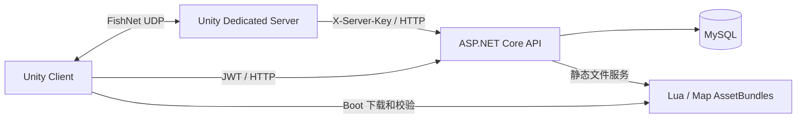

# LOWPOLY OPS · UnityFpsLowPoly

基于 **Unity 6 / URP / FishNet / ASP.NET Core** 的低多边形多人第一人称射击项目。仓库名沿用 `UnityTps`；当前客户端以 FPS 战斗为主，第三人称模型用于网络观察者表现。

本仓库包含 Unity 客户端与 Dedicated Server（DS）、账户与房间 API、数据库迁移、Lua 和地图热更，以及 Windows 构建、部署和朋友测试工具。

## 当前版本

**Final20261001** 是封存的 Windows x64 朋友测试版本。协议 `fps-net-v25`，热更 `25`，客户端 buildId `f4f4cc5a4e53`，DS buildId `e407c8d03b45`。双端 buildId 分别标识各自构建，不要求字符串相同。

源码关联、输入摘要、包 SHA256 和验证边界见 [最终版本记录](Docs/Releases/Final20261001.md)。ZIP、数据库、运行日志和秘密配置不在 Git 中。版本名称表示用户指定的交付版本；完整 ADS、空仓换弹和手电墙面印记仍有实机验证缺口。

## 已有功能

| 模块 | 当前实现 |
|---|---|
| 战斗 | TDM、KillRace；服务器权威命中、伤害、弹药、死亡、重生与结算；Owner 预测和校正 |
| 武器 | 主副武器、枪匠配件、FP 武器与 TP 观察者表现；原生 `shotgun.01` 逐发换弹 |
| 装备 | 三个独立背包；每包三格投掷物，可重复或留空；永久解锁；复活补充 |
| UI | 登录、大厅、仓库、商城、房间、枪匠、局内装备面板与背包资格提示 |
| 在线服务 | JWT 单活登录、档案、钱包、购买、配装、好友与社交、房间、DS 实例池与票据 |
| 地图 | Arena、Stackyard、Depot55、Ridgeline、TrainingYard、NightRelay |
| 更新与交付 | Boot 加载覆盖、Lua / 地图包校验、双端构建身份、ZeroTier 朋友测试启动器 |

## 架构概览



API 保存跨对局数据，DS 决定对局事实，客户端负责输入、预测和呈现。Gameplay 实际依赖 FishNet；详细依赖、状态归属和流程见 [系统架构](Docs/Architecture/System.md)。

## 技术栈与环境要求

| 项目 | 当前基线 |
|---|---|
| Unity | `6000.0.76f1`，Windows x64 Player / Dedicated Server 模块 |
| 渲染 | Universal RP `17.0.4`、TextMeshPro、项目中文字体 |
| 输入与相机 | Input System `1.19.0`、Cinemachine `3.1.7` |
| 网络与动画 | FishNet、Animancer，项目内导入资产 |
| 热更 | xLua、AssetBundles；Addressables `2.9.1` 已列入包清单 |
| 后端 | .NET 8、ASP.NET Core、EF Core / Pomelo MySQL |
| 工具 | Windows PowerShell；部分诊断工具需 Python；朋友联网使用 ZeroTier |

`Packages/manifest.json` 保留两个本地 Codely 插件引用。干净克隆后须恢复 `.codely-cli/extensions/TJGenerators/Packages/cn.tuanjie.ai.generators` 和 `.codely.packages/cn.tuanjie.codely.bridge@1.0.85-47f31100`。目录不入库，未准备时 Package Manager 无法完整解析项目。准备方法见 [环境搭建](Docs/Development/Setup.md)；删包或换版本会形成新的构建基线。

第三方模型、动画和插件位于 Assets；使用范围按原素材授权处理。仓库未另行授予第三方资产再分发许可。

## 开发与运行入口

1. 克隆仓库，准备 Unity、.NET 8、MySQL 与本地插件包。
2. 配置连接串、JWT 签名密钥、DS 控制面密钥；示例使用占位值，实际值只存本机。
3. 在 Unity 打开 `Assets/_Project/Scenes/Boot.unity`，进入 Boot → 热更 → Lobby。
4. 按 [构建与发布](Docs/Operations/BuildAndRelease.md) 构建双端与地图，核对身份后启动在线栈。

后端入口（根目录执行，先准备配置）：

```powershell
dotnet restore fps-backend/UnityFps.Backend.sln
dotnet build fps-backend/UnityFps.Backend.sln --no-restore
dotnet run --project fps-backend/src/UnityFps.Api --launch-profile http
```

完整本地栈使用 `Tools/Server/Start-LocalServer.ps1 -AllMaps`；客户端入口为 `Tools/Client/Start-LocalClient.ps1`。启动器依赖已安装的 Builds/ReleaseClient、Builds/Server，克隆源码不会自动获得可执行包。

## 目录与开发导航

| 目录 | 职责 |
|---|---|
| Assets/_Project | 项目场景、资源、Gameplay、表现、UI、Editor 与测试 |
| Assets/Resources/Lua | 内置 Lua |
| Packages、ProjectSettings | 包清单、锁文件、Unity 设置 |
| fps-backend | API、服务、迁移与后端测试 |
| Tools | 构建、热更、开服、分发与诊断 |
| Docs/Architecture | 模块图、职责与流程 |
| Docs/Development | 环境、扩展、网络、API 与测试 |
| Docs/Operations | 构建、部署、朋友测试与恢复 |
| Docs/Releases | 版本身份、摘要与验证范围 |

| 需求 | 文档 |
|---|---|
| 理解项目 | [架构与流程](Docs/Architecture/System.md) |
| 首次打开 | [环境搭建](Docs/Development/Setup.md) |
| 武器、投掷、地图、FP / TP | [Gameplay 与表现](Docs/Development/Gameplay.md) |
| 权威和预测 | [Networking](Docs/Development/Networking.md) |
| API 与数据库 | [Backend](Docs/Development/Backend.md) |
| 验证修改 | [Testing](Docs/Development/Testing.md) |
| 构建和热更 | [Build and Release](Docs/Operations/BuildAndRelease.md) |
| 联机与朋友分发 | [Hosting](Docs/Operations/Hosting.md) |

## 维护与已知限制

Unity 资源及 .meta 一起提交；构建输入按 .gitattributes 保留原始字节。Builds、Library、Logs、秘密配置和本机状态继续忽略。历史计划、审计、交接和代理说明仅本地保留，旧内容仍可从 Git 历史查阅；线上入口为 [Docs 索引](Docs/README.md)。

源码与构建快照一致不等于所有玩法验收通过。版本记录分开列出通过与待验证项。新增源码或重建需使用新的版本身份，不覆盖封存分发包。
